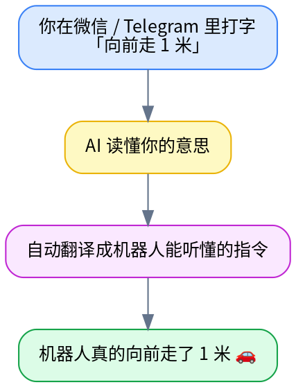
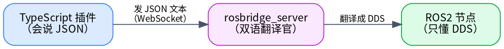
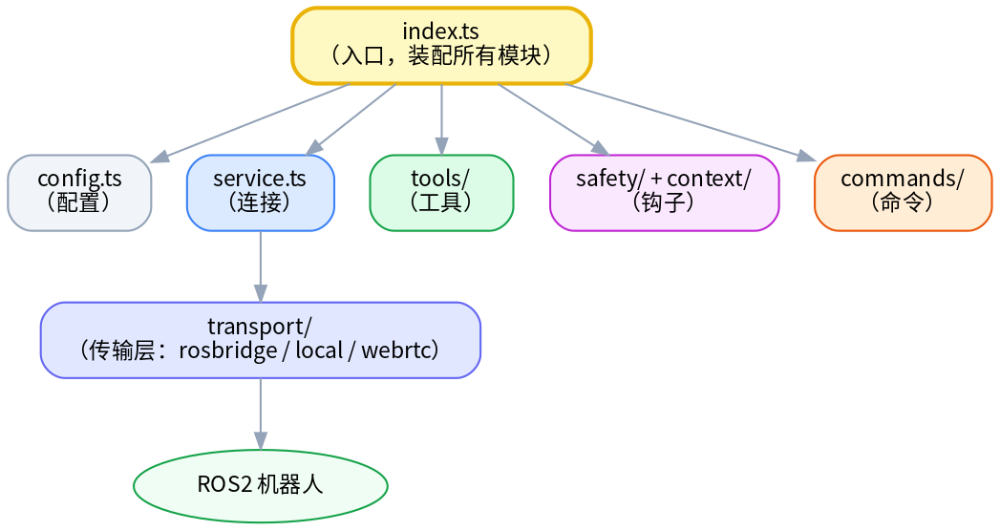
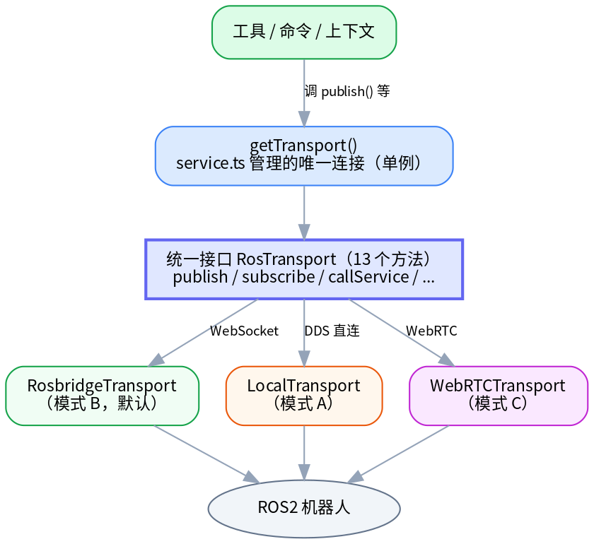
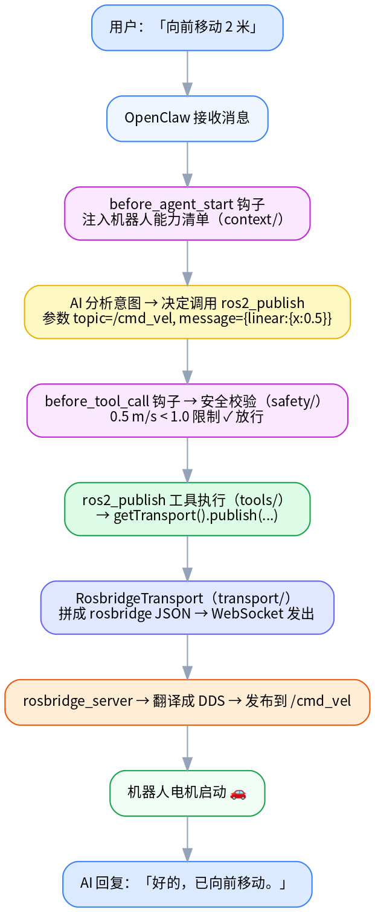

# RosClaw 学习教程

# RosClaw 新手学习指南

欢迎来到 RosClaw 学习中心！本指南带你从零开始理解和使用这个项目——**面向"新手中的新手"**，不要求你懂 ROS2 或 TypeScript。

---

## 学习路径

按顺序读这五章，循序渐进：

| 序号 | 文件 | 内容 | 需要动手吗 |
|---|---|---|---|
| 1 | [项目概览](01-项目概览.md) | 是什么、解决什么痛点、三大概念、整体架构、术语表 | 否 |
| 2 | [技术前置知识](02-技术前置知识.md) | 会碰到哪些技术，每项最少要懂多少 | 否 |
| 3 | [架构深度解析](03-架构深度解析.md) | 三层架构、六模块、四种对接 AI 的方式、传输层设计 | 否 |
| 4 | [核心代码导读](04-核心代码导读.md) | 源码鸟瞰索引：哪个文件干什么、按什么顺序读 | 否 |
| 5 | [完整实战教程](05-完整实战教程.md) | 从零跑通：裸协议 → AI → 进阶练习 | **是** |

读完这五章，再进 **[code/ 逐行详解系列](code/README.md)**（33 篇）逐行精读源码。

---

## 两条特别推荐的主线

无论你想"读懂"还是"跑通"，这两篇是各自的最佳起点：

- 🧭 **想读懂代码怎么运转** → [code/00 · 一条命令的旅程](code/00-一条命令的旅程.md)
  跟着「向前走 1 米」这一条命令，看它如何穿过 8 个文件到达机器人——**精确到哪个文件、哪个函数、第几行**，并链到每篇逐行详解。这是整个 code/ 系列的"龙头"。

- 🚀 **想亲手跑起来** → [第五章：完整实战教程](05-完整实战教程.md)
  手把手：先用裸 JSON 让仿真机器人动（不用 AI），再叠加 OpenClaw + AI，最后做进阶练习。

---

## 按目标快速定位

- **我只想最快看到机器人动** → [第五章](05-完整实战教程.md) 的"第 0 + 第 1 部分"（不用 AI）。
- **我想理解它怎么工作** → [第一章](01-项目概览.md) → [第三章](03-架构深度解析.md)。
- **我想读源码** → [第四章](04-核心代码导读.md) 鸟瞰，再进 [code/ 系列](code/README.md)；先读 [code/00](code/00-一条命令的旅程.md) 主线不迷路。
- **我想自己动手改** → [第五章 · 第 5 部分进阶练习](05-完整实战教程.md#第-5-部分进阶练习)。

---

## 仓库地图

```
rosclaw/
├── extensions/openclaw-plugin/   ← 核心插件（TypeScript）
│   └── src/
│       ├── config.ts             ← 配置定义
│       ├── index.ts              ← 插件入口
│       ├── tools/                ← AI 可调用的 8 个 ROS2 工具
│       ├── transport/            ← 三种传输层适配器（A/B/C 模式）
│       ├── safety/               ← 安全校验钩子
│       ├── context/              ← 机器人能力注入钩子
│       └── commands/             ← 直接命令（如 /estop 急停）
├── extensions/openclaw-canvas/   ← 第二个扩展：实时仪表盘（占位中）
├── ros2_ws/src/                  ← ROS2 Python 包
│   ├── rosclaw_discovery/        ← 能力自动发现节点
│   ├── rosclaw_msgs/             ← 自定义消息/服务类型
│   └── rosclaw_agent/            ← WebRTC 模式的机器人侧节点
├── docker/                       ← 一键启动仿真环境
├── examples/                     ← 三个场景示例
├── docs/                         ← 架构文档
└── learn/                        ← 【你在这里】新手学习资料
    ├── 01~05-*.md                ← 五章学习路径
    └── code/                     ← 逐行详解系列（00 主线 + 01~32 各文件）
```

---

## 这套资料的两个层次

| 层次 | 在哪 | 干什么 | 比喻 |
|---|---|---|---|
| **入门五章** | `learn/01~05` | 概念、架构、鸟瞰、实战 | 城市地图 |
| **逐行详解** | `learn/code/` | 每一行、每个语法都拆开讲 | 逐街逐户导览 |

先看地图（五章）建立全局观，再逐户细看（code/）才扎实。code/ 系列专为"新手中的新手"设计，每个新出现的 TypeScript 语法都有「语法小课堂」，并配有可反查的"语法学习地图"。


---


# 第一章：项目概览

> 本章目标：在不碰任何代码的前提下，让你彻底搞懂 **RosClaw 是什么、解决什么问题、整体怎么运作**。读完你会对整个项目有一张"心理地图"，后面每一章都是往这张地图上填细节。
>
> 面向**完全的新手**——不要求你懂 ROS2、不要求你会 TypeScript。遇到术语都会用大白话和类比解释。

---

## 一、一句话：RosClaw 是什么？

**RosClaw 是一座"桥"——它让你能用聊天软件里的大白话，去指挥一个机器人。**



不用学机器人编程、不用记复杂命令，**像聊天一样指挥机器人**——这就是 RosClaw 想做的事。

### 它到底解决了什么痛点？

传统上要控制一个 ROS2 机器人，你得：

- 在和机器人**同一个网络/同一台电脑**上；
- 安装一整套 ROS2 开发环境；
- 用命令行敲 `ros2 topic pub /cmd_vel geometry_msgs/msg/Twist "{linear: {x: 0.5}}"` 这种又长又容易写错的指令；
- 自己换算"向前 1 米"等于"速度 0.5 持续 2 秒"。

RosClaw 把这些**全部交给 AI 和插件代劳**。你只要会发微信消息，就能控制机器人——哪怕机器人在地球另一端。

---

## 二、三个必须先搞懂的概念

整个项目反复出现三个名词。先用大白话讲清楚，后面就不会懵。

### 概念 1：OpenClaw —— "AI 版的客服总机"

**OpenClaw 是一个 AI 网关平台**。你可以把它想成一个**智能总机**：

- 一头连着各种聊天软件（WhatsApp、Telegram、Discord、Slack，还有网页聊天框）；
- 中间坐着一个 **AI 代理**（大脑是 Claude 这样的大模型），负责"听懂人话、决定该干什么"；
- 另一头连着各种**插件**，每个插件提供一组"它会干的活儿"（叫做"工具"）。

> 类比：OpenClaw 像一家公司的**前台 + 调度中心**。顾客（你）打电话进来说需求，前台（AI）听懂后，派给对应的部门（插件）去办。

**RosClaw 就是 OpenClaw 的一个插件**——专门负责"和机器人打交道"这摊活儿。OpenClaw 本身不在这个仓库里，它是运行 RosClaw 的"宿主平台"。

### 概念 2：ROS2 —— "机器人世界的操作系统"

**ROS2（Robot Operating System 2）是机器人软件的通用框架**。几乎所有研究和工业机器人都用它。你不需要会写 ROS2 程序，但要听懂下面 4 个词，因为 RosClaw 干的事全是围绕它们：

| 词 | 大白话 | 例子 |
|---|---|---|
| **节点（Node）** | 一个独立运行的小程序 | "摄像头节点"、"导航节点"、"电机节点" |
| **话题（Topic）** | 一条持续广播的"频道"，发布者往里发、订阅者从里收 | `/cmd_vel`（速度指令频道）、`/odom`（位置反馈频道） |
| **服务（Service）** | 一问一答的调用，发一个请求等一个回复 | "告诉我当前电量是多少？" |
| **动作（Action）** | 一个耗时任务，过程中能持续汇报进度 | "导航到门口"（要走一会儿，途中不断报"还剩 3 米") |

再加一个底层名词：

- **DDS**：ROS2 内部传递消息用的"快递系统"（一种高效的二进制通信协议）。机器人内部节点之间靠它互相发消息。

> 类比：把机器人想成一家工厂。**节点**是各个车间；**话题**是厂区广播（"所有人注意，开始干活"）；**服务**是打电话问某车间"现在产量多少"；**动作**是派一个长期任务并要求定时汇报；**DDS** 是厂内的内部邮路。

### 概念 3：rosbridge —— "给机器人装的一扇翻译窗口"

这里有个现实难题：ROS2 内部用 **DDS**（二进制）通信，而我们的插件是用 **TypeScript/Node.js** 写的，**两者语言不通**——Node.js 没法直接说 DDS。

**rosbridge** 就是解决这个的官方组件。它给 ROS2 开了一扇"翻译窗口"：把 ROS2 的 DDS 通信**封装成 WebSocket + JSON**——而 JSON 和 WebSocket 是任何编程语言（包括 Node.js）都会的"普通话"。



> 类比：你（只会中文）要和一位只会法语的工程师沟通，中间请了个**翻译**（rosbridge）。你说中文，翻译转成法语；对方回法语，翻译转回中文。rosbridge 就是 ROS2 和外部世界之间的这位翻译。

一条典型的"rosbridge 普通话"长这样（让机器人前进）：

```json
{
  "op": "publish",
  "topic": "/cmd_vel",
  "msg": { "linear": { "x": 0.5, "y": 0, "z": 0 }, "angular": { "x": 0, "y": 0, "z": 0 } }
}
```

`op` 字段表明"这是一个发布操作"，后面是发到哪个话题、发什么内容。记住这个 `op` 格式，它会贯穿整个项目。

---

## 三、整体架构：一句话 + 一张图

把上面三个概念串起来，就是 RosClaw 的全貌：


**每一个箭头，都是一次"翻译"**（信息换了一种形态，但意思不变）：

| # | 这一步 | 把"什么"翻译成"什么" | 谁干的 |
|---|---|---|---|
| 1 | 消息应用 → OpenClaw | 微信/Telegram 协议 → OpenClaw 内部消息 | OpenClaw |
| 2 | OpenClaw → 插件 | 自然语言「向前走」→ 一次"工具调用" | AI 代理 |
| 3 | 插件 → rosbridge | 工具调用 → rosbridge 的 JSON | RosClaw 插件 |
| 4 | rosbridge → ROS2 | JSON → DDS 二进制消息 | rosbridge_server |

> 整个项目的"主角"是第 3 步——**RosClaw 插件**。它是这个仓库里你将要读的几乎所有代码。第 1、4 步是别人（OpenClaw、rosbridge）干的，第 2 步是 AI 干的。

如果你想**立刻看到这条链路在代码里逐行是怎么走的**（精确到哪个文件、哪个函数、第几行），有一篇专门的"流程主线"文档：[code/00 · 一条命令的旅程](code/00-一条命令的旅程.md)。建议读完本系列前几章后去看，它会把这张抽象的图变成真实的代码地图。

---

## 四、三种部署模式：机器人离你多远？

RosClaw 支持三种连接机器人的方式，对应"机器人离你有多远"的三种情况：

| 模式 | 场景 | 怎么连 | 什么时候用 |
|---|---|---|---|
| **模式 A：同机** | OpenClaw 和机器人在**同一台电脑** | 直接走 ROS2 DDS，不经过网络 | 延迟最低；机器人自带的板载电脑 |
| **模式 B：局域网** | OpenClaw 在你笔记本，机器人在**同一个 WiFi** | 通过 rosbridge 的 WebSocket | **新手首选**，开发调试最方便 |
| **模式 C：云端** | OpenClaw 在云服务器，机器人在**远端**（家里/野外） | 通过 WebRTC 穿透网络 | 远程遥控，跨地域 |

> 💡 **新手建议先用模式 B**：在自己电脑上用 Docker 跑一个 ROS2 仿真机器人，再让插件通过 rosbridge 连上它。不需要真机器人，零成本就能体验完整流程。具体步骤见 [第五章：完整实战教程](05-完整实战教程.md)。

这三种模式在代码里对应三套"传输层"实现，但它们**对上层提供完全一样的接口**——这是 RosClaw 一个很漂亮的设计，后面 [第三章](03-架构深度解析.md) 会细讲。

> 📌 **关于实现状态（诚实说明）**：项目文档曾把模式 A（local）和模式 C（webrtc）标为"存根/未实现"。但实际逐行读代码会发现，**模式 C 其实是相当完整的实现**（真的用了 WebRTC 库）。这种"文档和代码不一致"的情况，我们在逐行详解里会如实指出（见 [code/30](code/30-webrtc-transport.ts.md) 的勘误）。**读代码时以代码为准**——这本身就是一项重要的读码功夫。目前可以确定：**模式 B（rosbridge）是默认且最完整的**，新手就用它。

---

## 五、仓库长什么样？（目录巡览）

这是一个 **monorepo**（多个相关项目放在同一个仓库里）。主要目录：

```
rosclaw/
├── extensions/                    ← 【主角】OpenClaw 插件（TypeScript）
│   ├── openclaw-plugin/           ← 核心插件：控制机器人
│   │   ├── src/                   ← 你要读的源代码几乎都在这
│   │   │   ├── index.ts           ← 插件入口
│   │   │   ├── config.ts          ← 配置定义
│   │   │   ├── tools/             ← AI 能调用的 8 个工具
│   │   │   ├── transport/         ← 三种传输层（A/B/C 模式）
│   │   │   ├── safety/            ← 安全校验
│   │   │   ├── context/           ← 把机器人能力告诉 AI
│   │   │   └── commands/          ← 直接命令（如 /estop 急停）
│   │   └── skills/                ← 多步"技能"（导航、拍照……）
│   └── openclaw-canvas/           ← 第二个插件：实时仪表盘（占位中）
├── ros2_ws/src/                   ← ROS2 这一侧的 Python 包
│   ├── rosclaw_discovery/         ← "能力自动发现"节点
│   ├── rosclaw_msgs/              ← 自定义消息/服务类型
│   └── rosclaw_agent/             ← 模式 C 机器人侧节点
├── docker/                        ← 一键启动仿真环境
├── examples/                      ← 三个场景示例
├── docs/                          ← 架构文档
└── learn/                         ← 【你在这里】新手学习资料
```

**90% 的代码阅读都集中在 `extensions/openclaw-plugin/src/`**。其余目录（ROS2 包、Docker、示例）是配套。

---

## 六、三个现成示例

仓库自带三个示例场景，展示 RosClaw 能干什么：

| 示例 | 路径 | 说明 |
|---|---|---|
| 小车聊天控制 | `examples/turtlebot-chat/` | 用聊天消息控制 Gazebo 仿真里的 TurtleBot3 小车 |
| 机械臂控制 | `examples/arm-control/` | 用自然语言让机械臂做动作 |
| 多机巡逻 | `examples/fleet-patrol/` | 指挥多个机器人执行巡逻任务 |

---

## 七、新手术语小词典

读后面章节前，把这张表存着，遇到生词回来查：

| 术语 | 一句话解释 |
|---|---|
| OpenClaw | AI 网关平台，RosClaw 运行在它上面（宿主） |
| 插件（plugin） | 给 OpenClaw 增加能力的扩展，RosClaw 就是一个插件 |
| 工具（tool） | 插件提供给 AI 调用的一个具体动作（如"发布话题"） |
| ROS2 | 机器人软件框架 |
| 话题 / 服务 / 动作 | ROS2 的三种通信方式：广播频道 / 一问一答 / 耗时任务带进度 |
| DDS | ROS2 内部的二进制通信协议 |
| rosbridge | 把 ROS2 的 DDS 封装成 WebSocket+JSON 的翻译组件 |
| WebSocket | 一种保持长连接、可双向实时收发的网络协议 |
| 传输层（transport） | 插件里负责"实际和机器人通信"的那一层，有 A/B/C 三种实现 |
| 仿真（simulation） | 用软件（Gazebo）模拟一个机器人，不用真硬件 |

---

## 八、接下来读什么

你已经有了全局地图。根据你的目的选择下一步：

- **想继续打基础**（推荐按顺序）→ [第二章：技术前置知识](02-技术前置知识.md)：学这个项目会碰到哪些技术、每项最少要懂多少。
- **想理解它内部怎么搭起来的** → [第三章：架构深度解析](03-架构深度解析.md)。
- **想立刻动手跑起来** → [第五章：完整实战教程](05-完整实战教程.md)：手把手让仿真机器人动起来。
- **想钻进源码** → [第四章：核心代码导读](04-核心代码导读.md)，及配套的 [code/ 逐行详解系列](code/README.md)。

**下一步** → [第二章：技术前置知识](02-技术前置知识.md)


---


# 第二章：技术前置知识

> 本章把"读懂 RosClaw 会用到的技术"逐项过一遍。每一项都按同一个套路讲：**是什么（类比）→ 项目为什么用它 → 在项目哪个位置 → 你最少要懂多少 → 想深入看哪篇**。
>
> **重要心态**：你**不需要精通**这些技术。本章的目的是让你"认得出、不害怕"，而不是"全学会"。真正想钻语法细节时，[code/ 逐行详解系列](code/README.md) 会用「语法小课堂」一点点补课。

---

## 怎么用这一章

下面把技术分成两档：

- **必须有个印象**（TypeScript、ROS2 概念、rosbridge、Docker）——不懂会卡。
- **知道有这回事就行**（Zod、TypeBox、pnpm、WebSocket、WebRTC）——用到时回来查。

每项末尾的"深入看哪篇"指向 code/ 系列，等你读源码时按图索骥即可。

---

## 第一档：必须有个印象

### 1. TypeScript / Node.js / ESM

**是什么**：

- **Node.js** 是"让 JavaScript 能在电脑上（而非只在浏览器里）运行"的运行环境。
- **TypeScript（简称 TS）** 是给 JavaScript "加了类型标注"的升级版。所谓"类型"，就是给每个数据贴个标签说明"它长什么样"（是文字 `string`、数字 `number`，还是某种对象）。加了类型，**很多错误在写代码时就能被发现**，而不是等运行才崩。
- **ESM**（ES Modules）是 JS 现代的"模块化"方式——用 `import`/`export` 在文件之间互相借用代码。

> 类比：JavaScript 像随手写的便条，写错了没人管；TypeScript 像填表格，每个格子规定了"只能填数字"或"只能填日期"，填错当场提示。

**项目为什么用**：整个插件层要求类型安全、现代化，所以全用 TS + ESM（`"type": "module"`，严格模式）。

**在项目哪里**：`extensions/` 下所有 `.ts` 文件。

**最少要懂**：认识三样就够起步——
- `interface` / `type`：定义"一个对象长什么样"。
- 泛型 `<T>`：给类型留个"待填的空"（如"一个装 T 的数组"）。
- `import` / `export`：文件间借用代码。

> 💡 一个会让新手困惑的小细节：项目里 `import` 别的文件时写的是 `.js` 后缀（如 `from "./config.js"`），但文件明明是 `.ts`。这是 ESM 的规矩，[code/01](code/01-plugin-api.ts.md) 会解释。

**深入看哪篇**：[code/01 · plugin-api.ts](code/01-plugin-api.ts.md) 从最基础的"什么是类型/接口"讲起，是整个语法学习的起点。

### 2. ROS2 的四个核心概念

**是什么**：机器人软件框架。详见 [第一章](01-项目概览.md) 的讲解，这里只复述要记的四个词 + 一个底层词：

| 概念 | 大白话 | 典型例子 |
|---|---|---|
| 节点 Node | 一个独立运行的小程序 | 摄像头节点、导航节点 |
| 话题 Topic | 持续广播的频道（发布/订阅） | `/cmd_vel` 速度、`/odom` 里程计 |
| 服务 Service | 一问一答 | "当前电量？" |
| 动作 Action | 耗时任务 + 进度反馈 | "导航到目标点" |
| DDS | ROS2 内部的二进制通信协议 | （底层，看不见） |

**项目为什么用**：RosClaw 做的所有事，本质都是"对这四种东西做操作"——发布话题、订阅话题、调服务、发动作。

**在项目哪里**：`src/tools/` 下的 8 个工具，正好一一对应这些操作（发布、订阅、调服务、发动作、读写参数、列话题、拍照）。

**最少要懂**：能区分"话题 vs 服务 vs 动作"——这决定了用哪个工具。一句话记忆：
- 持续广播的数据（速度、传感器）→ **话题**；
- 一次性问答（查个值、设个参数）→ **服务**；
- 要等一会儿、还想看进度（导航、抓取）→ **动作**。

还要知道**消息类型**：每个话题的数据都有固定格式，如 `geometry_msgs/msg/Twist`（速度）含 `linear.x`（前进）和 `angular.z`（转向）字段。

**深入看哪篇**：[code/03 · transport-types.ts](code/03-transport-types.ts.md)（这些概念在代码里如何用类型表达）。

### 3. rosbridge 协议（WebSocket + JSON）

**是什么**：把 ROS2 的 DDS 通信"翻译"成 WebSocket + JSON 的官方组件（详见 [第一章](01-项目概览.md) 的"翻译窗口"类比）。

**项目为什么用**：因为 Node.js 不会说 DDS，但人人都会 JSON。rosbridge 让我们的 TS 插件能通过发 JSON 文本来操作 ROS2。这是**模式 B（默认模式）**的基础。

**在项目哪里**：`src/transport/rosbridge/` 整个目录。

**最少要懂**：rosbridge 消息就是带 `op` 字段的 JSON。认识这几个 `op`：

```json
// 发布（让机器人动）
{"op": "publish", "topic": "/cmd_vel", "msg": { ... }}

// 订阅（持续接收某话题）
{"op": "subscribe", "topic": "/odom"}

// 调用服务（一问一答）
{"op": "call_service", "service": "/rosapi/topics"}
```

了解它对**调试**很有用——出问题时你能看懂插件到底发了什么。[第五章](05-完整实战教程.md) 还会教你亲手发这些 JSON。

**深入看哪篇**：[code/05 · rosbridge-types.ts](code/05-rosbridge-types.ts.md)（协议全部消息的类型定义）+ [code/06 · client.ts](code/06-rosbridge-client.ts.md)（怎么收发，最核心）。

### 4. Docker / Docker Compose

**是什么**：

- **Docker** 把一个软件 + 它需要的所有环境**打包成一个"集装箱"（容器）**，在任何电脑上都能一致地跑起来，不用自己装一堆依赖。
- **Docker Compose** 用一个 `.yml` 文件**一次性启动多个容器**并把它们连起来。

> 类比：Docker 像"即食餐盒"——菜、米、调料都配好封装，加热即食，不用自己买菜。Docker Compose 则是"一桌套餐"，一道命令上齐好几个餐盒。

**项目为什么用**：让你**不装 ROS2** 就能跑起一个完整的仿真机器人环境——这是新手能零成本体验的关键。

**在项目哪里**：`docker/` 目录。注意有好几个 compose 文件，对应不同部署模式：

```
docker/
├── docker-compose.yml          # 默认（模式 B）：ROS2 仿真 + rosbridge
├── docker-compose.dev.yml      # 开发模式（挂载源码）
├── docker-compose.local.yml    # 模式 A：同机
├── docker-compose.robot.yml    # 模式 C：机器人侧
├── docker-compose.cloud.yml    # 模式 C：云侧
└── docker-compose.sim.yml      # 纯仿真
```

**最少要懂**：会用两条命令——`docker compose up`（启动）和 `docker compose down`（停止）。注意是 `docker compose`（带空格，新语法），不是老的 `docker-compose`。

**深入看哪篇**：[第五章：完整实战教程](05-完整实战教程.md) 会手把手带你用 Docker 跑起仿真。

---

## 第二档：知道有这回事就行

### 5. pnpm 与 Monorepo（工作空间）

**是什么**：`pnpm` 是个更快、更省磁盘的包管理器（类似 `npm`）。**workspace（工作空间）**让一个仓库里管多个包。

**项目为什么用**：仓库里有两个包（`openclaw-plugin` 和 `openclaw-canvas`），用 pnpm workspace 统一管理。

**最少要懂**两条命令：

```bash
pnpm install      # 一次性装好所有包的依赖
pnpm typecheck    # 对所有包做类型检查（验证代码类型没写错）
```

### 6. Zod（配置校验）

**是什么**：一个"运行时检查数据形状对不对"的库。你定义一个 schema（数据该长什么样），它就能在程序运行时验证真实数据、填默认值。

**项目为什么用**：用户写的插件配置（连哪个机器人、速度上限多少）可能写错或缺项。Zod 在插件启动时**校验一次**，把缺的填上默认值，把错的报出来。

**在项目哪里**：`src/config.ts`（开头就是 `import { z } from "zod"`）。

**深入看哪篇**：[code/02 · config.ts](code/02-config.ts.md)。

### 7. TypeBox（工具参数定义）—— 注意别和 Zod 搞混

**是什么**：另一个定义"数据形状"的库，但用途不同——它生成的是 **AI 能读懂的参数说明（JSON Schema）**。

**项目为什么用 + 和 Zod 的区别**（新手很容易混淆，记住这条）：

| | Zod | TypeBox |
|---|---|---|
| 用来定义 | **插件配置**的形状 | **工具参数**的形状 |
| 给谁看 | 给程序校验用户配置 | 给 **AI** 看"这个工具要传什么参数" |
| 在哪 | `src/config.ts` | `src/tools/*.ts` 每个工具里 |

**深入看哪篇**：[code/14 · 工具通用结构](code/14-tools-index.ts.md)、[code/15 · ros2-publish.ts](code/15-ros2-publish.ts.md)。

### 8. WebSocket

**是什么**：一种网络协议，特点是**建立一次连接后，双方可以持续、双向、实时地互发消息**（不像普通网页那样"问一次答一次就断")。

**项目为什么用**：rosbridge 用 WebSocket 通信。机器人的传感器数据需要持续推送，正适合 WebSocket 这种长连接。

**在项目哪里**：`src/transport/rosbridge/client.ts` 用 `ws` 库连 WebSocket。

**深入看哪篇**：[code/06 · client.ts](code/06-rosbridge-client.ts.md)。

### 9. WebRTC 与 DDS（仅模式 A / C，可跳过）

**是什么**：

- **WebRTC**：浏览器/设备之间**点对点直连**传输数据的技术，能穿透防火墙/NAT。模式 C 用它来连远端机器人。
- **直连 DDS**：模式 A 在同一台机器上时，跳过 rosbridge，直接说 ROS2 的"母语"DDS（通过 `rclnodejs` 库）。

**项目为什么用**：覆盖"机器人在远端"（C）和"在同机"（A）两种场景。

**在项目哪里**：`src/transport/webrtc/` 和 `src/transport/local/`。

> 新手可以**完全跳过**这两块，先掌握模式 B。等熟练了再回来。

**深入看哪篇**：[code/26 · local-transport.ts](code/26-local-transport.ts.md)（模式 A）、[code/29–31](code/29-webrtc-signaling-types.ts.md)（模式 C）。

---

## 技术 → 深入篇目 速查表

| 技术 | 在项目哪里 | 深入看哪篇 code/ |
|---|---|---|
| TypeScript 基础 | 所有 `.ts` | [01](code/01-plugin-api.ts.md) |
| Zod 配置校验 | `config.ts` | [02](code/02-config.ts.md) |
| ROS2 概念建模 | `transport/types.ts` | [03](code/03-transport-types.ts.md) |
| 传输层抽象接口 | `transport/transport.ts` | [04](code/04-transport.ts.md) |
| rosbridge 协议 | `transport/rosbridge/types.ts` | [05](code/05-rosbridge-types.ts.md) |
| WebSocket 收发 | `transport/rosbridge/client.ts` | [06](code/06-rosbridge-client.ts.md) 🔥 |
| TypeBox 工具参数 | `tools/*.ts` | [14](code/14-tools-index.ts.md)、[15](code/15-ros2-publish.ts.md) |
| 模式 A（DDS 直连） | `transport/local/` | [26–28](code/26-local-transport.ts.md) |
| 模式 C（WebRTC） | `transport/webrtc/` | [29–31](code/29-webrtc-signaling-types.ts.md) |

---

## 快速自测

读完本章，能用大白话回答这几个问题就可以继续了（答不上就回看对应小节）：

1. ROS2 的"话题"和"服务"有什么区别？什么时候用哪个？
2. 为什么需要 rosbridge？它解决了 Node.js 的什么困难？
3. Zod 和 TypeBox 都在定义"数据形状"，它们的用途有什么不同？
4. `docker compose up` 是用来干什么的？
5. 三种部署模式里，新手该先用哪个？为什么？

---

**下一步** → [第三章：架构深度解析](03-架构深度解析.md)：把这些技术拼起来，看 RosClaw 内部是怎么搭的。


---


# 第三章：架构深度解析

> 本章目标：把 RosClaw 插件**内部是怎么搭起来的**讲透——分几层、每层干什么、谁先谁后、为什么这么设计。
>
> [第一章](01-项目概览.md) 给了全局地图，本章把镜头推近到"插件内部"。读完你会理解四种核心机制（工具/钩子/命令/传输层），这是看懂源码的骨架。
>
> 想看一条命令在代码里**逐行、逐函数**怎么流动？那是配套的 [code/00 · 一条命令的旅程](code/00-一条命令的旅程.md)——本章讲"结构"，那篇讲"流动"，互为表里。

---

## 一、三层架构：全局视角

整个系统从上到下分三层，职责清晰：

<div style="width: 760px; box-sizing: border-box; position: relative; background: #fafbfc; padding: 20px; border-radius: 6px; border: 1px solid #e5e7eb;">
  <style scoped>
    .arch-main { flex: 1; min-width: 0; }
    .arch-title { text-align: center; font-size: 20px; font-weight: bold; color: #1f2937; margin-bottom: 14px; }
    .arch-layer { margin: 8px 0; padding: 14px; border-radius: 6px; box-shadow: 0 1px 3px rgba(0,0,0,0.04); }
    .arch-layer-title { font-size: 14px; font-weight: bold; margin-bottom: 10px; text-align: center; }
    .arch-grid { display: grid; gap: 8px; }
    .arch-grid-3 { grid-template-columns: repeat(3, 1fr); }
    .arch-grid-4 { grid-template-columns: repeat(4, 1fr); }
    .arch-box { border-radius: 4px; padding: 8px; text-align: center; font-size: 12px; font-weight: 600; line-height: 1.4; color: #1f2937; background: #ffffff; border: 1px solid #e5e7eb; }
    .arch-box.highlight { background: #f3f4f6; border: 2px solid #6b7280; }
    .arch-box.tech { font-size: 11px; color: #6b7280; background: #f9fafb; }
    .arch-layer.user { background: linear-gradient(135deg, #eff6ff 0%, #dbeafe 100%); border: 2px solid #3b82f6; }
    .arch-layer.user .arch-layer-title { color: #1d4ed8; }
    .arch-layer.application { background: linear-gradient(135deg, #fffbeb 0%, #fef3c7 100%); border: 2px solid #d97706; }
    .arch-layer.application .arch-layer-title { color: #92400e; }
    .arch-layer.ai { background: linear-gradient(135deg, #f0fdf4 0%, #dcfce7 100%); border: 2px solid #16a34a; }
    .arch-layer.ai .arch-layer-title { color: #15803d; }
    .arch-flow-arrow { text-align: center; font-size: 11px; color: #64748b; margin: 2px 0; }
  </style>
  <div class="arch-title">RosClaw 三层架构</div>
  <div class="arch-main">
    <div class="arch-layer user">
      <div class="arch-layer-title">① 消息层（用户接口）</div>
      <div class="arch-grid arch-grid-4"><div class="arch-box">WhatsApp</div><div class="arch-box">Telegram</div><div class="arch-box">Discord</div><div class="arch-box">网页聊天</div></div>
    </div>
    <div class="arch-flow-arrow">▼ &nbsp; 自然语言消息</div>
    <div class="arch-layer application">
      <div class="arch-layer-title">② AI 网关层（OpenClaw）　← RosClaw 插件挂在这里</div>
      <div class="arch-grid arch-grid-3"><div class="arch-box">AI 代理<br><small>理解意图</small></div><div class="arch-box highlight">RosClaw 插件<br><small>工具 / 钩子 / 命令</small></div><div class="arch-box">决定调用哪个工具</div></div>
    </div>
    <div class="arch-flow-arrow">▼ &nbsp; rosbridge JSON / DDS / WebRTC</div>
    <div class="arch-layer ai">
      <div class="arch-layer-title">③ ROS2 层（机器人）</div>
      <div class="arch-grid arch-grid-3"><div class="arch-box tech">/cmd_vel<br><small>速度</small></div><div class="arch-box tech">/odom<br><small>里程计</small></div><div class="arch-box tech">/camera<br><small>图像</small></div></div>
      <div class="arch-flow-arrow" style="margin-top:8px;">▼</div>
      <div class="arch-grid arch-grid-3"><div class="arch-box tech">电机</div><div class="arch-box tech">摄像头</div><div class="arch-box tech">传感器</div></div>
    </div>
  </div>
</div>

- **消息层**：用户从哪进来。RosClaw 不管这层（OpenClaw 管）。
- **AI 网关层**：OpenClaw + 大模型。**RosClaw 插件就挂在这一层**，给 AI 提供"和机器人打交道的能力"。
- **ROS2 层**：真正的机器人（或仿真）。

**RosClaw 插件是连接 AI 层和 ROS2 层的桥。** 本章剩下的内容都在拆解这座桥。

---

## 二、插件内部：六个模块

RosClaw 插件的全部代码在 `extensions/openclaw-plugin/src/`，分成六块：

```
src/
├── index.ts          ← 入口：把下面所有模块"注册"起来
├── config.ts         ← 配置定义（Zod 校验）
├── plugin-api.ts     ← OpenClaw 平台的 API 类型声明（"合同"）
├── service.ts        ← 传输层连接的生命周期管理（单例）
├── tools/            ← AI 工具（8 个）
├── transport/        ← 传输层（3 种模式）
├── safety/           ← 安全校验钩子
├── context/          ← 机器人能力注入钩子
└── commands/         ← 直接命令（/estop、/transport）
```

把它们的关系画出来：



- `config.ts`、`plugin-api.ts` 是**地基**（配置和类型契约）。
- `service.ts` + `transport/` 是**连接管道**（怎么和机器人通信）。
- `tools/`、`safety/`、`context/`、`commands/` 是**四种对接 AI 的方式**（下一节细讲）。

---

## 三、真实启动顺序：`register()` 做了什么

插件被 OpenClaw 加载时，会调用入口 `index.ts` 里的 `register()` 函数。这是**真实代码**（不是伪代码），按顺序做 7 件事：

```typescript
register(api) {
  api.logger.info("RosClaw plugin loading...");
  const config = parseConfig(api.pluginConfig ?? {}); // 0. 解析+校验配置

  registerService(api, config);          // 1. 建立 ROS2 连接（传输层）
  registerTools(api);                    // 2. 注册 8 个 AI 工具
  registerSafetyHook(api, config);       // 3. 注册安全校验钩子
  registerRobotContext(api, config);     // 4. 注册机器人能力注入钩子
  registerEstopCommand(api, config);     // 5. 注册 /estop 命令
  registerTransportCommand(api, config); // 6. 注册 /transport 命令

  api.logger.info("RosClaw plugin loaded successfully");
}
```

**这 7 步就是插件的完整生命周期起点。** 注意两个要点：

1. **顺序有讲究**：`registerService` 必须第一个——先把"和机器人的连接"建好，后面的工具、钩子、命令才有连接可用。
2. **"注册" ≠ "执行"**：`register` 阶段只是**登记**（"这里有个工具叫 X""门口安排个安全员"），并不真的去控制机器人。真正干活是等用户消息进来、相应的零件被触发时。

> 🔍 逐行详解：[code/13 · index.ts](code/13-index.ts.md)。

---

## 四、四种对接 AI 的方式（核心机制）

这是理解 RosClaw 的**最关键一节**。插件和 OpenClaw/AI 打交道，一共四种方式，时机和用途各不相同：

| 方式 | 谁触发 | 何时 | 返回什么 | 例子 |
|---|---|---|---|---|
| **工具 Tool** | **AI** 主动调用 | AI 决定要做某动作时 | `content` + `details` | `ros2_publish` 发速度 |
| **钩子 Hook（工具前）** | 宿主自动 | 每次工具执行**前** | `{block, blockReason}` 或放行 | 安全校验拦超速 |
| **钩子 Hook（会话前）** | 宿主自动 | 每次 AI 会话**开始前** | `{prependContext}` | 注入机器人能力清单 |
| **命令 Command** | **用户**直接打 | 用户输入 `/xxx` 时 | `{text}` | `/estop` 急停 |

逐一说明：

### 4.1 工具（tools/）—— AI 的"动作按钮"

AI 不能直接碰机器人，它只能**调用插件注册的工具**。每个工具是一个"AI 能按的按钮"，带：
- 名字（`ros2_publish`）；
- 给 AI 看的说明（`description`，相当于提示词，决定 AI 何时用它）；
- 参数定义（TypeBox schema，告诉 AI 要传什么）；
- 执行逻辑（`execute`，真正干活）。

RosClaw 注册了 **8 个工具**：

| 文件 | 工具名 | 功能 | 对应 ROS2 操作 |
|---|---|---|---|
| `ros2-publish.ts` | `ros2_publish` | 向话题发布消息 | 话题（发布） |
| `ros2-subscribe.ts` | `ros2_subscribe_once` | 读取话题最新一条消息 | 话题（订阅） |
| `ros2-service.ts` | `ros2_service_call` | 调用服务 | 服务 |
| `ros2-action.ts` | `ros2_action_goal` | 发送动作目标 | 动作 |
| `ros2-param.ts` | `ros2_param_get` / `ros2_param_set` | 读/写节点参数 | 服务（参数） |
| `ros2-introspect.ts` | `ros2_list_topics` | 列出可用话题 | 服务（自省） |
| `ros2-camera.ts` | `ros2_camera_snapshot` | 截取摄像头图像 | 话题（订阅图像） |

> 🔍 逐行详解：[code/14 · 工具通用结构](code/14-tools-index.ts.md)，及 [code/15–21](code/15-ros2-publish.ts.md) 各工具。

### 4.2 钩子（safety/ 和 context/）—— 自动触发的"拦截 / 注入"

钩子是**宿主在特定时机自动触发**的函数（不是 AI 或用户主动调）。RosClaw 用了两个：

- **`before_tool_call`（工具执行前）—— 安全校验** `safety/validator.ts`
  每次工具即将执行前触发。检查 `ros2_publish` 的速度是否超限，超了就返回 `{ block: true, blockReason }` **拦下**，否则放行。这保证了"AI 再怎么乱来也突破不了物理安全上限"。

- **`before_agent_start`（AI 会话开始前）—— 能力注入** `context/robot-context.ts`
  每次对话开始前触发。它去查机器人当前有哪些话题/服务/动作，拼成一段文字，通过 `{ prependContext }` **塞进 AI 的系统提示**——这样 AI 才知道这台机器人"能干什么、该往哪个话题发"。还带 60 秒缓存和失败降级。

> 🔍 逐行详解：[code/22 · validator.ts](code/22-safety-validator.ts.md)、[code/23 · robot-context.ts](code/23-robot-context.ts.md)。

### 4.3 命令（commands/）—— 用户直接打的 `/xxx`

命令**绕过 AI**，由用户直接输入触发，返回的 `{ text }` 直接显示给用户。RosClaw 有两个：

- **`/estop`（紧急停止）** `commands/estop.ts`
  直接向 `/cmd_vel` 发零速度，**完全绕过 AI 推理**——紧急情况下不能等 AI 慢慢想，必须即时响应。
- **`/transport`（运行时切换传输模式）** `commands/transport.ts`
  在 rosbridge/local/webrtc 之间热切换，不重启插件。

> 🔍 逐行详解：[code/24 · estop.ts](code/24-commands-estop.ts.md)、[code/25 · transport.ts](code/25-commands-transport.ts.md)。

---

## 五、传输层：RosClaw 最漂亮的设计

工具调 `transport.publish(...)` 时，**根本不知道底层用的是 WebSocket 还是 WebRTC**——因为传输层用了**适配器模式**把三种通信方式的差异藏了起来。



**关键设计点**：

1. **统一接口 `RosTransport`**（`transport/transport.ts`）：定义了 13 个方法（publish/subscribe/callService/sendActionGoal/listTopics……）。这是一份"承诺清单"。
2. **三种实现都履行这份承诺**：每种模式写一个类去 `implements RosTransport`。上层只认接口、不认具体类。
3. **工厂按配置选实现**（`transport/factory.ts`）：

```typescript
// 伪代码示意（真实现是动态 import 懒加载）
async function createTransport(config) {
  switch (config.mode) {
    case "rosbridge": return new RosbridgeTransport(config.rosbridge);
    case "local":     return new LocalTransport(config.local);
    case "webrtc":    return new WebRTCTransport(config.webrtc);
  }
}
```

**这么设计的好处**：想换通信方式，只改工厂里 `new` 哪个类，**上层工具一行都不用动**。这就是"面向接口编程、实现可替换"。

> 📌 **实现状态（诚实说明）**：默认的 `rosbridge`（模式 B）是最完整的实现。`local`（A）和 `webrtc`（C）在项目文档里曾被标为"存根"，但逐行读代码发现 **模式 C 其实是完整实现**（真用了 WebRTC 库）。详见 [code/30 的勘误](code/30-webrtc-transport.ts.md)。**以代码为准。**

> 🔍 逐行详解：接口 [code/04](code/04-transport.ts.md)、工厂 [code/11](code/11-transport-factory.ts.md)、单例管理 [code/12](code/12-service.ts.md)、rosbridge 实现 [code/05–10](code/05-rosbridge-types.ts.md)。

---

## 六、能力自动发现：让 AI "认识"这台机器人

AI 怎么知道某台机器人有哪些话题可用？靠 **`rosclaw_discovery`** 这个 ROS2 节点（在 `ros2_ws/src/rosclaw_discovery/`，Python 写的）：

1. 它扫描当前 ROS2 环境里所有活跃的话题和服务；
2. 通过一个 `GetCapabilities` 服务接口把结果暴露出来；
3. 插件的 `context/robot-context.ts` 在每次 AI 会话开始前调用它（或调用标准的 `/rosapi/topics`），把能力清单**注入到 AI 的系统提示**。

这样同一个插件接到不同机器人时，AI 都能自动"认识"对方的能力，而不用为每台机器人改代码。

---

## 七、一次完整交互的数据流（高层版）

把前面所有机制串起来，一条命令的高层流动是：



> 这张图是"高层"的。**想看精确到"哪个文件、哪个函数、第几行"的版本**，请读配套的 [code/00 · 一条命令的旅程](code/00-一条命令的旅程.md)——它把上面每个箭头都落实到了真实代码位置。

---

## 八、用到的设计模式（点名）

读源码时你会反复遇到这几个经典设计模式，先认个脸：

| 模式 | 在哪体现 | 解决什么 |
|---|---|---|
| **适配器（Adapter）** | 传输层三种实现同一个 `RosTransport` 接口 | 隐藏底层差异，可替换 |
| **单例（Singleton）** | `service.ts` 全程序共享一个 `transport` | 所有工具共用同一条连接 |
| **工厂（Factory）** | `factory.ts` 按配置造对应传输层 | 把"造哪种对象"的判断集中一处 |
| **观察者 / 回调** | `onConnection`、话题订阅回调 | 状态变化时通知关心的人 |

这些模式不是 RosClaw 独创，而是软件工程的通用套路。认识它们后，你会发现"原来很多项目都长这样"。

---

## 九、本章小结

- 系统三层：消息层 / AI 网关层（插件挂这）/ ROS2 层。
- 插件六模块：地基（config、plugin-api）+ 连接（service、transport）+ 四种对接方式（tools、safety、context、commands）。
- **四种对接 AI 的方式**：工具（AI 调）、钩子-工具前（安全拦截）、钩子-会话前（能力注入）、命令（用户打）——这是全章最该记住的。
- **传输层适配器模式**：统一接口 + 三种可替换实现 + 工厂选择，是项目最漂亮的设计。

---

**下一步** → [第四章：核心代码导读](04-核心代码导读.md)：从架构走进源码，看每个文件的概貌；想逐行精读就去 [code/ 系列](code/README.md)。


---


# 第四章：核心代码导读（鸟瞰版）

> 本章是源码的**鸟瞰索引**：用一张全局文件结构图 + 每个文件的一句话概述，帮你建立"哪个文件干什么、该按什么顺序读"的全貌。
>
> **本章只做鸟瞰，不逐行。** 真正的"显微镜"——每一行、每一个符号都拆开讲、第一次出现的语法都补课——在配套的 [code/ 逐行详解系列](code/README.md)（共 33 篇）。本章的每个文件都会链到它对应的逐行详解篇。
>
> 这样分工是为了**各取所需**：想先看大图，读本章；想吃透某个文件，点进 code/ 对应篇。

---

## 一、两种读法，先选一个

读源码有两条路，按你的风格选：

| | 路线 A：先看主线 | 路线 B：按依赖层层读 |
|---|---|---|
| 适合 | 想先搞懂"一条命令怎么流过整个项目" | 想从地基开始、一块块吃透 |
| 怎么走 | 先读 [code/00 · 一条命令的旅程](code/00-一条命令的旅程.md)，跟着一条命令跳过 8 个文件，对全局有感觉后再钻细节 | 按本章下面的"推荐阅读顺序"，从 `plugin-api.ts` 一路读到 canvas |
| 优点 | 不迷路，始终知道"我在整体的哪一站" | 系统、扎实，后一篇都建立在前一篇之上 |

> 💡 **强烈建议先花 10 分钟读 [code/00](code/00-一条命令的旅程.md)**。它是整个 code/ 系列的"龙头"——把一条命令从聊天框到机器人电机的全过程，精确标注到"哪个文件、哪个函数、第几行"，并链到每一篇逐行详解。有了这条主线打底，无论你之后怎么读都不会迷路。

---

## 二、全局文件结构

```
extensions/
├── openclaw-plugin/              ← 核心插件（控制机器人）
│   ├── openclaw.plugin.json      ← 插件元数据与配置 Schema
│   ├── src/
│   │   ├── index.ts              ← 插件入口，统一注册所有模块
│   │   ├── plugin-api.ts         ← OpenClaw API 的 TypeScript 类型声明（"合同"）
│   │   ├── config.ts             ← 配置 Schema（Zod），所有配置项和默认值
│   │   ├── service.ts            ← transport 单例，连接生命周期管理
│   │   │
│   │   ├── transport/            ← 传输层抽象（三种模式）
│   │   │   ├── transport.ts      ← RosTransport 统一接口
│   │   │   ├── types.ts          ← 所有 Option/Result/Config 类型
│   │   │   ├── factory.ts        ← 按模式动态加载适配器
│   │   │   ├── rosbridge/        ← 模式 B：WebSocket（默认，最完整）
│   │   │   │   ├── client.ts     ← WebSocket 连接、重连、消息路由 🔥
│   │   │   │   ├── adapter.ts    ← 把 RosTransport 接口适配到 client
│   │   │   │   ├── topics.ts     ← 话题发布/订阅
│   │   │   │   ├── services.ts   ← 服务调用
│   │   │   │   ├── actions.ts    ← 动作目标发送/取消
│   │   │   │   └── types.ts      ← rosbridge 协议消息结构
│   │   │   ├── local/            ← 模式 A：直连 DDS（需 rclnodejs）
│   │   │   │   ├── transport.ts  ← rclnodejs 包装实现
│   │   │   │   ├── conversion.ts ← JS 对象 ↔ ROS2 消息类型转换
│   │   │   │   └── entities.ts   ← 节点/发布者/订阅者缓存
│   │   │   └── webrtc/           ← 模式 C：WebRTC P2P（实为完整实现）
│   │   │       ├── transport.ts  ← WebRTC 传输主体（全项目最长）
│   │   │       ├── signaling-client.ts ← 信令客户端
│   │   │       └── signaling-types.ts  ← 信令协议类型
│   │   │
│   │   ├── tools/                ← 注册给 AI 的 8 个工具
│   │   │   ├── index.ts          ← 汇总注册入口
│   │   │   ├── ros2-publish.ts   ← ros2_publish
│   │   │   ├── ros2-subscribe.ts ← ros2_subscribe_once
│   │   │   ├── ros2-service.ts   ← ros2_service_call
│   │   │   ├── ros2-action.ts    ← ros2_action_goal
│   │   │   ├── ros2-param.ts     ← ros2_param_get + ros2_param_set
│   │   │   ├── ros2-introspect.ts← ros2_list_topics
│   │   │   └── ros2-camera.ts    ← ros2_camera_snapshot
│   │   │
│   │   ├── safety/validator.ts   ← before_tool_call 安全拦截钩子
│   │   ├── context/robot-context.ts ← before_agent_start 能力注入钩子
│   │   └── commands/
│   │       ├── estop.ts          ← /estop 紧急停止
│   │       └── transport.ts      ← /transport 运行时切换传输模式
│   └── skills/                   ← 技能描述文档（纯文本，供 AI 读取）
│
└── openclaw-canvas/              ← 实时仪表盘扩展（Phase 3，占位）
    ├── index.ts                  ← 仅打印一行 log
    └── README.md                 ← 详细设计文档
```

---

## 三、按模块速览（每个文件一句话 + 逐行详解链接）

### 地基：契约与配置

| 文件 | 一句话 | 逐行详解 |
|---|---|---|
| `plugin-api.ts` | OpenClaw 与插件之间的"合同"——类型声明，无逻辑 | [code/01](code/01-plugin-api.ts.md) |
| `config.ts` | 用 Zod 定义所有配置项、默认值、校验 | [code/02](code/02-config.ts.md) |

简化示意（`index.ts` 入口）：

```typescript
export default {
  id: "rosclaw",
  name: "RosClaw",
  register(api) {
    const config = parseConfig(api.pluginConfig ?? {});
    registerService(api, config);   // 先建连接
    registerTools(api);             // 再摆工具
    registerSafetyHook(api, config);
    registerRobotContext(api, config);
    registerEstopCommand(api, config);
    registerTransportCommand(api, config);
  },
};
```

### 连接：传输层抽象

| 文件 | 一句话 | 逐行详解 |
|---|---|---|
| `transport/transport.ts` | `RosTransport` 统一接口（13 个方法的承诺清单） | [code/04](code/04-transport.ts.md) |
| `transport/types.ts` | 各种 Option/Result/Config 数据结构 | [code/03](code/03-transport-types.ts.md) |
| `transport/factory.ts` | 按 `mode` 动态加载对应适配器 | [code/11](code/11-transport-factory.ts.md) |
| `service.ts` | 管理唯一的 transport 单例 + 连接生命周期 | [code/12](code/12-service.ts.md) |

接口长这样（简化）：

```typescript
export interface RosTransport {
  connect(): Promise<void>;
  disconnect(): Promise<void>;
  publish(options: PublishOptions): void;
  subscribe(options: SubscribeOptions, handler: MessageHandler): Subscription;
  callService(options: ServiceCallOptions): Promise<ServiceCallResult>;
  // ……共 13 个方法，三种模式都实现它……
}
```

### 模式 B：rosbridge（默认，最完整）

| 文件 | 一句话 | 逐行详解 |
|---|---|---|
| `rosbridge/types.ts` | rosbridge 协议消息的类型 | [code/05](code/05-rosbridge-types.ts.md) |
| `rosbridge/client.ts` | WebSocket 连接、重连、消息路由（**最核心最难**） | [code/06](code/06-rosbridge-client.ts.md) 🔥 |
| `rosbridge/topics.ts` | 话题发布/订阅 | [code/07](code/07-rosbridge-topics.ts.md) |
| `rosbridge/services.ts` | 服务调用（按 id 配对响应） | [code/08](code/08-rosbridge-services.ts.md) |
| `rosbridge/actions.ts` | 动作目标发送/取消/进度 | [code/09](code/09-rosbridge-actions.ts.md) |
| `rosbridge/adapter.ts` | 把以上组装成 `RosTransport` 实例 | [code/10](code/10-rosbridge-adapter.ts.md) |

### 工具层：AI 的 8 个动作按钮

| 文件 | 工具 | 逐行详解 |
|---|---|---|
| `tools/index.ts` | 汇总注册 + 工具通用结构 | [code/14](code/14-tools-index.ts.md) |
| `ros2-publish.ts` | `ros2_publish` | [code/15](code/15-ros2-publish.ts.md) |
| `ros2-subscribe.ts` | `ros2_subscribe_once` | [code/16](code/16-ros2-subscribe.ts.md) |
| `ros2-service.ts` | `ros2_service_call` | [code/17](code/17-ros2-service.ts.md) |
| `ros2-action.ts` | `ros2_action_goal` | [code/18](code/18-ros2-action.ts.md) |
| `ros2-param.ts` | `ros2_param_get/set` | [code/19](code/19-ros2-param.ts.md) |
| `ros2-introspect.ts` | `ros2_list_topics` | [code/20](code/20-ros2-introspect.ts.md) |
| `ros2-camera.ts` | `ros2_camera_snapshot` | [code/21](code/21-ros2-camera.ts.md) |

### 钩子与命令

| 文件 | 一句话 | 逐行详解 |
|---|---|---|
| `safety/validator.ts` | `before_tool_call` 钩子，速度超限则拦截 | [code/22](code/22-safety-validator.ts.md) |
| `context/robot-context.ts` | `before_agent_start` 钩子，注入机器人能力 | [code/23](code/23-robot-context.ts.md) |
| `commands/estop.ts` | `/estop` 急停（绕过 AI 发零速） | [code/24](code/24-commands-estop.ts.md) |
| `commands/transport.ts` | `/transport` 运行时切换传输模式 | [code/25](code/25-commands-transport.ts.md) |

### 模式 A / C 与第二扩展

| 文件 | 一句话 | 逐行详解 |
|---|---|---|
| `transport/local/*` | 模式 A：rclnodejs 直连 DDS（转换/缓存） | [code/26–28](code/26-local-transport.ts.md) |
| `transport/webrtc/*` | 模式 C：WebRTC P2P（信令/握手，实为完整实现） | [code/29–31](code/29-webrtc-signaling-types.ts.md) |
| `openclaw-canvas/` | 第二个扩展：实时仪表盘（占位中） | [code/32](code/32-openclaw-canvas.md) |

---

## 四、推荐阅读顺序

code/ 系列**按依赖关系**编排（先读被依赖的底层，再读上层），与下面顺序一致：

```
0.  code/00 一条命令的旅程   ← 先读这条主线，建立全局观
1.  plugin-api.ts            理解 OpenClaw 契约（AgentTool、钩子）
2.  config.ts                所有配置项和默认值
3.  transport/types.ts       传输层数据结构
4.  transport/transport.ts   RosTransport 统一接口
5.  rosbridge/types.ts       rosbridge 协议消息格式
6.  rosbridge/client.ts      WebSocket 连接/重连/路由（最难）🔥
7.  rosbridge/topics.ts      话题发布/订阅
8.  rosbridge/services.ts    服务调用的 pending 模式
9.  rosbridge/actions.ts     动作目标与 feedback
10. rosbridge/adapter.ts     组装成 RosTransport
11. transport/factory.ts     工厂
12. service.ts               单例与生命周期
13. index.ts                 启动流程总览
14-21. tools/                8 个工具（先 publish 学通用结构）
22. safety/validator.ts      安全拦截钩子
23. context/robot-context.ts 能力注入、并行、缓存、降级
24-25. commands/             /estop、/transport
26-28. transport/local/      模式 A
29-31. transport/webrtc/     模式 C
32. openclaw-canvas/         第二扩展
```

> 完整的进度表、语法学习地图（上百个 TypeScript 语法点 → 在哪篇首次讲）在 [code/ 系列总览](code/README.md)。

---

## 五、为什么把"逐行"单独放到 code/？

你可能注意到本章很"薄"——这是**有意的**。本章和 code/ 系列分工明确：

- **本章（鸟瞰）**：回答"有哪些文件、各干什么、怎么连、按什么顺序读"。看完心里有张地图。
- **code/ 系列（显微镜）**：回答"这一行到底什么意思、这个符号是什么语法"。是给"新手中的新手"逐行精读用的，每个新语法都有「语法小课堂」。

如果把代码比作一座城市：本章是**地图**，code/ 是**逐街逐户的导览**。先看地图不迷路，再逐户细看才扎实。

---

**下一步** → [第五章：完整实战教程](05-完整实战教程.md)：亲手把仿真机器人跑起来、用一句话让它移动。或直接进 [code/ 逐行详解系列](code/README.md)。


---


# 第五章：完整实战教程——从零到用网页端控制机器人

> 本章是**唯一的动手实战章**，手把手带你走完整条链路，并附进阶练习。它合并、去重了原先三篇相互重叠的教程，按"由浅入深"重排成一条主线：
>
> **先用裸协议（无 AI）跑通机器人 → 再叠加 OpenClaw + AI → 最后做进阶练习。**
>
> 这样安排是有教学用意的：**先理解底层协议、亲手发 JSON 让机器人动**，你对"AI 背后到底发生了什么"会有切身体感；之后再加上 AI，就不会觉得它是黑魔法。

---

## 本章地图

| 部分 | 你会做什么 | 需要 AI 吗 |
|---|---|---|
| **第 0 部分** | 检查系统环境、准备账号 | — |
| **第 1 部分** | 用 Docker 跑起 ROS2 仿真，**亲手发裸 JSON** 让机器人移动 | ❌ 不需要 |
| **第 2 部分** | 安装并初始化 OpenClaw，打开网页聊天 | — |
| **第 3 部分** | 把 RosClaw 插件装进 OpenClaw 并配置 | — |
| **第 4 部分** | 连上机器人，**用自然语言**指挥它 | ✅ |
| **第 5 部分** | 进阶练习（改安全限制、加工具、对比模式……） | 部分 |

> **只想最快看到效果？** 做完 **第 0 + 第 1 部分** 就能让仿真机器人动起来（不用 AI、不用 OpenClaw）。想体验"发一句话控制机器人"的完整魔法，继续第 2–4 部分。

---

# 第 0 部分：前置与系统自检

## 0.1 系统要求

| 项目 | 最低要求 |
|---|---|
| 操作系统 | Ubuntu 20.04+ / macOS 13+ / Windows 11（WSL2）|
| 内存 | 8 GB RAM |
| 磁盘 | 10 GB 可用空间 |
| 网络 | 能访问 GitHub、Docker Hub |
| 浏览器 | Chrome / Edge / Firefox 等现代浏览器 |

## 0.2 检查工具链

打开终端，逐条运行，确认每条都有合理输出：

```bash
node -v                    # 需要 v20 以上，如 v22.3.0
pnpm -v                    # 需要 9 以上，如 9.15.4
docker --version           # 如 Docker version 24.x.x
docker compose version     # 注意是 docker compose（带空格），如 v2.x.x
git --version              # 如 git version 2.x.x
```

### 如果某项没装

- **Node.js 20+**：去 [nodejs.org](https://nodejs.org) 下 LTS，或用 nvm：
  ```bash
  curl -o- https://raw.githubusercontent.com/nvm-sh/nvm/v0.39.7/install.sh | bash
  # 重启终端后
  nvm install 20 && nvm use 20
  ```
- **pnpm**：`npm install -g pnpm`
- **Docker Desktop**：去 [docker.com](https://www.docker.com/products/docker-desktop) 下载安装，装完启动 Docker Desktop 应用。

## 0.3 准备账号（第 4 部分才需要）

- **Anthropic API Key**（OpenClaw 的 AI 功能需要）：在 https://console.anthropic.com 注册并生成。
  > 也可用 OpenAI Key，但本教程以 Anthropic（Claude）为例。

> 第 1 部分（裸协议）**不需要任何账号或 Key**，可以先跳过 0.3。

---

# 第 1 部分：ROS2 仿真 + 裸协议验证（不需要 AI）

> **本部分的成功标准**：在终端发一条 JSON 消息，仿真里的机器人向前移动。
>
> 这一步**完全不涉及 AI、不涉及 OpenClaw 插件**——只有"你 → rosbridge → 机器人"。目的是让你亲眼看到 rosbridge 协议是怎么驱动机器人的。理解了这层，第 4 部分的 AI 不过是"自动帮你发这些 JSON"而已。

## 1.1 克隆仓库

```bash
git clone https://github.com/PlaiPin/rosclaw.git
cd rosclaw
```

验证：`ls` 应能看到 `docker`、`extensions`、`learn`、`ros2_ws`、`package.json` 等。

## 1.2 安装 Node 依赖并类型检查

```bash
pnpm install
```

这会装好 `extensions/` 下两个包的全部依赖。

**✅ 检查点：类型检查**

```bash
pnpm typecheck
```

期望：没有任何错误、安静返回。看到两个包（openclaw-plugin、openclaw-canvas）都执行了 `tsc --noEmit` 且无报错即通过。

> 若报错，最常见是 Node 版本不够：`node -v` 必须 ≥ v20。

## 1.3 构建 ROS2 Docker 镜像

```bash
cd docker
docker compose build ros2
```

第一次构建较慢（5–15 分钟，要拉 ROS2 基础镜像）。看到最后出现：

```
=> naming to docker.io/rosclaw/ros2:latest
```

即构建成功。

> **只构建 ros2 服务**：`docker-compose.yml` 里还有个 `rosclaw` 服务，它依赖尚未合并到仓库的 `packages/` 目录，会报错。本部分只需要 `ros2`。

**构建失败排查**：
- 网络超时（国内拉镜像慢）：重跑 `docker compose build ros2`，Docker 会断点续传；或配置镜像加速（见文末排错指南）。
- 磁盘不足：`df -h /`（需 ≥ 5GB），`docker system prune` 清缓存。

## 1.4 启动仿真

```bash
docker compose up ros2
```

终端持续输出日志，**等出现这一行**（约 30–60 秒）：

```
ros2-ros2-1  | [INFO] [rosbridge_websocket_launch]: Rosbridge WebSocket server started on port 9090
```

看到 `port 9090` 就绪。**保持这个终端开着**，另开一个新终端做后续步骤。

## 1.5 验证 rosbridge 端口

新终端里：

```bash
curl -s --max-time 3 http://localhost:9090
```

期望报这类错（都说明端口通了——rosbridge 是 WebSocket，不接受普通 HTTP）：

```
curl: (56) Recv failure: Connection reset by peer
# 或
curl: (1) Received HTTP/0.9 when not allowed
```

> 若是 `curl: (7) Failed to connect`，说明容器还没起好，等几秒再试。

## 1.6 用裸 JSON 控制机器人（本部分高潮）

安装 `websocat`（命令行 WebSocket 客户端）：

```bash
# macOS
brew install websocat
# Linux
curl -L https://github.com/vi/websocat/releases/latest/download/websocat.x86_64-unknown-linux-musl -o /usr/local/bin/websocat && chmod +x /usr/local/bin/websocat
# Windows（scoop）
scoop install websocat
```

> **不想装 websocat？** 用浏览器替代：F12 打开开发者工具，在 Console 粘贴：
> ```javascript
> const ws = new WebSocket('ws://localhost:9090');
> ws.onopen = () => ws.send(JSON.stringify({op:'call_service', service:'/rosapi/topics'}));
> ws.onmessage = (e) => console.log(JSON.parse(e.data));
> ```
> 看到话题列表打印即成功。

### 第 ① 步：先列出话题（最简单的连通测试）

```bash
websocat ws://localhost:9090
```

连上后光标停在空行，粘贴并回车：

```json
{"op":"call_service","service":"/rosapi/topics"}
```

期望几秒内返回包含 `/cmd_vel`、`/odom` 等的话题列表。**看到这个就说明 rosbridge ↔ ROS2 通了。**

### 第 ② 步：订阅里程计（用来确认机器人真的在动）

保持上面的连接，粘贴：

```json
{"op":"subscribe","topic":"/odom","type":"nav_msgs/msg/Odometry","queue_length":1}
```

### 第 ③ 步：发布速度指令（**新开一个终端**再连一次）

```bash
websocat ws://localhost:9090
```

发送（线速度 0.3 m/s 向前）：

```json
{"op":"publish","topic":"/cmd_vel","type":"geometry_msgs/msg/Twist","msg":{"linear":{"x":0.3,"y":0.0,"z":0.0},"angular":{"x":0.0,"y":0.0,"z":0.0}}}
```

### 第 ④ 步：观察

切回**订阅 `/odom` 的那个终端**，你应看到持续涌入的里程计数据，`position.x` 在不断增大——**机器人正在向前移动！**

### 第 ⑤ 步：停下机器人

在发指令的终端发零速：

```json
{"op":"publish","topic":"/cmd_vel","type":"geometry_msgs/msg/Twist","msg":{"linear":{"x":0.0,"y":0.0,"z":0.0},"angular":{"x":0.0,"y":0.0,"z":0.0}}}
```

> 🎯 **你刚刚亲手做了 RosClaw 在底层做的事**：拼一条 rosbridge JSON、发给 rosbridge、机器人响应。第 4 部分的 AI，本质就是自动帮你生成并发送这些 JSON。对照 [code/00 · 一条命令的旅程](code/00-一条命令的旅程.md) 看代码里是怎么走的，会非常有感觉。

### ✅ 第 1 部分成功标准

| 检查点 | 命令 | 成功标志 |
|---|---|---|
| 依赖安装 | `pnpm install` | 无报错 |
| 类型检查 | `pnpm typecheck` | 无错误 |
| 镜像构建 | `docker compose build ros2` | 出现 `naming to rosclaw/ros2:latest` |
| 仿真启动 | `docker compose up ros2` | 日志出现 `port 9090` |
| 端口可达 | `curl localhost:9090` | 报 WebSocket 相关错误 |
| ROS2 响应 | 发 `/rosapi/topics` | 返回含 `/cmd_vel` 的列表 |
| **机器人移动** | 发布 `/cmd_vel` | `/odom` 的 `position.x` 持续增大 |

完成第 1 部分后，如果只想验证底层就到此为止；想体验完整 AI 链路，继续往下。

---

# 第 2 部分：安装并初始化 OpenClaw

> 从这里开始进入"AI 链路"。我们让浏览器网页聊天框 → 本机 OpenClaw 网关 → AI 这条线先通起来。**网页聊天内置在网关里，不需要注册任何消息平台账号或 Bot。**

## 2.1 安装 OpenClaw

```bash
curl -fsSL https://openclaw.ai/install.sh | bash
```

它会检测系统、安装/更新 Node（需 22.19+）、装好 `openclaw` CLI。装完**重开终端**刷新 PATH，验证：

```bash
openclaw --version       # 期望输出版本号
```

> **Windows**：PowerShell（管理员）跑 `iwr -useb https://openclaw.ai/install.ps1 | iex`，之后在 WSL2 里操作。

## 2.2 初始化

```bash
openclaw onboard --install-daemon
```

`--install-daemon` 把 OpenClaw 注册为开机自启的系统服务。向导按如下回答：

```
? Choose your AI provider  →  Anthropic (Claude)
? Anthropic API Key        →  粘贴你的 sk-ant-... Key
? Choose a model           →  claude-sonnet-4-6（或最新 Sonnet）
? Gateway port             →  回车（默认 3000）
? Enable web dashboard     →  Yes   ← 关键！网页聊天就靠它
```

> **务必把 `Enable web dashboard` 选 `Yes`**——网页聊天界面内置在 Dashboard 里，是本教程和机器人对话的入口。

初始化完跑一下体检：

```bash
openclaw doctor          # 期望所有项都是绿色 ✓
```

## 2.3 启动网关并验证

```bash
openclaw gateway start
# 或（装了 daemon 时）
openclaw gateway status  # 期望 Gateway is running (PID: xxxxx)
```

浏览器打开 `http://localhost:3000`，应看到 OpenClaw Dashboard。

**✅ 阶段验证**：浏览器能打开 `http://localhost:3000` 并显示 Dashboard。

## 2.4 打开网页聊天，验证 AI

进入 Dashboard 后，在左侧导航找到 **Chat** 入口点进去（首次可能提示创建会话，按默认建一个）。在聊天框输入：

```
hello
```

几秒内 AI 应回复你——说明"网页 → 网关 → AI"这条线通了。

> 没回复？看日志排查：`openclaw logs --tail 50`。常见原因：API Key 填错/额度用尽。

**✅ 阶段验证**：网页聊天框发 `hello`，几秒内收到 AI 回复。

---

# 第 3 部分：安装并配置 RosClaw 插件

## 3.1 确认仓库已克隆 + 装依赖

你在第 1 部分已经 `git clone` 和 `pnpm install` 过了。确认一下：

```bash
ls /home/agiuser/data/ROSCLAW/extensions/openclaw-plugin/
# 应看到：openclaw.plugin.json  package.json  src/  skills/  ...
```

（路径换成你的实际仓库位置。）

## 3.2 把插件装进 OpenClaw

```bash
openclaw skills install /home/agiuser/data/ROSCLAW/extensions/openclaw-plugin
openclaw skills list      # 期望看到 rosclaw 出现在列表
```

> 若命令不支持本地路径，手动复制：
> ```bash
> cp -r /home/agiuser/data/ROSCLAW/extensions/openclaw-plugin ~/.openclaw/skills/rosclaw
> ```

## 3.3 配置插件

打开 `~/.openclaw/config.json5`，加上 `plugins` 部分（`channels.web` 是第 2 部分留下的，保持）：

```json5
{
  channels: {
    web: { enabled: true }
  },

  plugins: {
    rosclaw: {
      enabled: true,
      config: {
        transport: { mode: "rosbridge" },
        rosbridge: {
          url: "ws://localhost:9090",   // Docker 暴露的 rosbridge 地址
          reconnect: true
        },
        robot: { name: "TurtleBot3", namespace: "" },
        safety: {
          maxLinearVelocity: 0.5,       // 仿真用保守速度
          maxAngularVelocity: 1.0
        }
      }
    }
  }
}
```

保存后重启网关并看日志：

```bash
openclaw gateway restart
openclaw logs --follow
```

应看到类似 `RosClaw plugin loaded successfully`。按 `Ctrl+C` 退出日志跟踪。

**✅ 阶段验证**：`openclaw logs` 出现 `RosClaw plugin loaded successfully`。

---

# 第 4 部分：连接并下达自然语言指令

## 4.1 确保仿真在运行

如果第 1 部分的仿真还开着就行；否则重新启动（这次用后台模式 `-d`）：

```bash
cd /home/agiuser/data/ROSCLAW/docker
docker compose up -d ros2
docker compose logs ros2 | grep "port 9090"   # 确认就绪
```

## 4.2 确认插件连上了机器人

```bash
openclaw logs | grep -i "transport"
# 期望看到：ROS2 transport status: connected
```

**✅ 阶段验证**：`openclaw logs` 出现 `ROS2 transport status: connected`。

## 4.3 发出第一条自然语言指令（完整链路的高潮）

回到浏览器网页聊天（`http://localhost:3000` 的 Chat），发送：

```
向前走 1 米
```

**预期过程**（约 5–10 秒）：
1. AI 回复："好的，我来控制机器人向前移动 1 米。"
2. AI 调用 `ros2_publish` 工具，向 `/cmd_vel` 发速度指令；
3. AI 确认："已完成。"

**后台验证**（另开终端）：

```bash
docker exec -it docker-ros2-1 bash -c "source /opt/ros/jazzy/setup.bash && ros2 topic echo /odom --once"
# 应看到 pose.pose.position.x 有非零值
```

> 🎉 **见证一下**：第 1 部分你**亲手发 JSON** 让机器人动；这次你只说了句中文，AI **自动**帮你完成了同样的事。这就是 RosClaw 的价值。

## 4.4 试试更多指令

| 你发的消息 | AI 调用的工具 | 效果 |
|---|---|---|
| `向前走 1 米` | `ros2_publish` → `/cmd_vel` | 前进 |
| `左转 90 度` | `ros2_publish` → `/cmd_vel` | 左转 |
| `电池还有多少` | `ros2_subscribe_once` → `/battery_state` | 返回电量 |
| `现在在哪里` | `ros2_subscribe_once` → `/odom` | 返回坐标 |
| `有哪些可以控制的话题` | `ros2_list_topics` | 返回话题列表 |
| `/estop` | 直接发零速（绕过 AI） | 立即停止 |

## 4.5 查看 AI 的工具调用过程（可选）

网页 Dashboard 里，你能在对话旁看到每条消息的完整推理与工具调用记录：AI 选了哪个工具、传了什么参数、工具返回了什么。**对照 [code/00 · 一条命令的旅程](code/00-一条命令的旅程.md)，你能把界面上看到的每一步对上代码里的函数。**

**✅ 阶段验证（核心）**：网页发「向前走 1 米」→ AI 回复 + `/odom` 数值变化。

---

# 第 5 部分：进阶练习

> 跑通链路后，下面的练习帮你从"会用"走向"会改"。每个练习都链到相关的逐行详解篇，便于深入。

## 练习一：理解并修改安全限制

**目标**：理解安全校验逻辑，并改速度限制。

1. 打开 [extensions/openclaw-plugin/src/config.ts](../extensions/openclaw-plugin/src/config.ts)，找到 `safety` 的默认值 `maxLinearVelocity`。
2. 打开 [extensions/openclaw-plugin/src/safety/validator.ts](../extensions/openclaw-plugin/src/safety/validator.ts)，看校验逻辑（合速度 `Math.sqrt(x²+y²+z²)` 与上限比较）。
3. **尝试**：把配置里的 `maxLinearVelocity` 改成 `0.1`，重启网关，再让机器人"向前走"（AI 会发约 0.5 的速度），观察日志是否出现拦截：`Blocked: linear velocity ... exceeds limit ...`。

**思考题**：安全校验目前只查 `/cmd_vel` 速度。若要给导航目标点也加边界检查，该改哪个文件的哪部分？

> 🔍 深入：[code/22 · validator.ts](code/22-safety-validator.ts.md)

## 练习二：添加一个新的 ROS2 工具

**目标**：给 AI 加一个 `ros2_list_services` 工具（列出可用服务）。

1. 参考 [tools/ros2-introspect.ts](../extensions/openclaw-plugin/src/tools/ros2-introspect.ts)（现有的 `ros2_list_topics`），看工具的结构：名字、参数 schema、`execute`。
2. 在 `RosTransport` 接口（[transport/types.ts](../extensions/openclaw-plugin/src/transport/types.ts) / [transport.ts](../extensions/openclaw-plugin/src/transport/transport.ts)）参考 `listTopics()` 加一个 `listServices()`。
3. 在 rosbridge 适配器里实现它——rosbridge 列服务用 `{"op":"call_service","service":"/rosapi/services"}`（对照列话题用的 `/rosapi/topics`）。
4. 在 `tools/ros2-introspect.ts` 注册新工具，并确保 `tools/index.ts` 注册了它。
5. `pnpm typecheck` 验证。

> 🔍 深入：[code/14 工具结构](code/14-tools-index.ts.md)、[code/20 introspect](code/20-ros2-introspect.ts.md)、[code/10 适配器](code/10-rosbridge-adapter.ts.md)

## 练习三：理解三种部署模式的差异

**目标**：通过对比 Docker Compose 文件理解三种模式的实际部署。

1. 对比阅读：
   - [docker/docker-compose.local.yml](../docker/docker-compose.local.yml)（模式 A）
   - [docker/docker-compose.yml](../docker/docker-compose.yml)（模式 B）
   - [docker/docker-compose.cloud.yml](../docker/docker-compose.cloud.yml) + [docker/docker-compose.robot.yml](../docker/docker-compose.robot.yml)（模式 C）
2. 找出每种模式里 `ROSCLAW_TRANSPORT_MODE` 的值，以及服务之间如何通信（同容器？不同容器？不同网络？）。
3. 对照 [docs/architecture.zh.md](../docs/architecture.zh.md) 验证理解。

**思考题**：模式 C 为什么需要两个独立的 compose 文件（cloud + robot）？

> 🔍 深入：模式 A [code/26–28](code/26-local-transport.ts.md)、模式 C [code/29–31](code/29-webrtc-signaling-types.ts.md)

## 练习四：理解"技能（Skill）"与工具的区别

**目标**：搞懂"技能"概念。

1. 阅读 `extensions/openclaw-plugin/skills/` 下四个技能：`navigate-to`、`take-photo`、`check-status`、`pick-object` 的 `SKILL.md`。
2. 理解区别：
   - **工具**：单步操作（发一个话题、调一个服务）。
   - **技能**：多步流程（如"导航到目标点" = 发 Nav2 目标 + 等完成 + 订阅里程计确认）。
3. **尝试**：参考现有技能，为"巡逻"场景草拟一个 `patrol/SKILL.md`，描述 AI 应如何依次执行多个导航目标。

## 练习五：探索 `rosclaw_discovery` 能力发现节点

**目标**：理解能力自动发现机制。

仿真运行时，进入 ROS2 容器：

```bash
docker exec -it docker-ros2-1 bash
source /opt/ros/jazzy/setup.bash
ros2 topic list                              # 当前话题
ros2 service list | grep rosclaw             # 发现服务是否就绪
ros2 service call /rosclaw/get_capabilities rosclaw_msgs/srv/GetCapabilities   # 手动调用
```

对比输出，理解插件如何把这些信息注入给 AI（对应 [code/23 robot-context](code/23-robot-context.ts.md)）。

---

# 排错指南（合并去重）

### 网页端打不开 / 聊天框不显示

```bash
openclaw gateway status      # 1. 网关在运行？
openclaw doctor              # 2. web dashboard 已启用？
nc -zv localhost 3000        # 3. 端口没被占用？
```
常见原因：onboard 时 `Enable web dashboard` 选了 No；3000 端口被占。

### 网页发消息后 AI 不回复

```bash
openclaw gateway status
openclaw logs --tail 50
openclaw doctor              # 确认 AI Key 正确
```
常见原因：Anthropic Key 填错/额度用尽；config.json5 语法错误（缺逗号、括号不匹配）导致网关没正常启动。

### 插件加载报错

```bash
openclaw logs | grep -i "error\|rosclaw"
```

| 报错 | 原因 | 解决 |
|---|---|---|
| `Cannot find module` | 插件依赖没装 | `cd 仓库 && pnpm install` |
| `Transport not initialized` | rosbridge 还没连上 | 确认 Docker 容器已启动 |
| `Connection to ws://localhost:9090 timed out` | rosbridge 没起来/端口不对 | 查 `docker compose logs ros2` |

### AI 调用工具后说"失败"——可能被安全校验拦了

```bash
openclaw logs | grep -i "blocked\|safety\|velocity"
```
看到 `Blocked: linear velocity X exceeds limit Y`，说明速度超过 `maxLinearVelocity`。临时解决：把它调大（如 1.0）并重启网关。

### `/estop` 发出后机器人没停

`/estop` 要求 transport 已连接：
```bash
openclaw logs | grep "transport status"
```
若显示 `disconnected`，重启网关等重连。

### Docker 镜像构建卡在下载

ROS2 基础镜像约 1GB，国内慢。配置镜像加速：Docker Desktop → Settings → Docker Engine 添加：
```json
{ "registry-mirrors": ["https://mirror.ccs.tencentyun.com"] }
```

### `docker compose up ros2` 看不到 `port 9090`

等待不够（ROS2 启动慢）。超过 3 分钟仍无，查错：
```bash
docker compose logs ros2 | grep -i error
```

### 容器起不来

```bash
docker compose logs ros2
docker compose down
docker compose build ros2 --no-cache
docker compose up -d ros2
```

---

# 完整成功标准

全部通过即为完整链路打通：

| # | 验证项 | 命令/操作 | 成功标志 |
|---|---|---|---|
| 1 | 类型检查 | `pnpm typecheck` | 无错误 |
| 2 | 仿真起来 | `docker compose logs ros2 \| grep 9090` | 出现 `port 9090` |
| 3 | **裸协议控制** | websocat 发 `/cmd_vel` | `/odom` 的 `position.x` 增大 |
| 4 | OpenClaw 安装 | `openclaw --version` | 输出版本号 |
| 5 | Dashboard 可访问 | 浏览器开 `localhost:3000` | 正常显示 |
| 6 | 网页对话通 | 网页发 `hello` | 收到 AI 回复 |
| 7 | 插件加载 | `openclaw logs \| grep RosClaw` | `loaded successfully` |
| 8 | transport 连接 | `openclaw logs \| grep transport` | `status: connected` |
| **9** | **自然语言控制** | 网页发「向前走 1 米」 | **AI 回复 + odom 变化** |

第 3 条是"裸协议里程碑"，第 9 条是"完整链路里程碑"——两个都达到，你就走通了从底层协议到 AI 的全程。

---

## 下一步探索

- **接入消息平台**：在网页之外，再配 Telegram/WhatsApp/Discord 通道，就能用手机远程控制（把 `channels.web` 换成对应平台，配置方式类似）。
- **尝试导航**：发「导航到坐标 2, 2」，测试 `ros2_action_goal` 工具（动作）。
- **接真实机器人**：把 `rosbridge.url` 改成真机 IP，其余代码完全不变——这正是传输层抽象的好处。
- **读源码**：对照 [第四章：核心代码导读](04-核心代码导读.md) 和 [code/ 逐行详解系列](code/README.md) 理解每一步背后的实现，尤其推荐先读 [code/00 · 一条命令的旅程](code/00-一条命令的旅程.md)。

---

← 返回 [README 学习总览](README.md)　|　← 上一章 [第四章：核心代码导读](04-核心代码导读.md)


---

