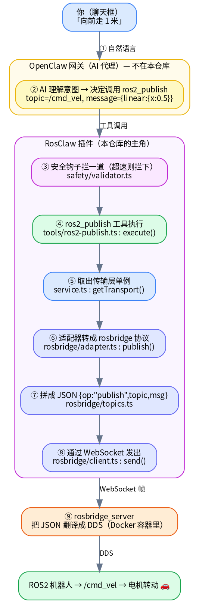
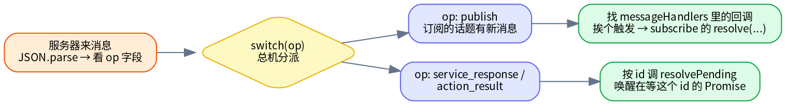

# RosClaw 核心代码导读

# 逐行详解系列 · 总览

> 这是为**新手中的新手**准备的"逐行 + 逐语法"代码详解系列，是对 [`learn/04-核心代码导读.md`](../04-核心代码导读.md) 的深度展开。
>
> - 顶层 `04` 章是"鸟瞰"——讲设计意图、用简化代码。
> - 本系列 `code/` 是"显微镜"——读**真实源码**，**每一行、每一个符号**都拆开讲，第一次出现的 TypeScript 语法都用「语法小课堂」单独补课。
>
> **从哪开始**：🧭 **强烈建议先读 [00 · 一条命令的旅程](00-一条命令的旅程.md)**——它是全系列的"龙头"，跟着一条命令（「向前走 1 米」）走过 8 个文件，精确到"哪个文件、哪个函数、第几行"，并链到下面每一篇。有了这条主线打底，再按下表顺序逐篇读就不会迷路。
>
> **怎么用**：按下表顺序一篇篇读。每篇结尾有「语法点回顾清单」，可当字典反查。讲解顺序遵循**依赖关系**（先读被依赖的底层，再读依赖它的上层），而不是文件名顺序。

---

## 流程主线（先读我）

| # | 文档 | 内容 | 状态 |
|---|---|---|---|
| 00 | [一条命令的旅程](00-一条命令的旅程.md) | 跟踪一条命令端到端穿过 8 个文件，每跳标注 `文件:函数:行号` 并链入对应逐行详解——**全系列的导航主线** | ✅ |

---

## 进度一览

图例：✅ 已完成 · ⬜ 待完成 · "行数"=源码行数（难度参考）

### 第一部分：契约与配置（基础，无执行逻辑）

| # | 文档 | 源文件 | 状态 | 行数 |
|---|---|---|---|---|
| 01 | [plugin-api.ts](01-plugin-api.ts.md) | `src/plugin-api.ts` | ✅ | 138 |
| 02 | [config.ts](02-config.ts.md) | `src/config.ts` | ✅ | 73 |

### 第二部分：传输层抽象（接口与数据结构）

| # | 文档 | 源文件 | 状态 | 行数 |
|---|---|---|---|---|
| 03 | [transport-types.ts](03-transport-types.ts.md) | `src/transport/types.ts` | ✅ | 119 |
| 04 | [transport.ts](04-transport.ts.md) | `src/transport/transport.ts` | ✅ | 70 |

### 第三部分：rosbridge 实现（模式 B，唯一完整实现）

| # | 文档 | 源文件 | 状态 | 行数 |
|---|---|---|---|---|
| 05 | [rosbridge-types.ts](05-rosbridge-types.ts.md) | `src/transport/rosbridge/types.ts` | ✅ | 119 |
| 06 | [rosbridge-client.ts](06-rosbridge-client.ts.md) 🔥最难 | `src/transport/rosbridge/client.ts` | ✅ | 317 |
| 07 | [rosbridge-topics.ts](07-rosbridge-topics.ts.md) | `src/transport/rosbridge/topics.ts` | ✅ | 60 |
| 08 | [rosbridge-services.ts](08-rosbridge-services.ts.md) | `src/transport/rosbridge/services.ts` | ✅ | 41 |
| 09 | [rosbridge-actions.ts](09-rosbridge-actions.ts.md) | `src/transport/rosbridge/actions.ts` | ✅ | 81 |
| 10 | [rosbridge-adapter.ts](10-rosbridge-adapter.ts.md) | `src/transport/rosbridge/adapter.ts` | ✅ | 148 |

### 第四部分：装配与启动

| # | 文档 | 源文件 | 状态 | 行数 |
|---|---|---|---|---|
| 11 | [transport-factory.ts](11-transport-factory.ts.md) | `src/transport/factory.ts` | ✅ | 42 |
| 12 | [service.ts](12-service.ts.md) | `src/service.ts` | ✅ | 114 |
| 13 | [index.ts](13-index.ts.md) | `src/index.ts` | ✅ | 40 |

### 第五部分：工具层（注册给 AI 的 8 个工具）

| # | 文档 | 源文件 | 状态 | 行数 |
|---|---|---|---|---|
| 14 | [tools-index.ts（含通用结构）](14-tools-index.ts.md) | `src/tools/index.ts` | ✅ | 21 |
| 15 | [ros2-publish.ts](15-ros2-publish.ts.md) | `src/tools/ros2-publish.ts` | ✅ | 39 |
| 16 | [ros2-subscribe.ts](16-ros2-subscribe.ts.md) | `src/tools/ros2-subscribe.ts` | ✅ | 50 |
| 17 | [ros2-service.ts](17-ros2-service.ts.md) | `src/tools/ros2-service.ts` | ✅ | 43 |
| 18 | [ros2-action.ts](18-ros2-action.ts.md) | `src/tools/ros2-action.ts` | ✅ | 47 |
| 19 | [ros2-param.ts](19-ros2-param.ts.md) | `src/tools/ros2-param.ts` | ✅ | 83 |
| 20 | [ros2-introspect.ts](20-ros2-introspect.ts.md) | `src/tools/ros2-introspect.ts` | ✅ | 29 |
| 21 | [ros2-camera.ts](21-ros2-camera.ts.md) | `src/tools/ros2-camera.ts` | ✅ | 53 |

### 第六部分：钩子与命令

| # | 文档 | 源文件 | 状态 | 行数 |
|---|---|---|---|---|
| 22 | [safety-validator.ts](22-safety-validator.ts.md) | `src/safety/validator.ts` | ✅ | 43 |
| 23 | [robot-context.ts](23-robot-context.ts.md) | `src/context/robot-context.ts` | ✅ | 192 |
| 24 | [commands-estop.ts](24-commands-estop.ts.md) | `src/commands/estop.ts` | ✅ | 40 |
| 25 | [commands-transport.ts](25-commands-transport.ts.md) | `src/commands/transport.ts` | ✅ | 171 |

### 第七部分：另外两种传输模式（模式 A / C）

| # | 文档 | 源文件 | 状态 | 行数 |
|---|---|---|---|---|
| 26 | [local-transport.ts](26-local-transport.ts.md) | `src/transport/local/transport.ts` | ✅ | 375 |
| 27 | [local-conversion.ts](27-local-conversion.ts.md) | `src/transport/local/conversion.ts` | ✅ | 153 |
| 28 | [local-entities.ts](28-local-entities.ts.md) | `src/transport/local/entities.ts` | ✅ | 129 |
| 29 | [webrtc-signaling-types.ts](29-webrtc-signaling-types.ts.md) | `src/transport/webrtc/signaling-types.ts` | ✅ | 130 |
| 30 | [webrtc-transport.ts](30-webrtc-transport.ts.md) | `src/transport/webrtc/transport.ts` | ✅ | 516 |
| 31 | [webrtc-signaling-client.ts](31-webrtc-signaling-client.ts.md) | `src/transport/webrtc/signaling-client.ts` | ✅ | 196 |

### 第八部分：第二个扩展

| # | 文档 | 源文件 | 状态 | 行数 |
|---|---|---|---|---|
| 32 | [openclaw-canvas](32-openclaw-canvas.md) | `extensions/openclaw-canvas/` | ✅ | 14 |

---

## 当前进度

- **全部完成：32 / 32 篇 🎉**（整个 RosClaw 项目——主插件 31 个源文件 + 第二个扩展 canvas——已逐行读完）。
- 收官篇 [32 · openclaw-canvas](32-openclaw-canvas.md) 末尾有全系列总回顾与下一步建议。
- 想反查某个语法点，用下面的「语法学习地图」。

### 交付批次记录

| 批次 | 包含文档 | 状态 |
|---|---|---|
| 第一批 | 01, 02 | ✅ |
| 第二批（合并入第一批前的确认） | — | — |
| 第三批 | 03, 04 | ✅ |
| 第四批 | 05, 06 | ✅ |
| 第五批 | 07, 08, 09 | ✅ |
| 第六批 | 10, 11 | ✅ |
| 第七批 | 12, 13 | ✅ |
| 第八批 | 14, 15, 16 | ✅ |
| 第九批 | 17, 18, 19 | ✅ |
| 第十批 | 20, 21 | ✅ |
| 第十一批 | 22, 23 | ✅ |
| 第十二批 | 24, 25 | ✅ |
| 第十三批 | 26, 27, 28 | ✅ |
| 第十四批 | 29, 30, 31 | ✅ |
| 第十五批 | 32 | ✅ 收官 🎉 |

> 批次划分是计划，可能随内容长短微调；以上表"进度一览"的 ✅/⬜ 为准。

---

## 语法学习地图（已讲过的 TypeScript 语法 → 在哪篇首次出现）

读到后面遇到忘了的语法，回这里查它在哪篇讲过。

### 注释与模块
- 三种注释 `// /* */ /** */`、JSDoc、`@see` —— 01、05
- `import { X }`（具名）/ `import X`（默认）/ `import type` —— 01、02、06
- `import`（值，要 new/调用）vs `import type`（仅类型，运行时抹除）的判断标准 —— 10
- 一条 import 混用值与类型：`import { 值, type 类型 } from …` —— 30
- 动态 `import("...")`：执行到才加载、返回 Promise、按需加载 —— 11
- `createRequire(import.meta.url)`：在 ESM 里借 CJS 的 `require` 加载老库（rclnodejs）；`import.meta.url` 当前文件地址 —— 26
- `export default`（默认导出，一文件至多一个、导入不带花括号）vs 具名 `export` —— 13
- `export` 导出、`./` 当前目录、`../` 上级、内部导入写 `.js` 后缀 —— 01、04

### 类型系统基础
- 基础类型 `string`/`number`/`boolean`/`void`/`unknown`/`null` —— 01、06
- `interface`（对象形状）vs `type`（更万能） —— 01
- 可选 `?`、数组 `[]`、`Record<K,V>`、`Promise<T>` —— 01
- 联合 `|`、字面量类型、判别联合、类型收窄 —— 01、03
- 交叉类型 `&` —— 06
- 函数类型 `(参数) => 返回`、回调、函数重载 —— 01、03
- 剩余参数 `function f(a, ...args: unknown[])`（收集任意多个尾部参数） —— 32
- 极简局部接口：只声明真正用到的成员（vs 完整 `OpenClawPluginApi`） —— 32
- `interface extends`（继承）、子接口收紧字段 —— 05
- `class implements 接口`：承诺实现契约、TS 逐方法强制检查 —— 10
- `never` 类型 + 穷举检查（`const _e: never = 判别变量`，漏分支编译期报错） —— 11
- `any`（放弃类型检查的逃生类型，catch 里常见） —— 11
- `type X = any` 给 any 起有意义的别名（自我文档化） —— 28
- 工具类型 `Required<T>`、`ReturnType<typeof f>` —— 06
- `as`（类型断言）、`!`（非空断言）、`typeof 值`（值→类型） —— 06、02
- 双重断言 `as unknown as X`（源/目标差太远时的强转） —— 09
- `satisfies 类型`：验证对象符合某类型但保留精确类型（比 `as` 安全——核对而非强断言） —— 31
- 索引签名 `[key: string]: unknown`（除已知字段外允许任意字符串键） —— 29
- `string | null`（值可为 null）vs `?`（键可省略）的区别 —— 29
- 索引访问类型 `TransportConfig["mode"]`（从对象类型里取某字段的类型，跟着源头自动变） —— 12
- `as const`（锁成只读字面量类型）+ 从数组派生类型 `(typeof 数组)[number]` —— 25
- 类型守卫 `function f(x): x is T`（运行时检查 + 让 TS 收窄类型） —— 25
- 真值判断 `if (someValue)`（判空简写）、可空函数字段 `(() => void) | null` —— 07

### 值与变量
- `const`/`let`/`var`、对象简写 `{a,b}`、数组解构 `[x,y]` —— 02、06
- 模块级变量（写在文件最外层、全文件共享、程序运行期长存）——单例的朴素实现 —— 12
- 先声明后赋值 `let x: T;` 再在各分支赋值（穷尽分支时可省 `default`） —— 12
- 参数名加 `_` 前缀（`_ctx`）表示"故意不用此参数" —— 12
- 对象解构 `const { X } = 模块/对象`（拆出某项） —— 11
- 模板字符串 `` `${x}` ``、数字分隔符 `10_000` —— 06
- `??`（空值合并）、`?.`（可选链）、默认参数 —— 06

### 运算与控制流
- `===`/`!==`、`!`/`&&`/`||`、三元 `?:` —— 06
- `if`、`switch`/`case`/`break`、`for...of`、`continue`、`return` —— 02、06
- `++x`/`x++`、`Math.min`/`Math.pow`、`字符串.startsWith` —— 06
- `**`（乘方）、`Math.sqrt`（平方根）、`Math.abs`（绝对值）、`数字.toFixed(2)`（保留小数） —— 22
- 数组 `.map((元素,下标)=>…)`、`.push()`；箭头函数返回对象套圆括号 `({...})` —— 10
- 数组 `.filter(判断函数)`（筛选）、`.length`（长度） —— 23
- 数组 `.some(判断)`（有无任一满足）、`.find(判断)`（找第一个）、链式 `.filter().map()` —— 26
- `Object.entries`（键值对数组）/`Object.keys`（键名数组）/`Map.values`（值），配 `for...of` 遍历 —— 26
- 数组 `.includes`/`.join`/`.slice(1)`、字符串 `.includes`/`.split`、正则 `/\s+/`（按空白分割） —— 25
- 解构剩余元素 `const [key, ...rest] = …`（处理"值里也含分隔符"） —— 25
- `{ ...对象 }` 展开浅拷贝（改副本不污染原对象）、`键 in 对象`（判断有无该键） —— 25
- `Number(value)` 转数字、`Number.isNaN` 校验、`value === "true"` 转布尔、按 `typeof` 分支转换 —— 25
- 字符串 `.endsWith` / `.slice(起,止)` / 负数下标"从末尾数"；`对象["键名"]` 取属性 —— 10
- 字符串拼装：`s += x`（追加）、`\n` 换行、多行模板字符串、`\\\`` 转义反引号、`.trim()` —— 23
- `字符串.replace(/\/+$/, "")`：正则去掉结尾斜杠（URL 规整） —— 31

### 类与异步
- `class`/`new`/实例/`this`/`constructor`/`private` —— 06
- `static` 静态成员（类共享一份）+ 静态门闩（全进程只初始化一次） —— 26
- 递归：函数调用自己处理"同类的子结构"（嵌套消息层层穿透） —— 27
- 构造函数参数属性简写（参数前加 `private`/`public` 自动建字段） —— 07
- `get 属性()`：取值器（getter），用时不加括号、像读属性但实时计算 —— 31
- `Map`/`Set` 容器及其方法 —— 06
- `Promise` 构造 `new Promise((resolve,reject)=>…)`、`async`/`await` —— 06
- `async` 函数直接 `return` 一个 Promise（不在体内 await）、事件→Promise 桥接 —— 08
- `setTimeout`/`clearTimeout`、`try/catch`、`throw`/`new Error` —— 02、06
- `setInterval`/`clearInterval`：反复定时触发（vs setTimeout 一次）；心跳保活 —— 31
- `fetch(url, {method,headers,body})` 发 HTTP 请求；`res.ok`/`res.status`/`res.json()`/`res.text()` —— 31
- `catch {}`（不接错误对象，出错也无所谓）vs `catch (err)`（要用错误） —— 23
- `try/finally`（无论成败必执行的善后） —— 09
- 并发门闩：布尔标志 + `try { 上闩… } finally { 抬闩 }` 防止异步操作重入 —— 12
- **`Promise.all([...])`：多个异步操作并行、一起等，结果按序解构 `const [a,b,c]=…`** —— 23
- 带 TTL 的缓存：`Date.now()` 时间戳 + `现在-timestamp<TTL` 判新鲜 + 模块级 `cache` —— 23
- 降级兜底（fallback）：失败返回空/默认，`if(有数据)用真的 else 用兜底` —— 23
- `JSON.stringify`/`JSON.parse` —— 06

### 第三方库
- Zod：`z.object/string/number/boolean/enum/array/union`、链式 `.optional()/.default()`、`z.infer` —— 02
- `TSchema`（TypeBox，工具参数定义） —— 01
- TypeBox：`Type.Object/String/Number/Record/Unknown/Optional`、字段带 `{ description }`（写给 AI） —— 14、15、16

### 工具开发（OpenClaw）
- 工具对象 `AgentTool`：name/label/description/parameters/execute —— 14
- `description` 是写给 AI 的提示词（决定 AI 是否/如何使用工具） —— 14
- `execute(_toolCallId, params): Promise<ToolResult>`、返回 `content`(文本) + `details`(对象) —— 14、15
- `params["键"] as 类型`：从 `Record<string,unknown>` 取参数并断言（有 schema 校验兜底） —— 15
- 竞速 Promise：一条路 `resolve`、另一条 `setTimeout`→`reject`，谁先到谁结束 + 双向清理 —— 16
- 一个注册函数里多次 `api.registerTool`（一文件注册多个工具） —— 19
- "某能力 = 调某约定服务"模式：模板字符串拼服务名 + 迁就服务形状（值包成数组、嵌套结构） —— 19（呼应 10 的 `/rosapi/topics`）
- 纯转发的值不必 `as` 断言（要用具体能力才断言） —— 19
- 底层能力（如动作进度回调）在工具层可选择不用——务实取舍 —— 18
- `Type.Object({})`：声明"无参数"工具（仍必须写 `parameters`） —— 20
- base64：把二进制（图像）编码成纯文本以便走 JSON 协议；`ToolResult.content` 支持 `text`/`image` 两型 —— 21

### 钩子（OpenClaw hooks，按时机自动触发）
- `api.on(事件名, async (event, ctx) => {...})`：登记钩子，宿主到点自动触发（vs 工具被动调用） —— 22
- `before_tool_call`：工具调用前拦截，返回 `{block,blockReason}` 拦下 / `void` 放行 —— 22
- `before_agent_start`：对话开始前注入，返回 `{prependContext: 文本}` 塞进系统提示 —— 23
- 钩子用返回值影响宿主行为（拦截 / 注入），是统一的机制 —— 22、23

### 命令（OpenClaw commands，用户直接打 `/xxx`）
- `api.registerCommand({ name, description, handler })`：登记命令，绕过 AI；`description` 写给人 —— 24
- 命令 `handler(ctx)` 返回 `{ text }`：作为回复直接显示给用户 —— 24
- 三种交互对照：工具(AI 调,返 content/details) / 钩子(宿主触发,返 block/prependContext) / 命令(用户打,返 text) —— 24
- `ctx.args` 解析参数：`?? ""` + `.trim()` + `.split(/\s+/)` + 类型守卫校验 —— 25
- 安全操作的 try/catch：成功确认、失败响亮告警、绝不静默（`/estop`） —— 24

> 早先预告的大语法（`Promise.all` 并行、`createRequire`/CommonJS 互操作）均已在第 23、26 篇讲完。至此本系列承诺补的语法点已全部覆盖。

### 读码方法论（比语法更值钱的几样）
- 看懂"分层"：接口在中间、实现可替换（三种传输模式同实现一个 `RosTransport`） —— 04 + 10/26/30
- 识别"模式"：缓存（查→建→存）、Promise 包装回调、按 id 配对、引用计数清理 —— 反复出现
- 对照"现状 vs 文档"：发现并诚实指出代码与文档/注释的不一致（以代码为准） —— 21、30、31
- 存根的正当价值：正确类型签名 + 诚实标注未实现（vs 假装实现） —— 32

---

## 阅读建议

1. **严格按顺序**：后一篇默认你已掌握前面讲过的语法，讲过的不再重复。
2. **对照真实源码**：每篇开头有源文件链接，建议左边开源码、右边开详解对照看。
3. **卡住就回查**：忘了某语法，用上面「语法学习地图」定位到首讲那篇。
4. **第 06 篇（client.ts）是分水岭**：它最难、语法最密。吃透它，后面都是轻松的。建议反复读 `connect` 和 `handleMessage` 两个方法。
5. **读完动手改一行**：挑个最感兴趣的方法，自己改一行、跑一下看会怎样——"读"之后"动手"才能把知识焊牢。

---

## 🎉 全系列已完成（32 / 32）

从 01 `plugin-api.ts` 到 32 `openclaw-canvas`，整个 RosClaw 已逐行读完。收官总回顾见 [第 32 篇结尾](32-openclaw-canvas.md)。一路累计的上百个 TypeScript 语法点都收录在上面的「语法学习地图」里，可随时反查——它们是读**任何** TS 项目的通用功底。

← 返回 [核心代码导读（鸟瞰版）](../04-核心代码导读.md)


---


# 逐行详解 ⓪：一条命令的旅程（全系列主线 · 先读我）

> **这是整个逐行详解系列的"龙头"文档，建议第一个读。**
>
> 前面的 01–32 篇是"显微镜"——每篇把一个源文件**逐行**拆开。但新手最容易迷路的不是某一行看不懂，而是**"这些文件之间到底怎么串起来的？我发一句话，代码里到底依次发生了什么？"**
>
> 本篇就回答这个问题：我们跟踪**一条命令**——用户在聊天框打「向前走 1 米」——看它如何穿过整个 RosClaw，最终让机器人动起来。**每一跳都精确标注"哪个文件、哪个函数、第几行、信息变成了什么形状"，并链接到对应的逐行详解篇。**
>
> 读完它，你就有了一张"全局地图"。之后再按 01→32 钻进每个文件时，你随时知道"我现在在地图的哪个位置"。

---

## 怎么用这篇文档

- **第一次读**：从头顺读，不必点开每个链接，先在脑子里建立"一条命令流过 8 个站点"的整体印象。
- **读 01–32 时**：每当你读某一篇有点"只见树木"的感觉，回到本篇，找到那个文件在主线中的位置，就知道它"上游是谁、下游是谁"。
- **查地图**：文末有一张"全站点速查表"，可随时反查。

> 本篇出现的所有行号都对照当前源码核实过。若你本地代码版本不同，行号可能有小幅偏移，但函数名和顺序不变。

---

## 先看全景：一条命令要过几道关

想象你在微信里对机器人说「**向前走 1 米**」。这句中文，要变成机器人电机的转动，中间隔着**两个世界**：

- **"人话"的世界**：自然语言、聊天消息。
- **"机器"的世界**：ROS2 的话题、二进制 DDS 消息、电机指令。

RosClaw 就是把前者翻译成后者的**翻译流水线**。这条流水线大致是：



**注意信息的"形态"在一路上不断变化**（这是本篇最想让你记住的一点）：

| 阶段 | 信息长什么样 |
|---|---|
| 你发的 | 一句中文字符串 `"向前走 1 米"` |
| AI 产出的 | 一次"工具调用"：工具名 + 参数对象 |
| 工具内部 | 一个 JavaScript 对象 `{ topic, type, msg }` |
| 传输层发出的 | 一条 rosbridge **JSON 文本** `{"op":"publish",...}` |
| WebSocket 上 | 一个网络数据帧（就是上面那段 JSON 的字节） |
| rosbridge 之后 | ROS2 的 **DDS 二进制消息** |

**翻译，就是不断改变信息的形态、同时保持含义不变。** 下面逐站点细看。

---

## 站点 0（启动时就绪）：插件装配 —— `index.ts`

在你发任何消息**之前**，OpenClaw 启动时会加载 RosClaw 插件，调用它的 `register()` 函数。这一步把后面要用到的所有"零件"装好。

📍 **`src/index.ts` · `register()` · 第 17–39 行**

```typescript
register(api: OpenClawPluginApi): void {
  api.logger.info("RosClaw plugin loading...");
  const config = parseConfig(api.pluginConfig ?? {});   // 解析配置

  registerService(api, config);        // ① 建立 ROS2 连接（传输层）
  registerTools(api);                  // ② 注册 8 个 AI 工具
  registerSafetyHook(api, config);     // ③ 注册安全钩子
  registerRobotContext(api, config);   // ④ 注册"能力注入"钩子
  registerEstopCommand(api, config);   // ⑤ 注册 /estop 命令
  registerTransportCommand(api, config); // ⑥ 注册 /transport 命令
}
```

- **打个比方**：`register` 像开店前的"备货 + 摆货架"。它本身不卖东西，只是把"连接"建好、把"工具"摆上货架、把"安检员"安排到门口。等顾客（你的消息）上门，这些零件才各司其职。
- 这 6 个 `registerXxx` 就是插件的全部家当，**后面每一个站点都是其中之一被触发**。
- 注意一个**关键顺序**：`registerService` 排第一——必须先把"和机器人的连接"建好，后面的工具才有"管子"可用。

> 🔍 逐行详解：[第 13 篇 · index.ts](13-index.ts.md)（插件入口、`export default`、"只注册不执行"的节奏）

---

## 站点 1（会话开始前）：告诉 AI "这台机器人能干什么" —— `robot-context.ts`

你刚打开对话、还没说话时，就有一个钩子悄悄运行了：它**查出机器人当前有哪些话题/服务/动作，塞进 AI 的"脑子"里**。否则 AI 根本不知道该往哪个话题发消息。

📍 **`src/context/robot-context.ts` · `registerRobotContext()` · 第 26–49 行**

```typescript
api.on("before_agent_start", async (_event, _ctx) => {
  const capabilities = await discoverCapabilities(api, robotNamespace); // 查能力
  const context = buildRobotContext(robotName, robotNamespace, capabilities); // 拼成文本
  return { prependContext: context };   // 塞进 AI 系统提示
});
```

- **`before_agent_start`** 是个"钩子"——OpenClaw 在"AI 开始思考之前"自动触发它。返回 `{ prependContext: 文本 }`，这段文本就会被**插到 AI 的系统提示最前面**。
- 那段文本长这样（大意）：`这台机器人叫 TurtleBot3，可用话题有 /cmd_vel、/odom、/battery_state……`。AI 读了它，才知道"向前走"应该往 `/cmd_vel` 发。

**那"能力"是怎么查出来的？** 看 `discoverCapabilities`：

📍 **`src/context/robot-context.ts` · `discoverCapabilities()` · 第 55–98 行**

```typescript
const [topics, services, actions] = await Promise.all([
  transport.listTopics(),     // 并行发起三个查询
  transport.listServices(),
  transport.listActions(),
]);
```

- **`Promise.all`** 让三个查询**并行**跑、一起等结果（比一个个等快）。
- 这三个 `transport.listXxx()` 最终会**调用一个 ROS2 服务**去问机器人。以 `listTopics` 为例，它落到适配器里：

📍 **`src/transport/rosbridge/adapter.ts` · `listTopics()` · 第 102–112 行**

```typescript
const response = await callService(this.client, "/rosapi/topics", {}, "rosapi/srv/Topics");
```

- 看到了吗——**"查有哪些话题"本身也是一次"调用服务"**（服务名 `/rosapi/topics`）。这就和站点 6 之后的请求-响应走同一套机制了（后面会讲）。
- 还有个贴心设计：结果会**缓存 60 秒**（第 60 行 `Date.now() - cache.timestamp < CACHE_TTL_MS`），避免每次对话都重新查一遍；查询失败也不会崩，而是**降级**成一份硬编码的默认能力（第 89–97 行）。

> 🔍 逐行详解：[第 23 篇 · robot-context.ts](23-robot-context.ts.md)（`before_agent_start`、`Promise.all`、TTL 缓存、降级兜底）

---

## 站点 2（AI 的工作）：把"人话"变成"工具调用" —— OpenClaw 侧

这一步**不在本仓库**，是 OpenClaw 平台 + 大模型（Claude）干的，但它是整条链的转折点，必须理解：

- AI 收到你的「向前走 1 米」+ 站点 1 注入的能力清单，**推理**出："这要往 `/cmd_vel` 发一个 Twist 速度消息。"
- 于是 AI 产出一次**工具调用（tool call）**：
  - 工具名：`ros2_publish`
  - 参数：`{ topic: "/cmd_vel", type: "geometry_msgs/msg/Twist", message: { linear: { x: 0.5, ... }, angular: {...} } }`
- **AI 怎么知道有 `ros2_publish` 这个工具、该传什么参数？** 靠的是工具注册时写的 `description`（提示词）和 `parameters`（参数 schema）——这正是站点 0 里 `registerTools` 摆上货架时声明的。

> 📌 **这里是"人话世界"和"机器世界"的分界线**：往上是自然语言 + AI 推理，往下全是确定的代码逻辑。RosClaw 插件的工作从下一站正式开始。
>
> 🔍 想理解"工具"这种交互形式：[第 14 篇 · 工具通用结构](14-tools-index.ts.md)；想看整体架构：[顶层 · 03 架构深度解析](../03-架构深度解析.md)

---

## 站点 3（工具执行前）：安全员拦一道 —— `validator.ts`

AI 说要发速度消息，但**先别急**——在工具真正执行前，安全钩子会拦下来检查"这个速度会不会太快出危险"。

📍 **`src/safety/validator.ts` · `registerSafetyHook()` 内的 `before_tool_call` · 第 11–42 行**

```typescript
api.on("before_tool_call", async (event, _ctx) => {
  if (event.toolName === "ros2_publish") {
    const msg = event.params["message"] as Record<string, unknown> | undefined;
    if (msg) {
      const linear = msg["linear"] as Record<string, number> | undefined;
      if (linear) {
        const speed = Math.sqrt(                       // 第 20 行：算合速度
          (linear["x"] ?? 0) ** 2 + (linear["y"] ?? 0) ** 2 + (linear["z"] ?? 0) ** 2,
        );
        if (speed > safety.maxLinearVelocity) {
          return { block: true, blockReason: `...exceeds safety limit...` }; // 第 27 行：拦下
        }
      }
      // ……角速度同理（第 31–37 行）……
    }
  }
});
```

- **`before_tool_call`** 也是钩子，但时机不同：**每次工具即将执行前**触发。
- 它把参数里的 `message.linear` 取出来，用 `Math.sqrt(x² + y² + z²)` 算出**合速度**（第 20 行），和配置的上限 `maxLinearVelocity` 比。
- **两种结局**：
  - 超限 → `return { block: true, blockReason: "..." }`（第 27 行）→ **工具被拦截、不执行**，AI 收到拦截原因。
  - 没超 → 函数自然走完、`return` 一个 `undefined` → **放行**，进入下一站。
- **打个比方**：安全员站在工具门口，速度合规就放你进去，超速就把你拦下并说明理由。这一道关保证"AI 再怎么发疯，也发不出超过物理上限的危险速度"。

> 🔍 逐行详解：[第 22 篇 · validator.ts](22-safety-validator.ts.md)（钩子机制、`Math.sqrt`/`**`、默认放行/危险拦截）

---

## 站点 4：工具执行 —— `ros2-publish.ts`

安全员放行后，`ros2_publish` 工具的 `execute` 真正运行。它的工作出奇地简单——**取参数、拿传输层、发出去**。

📍 **`src/tools/ros2-publish.ts` · `execute()` · 第 24–37 行**

```typescript
async execute(_toolCallId, params) {
  const topic = params["topic"] as string;       // 第 25 行：取出三个参数
  const type = params["type"] as string;
  const message = params["message"] as Record<string, unknown>;

  const transport = getTransport();               // 第 29 行：拿到传输层单例
  transport.publish({ topic, type, msg: message }); // 第 30 行：发布！

  const result = { success: true, topic, type };
  return { content: [{ type: "text", text: JSON.stringify(result) }], details: result };
}
```

- 第 25–27 行：从 `params` 里取出 AI 传来的 `topic`、`type`、`message`。
- 第 29 行：`getTransport()` 拿到"和机器人的连接"（下一站讲它从哪来）。
- 第 30 行：`transport.publish({...})`——**真正的发布动作**。注意工具把参数 `message` 改名成 `msg` 装进对象（迁就传输层接口的字段名）。
- **工具层只是"薄薄一层"**：它不关心底层用 WebSocket 还是 WebRTC，只管"把请求交给 transport"。这正是分层设计的好处。

> 🔍 逐行详解：[第 15 篇 · ros2-publish.ts](15-ros2-publish.ts.md)（TypeBox 参数、`execute` 套路、`ToolResult` 的 content/details）

---

## 站点 5：取出"传输层"单例 —— `service.ts`

第 29 行那个 `getTransport()` 是从哪儿拿到连接的？答案在 `service.ts`——它管着一个**全程序共享的唯一连接对象（单例）**。

📍 **`src/service.ts` · `getTransport()` · 第 18–23 行**

```typescript
let transport: RosTransport | null = null;   // 第 9 行：模块级单例变量

export function getTransport(): RosTransport {
  if (!transport) {
    throw new Error("Transport not initialized. Is the service running?");
  }
  return transport;   // 返回那个唯一的连接
}
```

- `transport` 是个**模块级变量**（写在文件最外层，全文件共享），保存"唯一的那条连接"。
- **这条连接是什么时候建的？** 回到站点 0：`registerService` 在插件启动时，于 `start()` 里建好并连上：

📍 **`src/service.ts` · `registerService().start()` · 第 94–101 行**

```typescript
transport = await createTransport(transportCfg);  // 第 94 行：按配置造一个传输层
transport.onConnection((status) => { ... });
await transport.connect();                          // 第 100 行：连上机器人
currentMode = mode;
```

- `createTransport` 是个**工厂**：看配置里 `mode` 是 `rosbridge`/`local`/`webrtc`，就造对应的那一种。默认 `rosbridge`，所以这里造的是 `RosbridgeTransport`。
- **打个比方**：`service.ts` 像大楼的"总闸"——开店时合闸（`connect`），所有工具共用这一路电（同一个 `transport`），关店时拉闸（`disconnect`）。
- 还有个 `switchTransport`（第 35 行）支持运行时换传输模式，用了"并发门闩"防止换到一半被打断——那是 `/transport` 命令用的，本主线用不到。

> 🔍 逐行详解：[第 12 篇 · service.ts](12-service.ts.md)（模块级单例、并发门闩、生命周期）；工厂见 [第 11 篇](11-transport-factory.ts.md)

---

## 站点 6：适配器 —— `adapter.ts`

`transport.publish(...)` 调到的是 `RosbridgeTransport`（默认模式）的 `publish` 方法。它做的事也很薄——**转交给一个专门发布话题的小助手**。

📍 **`src/transport/rosbridge/adapter.ts` · `publish()` · 第 55–58 行**

```typescript
publish(options: PublishOptions): void {
  const publisher = new TopicPublisher(this.client, options.topic, options.type);
  publisher.publish(options.msg);
}
```

- `RosbridgeTransport` 实现了一个统一接口 `RosTransport`（13 个方法：publish/subscribe/callService……）。**三种传输模式都实现同一个接口**，所以上层（工具）调 `transport.publish` 时根本不用管底下是哪种模式。
- 这里它把活儿交给 `TopicPublisher`（话题发布小助手），自己只负责"组装零件、转交"。
- **打个比方**：适配器像前台。你说"我要发布到 /cmd_vel"，前台不亲自跑腿，而是叫来"话题发布专员"（`TopicPublisher`）去办。

> 🔍 逐行详解：[第 10 篇 · adapter.ts](10-rosbridge-adapter.ts.md)（`implements` 接口、13 个方法、把活儿分派给各助手）；统一接口本身见 [第 04 篇](04-transport.ts.md)

---

## 站点 7：拼成 rosbridge 协议 JSON —— `topics.ts`

`TopicPublisher.publish` 终于把请求变成了**rosbridge 协议规定的那条 JSON**。

📍 **`src/transport/rosbridge/topics.ts` · `TopicPublisher.publish()` · 第 15–22 行**

```typescript
publish(msg: Record<string, unknown>): void {
  this.client.send({
    op: "publish",          // ← rosbridge 协议：op 字段表明"这是发布操作"
    topic: this.topic,      //    /cmd_vel
    type: this.type,        //    geometry_msgs/msg/Twist
    msg,                    //    { linear: {...}, angular: {...} }
  });
}
```

- **这就是"信息形态"的关键一变**：原本是 JavaScript 对象，现在被拼成了 **rosbridge 协议**约定的形状——一个带 `op` 字段的对象。`op: "publish"` 告诉 rosbridge_server "我要往话题发消息"。
- rosbridge 协议就是一套"用带 `op` 字段的 JSON 表达 ROS2 操作"的约定：`publish`（发布）、`subscribe`（订阅）、`call_service`（调服务）等。
- 拼好后交给 `this.client.send(...)`——下一站真正发到网络上。

> 🔍 逐行详解：[第 07 篇 · topics.ts](07-rosbridge-topics.ts.md)；rosbridge 协议全貌见 [第 05 篇](05-rosbridge-types.ts.md)

---

## 站点 8：通过 WebSocket 发出去 —— `client.ts`

`client.send(...)` 是整条出站链的**最后一站**（插件这一侧）。它把那个 JSON 对象变成文本，写进 WebSocket。

📍 **`src/transport/rosbridge/client.ts` · `send()` · 第 138–144 行**

```typescript
send(message: RosbridgeMessage & Record<string, unknown>): void {
  if (!this.ws || this.status !== "connected") {
    throw new Error("Not connected to rosbridge server");
  }
  this.ws.send(JSON.stringify(message));   // 第 143 行：对象 → JSON 文本 → 发出
}
```

- 第 143 行 `JSON.stringify(message)`——**把对象序列化成 JSON 字符串**，再 `this.ws.send(...)` 写进 WebSocket 连接。
- 至此，那段文本 `{"op":"publish","topic":"/cmd_vel",...}` 以网络数据帧的形式，飞向 Docker 容器里的 **rosbridge_server**。
- `RosbridgeClient` 是最底层的"网络工"：管 WebSocket 的连接、断线重连、收发。**它是全系列最难、最核心的一篇**——因为"收消息"那一半（下面返回路径要用）也在这里。

> 🔍 逐行详解：[第 06 篇 · client.ts](06-rosbridge-client.ts.md) 🔥（全系列最难：connect、send、handleMessage）

---

## 站点 9（插件之外）：rosbridge → DDS → 机器人

JSON 飞出插件后：

1. **rosbridge_server**（跑在 Docker 容器里的 ROS2 官方组件）收到这条 JSON，**把它翻译成 ROS2 的 DDS 二进制消息**，发布到 `/cmd_vel` 话题。
2. ROS2 机器人（仿真里的 TurtleBot3）的电机控制节点**订阅**了 `/cmd_vel`，收到速度消息，驱动电机。
3. 🚗 **机器人向前动了。**

这一段不在本仓库（是 ROS2 生态的标准组件），但你要知道**信息在这里完成了最后一次形态转换**：rosbridge JSON → DDS 二进制。

> 想理解 rosbridge 是什么、为什么需要它：[顶层 · 01 项目概览](../01-项目概览.md) 和 [顶层 · 02 技术前置知识](../02-技术前置知识.md)。

---

## 返回路径：读类命令怎么把数据拿回来？

上面的「向前走」是**单向**的——发出去就完事（发布不需要回复）。但如果你问「**电池还有多少？**」，AI 会调 `ros2_subscribe_once` 工具，这就需要**等机器人回一条数据**。返回路径用了一个很妙的"竞速"技巧。

📍 **`src/tools/ros2-subscribe.ts` · `execute()` · 第 22–42 行**

```typescript
const result = await new Promise<Record<string, unknown>>((resolve, reject) => {
  const subscription = transport.subscribe(
    { topic, type: msgType },
    (msg) => {                       // 收到消息时：
      clearTimeout(timer);
      subscription.unsubscribe();
      resolve({ success: true, topic, message: msg });  // ← 兑现：把数据交出去
    },
  );
  const timer = setTimeout(() => {   // 同时起一个倒计时：
    subscription.unsubscribe();
    reject(new Error(`Timeout waiting for message on ${topic}`));  // ← 超时：报错
  }, timeout);
});
```

- **这是一场"竞速"**：两条路谁先到算谁——
  - **路 A**：机器人在 `timeout`（默认 5 秒）内回了消息 → 回调触发 → `resolve` 兑现，拿到数据。
  - **路 B**：超时了还没消息 → `setTimeout` 触发 → `reject` 报错。
  - 无论哪条先到，都会 `unsubscribe()` 退订并清掉对方（清 timer / 退订）——干净收尾。

**那机器人回的消息，是怎么走到这个回调里的？** 这就要回到站点 8 的 `client.ts`，但这次是**收消息**的那一半：

📍 **`src/transport/rosbridge/client.ts` · `handleMessage()` · 第 216–273 行**

```typescript
private handleMessage(data: string): void {
  const msg = JSON.parse(data);          // 收到的 JSON 文本 → 对象
  const op = msg.op as string | undefined;
  switch (op) {                          // 按 op 分派
    case "publish": {                    // 订阅的话题来消息了
      const handlers = this.messageHandlers.get(msg.topic);
      if (handlers) for (const h of handlers) h(msg.msg);  // → 触发上面那个回调
      break;
    }
    case "service_response":             // 服务调用的回复
    case "action_result": {
      this.resolvePending(msg.id, msg);  // 第 189 行：按 id 找到等待者并兑现
      break;
    }
    case "action_feedback": { ... }      // 动作进度
  }
}
```

- 收到的每条消息都先 `JSON.parse` 变回对象，再看 `op` 字段**分派**：
  - `op: "publish"`（订阅的话题有新消息）→ 找到登记在 `messageHandlers` 里的回调，挨个触发——**这就接回了上面 subscribe 的那个 `(msg) => { ... resolve(...) }`**。
  - `op: "service_response"` / `"action_result"` → 按消息里的 `id` 调 `resolvePending`（第 189 行），找到当初那个"在等这个 id 回复"的 Promise 并兑现。
- **"按 id 配对"是核心套路**：发请求时记下 `id` 和一个"等待者"，回复带着同样的 `id` 回来，就能精确找到该唤醒谁。站点 1 查能力用的 `callService` 也是靠这套机制拿到话题列表的。

把 `handleMessage` 这个"总机"的分派逻辑画出来：



> 🔍 逐行详解：[第 16 篇 · ros2-subscribe.ts](16-ros2-subscribe.ts.md)（竞速 Promise）；收发核心 [第 06 篇 · client.ts](06-rosbridge-client.ts.md)（`handleMessage` 的 `switch(op)`、`registerPending`/`resolvePending`）

---

## 全站点速查表（随时回查）

| 站点 | 文件 | 函数 | 行号 | 一句话 | 逐行详解 |
|---|---|---|---|---|---|
| 0 启动装配 | `index.ts` | `register()` | 17–39 | 注册 6 个零件 | [13](13-index.ts.md) |
| 1 能力注入 | `context/robot-context.ts` | `registerRobotContext` / `discoverCapabilities` | 26–49 / 55–98 | 把机器人能力塞进 AI 提示 | [23](23-robot-context.ts.md) |
| └ 发现走服务 | `transport/rosbridge/adapter.ts` | `listTopics()` | 102–112 | 调 `/rosapi/topics` 服务 | [10](10-rosbridge-adapter.ts.md) |
| 2 AI 选工具 | （OpenClaw 侧，非本仓库） | — | — | 人话 → 工具调用 | [14](14-tools-index.ts.md) |
| 3 安全拦截 | `safety/validator.ts` | `before_tool_call` 钩子 | 11–42 | 超速则 `block` | [22](22-safety-validator.ts.md) |
| 4 工具执行 | `tools/ros2-publish.ts` | `execute()` | 24–37 | 取参 → `transport.publish` | [15](15-ros2-publish.ts.md) |
| 5 取单例 | `service.ts` | `getTransport()` | 18–23 | 返回唯一连接（建于 94–101） | [12](12-service.ts.md) |
| 6 适配器 | `transport/rosbridge/adapter.ts` | `publish()` | 55–58 | 转交 `TopicPublisher` | [10](10-rosbridge-adapter.ts.md) |
| 7 拼协议 | `transport/rosbridge/topics.ts` | `TopicPublisher.publish()` | 15–22 | 组 `op:"publish"` JSON | [07](07-rosbridge-topics.ts.md) |
| 8 发送 | `transport/rosbridge/client.ts` | `send()` | 138–144 | `ws.send(JSON.stringify)` | [06](06-rosbridge-client.ts.md) |
| 9 机器人侧 | rosbridge_server → DDS | — | — | JSON → DDS → `/cmd_vel` | [01](../01-项目概览.md) |
| 返回 收消息 | `transport/rosbridge/client.ts` | `handleMessage()` | 216–273 | 按 `op`/`id` 分派回调 | [06](06-rosbridge-client.ts.md) |
| 返回 读工具 | `tools/ros2-subscribe.ts` | `execute()` | 22–42 | 竞速 Promise 等一条消息 | [16](16-ros2-subscribe.ts.md) |

---

## 三个最该记住的"全局道理"

读完这条主线，比记住具体行号更重要的是这三点——它们在 01–32 里会反复出现：

1. **分层 + 同一接口**：工具不知道底层用 WebSocket 还是 WebRTC，因为三种传输模式都实现同一个 `RosTransport` 接口（站点 4→6）。换模式只改工厂里 `new` 哪个类，上层一行都不用动。
2. **信息逐层改形、含义不变**：中文 → 工具调用 → JS 对象 → rosbridge JSON → WebSocket 帧 → DDS（看开头那张形态表）。每一层只负责"翻译成下一层听得懂的话"。
3. **请求-响应靠 id 配对、订阅靠话题回调**：出站是一条直线；入站则是 `handleMessage` 这个"总机"按 `op`/`id` 把消息接回正确的等待者（返回路径）。

---

## 接下来怎么读

- **想从最基础的"合同"开始**：→ [第 01 篇 · plugin-api.ts](01-plugin-api.ts.md)，然后按 01→32 顺序读，本系列每篇都假设你已掌握前面讲过的语法。
- **想先看大图、再钻代码**：→ 顶层 [03 架构深度解析](../03-架构深度解析.md) 和 [04 核心代码导读](../04-核心代码导读.md)。
- **想亲手跑起来、发一句话让机器人动**：→ 顶层 [05 完整实战教程](../05-完整实战教程.md)。

**这条主线会一直在这里。** 任何时候你在某一篇里"看不到全局"了，就回到本篇的速查表，找到那个文件的站点编号，你就知道它的上下游是谁。

下一份：[第 01 篇 · plugin-api.ts 逐行详解 →](01-plugin-api.ts.md)（一切的起点：OpenClaw 和插件之间的"合同"）

← 返回 [逐行详解系列 · 总览](README.md)


---


# 逐行详解 ①：`plugin-api.ts`

> 对应源文件：[extensions/openclaw-plugin/src/plugin-api.ts](../../extensions/openclaw-plugin/src/plugin-api.ts)
>
> 这是推荐阅读顺序的第 1 个文件。它**不是程序逻辑，而是一份"合同"**——用 TypeScript 的类型系统，把 OpenClaw 这个平台和我们插件之间的约定写下来。读懂它，你就知道"OpenClaw 会给我们什么、我们要还给它什么"。

---

## 阅读本章前，先建立 3 个最基础的概念

这 3 个概念后面会反复出现，先用大白话讲清楚。

### 概念 1：什么是"类型"？

在 TypeScript（简称 TS）里，每个数据都有"类型"，就是"这个数据长什么样"的标签。

- `string` —— 字符串，也就是文字，比如 `"你好"`、`"/cmd_vel"`。
- `number` —— 数字，比如 `3000`、`1.5`。
- `boolean` —— 布尔值，只有两个取值：`true`（真）和 `false`（假）。
- `void` —— "什么都不返回"。一个函数如果做完事不给你任何结果，它的返回类型就是 `void`。

### 概念 2：什么是 `interface`（接口）？

`interface` 是 TS 的关键字，意思是"定义一种对象的形状"。它**只描述长什么样，不写具体怎么做**。

打个比方：`interface` 就像招聘启事——"我们要招一个人，他必须会做 A、会做 B"。它不关心具体是谁来做，只规定"必须具备哪些能力/字段"。

```typescript
interface 人 {
  名字: string;   // 必须有一个叫"名字"的字段，且是文字
  年龄: number;   // 必须有一个叫"年龄"的字段，且是数字
}
```

任何对象只要同时有 `名字`（文字）和 `年龄`（数字），就算"符合这个接口"。

### 概念 3：什么是"声明文件 / 类型声明"？

这个文件开头的注释说得很清楚（第 1-7 行）：

```typescript
/**
 * Type declarations matching the real OpenClaw plugin SDK.
 *
 * Only the subset used by the rosclaw plugin is declared here.
 * These types mirror openclaw/plugin-sdk so that the plugin compiles
 * without importing the SDK at build time (it is provided at runtime).
 */
```

**语法小课堂：`/** ... */` 是什么？**
以 `/*` 开头、`*/` 结尾的是"块注释"，中间的内容计算机**完全忽略**，纯粹写给人看。开头是 `/**`（两个星号）的叫 **JSDoc 注释**，是一种约定俗成的、写给函数/类型的"文档说明"。

这段注释翻译过来是：
> 这些是与"真正的 OpenClaw 插件 SDK"相匹配的类型声明。这里只声明了 rosclaw 插件用到的那一小部分。这些类型是 `openclaw/plugin-sdk` 的"镜像"，这样插件在**编译时**不需要真的去导入 SDK 就能通过类型检查（真正的实现是在**运行时**由 OpenClaw 提供的）。

用大白话说：**OpenClaw 平台运行的时候，会塞给我们一个真实的工具箱（`api` 对象）。但我们写代码时它还不在手边，所以我们先按它的样子画一张"图纸"（类型声明），照着图纸写代码就不会出错。** 这个文件就是那张图纸。

---

## 第 9 行：导入一个外部类型

```typescript
import type { TSchema } from "@sinclair/typebox";
```

逐部分拆解：

- `import` —— 关键字，"从别的文件/库里拿东西过来用"。
- `type` —— 紧跟在 `import` 后面，强调"我只拿它的**类型**，不拿它的实际代码"。这是个优化：编译成最终运行的 JavaScript 时，这一行会被完全删掉（因为类型只在开发期检查用，运行时不需要）。
- `{ TSchema }` —— 一对花括号里写"我要拿的东西的名字"。这里要拿的是 `TSchema`。
- `from "@sinclair/typebox"` —— "从哪里拿"。`@sinclair/typebox` 是一个第三方库的名字（叫 TypeBox），用来描述"数据的结构和规则"。
- 行末的 `;` —— 分号，表示"这条语句到此结束"。TS 里分号大多数时候可加可不加，本项目风格是加。

**`TSchema` 是什么？** 它代表"一份用 TypeBox 写出来的数据结构定义"。后面工具的 `parameters`（参数定义）字段就是这个类型——AI 调用工具时要填哪些参数、每个参数什么类型，都用它来描述。现在记住"它是参数结构的类型"即可。

---

## 第 13-17 行：日志记录器 `PluginLogger`

```typescript
export interface PluginLogger {
  info(msg: string): void;
  warn(msg: string): void;
  error(msg: string): void;
}
```

**语法小课堂：`export` 是什么？**
`export` 意思是"导出"——把这个东西公开出去，让别的文件可以 `import` 它。没有 `export` 的东西只能在本文件内部用。这里 `export interface PluginLogger` 表示"我定义了一个叫 `PluginLogger` 的接口，并且允许别的文件使用它"。

逐行看接口内部：

- `info(msg: string): void;` —— 规定：必须有一个叫 `info` 的**方法（函数）**。
  - `info` 是方法名。
  - 括号 `(msg: string)` 表示它接收一个**参数**，参数名叫 `msg`，类型是 `string`（文字）。`参数名: 类型` 是 TS 写参数的固定格式。
  - `: void` 在括号后面，表示这个方法的**返回类型是 `void`**——调用它，它只是默默打印日志，不会返回任何值给你。
- `warn(msg: string): void;` —— 同理，一个叫 `warn`（警告）的方法。
- `error(msg: string): void;` —— 一个叫 `error`（错误）的方法。

**整体含义**：OpenClaw 会给我们一个"日志对象"，上面挂着三个方法。我们想打印普通信息就调 `api.logger.info("...")`，想打印警告就 `api.logger.warn("...")`，想打印错误就 `api.logger.error("...")`。这三档对应日志的严重程度。

> 第 11 行的 `// --- Logger ---` 是**单行注释**：以 `//` 开头，从这里到行尾都是给人看的说明，计算机忽略。这里只是个分隔小标题。

---

## 第 21-31 行：AI 工具的形状 `AgentTool`

这是整个插件最核心的类型之一——它定义了"一个能被 AI 调用的工具长什么样"。

```typescript
export interface AgentTool {
  name: string;
  label: string;
  description: string;
  parameters: TSchema;
  execute(
    toolCallId: string,
    params: Record<string, unknown>,
    signal?: AbortSignal,
  ): Promise<ToolResult>;
}
```

逐字段拆解：

- `name: string;` —— 工具的**唯一 ID**，是文字。AI 在内部就是用这个名字来"点名调用"工具，比如 `"ros2_publish"`。
- `label: string;` —— 工具的**显示名**，给人在界面上看的，比如 `"ROS2 Publish"`。
- `description: string;` —— 工具的**说明书**。这一段文字会交给 AI 阅读，AI 靠它判断"什么时候该用这个工具、每个参数该怎么填"。**这段写得越精确，AI 调用得越准**，所以它极其重要。
- `parameters: TSchema;` —— 工具**参数的结构定义**（就是上面导入的 `TSchema` 类型）。它规定了 AI 调用时要提供哪些参数、各是什么类型。
- `execute(...)` —— 工具的**执行函数**，也就是"真正干活的代码"。当 AI 决定调用这个工具时，OpenClaw 就会调用这个 `execute`。

重点看 `execute` 的签名（也就是它的输入和输出）：

```typescript
  execute(
    toolCallId: string,
    params: Record<string, unknown>,
    signal?: AbortSignal,
  ): Promise<ToolResult>;
```

它接收三个参数：

1. `toolCallId: string` —— 本次调用的唯一编号（文字），用于追踪是哪一次调用。
2. `params: Record<string, unknown>` —— AI 实际填进来的参数。
   - **语法小课堂：`Record<string, unknown>` 是什么？**
     `Record` 是 TS 内置的一个"泛型类型"，写成 `Record<键的类型, 值的类型>`，表示"一个对象，它的键是某种类型、值是另一种类型"。
     - `string` 是键的类型——意思是对象的字段名都是文字。
     - `unknown` 是值的类型——意思是"值是什么类型我现在不知道"。`unknown` 是 TS 里最"谨慎"的类型，表示"未知"，用它之前你必须先检查/断言它到底是什么，不能直接拿来乱用。
     - 合起来 `Record<string, unknown>` 就是"一个键是文字、值类型未知的普通对象"，等价于 `{ [字段名: string]: unknown }`。这正好适合描述"AI 传进来的、我们还没核实过的一包参数"。
   - **什么是"泛型"？** 就是尖括号 `<...>` 里那部分，相当于给类型传"参数"。`Record` 本身是个模板，你用 `<string, unknown>` 把模板里的空填上，得到一个具体类型。后面会反复见到尖括号，见到就想"这是在给类型传参"。
3. `signal?: AbortSignal` —— 一个"中止信号"，用来在任务执行到一半时取消它。
   - **语法小课堂：参数名后面的 `?` 是什么？**
     `?` 表示"这个参数**可选**"——调用时可以传，也可以不传。没有 `?` 的参数是必填的。所以 `signal?` 意思是"中止信号你爱给不给"。
   - `AbortSignal` 是浏览器/Node.js 内置的一个类型，专门用于"取消异步操作"，现在不深究。

返回类型是 `Promise<ToolResult>`：

- **语法小课堂：`Promise<...>` 是什么？这是理解本项目的关键。**
  很多操作不是一瞬间完成的，比如"通过网络问机器人要数据"，需要等一会儿。TS/JS 用 `Promise`（承诺）来表示"一个将来才会有结果的值"。
  - 你可以把 `Promise` 想成一张"取餐号"：你点了餐（发起了操作），拿到一张号（`Promise`），暂时没饭吃，但承诺将来饭好了凭号取。
  - `Promise<ToolResult>` 的尖括号里写的是"将来兑现时给你的东西的类型"。所以这表示"将来会给你一个 `ToolResult`（工具执行结果）"。
  - 后面你会看到 `async` 和 `await` 两个关键字，它们就是专门用来优雅地"等 Promise 兑现"的，到时再细讲。

**整体含义**：一个工具 = 一个名字 + 一个标签 + 一段给 AI 看的说明 + 一份参数结构 + 一个"将来会返回结果"的执行函数。

---

## 第 33-36 行：工具的返回结果 `ToolResult`

```typescript
export interface ToolResult {
  content: ToolContent[];
  details?: unknown;
}
```

- `content: ToolContent[];` —— 给 AI 看的内容。
  - **语法小课堂：类型后面的 `[]` 是什么？**
    `[]` 表示"数组"，也就是"一串同类型的东西排成队"。`ToolContent[]` 就是"一个由若干 `ToolContent` 组成的数组/列表"。例如 `[内容1, 内容2]`。
  - 为什么是数组？因为一次返回可能包含多条内容，比如"一段文字 + 一张图片"（后面摄像头工具就是这样）。
- `details?: unknown;` —— 可选的（注意那个 `?`）附加数据。类型是 `unknown`（未知结构）。这部分**给界面展示用，AI 不读**。

---

## 第 38-40 行：内容可以是文字或图片 `ToolContent`

```typescript
export type ToolContent =
  | { type: "text"; text: string }
  | { type: "image"; data: string; mimeType: string };
```

**语法小课堂：`type` 和 `interface` 有什么区别？**
`type` 也是用来定义类型的关键字。粗略说，`interface` 偏向描述"对象的形状"，而 `type` 更万能，还能表达"这个 **或** 那个"这种组合。这里用 `type` 正是因为要表达"或"。

**语法小课堂：`|` 是"联合类型"（union），表示"或者"。**
开头那个 `=` 后面换行写的 `| ... | ...`，每个 `|` 引出一个可能的选项。整体读作："`ToolContent` 是下面两种之一"：

- `{ type: "text"; text: string }` —— 第一种：一个对象，有 `type` 字段且值**正好是文字 `"text"`**，外加一个 `text` 字段放具体文字。
  - **语法小课堂：`type: "text"` 这里 `"text"` 当类型用是什么意思？**
    通常类型是 `string`（任意文字），但这里直接写了具体的 `"text"`，叫"字面量类型"——意思是"这个字段的值必须**恰好等于** `"text"` 这个词，别的文字都不行"。它起到"标签"的作用，让程序能一眼区分这是哪一种内容。
- `{ type: "image"; data: string; mimeType: string }` —— 第二种：`type` 必须是 `"image"`，再加 `data`（图片数据，通常是 base64 编码的文字）和 `mimeType`（媒体类型，比如 `"image/jpeg"`）。

**整体含义**：工具返回的每条内容，要么是"文字"，要么是"图片"，通过 `type` 字段区分。这种"用一个固定标签字段区分多种形状"的写法叫**判别联合（discriminated union）**，后面还会再见到。

---

## 第 44-54 行：服务相关类型

```typescript
export interface ServiceContext {
  config: Record<string, unknown>;
  stateDir: string;
  logger: PluginLogger;
}

export interface PluginService {
  id: string;
  start(ctx: ServiceContext): Promise<void>;
  stop?(ctx: ServiceContext): Promise<void>;
}
```

先看 `ServiceContext`（服务上下文）——OpenClaw 启动一个服务时，会把一些"环境信息"打包给我们：

- `config: Record<string, unknown>;` —— 用户填的配置（未知结构的对象）。
- `stateDir: string;` —— 一个目录路径（文字），服务可以把要持久保存的状态写在这里。
- `logger: PluginLogger;` —— 又见到上面定义的日志器类型，方便服务打日志。

再看 `PluginService`（插件服务）——所谓"服务"，是一段有**生命周期**的后台逻辑（比如"维持和机器人的连接"），它需要"启动"和"停止"两个动作：

- `id: string;` —— 服务的唯一标识。
- `start(ctx: ServiceContext): Promise<void>;` —— 启动方法。接收一个上下文 `ctx`，返回 `Promise<void>`（异步执行，做完不返回具体值）。
- `stop?(ctx: ServiceContext): Promise<void>;` —— 停止方法。注意方法名后面的 `?`：**整个 `stop` 方法是可选的**——有的服务不需要清理，就可以不提供 `stop`。

> 小结一下 `?` 出现在不同位置的含义：
> - `参数名?` → 这个**参数**可选（可不传）。
> - `字段名?` 或 `方法名?` → 这个**字段/方法**可选（可不写）。
> 本质都是"可有可无"。

---

## 第 58-80 行：命令相关类型

OpenClaw 里"命令"是用户直接敲 `/xxx` 触发的（比如 `/estop`），**不经过 AI**。这几段定义命令的相关类型。

```typescript
export interface CommandContext {
  senderId?: string;
  channel: string;
  channelId?: string;
  isAuthorizedSender: boolean;
  args?: string;
  commandBody: string;
  config: Record<string, unknown>;
  from?: string;
  to?: string;
  accountId?: string;
  messageThreadId?: number;
}
```

`CommandContext` 是"命令被触发时的现场信息"，挑几个关键字段看（带 `?` 的都是可选）：

- `senderId?: string;` —— 谁发的（用户 ID），可选。
- `channel: string;` —— 来自哪个渠道（如 `"telegram"`），必填。
- `isAuthorizedSender: boolean;` —— 这个发送者是否**已授权**（`true`/`false`）。这对安全很重要——比如紧急停止命令，可能只允许授权用户用。
- `args?: string;` —— 命令后面跟的参数文字。比如用户输入 `/transport rosbridge ws://x:9090`，`args` 就是 `"rosbridge ws://x:9090"`。可选（有的命令没参数）。
- `commandBody: string;` —— 命令的完整原文。
- `config: Record<string, unknown>;` —— 配置对象。
- 其余 `from / to / accountId / messageThreadId` 是不同消息平台的细节，可选，现在略过。
- 注意 `messageThreadId?: number;` 这个是**数字**类型，其它大多是文字。

```typescript
export interface PluginCommand {
  name: string;
  description: string;
  handler(ctx: CommandContext): Promise<CommandResult> | CommandResult;
}
```

`PluginCommand`（一个命令的定义）：

- `name: string;` —— 命令名，比如 `"estop"`（用户敲 `/estop`）。
- `description: string;` —— 命令说明（给人看）。
- `handler(ctx: CommandContext): Promise<CommandResult> | CommandResult;` —— 处理函数，命令被触发时执行。
  - 它接收上面的 `ctx`（现场信息）。
  - 返回类型是 `Promise<CommandResult> | CommandResult`——又见到联合 `|`。意思是"返回值**要么**是一个 `Promise<CommandResult>`（异步给结果），**要么**直接是一个 `CommandResult`（同步立刻给结果）"。这样写很贴心：你的命令逻辑如果是异步的就返回 Promise，是同步的就直接返回，两种都允许。

```typescript
export interface CommandResult {
  text: string;
}
```

`CommandResult`（命令的执行结果）非常简单：就一个 `text` 字段，是要回给用户的文字。

---

## 第 84-103 行：钩子之一 —— "会话开始前" `before_agent_start`

**先理解什么是"钩子（hook）"**：钩子是"在某个时机自动被调用的函数"。你把自己的函数"挂"在某个事件上，事件一发生，平台就替你调用它。`before_agent_start` 这个钩子，会在"AI 会话即将开始"这个时机触发——我们正好趁这时把机器人能力信息塞给 AI。

```typescript
export interface BeforeAgentStartEvent {
  prompt: string;
}
```

`BeforeAgentStartEvent`——事件触发时带来的数据，这里就是 `prompt`（用户即将发给 AI 的提示文字）。

```typescript
export interface BeforeAgentStartResult {
  prependContext?: string;
}
```

`BeforeAgentStartResult`——我们的钩子函数可以**返回**的东西：

- `prependContext?: string;` —— 可选的一段文字。如果我们返回了它，OpenClaw 会把这段文字"**前置（prepend）**"插入到 AI 的系统提示最前面。我们正是用它来注入"机器人有哪些话题/服务可用"。

```typescript
export interface BeforeAgentStartContext {
  agentId?: string;
  sessionKey?: string;
  sessionId?: string;
  workspaceDir?: string;
  messageProvider?: string;
}
```

`BeforeAgentStartContext`——额外的现场信息（会话 ID、工作目录等），全是可选，现在略过。

```typescript
export type BeforeAgentStartHandler = (
  event: BeforeAgentStartEvent,
  ctx: BeforeAgentStartContext,
) => Promise<BeforeAgentStartResult | void> | BeforeAgentStartResult | void;
```

这是**最绕的一行**，但拆开就不难。它用 `type` 定义了"这个钩子的处理函数长什么样"。

**语法小课堂：`(参数) => 返回类型` 是"函数类型"的写法。**
箭头 `=>` 把"输入"和"输出"分开：左边括号里是参数，右边是返回类型。注意这里是**描述一个函数的类型**，不是真的函数体。

- 参数部分：
  - `event: BeforeAgentStartEvent` —— 第一个参数，是上面的事件数据。
  - `ctx: BeforeAgentStartContext` —— 第二个参数，是现场信息。
- 返回部分（`=>` 右边）：`Promise<BeforeAgentStartResult | void> | BeforeAgentStartResult | void`
  - 这里嵌了好几层"或"，慢慢读：整体是三选一——
    1. `Promise<BeforeAgentStartResult | void>` —— 异步返回，将来兑现的可能是"一个结果"或"什么都不返回（void）"。
    2. `BeforeAgentStartResult` —— 同步直接返回一个结果。
    3. `void` —— 同步地什么都不返回。
  - 翻译成人话：**你的钩子函数，可以异步也可以同步，可以返回一段要注入的内容、也可以什么都不返回（那就不注入）。** 框架把所有合理写法都允许了，给你最大自由。

---

## 第 105-124 行：钩子之二 —— "工具调用前" `before_tool_call`

这是**安全机制的核心钩子**：在每个工具真正执行**之前**触发，给我们一个"拦下来不让它跑"的机会。

```typescript
export interface BeforeToolCallEvent {
  toolName: string;
  params: Record<string, unknown>;
}
```

`BeforeToolCallEvent`——事件数据：

- `toolName: string;` —— 即将被调用的工具名字（比如 `"ros2_publish"`）。
- `params: Record<string, unknown>;` —— AI 准备传给那个工具的参数。我们可以**检查**这些参数，判断危不危险。

```typescript
export interface BeforeToolCallResult {
  block?: boolean;
  blockReason?: string;
}
```

`BeforeToolCallResult`——我们钩子返回的东西：

- `block?: boolean;` —— 可选。如果设为 `true`，就**拦截**这次工具调用（不让它执行）。
- `blockReason?: string;` —— 可选。拦截的理由（文字）。这段理由会被回给 AI，AI 再解释给用户听（比如"速度超过安全上限，已阻止"）。

```typescript
export interface BeforeToolCallContext {
  agentId?: string;
  sessionKey?: string;
  toolName: string;
}
```

`BeforeToolCallContext`——现场信息，含会话标识和工具名，略过。

```typescript
export type BeforeToolCallHandler = (
  event: BeforeToolCallEvent,
  ctx: BeforeToolCallContext,
) => Promise<BeforeToolCallResult | void> | BeforeToolCallResult | void;
```

和前面那个钩子的函数类型**结构完全一样**，只是把类型换成了 `BeforeToolCall...` 系列。返回部分同样是"异步/同步、返回结果/不返回"四种组合都允许。

- **返回一个结果**（里面 `block: true`）→ 拦截工具。
- **返回 `void`（什么都不返回）** → 放行，工具照常执行。

这就是安全校验的工作方式：检查参数 → 危险就返回拦截结果 → 安全就什么都不返回。

---

## 第 128-138 行：总入口 `OpenClawPluginApi`（最重要的接口）

前面定义的所有类型，都是为了这个"总工具箱"。OpenClaw 运行时塞给我们的那个 `api` 对象，就符合这个接口。

```typescript
export interface OpenClawPluginApi {
  pluginConfig?: Record<string, unknown>;
  logger: PluginLogger;

  registerTool(tool: AgentTool, opts?: { name?: string; names?: string[]; optional?: boolean }): void;
  registerService(service: PluginService): void;
  registerCommand(command: PluginCommand): void;

  on(hookName: "before_agent_start", handler: BeforeAgentStartHandler): void;
  on(hookName: "before_tool_call", handler: BeforeToolCallHandler): void;
}
```

逐成员拆解：

- `pluginConfig?: Record<string, unknown>;` —— 用户在界面上填的**原始配置**（可选，未知结构）。注意它是"生的"——还没校验过，所以类型是 `unknown`。我们后面会用 `config.ts` 里的工具去校验它。
- `logger: PluginLogger;` —— 那个日志器（`info/warn/error` 三件套）。

接下来三个是**注册方法**——"向 OpenClaw 登记我们提供的东西"：

- `registerTool(tool: AgentTool, opts?: {...}): void;` —— 注册一个工具。
  - 第一个参数 `tool: AgentTool` 就是我们上面讲过的工具定义。
  - 第二个参数 `opts?` 是可选的额外选项，它的类型直接写在原地：`{ name?: string; names?: string[]; optional?: boolean }`。
    - **语法小课堂：类型可以"就地内联"写。** 不一定非得先 `interface` 再引用，简单的对象类型可以直接写在花括号里。这里表示"一个对象，可能有 `name`（文字）、`names`（文字数组）、`optional`（布尔），都可选"。
  - 返回 `void`：登记完不返回东西。
- `registerService(service: PluginService): void;` —— 注册一个服务（前面的 `PluginService`）。
- `registerCommand(command: PluginCommand): void;` —— 注册一个 `/` 命令。

最后两个 `on(...)` 是**挂钩子**的方法。注意它出现了**两次**，名字都叫 `on`：

- `on(hookName: "before_agent_start", handler: BeforeAgentStartHandler): void;`
- `on(hookName: "before_tool_call", handler: BeforeToolCallHandler): void;`

**语法小课堂：为什么同名 `on` 写两遍？这叫"函数重载（overload）"。**
同一个方法，根据第一个参数传的具体值不同，第二个参数要求的类型也不同：

- 如果你调用 `api.on("before_agent_start", ...)`（第一个参数正好是字面量 `"before_agent_start"`），那么第二个参数 `handler` 必须是 `BeforeAgentStartHandler` 类型。
- 如果你调用 `api.on("before_tool_call", ...)`，第二个参数就必须是 `BeforeToolCallHandler` 类型。

TS 会根据你传的钩子名，自动要求你提供对应正确类型的处理函数，传错了会在编译期报错。这就是字面量类型（`"before_agent_start"` 当类型用）的威力——它让方法"看名下菜"。

---

## 整章回顾：这个文件到底说了什么？

用一句话总结：**它画出了 OpenClaw 和我们插件之间的全部"接口契约"。**

把这些类型按用途归类，你的脑子里就有一张地图了：

| 类别 | 类型 | 作用 |
|---|---|---|
| 日志 | `PluginLogger` | 打印 info/warn/error |
| 工具 | `AgentTool` / `ToolResult` / `ToolContent` | 定义 AI 可调用的工具、它的返回值、返回内容（文字或图片） |
| 服务 | `PluginService` / `ServiceContext` | 定义有启停生命周期的后台服务 |
| 命令 | `PluginCommand` / `CommandContext` / `CommandResult` | 定义用户敲 `/xxx` 触发的命令 |
| 钩子 | `BeforeAgentStart*` / `BeforeToolCall*` | 定义"会话前注入上下文""工具执行前拦截"两个时机 |
| 总入口 | `OpenClawPluginApi` | 把上面全部串起来：`registerTool/Service/Command` 注册东西，`on` 挂钩子 |

**你只要记住一件事**：整份文件没有一行"真正干活的代码"，全是"形状描述"。真正的实现由 OpenClaw 在运行时提供。我们后面写的每个文件，本质都是在"填这些形状"——造一个符合 `AgentTool` 的工具、写一个符合 `PluginService` 的服务，等等。

**语法点回顾清单**（这一章你新学到的）：
- `/* */`、`/** */`、`//` 三种注释
- `import type { X } from "..."` 只导入类型
- `export` 导出
- `interface` 定义对象形状；`type` 更万能、能表达"或"
- `string` / `number` / `boolean` / `void` / `unknown` 基础类型
- `字段: 类型`、`参数: 类型`、`): 返回类型` 的标注位置
- `?` 表示可选（参数/字段/方法）
- `[]` 表示数组
- `Record<K, V>` 表示键值对象
- `Promise<T>` 表示"将来才有的值"
- `|` 联合类型（"或"）
- `"具体值"` 当类型用 = 字面量类型
- 判别联合（用一个标签字段区分多种形状）
- 函数类型写法 `(参数) => 返回`
- 函数重载（同名方法写多个签名）

下一份：[`config.ts` 逐行详解 →](02-config.ts.md)


---


# 逐行详解 ②：`config.ts`

> 对应源文件：[extensions/openclaw-plugin/src/config.ts](../../extensions/openclaw-plugin/src/config.ts)
>
> 推荐阅读顺序第 2 个文件。它负责一件事：**定义"用户能填哪些配置、每项的默认值是什么"，并提供一个函数把用户填的原始数据校验成可靠的配置对象。**

---

## 先理解这个文件要解决的问题

用户在界面上会填一堆配置：连接机器人的地址、速度上限、机器人名字……但用户填的东西**不可信**：

- 可能漏填（那就该用默认值）。
- 可能填错类型（该填数字却填了文字）。
- 可能填了我们不认识的模式。

我们需要一个"守门员"：把用户填的"生数据"检查一遍，缺的补上默认值，错的直接拒绝。这个文件用一个叫 **Zod** 的库来当这个守门员。

**什么是 Zod？** 它是一个"运行时数据校验库"。你先用它描述"我期望的数据长什么样"（这份描述叫 **schema / 模式**），然后把真实数据丢给它检验。它和上一章的 `interface` 有个根本区别：

- `interface` 只在**开发期/编译期**检查，程序真正运行时它已经被删掉了，**管不到运行时来的真实数据**（比如用户输入）。
- Zod 是真正的代码，在**运行时**执行，能拦住运行时进来的脏数据。

所以：`interface` 管"我们自己写的代码对不对"，Zod 管"外面进来的数据对不对"。两者配合。

---

## 第 1 行：导入 Zod

```typescript
import { z } from "zod";
```

- `import { z } from "zod"` —— 从名为 `"zod"` 的库里，导入一个叫 `z` 的东西。
- 注意这里**没有** `type` 关键字（对比上一章的 `import type`）。因为 `z` 不是类型，而是一个**真实的对象**，我们要在运行时真的调用它身上的方法（`z.object(...)`、`z.string()` 等）。它必须留到运行时，不能被删掉。
- `z` 是 Zod 库约定俗成的名字，可以理解成"Zod 的工具台"，所有构建 schema 的工具都挂在它身上。

---

## 第 3-7 行：一个小 schema —— ICE 服务器

```typescript
const IceServerSchema = z.object({
  urls: z.union([z.string(), z.array(z.string())]),
  username: z.string().optional(),
  credential: z.string().optional(),
});
```

**语法小课堂：`const` 是什么？**
`const` 声明一个**常量**——一个起了名字、且**之后不会被重新赋值**的变量。`const IceServerSchema = ...` 就是"造一个叫 `IceServerSchema` 的常量，它的值是右边那一坨"。声明变量还有 `let`（可改）和过时的 `var`，本项目几乎只用 `const`，因为"不可变"更安全、更可预测。

> 这个 `IceServerSchema` 没有 `export`，所以只在本文件内部用——它是给下面 webrtc 配置当"零件"的。

逐行看里面：

- `z.object({ ... })` —— 调用 `z` 的 `object` 方法，"我要描述一个**对象**，它有以下这些字段"。花括号里就是字段清单。
- `urls: z.union([z.string(), z.array(z.string())]),` —— 描述一个叫 `urls` 的字段。
  - `z.union([...])` —— "联合"，表示"这个字段可以是下面几种类型之一"（对应上一章 TS 的 `|`，这里是 Zod 的运行时版本）。
  - `[z.string(), z.array(z.string())]` —— 方括号是一个**数组**，里面列出允许的两种形态：
    - `z.string()` —— 一个字符串（比如单个地址 `"stun:..."`）。
    - `z.array(z.string())` —— 一个"字符串的数组"（比如多个地址 `["...", "..."]`）。
  - 合起来：`urls` 既可以是一个地址，也可以是一串地址。
- `username: z.string().optional(),` —— 字段 `username`，类型是字符串，但 **`.optional()`** 表示"可以不填"。
  - **语法小课堂：`.方法()` 这种"点号链式调用"是什么？**
    `z.string()` 先得到一个"字符串 schema"，然后在它后面接 `.optional()`，是在这个 schema 的基础上"再加一条规则：可省略"。这种"造好一个东西后用点号继续在它身上加工"的写法叫**链式调用（chaining）**，整份文件大量使用。可以读成"字符串、并且可选"。
- `credential: z.string().optional(),` —— 同理，字段 `credential`（密码/凭据），字符串、可选。

这个小 schema 描述的是 WebRTC 用到的 STUN/TURN 服务器配置，现在不用懂它的网络含义，重点是**看懂 Zod 描述数据的写法**。

---

## 第 9 行：主配置 schema 开始

```typescript
export const RosClawConfigSchema = z.object({
```

- `export const RosClawConfigSchema = z.object({` —— 导出一个常量 `RosClawConfigSchema`，它是一个 Zod 对象 schema。这是**整个插件的配置总表**。
- 花括号 `{` 开始列字段，一直到第 63 行的 `})` 才结束。中间分成 `transport / rosbridge / local / webrtc / robot / safety` 六大块，每块自己又是一个 `z.object`（对象套对象，叫"嵌套"）。

下面逐块讲。

---

## 第 10-14 行：`transport`（传输模式）

```typescript
  transport: z
    .object({
      mode: z.enum(["rosbridge", "local", "webrtc"]).default("rosbridge"),
    })
    .default({}),
```

- `transport: z.object({ ... }).default({}),` —— 一个叫 `transport` 的字段，它本身又是个对象。
  - 注意这里把链式调用**换行**写了：`z` 在一行，`.object({...})` 一段，`.default({})` 又一段。换行只是排版，连起来读就是 `z.object({...}).default({})`。
- 里面只有一个字段 `mode`：
  - `z.enum(["rosbridge", "local", "webrtc"])` —— **枚举**。意思是"这个字段的值**只能是**列出的这几个之一"，填别的就报错。这里限定传输模式只能三选一。
  - `.default("rosbridge")` —— 如果用户没填 `mode`，就默认用 `"rosbridge"`。
- 外层的 `.default({})` 是这一块设计上的**关键技巧**：
  - `{}` 是一个**空对象**（什么字段都没有）。
  - `.default({})` 表示"如果用户连 `transport` 这一整块都没填，就当他填了个空对象 `{}`"。
  - 而空对象会触发里面每个字段各自的 `.default(...)`——于是 `mode` 又变回 `"rosbridge"`。
  - **效果**：一层层的默认值像多米诺骨牌一样被触发，最终保证"即使用户什么都不填，也能得到一份完整、合理的配置"。这就是文档里说的"`parseConfig({})` 也能正常工作"的原理。

---

## 第 16-22 行：`rosbridge`（WebSocket 连接配置）

```typescript
  rosbridge: z
    .object({
      url: z.string().default("ws://localhost:9090"),
      reconnect: z.boolean().default(true),
      reconnectInterval: z.number().default(3000),
    })
    .default({}),
```

- `url: z.string().default("ws://localhost:9090"),` —— 连接地址，字符串，默认是本机的 `ws://localhost:9090`（`ws://` 是 WebSocket 协议的前缀，`localhost` 指本机，`9090` 是端口号，是 rosbridge 的默认端口）。
- `reconnect: z.boolean().default(true),` —— 是否自动重连，布尔值，默认 `true`（开启）。
- `reconnectInterval: z.number().default(3000),` —— 重连间隔，数字，默认 `3000`（单位毫秒，即 3 秒）。
- 末尾同样 `.default({})`，整块可省略。

---

## 第 24-28 行：`local`（本机直连 DDS）

```typescript
  local: z
    .object({
      domainId: z.number().default(0),
    })
    .default({}),
```

- `domainId: z.number().default(0),` —— ROS2 的"域 ID"，数字，默认 `0`。（ROS2 用域 ID 把不同机器人/系统隔离开，默认大家都在 0 号域。）现在记住"它是一个数字配置项"即可。
- 整块可省略（`.default({})`）。

---

## 第 30-40 行：`webrtc`（点对点远程连接）

```typescript
  webrtc: z
    .object({
      signalingUrl: z.string().default(""),
      apiUrl: z.string().default(""),
      robotId: z.string().default(""),
      robotKey: z.string().default(""),
      iceServers: z
        .array(IceServerSchema)
        .default([{ urls: "stun:stun.l.google.com:19302" }]),
    })
    .default({}),
```

- 前四个字段 `signalingUrl / apiUrl / robotId / robotKey` 都是字符串，默认值都是 `""`（**空字符串**，即"一个字都没有的文字"）。默认留空意味着"用户不配 WebRTC 就不填，这些值是空的"。
- `iceServers: z.array(IceServerSchema).default([...]),` —— 这里把前面定义的小 schema 用上了：
  - `z.array(IceServerSchema)` —— "一个数组，里面每个元素都必须符合 `IceServerSchema` 的形状"。这就是为什么前面要先单独定义那个小 schema——为了在这里当"数组元素的模板"复用。
  - `.default([{ urls: "stun:stun.l.google.com:19302" }])` —— 默认值是一个**含一个元素的数组**：`[ {...} ]`。那一个元素 `{ urls: "stun:stun.l.google.com:19302" }` 是个对象，提供了一个公共的 Google STUN 服务器地址。
- 整块可省略。

---

## 第 42-47 行：`robot`（机器人身份）

```typescript
  robot: z
    .object({
      name: z.string().default("Robot"),
      namespace: z.string().default(""),
    })
    .default({}),
```

- `name: z.string().default("Robot"),` —— 机器人名字，字符串，默认 `"Robot"`。这个名字会出现在注入给 AI 的提示里（"你正连接着一台叫 XXX 的机器人"）。
- `namespace: z.string().default(""),` —— 命名空间，字符串，默认空。
  - ROS2 用"命名空间"给话题名加前缀，实现多机器人隔离。比如命名空间是 `/robot1`，那它的速度话题就是 `/robot1/cmd_vel` 而不是 `/cmd_vel`。默认空表示不加前缀。

---

## 第 49-62 行：`safety`（安全限制）—— 含一层嵌套

```typescript
  safety: z
    .object({
      maxLinearVelocity: z.number().default(1.0),
      maxAngularVelocity: z.number().default(1.5),
      workspaceLimits: z
        .object({
          xMin: z.number().default(-10),
          xMax: z.number().default(10),
          yMin: z.number().default(-10),
          yMax: z.number().default(10),
        })
        .default({}),
    })
    .default({}),
```

- `maxLinearVelocity: z.number().default(1.0),` —— **最大线速度**（直线行进速度），数字，默认 `1.0`（米/秒）。安全钩子会用它来拦截超速指令。
- `maxAngularVelocity: z.number().default(1.5),` —— **最大角速度**（转弯/旋转速度），数字，默认 `1.5`（弧度/秒）。
- `workspaceLimits: z.object({ ... }).default({}),` —— **工作空间边界**，它本身又是一个嵌套对象（对象套对象套对象，到这里是第三层了）。里面四个数字定义了一个矩形活动范围：
  - `xMin: z.number().default(-10),` —— X 方向最小值，默认 `-10`。
  - `xMax: z.number().default(10),` —— X 方向最大值，默认 `10`。
  - `yMin / yMax` 同理，Y 方向的 `-10` 到 `10`。
  - 即默认允许机器人在一个 20×20 的方形区域内活动。
  - **语法小课堂：负数 `-10` 怎么读？** `-` 是负号，`-10` 就是负十。没什么特别，只是数字。
- 这一块同样层层 `.default({})`，全可省略。

---

## 第 63 行：主 schema 结束

```typescript
});
```

- `}` 关闭最外层 `z.object({` 的花括号。
- `)` 关闭 `z.object(` 的圆括号。
- `;` 语句结束。

到这里，`RosClawConfigSchema` 这份"配置总表"就定义完了。

---

## 第 65 行：从 schema **反推**出 TS 类型

```typescript
export type RosClawConfig = z.infer<typeof RosClawConfigSchema>;
```

这一行很巧妙，是 Zod 最受欢迎的特性，逐部分拆：

- `export type RosClawConfig = ...` —— 导出一个**类型**叫 `RosClawConfig`。
- `z.infer<...>` —— `infer` 意思是"推断"。`z.infer<某个schema>` 的作用是：**自动从一个 Zod schema 推算出对应的 TS 静态类型**。
- `typeof RosClawConfigSchema` —— **语法小课堂：`typeof` 是什么？**
  - `RosClawConfigSchema` 是一个**值**（一个真实存在的常量对象）。
  - 但 `z.infer<...>` 尖括号里需要的是一个**类型**。
  - `typeof 某个值` 这个写法，作用是"取出这个值的类型"，把值"翻译"成类型，好让它能放进尖括号里。
- 整句合起来：**"看看 `RosClawConfigSchema` 这个 schema 描述的数据长啥样，自动生成一个对应的 TS 类型，命名为 `RosClawConfig`。"**

**为什么要这样做？** 这是为了**"单一事实来源"**：我们只在一个地方（Zod schema）描述配置结构，TS 类型自动跟着生成。如果以后改了 schema（比如加一个配置项），对应的 TS 类型会**自动更新**，永远不会和 schema 不一致。如果手动再写一遍 `interface`，就得改两处、容易忘记其一。

推断出来的 `RosClawConfig` 大致等价于：

```typescript
type RosClawConfig = {
  transport: { mode: "rosbridge" | "local" | "webrtc" };
  rosbridge: { url: string; reconnect: boolean; reconnectInterval: number };
  local: { domainId: number };
  // ...等等
};
```

注意：因为所有字段都有 `.default()`，推断出来的类型里这些字段都是**必有**的（不是可选的）——因为经过校验后它们一定有值了。

---

## 第 67-73 行：守门员函数 `parseConfig`

```typescript
/**
 * Parse and validate raw plugin config against the RosClaw schema.
 * Returns a fully-defaulted, typed config object.
 */
export function parseConfig(raw: Record<string, unknown>): RosClawConfig {
  return RosClawConfigSchema.parse(raw);
}
```

先看注释（第 67-70 行）：
> 根据 RosClaw schema 解析并校验"生的"插件配置。返回一个"补全了所有默认值的、带类型的"配置对象。

再看函数本体：

- `export function parseConfig(...)` —— **语法小课堂：`function` 怎么定义函数？**
  - `function` 是定义函数的关键字。
  - `parseConfig` 是函数名。
  - 括号里是参数，`): 类型` 是返回类型，花括号 `{ }` 里是函数体（真正执行的代码）。
- 参数 `raw: Record<string, unknown>` —— 接收一个"生的"配置对象。回忆上一章：`Record<string, unknown>` = "键是文字、值类型未知的对象"，正好描述"用户填的、还没校验的脏数据"。参数名取 `raw`（生的、未加工的）很贴切。
- 返回类型 `: RosClawConfig` —— 承诺"我会返回一个符合 `RosClawConfig` 类型的、干净的配置对象"。
- 函数体只有一行：
  - `return RosClawConfigSchema.parse(raw);`
  - **语法小课堂：`return` 是什么？** `return` 表示"把后面这个值作为函数的结果交出去，并结束函数"。
  - `RosClawConfigSchema.parse(raw)` —— 调用 schema 的 `.parse()` 方法，把生数据 `raw` 丢进去校验。`.parse()` 会做三件事：
    1. **校验**：检查每个字段类型对不对、枚举值合不合法。
    2. **补默认值**：缺的字段用 `.default(...)` 补上。
    3. **要么成功返回干净对象，要么直接抛出异常**：如果数据有无法接受的错误（比如 `mode` 填了 `"foobar"` 这种不在枚举里的值），`.parse()` 会**抛出错误（throw）**，整个插件加载就会失败并报错。
  - 这正是文档里强调的"**Zod 解析失败会直接抛出异常——插件不会带着错误配置悄悄运行**"。宁可一开始就响亮地报错，也不要带着坏配置偷偷跑起来导致更难查的问题。

> **`throw`（抛出异常）是什么？** 当代码遇到无法继续的错误，它可以"抛出"一个异常，就像拉响警报。如果没人"接住"（用 `try/catch`，后面文件会见到），程序就会中断并打印错误。这里我们故意不接住——配置错了就该让插件启动失败。

---

## 整章回顾

这个文件做了三件事：

1. **用 Zod 描述配置结构**（`RosClawConfigSchema`）——六大块配置，每项都带默认值，层层 `.default({})` 保证"全空也能跑"。
2. **从 schema 自动推断 TS 类型**（`RosClawConfig`）——一处定义，类型自动同步，杜绝不一致。
3. **提供守门员函数**（`parseConfig`）——把用户的脏数据校验+补全成干净配置，错就报错。

它和上一章的关系：上一章 `OpenClawPluginApi` 里有个 `pluginConfig?: Record<string, unknown>`（用户填的生配置）。我们拿到它之后，第一件事就是丢给这里的 `parseConfig` 洗干净，之后全程用洗干净的 `RosClawConfig`。这个交接动作发生在下一个要读的关键文件 `index.ts` 里。

**语法点回顾清单**（本章新增）：
- `const` / `let` / `var`：声明变量，本项目偏爱 `const`（不可变）
- 不带 `type` 的 `import { z } from "zod"`：导入运行时真实存在的值
- Zod 基础：`z.object` / `z.string` / `z.number` / `z.boolean` / `z.enum` / `z.array` / `z.union`
- 链式调用 `.方法().方法()`，尤其 `.optional()` 和 `.default(值)`
- 空对象 `{}`、空字符串 `""`、数组字面量 `[...]`
- `z.infer<typeof X>`：从 schema 反推类型
- `typeof 值`：把"值"翻译成"类型"
- `function 名字(参数): 返回类型 { ... }`：定义函数
- `return`：交出结果
- `throw` / 抛出异常的概念（Zod 校验失败时）

下一份：[`transport/types.ts` 逐行详解 →](03-transport-types.ts.md)（第三批开始进入传输层）


---


# 逐行详解 ③：`transport/types.ts`

> 对应源文件：[extensions/openclaw-plugin/src/transport/types.ts](../../extensions/openclaw-plugin/src/transport/types.ts)
>
> 推荐阅读顺序第 3 个文件。它是**传输层的"数据字典"**——把"发布一条消息要带哪些信息""调用服务的结果长什么样""三种连接模式各自的配置"全部用类型定义好。和第①篇 `plugin-api.ts` 一样，这里**全是类型声明，没有一行干活的逻辑**。

---

## 先搞清楚"传输层"是干什么的

回忆一下整个项目的链路：

```
用户 → OpenClaw → RosClaw 插件 → (某种连接方式) → ROS2 机器人
```

那个"某种连接方式"就是**传输层**。它可能是 WebSocket（rosbridge）、可能是本机直连（DDS）、可能是 WebRTC。不管底层用哪种，上层的工具代码都希望"用一样的方式去发布消息、调用服务"。

要做到"用一样的方式"，就得先约定好**统一的数据格式**——发布消息时该提供什么、得到的结果长什么样。这个文件就是定义这些数据格式的。它本身不连接任何东西，只是"词汇表"。

> 第 1-3 行的 JSDoc 注释：「RosClaw 传输抽象层的共享类型」。"共享（shared）"是关键词——这些类型会被传输层的很多文件 `import` 复用。

---

## 第 7 行：连接状态 `ConnectionStatus`

```typescript
export type ConnectionStatus = "disconnected" | "connecting" | "connected";
```

- 用 `type` 定义一个类型 `ConnectionStatus`。
- 右边是三个**字面量类型**用 `|`（或）连起来——回忆第①篇：把具体的字符串当类型用，表示"值只能恰好是这几个词之一"。
- 含义：连接状态**只能是**这三种之一：
  - `"disconnected"` —— 已断开
  - `"connecting"` —— 连接中
  - `"connected"` —— 已连上
- 为什么不直接用 `string`？因为如果用 `string`，谁都能填 `"abc"` 这种乱七八糟的状态。限定成这三个，写错了 TS 立刻报错。这是字面量联合类型最常见的用途：**当"有限的几个选项"用**（相当于一个轻量级枚举）。

---

## 第 9 行：消息处理器 `MessageHandler`

```typescript
export type MessageHandler = (msg: Record<string, unknown>) => void;
```

- 这是一个**函数类型**（回忆第①篇：`(参数) => 返回类型` 的写法描述"一个函数长什么样"）。
- 拆解：
  - 参数 `msg: Record<string, unknown>` —— 收到的消息，是个"键是文字、值未知"的对象（因为 ROS2 消息可以是任意结构）。
  - 返回 `void` —— 处理完不返回任何值。
- 含义：**"消息处理器"是一种函数，它接收一条消息、处理它、不返回东西。** 后面订阅话题时，我们会写一个这样的函数交给传输层："每来一条消息，就用我这个函数处理"。这种"事后被调用的函数"通俗叫**回调函数（callback）**。

> **什么是回调？** 你把一个函数"交出去"，不是自己马上调用它，而是让别人"将来在合适的时机替你调用"。就像你留个电话号码给餐厅："菜好了打这个号码"——电话号码就是回调，餐厅将来会"回拨"。

---

## 第 11 行：连接状态处理器 `ConnectionHandler`

```typescript
export type ConnectionHandler = (status: ConnectionStatus) => void;
```

- 同样是函数类型（回调）。
- 参数 `status: ConnectionStatus` —— 接收一个连接状态（就是上面那三选一）。
- 返回 `void`。
- 含义：**一种"连接状态变化时被调用"的回调函数。** 连接从"连接中"变成"已连上"时，传输层会调用我们登记的这种函数，并把新状态传进来。我们就能据此打日志、刷新界面等。

---

## 第 13-16 行：订阅句柄 `Subscription`

```typescript
/** Returned by subscribe(); call unsubscribe() to stop receiving messages. */
export interface Subscription {
  unsubscribe(): void;
}
```

- 先看注释：「由 subscribe() 返回；调用 unsubscribe() 来停止接收消息」。
- `interface Subscription` —— 定义一个对象形状。
- 里面只有一个方法 `unsubscribe(): void;` —— "取消订阅"，无参数、无返回。
- 含义：当你订阅一个话题，传输层会给你一个 `Subscription` 对象（就像给你一张"订阅凭证"）。等你不想再收消息了，就调用这张凭证上的 `unsubscribe()` 来退订。
- **设计要点**：为什么要返回一个"句柄对象"，而不是用话题名字来退订？因为同一个话题**可能被订阅好几次**。如果用话题名退订，会分不清要退哪一个。而每次订阅返回一个独立的 `Subscription`，就能**精确退订其中某一个**，互不影响。（文档第 372-377 行也强调了这点。）

> **"句柄（handle）"是什么？** 一个代表"某个资源/操作"的小对象，你拿着它就能对那个资源做操作。这里 `Subscription` 就是"这次订阅"的句柄，拿着它能取消这次订阅。

---

## 第 20-24 行：发布选项 `PublishOptions`

```typescript
export interface PublishOptions {
  topic: string;
  type: string;
  msg: Record<string, unknown>;
}
```

发布一条消息到话题时要提供的信息：

- `topic: string;` —— 话题名（比如 `"/cmd_vel"`），必填。
- `type: string;` —— 消息类型（比如 `"geometry_msgs/msg/Twist"`），必填。ROS2 里每个话题都有固定的消息类型。
- `msg: Record<string, unknown>;` —— 消息体本身，是个任意结构的对象（因为不同类型的消息字段完全不同）。

> **为什么把参数打包成一个"选项对象"，而不是写成三个独立参数？**
> 对比两种写法：
> - `publish(topic, type, msg)` —— 调用时得记住顺序，容易传错。
> - `publish({ topic, type, msg })` —— 调用时每个值都有名字，一目了然，且以后加新选项不影响老代码。
> 本项目统一用"选项对象"风格，所以才有这么多 `XxxOptions` 接口。

---

## 第 28-33 行：订阅选项 `SubscribeOptions`

```typescript
export interface SubscribeOptions {
  topic: string;
  type?: string;
  throttleRate?: number;
  queueLength?: number;
}
```

订阅话题时的选项：

- `topic: string;` —— 话题名，必填。
- `type?: string;` —— 消息类型，**可选**（注意 `?`）。为什么可选？因为 rosbridge 通常能自己推断出话题类型，不一定要我们指定。
- `throttleRate?: number;` —— **节流速率**，可选，单位毫秒。意思是"两条消息之间至少间隔这么久"。用于高频话题（如里程计 `/odom` 每秒几十条），限制频率避免被淹没。
- `queueLength?: number;` —— 队列长度，可选。rosbridge 服务端为这个订阅缓存多少条消息。

---

## 第 37-46 行：服务调用的选项和结果

ROS2 的"服务（service）"是**请求-响应**模式：你发一个请求，它给你一个回应（类似打电话问一件事、对方答复）。

```typescript
export interface ServiceCallOptions {
  service: string;
  type?: string;
  args?: Record<string, unknown>;
}
```

调用服务的选项：

- `service: string;` —— 服务名，必填。
- `type?: string;` —— 服务类型，可选。
- `args?: Record<string, unknown>;` —— 请求参数，可选的任意对象（有的服务不需要参数）。

```typescript
export interface ServiceCallResult {
  result: boolean;
  values?: Record<string, unknown>;
}
```

服务返回的结果：

- `result: boolean;` —— 是否成功（`true`/`false`），必有。
- `values?: Record<string, unknown>;` —— 服务返回的实际数据，可选（有的服务只表示成功失败，没有数据要返回）。

---

## 第 50-60 行：动作的选项和结果

ROS2 的"动作（action）"用于**耗时较长、还能反馈进度、可中途取消**的任务（比如"导航到某点"，可能要走几十秒，途中不断报告进度）。

```typescript
export interface ActionGoalOptions {
  action: string;
  actionType: string;
  args?: Record<string, unknown>;
  onFeedback?: (feedback: Record<string, unknown>) => void;
}
```

发送动作目标的选项：

- `action: string;` —— 动作名，必填。
- `actionType: string;` —— 动作类型，**必填**（注意这里没有 `?`，和服务不同——动作类型不能省略）。
- `args?: Record<string, unknown>;` —— 目标参数，可选（比如目标坐标）。
- `onFeedback?: (feedback: Record<string, unknown>) => void;` —— **可选的进度回调**。
  - 它的类型是一个函数（回调）：接收一个 `feedback` 对象、返回 `void`。
  - 如果你提供了这个回调，那么动作服务器每推送一次进度，传输层就会调用你这个函数把进度交给你。
  - 如果不提供（可选），就单纯等动作做完、不接收中途进度。

```typescript
export interface ActionResult {
  result: boolean;
  values?: Record<string, unknown>;
}
```

动作完成后的结果——结构和 `ServiceCallResult` 一模一样：`result`（成功与否）+ 可选的 `values`（结果数据）。

---

## 第 64-77 行：三种"自省"信息

"自省（introspection）"指**让机器人告诉我们它有哪些能力**——有哪些话题、服务、动作可用。这三个接口形状完全相同，都是"名字 + 类型"：

```typescript
export interface TopicInfo {
  name: string;
  type: string;
}

export interface ServiceInfo {
  name: string;
  type: string;
}

export interface ActionInfo {
  name: string;
  type: string;
}
```

- `TopicInfo` —— 一个话题的信息：`name`（如 `"/cmd_vel"`）+ `type`（如 `"geometry_msgs/msg/Twist"`）。
- `ServiceInfo` —— 一个服务的信息，同样是名字 + 类型。
- `ActionInfo` —— 一个动作的信息，同样是名字 + 类型。

> **为什么三个长得一样还要分别定义？** 虽然现在形状相同，但它们**含义不同**（一个是话题、一个是服务、一个是动作）。分开定义，代码读起来语义更清楚，而且将来某一个要加字段时不会牵连另外两个。

---

## 第 81-113 行：三种传输模式各自的配置

接下来定义三种连接模式各自需要的配置。**注意每个里面都有一个 `mode` 字段，且值是一个固定的字符串**——这是后面要讲的"判别联合"的关键。

### 第 81-89 行：rosbridge 模式配置

```typescript
export interface RosbridgeTransportConfig {
  mode: "rosbridge";
  rosbridge: {
    url: string;
    reconnect?: boolean;
    reconnectInterval?: number;
    maxReconnectAttempts?: number;
  };
}
```

- `mode: "rosbridge";` —— **判别字段**。它的类型是字面量 `"rosbridge"`，意思是"这个对象的 `mode` 必须恰好是 `"rosbridge"`"。这个字段就像贴在盒子上的标签。
- `rosbridge: { ... };` —— 一个**内联的嵌套对象类型**（回忆第①篇：简单对象类型可以直接就地写在花括号里，不必单独 `interface`）。里面：
  - `url: string;` —— 连接地址，必填。
  - `reconnect?: boolean;` —— 是否重连，可选。
  - `reconnectInterval?: number;` —— 重连间隔，可选。
  - `maxReconnectAttempts?: number;` —— 最多重连几次，可选。

### 第 91-96 行：local 模式配置

```typescript
export interface LocalTransportConfig {
  mode: "local";
  local?: {
    domainId?: number;
  };
}
```

- `mode: "local";` —— 标签固定为 `"local"`。
- `local?: { domainId?: number };` —— 可选的本地配置，里面 `domainId` 也可选。注意整个 `local` 字段都带 `?`——因为本地模式可以完全用默认值，啥也不配。

### 第 98-107 行：webrtc 模式配置

```typescript
export interface WebRTCTransportConfig {
  mode: "webrtc";
  webrtc: {
    signalingUrl: string;
    apiUrl: string;
    robotId: string;
    robotKey: string;
    iceServers?: RTCIceServerConfig[];
  };
}
```

- `mode: "webrtc";` —— 标签固定为 `"webrtc"`。
- `webrtc: { ... };` —— WebRTC 的配置，前四个字段都是必填字符串（信令地址、API 地址、机器人 ID、密钥），最后：
  - `iceServers?: RTCIceServerConfig[];` —— 可选的 ICE 服务器**数组**（注意 `[]`），数组元素的类型是下面紧接着定义的 `RTCIceServerConfig`。

### 第 109-113 行：ICE 服务器配置 `RTCIceServerConfig`

```typescript
export interface RTCIceServerConfig {
  urls: string | string[];
  username?: string;
  credential?: string;
}
```

- `urls: string | string[];` —— 地址，类型是 `string | string[]`，即"一个字符串 **或** 一个字符串数组"（对应第②篇 Zod 里那个 `z.union`）。
- `username?` / `credential?` —— 可选的用户名和凭据。

> 你会发现这个接口和第②篇 `config.ts` 里的 `IceServerSchema` 描述的是同一种东西——一个是 Zod 运行时校验版，一个是 TS 类型版。

---

## 第 115-119 行：把三者合成"判别联合" `TransportConfig`（本章重点）

```typescript
/** Discriminated union of all transport configurations. */
export type TransportConfig =
  | RosbridgeTransportConfig
  | LocalTransportConfig
  | WebRTCTransportConfig;
```

- 注释：「所有传输配置的判别联合」。
- 用 `type` 定义 `TransportConfig`，它是上面三个配置接口用 `|`（或）连起来——意思是"一份传输配置，是这三种之一"。

**重点理解"判别联合（discriminated union）"——为什么它这么好用？**

注意三个接口的共同点：它们都有一个 `mode` 字段，且值各不相同（`"rosbridge"` / `"local"` / `"webrtc"`）。这个充当"标签"的字段叫**判别字段（discriminant）**。

它带来的好处是：**TypeScript 能根据 `mode` 的值，自动推断出当前到底是哪一种配置**。看个例子（这正是后面 `factory.ts` 和 `service.ts` 会写的代码）：

```typescript
function 处理(config: TransportConfig) {
  if (config.mode === "rosbridge") {
    // 在这个 if 内部，TS 100% 确定 config 是 RosbridgeTransportConfig
    // 所以你能安全访问 config.rosbridge.url，TS 不会报错
    console.log(config.rosbridge.url);
  } else if (config.mode === "webrtc") {
    // 这里 TS 又确定 config 是 WebRTCTransportConfig
    console.log(config.webrtc.robotId);
  }
}
```

这种"根据一个标签字段，自动缩小到具体类型"的能力叫**类型收窄（narrowing）**。它让我们写多模式处理代码时又安全又省心——不会出现"在 rosbridge 分支里手滑访问了 webrtc 才有的字段"这种错误，TS 会当场拦下。

---

## 整章回顾

这个文件是传输层的"数据字典"，把所有跨模式共享的数据结构定义清楚，分几类：

| 类别 | 类型 | 作用 |
|---|---|---|
| 连接 | `ConnectionStatus` / `MessageHandler` / `ConnectionHandler` / `Subscription` | 连接状态、两种回调函数、订阅句柄 |
| 发布 | `PublishOptions` | 发布消息要带的信息 |
| 订阅 | `SubscribeOptions` | 订阅话题的选项（含节流/队列） |
| 服务 | `ServiceCallOptions` / `ServiceCallResult` | 请求-响应式调用 |
| 动作 | `ActionGoalOptions` / `ActionResult` | 长任务，含进度回调 `onFeedback` |
| 自省 | `TopicInfo` / `ServiceInfo` / `ActionInfo` | 机器人能力发现 |
| 配置 | `RosbridgeTransportConfig` / `LocalTransportConfig` / `WebRTCTransportConfig` / `RTCIceServerConfig` / `TransportConfig` | 三种模式配置 + 判别联合 |

这些类型本身不"做"任何事，但它们是下一篇 `transport.ts`（统一接口）和整个传输层所有文件的"共同语言"。读懂它们，后面的代码才有意义。

**语法点回顾清单**（本章新增/巩固）：
- 字面量联合当"轻量枚举"用：`"a" | "b" | "c"`
- 回调函数 / 函数类型：`(参数) => void`
- "句柄对象"的设计思路（返回一个能操作资源的小对象）
- "选项对象"参数风格（`XxxOptions`）vs 散参数
- 内联嵌套对象类型 `字段: { 子字段: 类型 }`
- `string | string[]`：单个值或数组
- **判别联合**：用共同的标签字段（如 `mode`）区分多种形状
- **类型收窄**：`if (x.mode === "...")` 后 TS 自动确定具体类型

下一份：[`transport/transport.ts` 逐行详解 →](04-transport.ts.md)（传输层的统一接口契约）


---


# 逐行详解 ④：`transport/transport.ts`

> 对应源文件：[extensions/openclaw-plugin/src/transport/transport.ts](../../extensions/openclaw-plugin/src/transport/transport.ts)
>
> 推荐阅读顺序第 4 个文件。它定义了**整个传输层的"统一接口" `RosTransport`**——这是全项目最重要的一个接口之一。它依旧是纯类型声明（没有实现），但它是所有传输模式（rosbridge / local / webrtc）都必须遵守的"契约"。

---

## 先理解这个文件的地位

回忆第③篇讲的：传输层有三种底层实现方式，但上层工具希望"用一样的方式操作"。

这个文件就是定义那个"一样的方式"——它写出一份接口 `RosTransport`，规定"任何一个传输实现，都必须提供这些方法（连接、发布、订阅、调用服务……）"。

打个比方：

- `RosTransport` 是**插座标准**（规定插孔形状、电压）。
- rosbridge、local、webrtc 三种实现是**三种不同的发电方式**（火电、水电、太阳能）。
- 上层工具是**电器**。

只要三种发电方式都按同一个插座标准供电，电器插上去就能用，根本不关心电是怎么发的。这就是"接口/抽象"最核心的价值：**让使用者和实现者解耦**。

---

## 第 1-15 行：导入一堆类型

```typescript
import type {
  ConnectionStatus,
  ConnectionHandler,
  Subscription,
  PublishOptions,
  SubscribeOptions,
  ServiceCallOptions,
  ServiceCallResult,
  ActionGoalOptions,
  ActionResult,
  TopicInfo,
  ServiceInfo,
  ActionInfo,
  MessageHandler,
} from "./types.js";
```

- `import type { ... } from "./types.js"` —— 从同目录的 `types.js` 导入一批**类型**（`import type` 表示只拿类型，回忆第①篇）。
- 花括号里换行列出了 13 个名字——全是上一篇 `types.ts` 里定义的那些类型。这里把它们都拿过来，因为下面定义接口时要用到。
- **语法小课堂：为什么是 `"./types.js"` 而不是 `"./types.ts"`？**
  - `./` 表示"当前目录"（`../` 表示"上一级目录"）。所以 `./types` 指"本文件旁边那个 types 文件"。
  - 后缀写 `.js` 而不是 `.ts`，看起来很反直觉（我们明明导入的是 `.ts` 文件）。这是现代 ESM（ES 模块）标准 + 本项目 `NodeNext` 模块解析的规矩：**导入路径要写最终运行时的扩展名 `.js`**，即便源文件是 `.ts`。TS 编译时会自动对应过去。你现在只要记住"本项目内部导入一律写 `.js` 后缀"即可，照抄不会错。

---

## 第 17-23 行：接口的文档注释

```typescript
/**
 * Unified transport interface for ROS2 communication.
 *
 * All deployment modes (local DDS, rosbridge WebSocket, WebRTC data channel)
 * implement this interface so that plugin tools work identically regardless
 * of the underlying transport.
 */
```

翻译：
> ROS2 通信的统一传输接口。所有部署模式（本地 DDS、rosbridge WebSocket、WebRTC 数据通道）都实现这个接口，这样插件工具无论底层用哪种传输，操作方式都完全一致。

这正是上面"插座标准"那个比方的官方表述。

---

## 第 24 行：接口声明开始

```typescript
export interface RosTransport {
```

- 导出一个接口 `RosTransport`。从这里到第 70 行的 `}` 之间，列出所有"任何传输实现都必须提供的方法"。
- 接口里只写**方法的签名**（名字、参数、返回类型），不写方法体——因为这是"要求"，不是"实现"。具体怎么连、怎么发，是各个实现文件的事。

下面按功能分组逐方法看。每个方法前面都有一行 `/** ... */` 注释说明它干嘛。

---

## 第 25-37 行：连接生命周期（4 个方法）

```typescript
  // --- Connection lifecycle ---

  /** Establish the transport connection. */
  connect(): Promise<void>;
```

- `connect(): Promise<void>;` —— 「建立传输连接」。
  - 无参数。
  - 返回 `Promise<void>`：这是个**异步**操作（连接需要时间），将来完成、但不返回具体值。
  - 回忆第①篇：`Promise<T>` 是"将来才有的结果"，`void` 是"没有结果"，合起来就是"将来会做完，但不给你东西"。

```typescript
  /** Gracefully close the transport connection. */
  disconnect(): Promise<void>;
```

- `disconnect(): Promise<void>;` —— 「优雅地关闭连接」。同样异步、无返回值。"优雅地（gracefully）"意味着会做好清理（通知服务端、释放资源），而不是粗暴切断。

```typescript
  /** Get current connection status. */
  getStatus(): ConnectionStatus;
```

- `getStatus(): ConnectionStatus;` —— 「获取当前连接状态」。
  - 注意返回类型是 `ConnectionStatus`（上一篇那个三选一），**不是 `Promise`**——因为查询当前状态是**瞬间**就能拿到的，不需要等待，所以是同步方法。
  - **对比体会**：`connect()` 要等所以返回 `Promise`；`getStatus()` 立刻有答案所以直接返回值。是否包 `Promise`，取决于"这事要不要等"。

```typescript
  /** Register a connection status change handler. Returns a cleanup function. */
  onConnection(handler: ConnectionHandler): () => void;
```

- `onConnection(handler: ConnectionHandler): () => void;` —— 「注册一个连接状态变化的处理器。返回一个清理函数」。逐部分看：
  - 参数 `handler: ConnectionHandler` —— 接收一个回调（上一篇定义的 `ConnectionHandler`，即 `(status) => void`）。意思是"你给我一个函数，状态一变我就调用它"。
  - 返回类型 `() => void` —— **重点**：返回的是**一个函数**！
    - `() => void` 是函数类型：无参数、无返回值的函数。
    - 注释说这是"cleanup function（清理函数）"。意思是：你登记了一个监听器，`onConnection` 给你回一个"取消登记"的小函数。将来你不想再听了，调用这个返回的函数就能注销。
  - **语法小课堂：函数可以"返回另一个函数"。** 在 JS/TS 里函数是"一等公民"——可以当参数传、可以当返回值返回、可以存进变量。这里 `onConnection` 接收一个函数（`handler`）又返回一个函数（清理器），是非常典型的用法。和上一篇 `Subscription.unsubscribe()` 是同一个思路（给你一个"取消"的手段），只不过这里用"返回一个函数"实现，那里用"返回一个带方法的对象"实现。

---

## 第 39-45 行：话题（2 个方法）

```typescript
  // --- Topics ---

  /** Publish a message to a ROS2 topic. */
  publish(options: PublishOptions): void;
```

- `publish(options: PublishOptions): void;` —— 「向 ROS2 话题发布一条消息」。
  - 参数 `options: PublishOptions` —— 一个发布选项对象（上一篇定义的，含 `topic`/`type`/`msg`）。
  - 返回 `void`，而且**不是 `Promise`**！这很关键：发布是"**发完即忘（fire-and-forget）**"——把消息扔出去就完事，不等待机器人确认。ROS2 话题本来就是这种"广播"语义，没有回执。所以它既不异步也无返回。

```typescript
  /** Subscribe to a ROS2 topic. Returns a Subscription handle. */
  subscribe(options: SubscribeOptions, handler: MessageHandler): Subscription;
```

- `subscribe(options: SubscribeOptions, handler: MessageHandler): Subscription;` —— 「订阅一个话题，返回一个订阅句柄」。
  - 两个参数：
    1. `options: SubscribeOptions` —— 订阅选项（话题名、可选的类型/节流等）。
    2. `handler: MessageHandler` —— 消息回调（上一篇定义的 `(msg) => void`）。每来一条消息就调用它。
  - 返回 `Subscription` —— 那个"订阅凭证"句柄（上一篇定义），拿着它可以 `unsubscribe()` 退订。
  - 同样**不是 `Promise`**：订阅这个动作是即时建立的，之后消息靠回调陆续送来，不需要"等一个结果"。

---

## 第 47-50 行：服务（1 个方法）

```typescript
  // --- Services ---

  /** Call a ROS2 service and return the result. */
  callService(options: ServiceCallOptions): Promise<ServiceCallResult>;
```

- `callService(options: ServiceCallOptions): Promise<ServiceCallResult>;` —— 「调用一个 ROS2 服务并返回结果」。
  - 参数 `options: ServiceCallOptions` —— 服务调用选项（服务名、类型、参数）。
  - 返回 `Promise<ServiceCallResult>` —— **这次是 `Promise` 了**！因为服务是"请求-响应"：发出请求后要**等**对方答复，所以异步；将来兑现时给你一个 `ServiceCallResult`（含 `result` 成功与否、`values` 返回数据）。
  - **再次对比**：`publish` 不等（`void`），`callService` 要等（`Promise<结果>`）。是不是 `Promise`，永远取决于"需不需要等一个回应"。

---

## 第 52-58 行：动作（2 个方法）

```typescript
  // --- Actions ---

  /** Send a goal to a ROS2 action server. */
  sendActionGoal(options: ActionGoalOptions): Promise<ActionResult>;
```

- `sendActionGoal(options: ActionGoalOptions): Promise<ActionResult>;` —— 「向动作服务器发送一个目标」。
  - 参数 `options: ActionGoalOptions` —— 动作目标选项（动作名、类型、参数，以及可选的进度回调 `onFeedback`）。
  - 返回 `Promise<ActionResult>` —— 异步，等动作**完全做完**后兑现，给你最终结果 `ActionResult`。
  - （动作可能耗时几十秒到几分钟，所以这个 `Promise` 可能要等很久。中途的进度则通过 `onFeedback` 回调实时给你，不走这个返回值。）

```typescript
  /** Cancel an in-progress action goal. */
  cancelActionGoal(action: string): Promise<void>;
```

- `cancelActionGoal(action: string): Promise<void>;` —— 「取消一个进行中的动作目标」。
  - 参数 `action: string` —— 要取消哪个动作（用动作名指定）。注意这里参数直接是个字符串，不是选项对象——因为只需要一个信息，没必要包装。
  - 返回 `Promise<void>` —— 异步（取消请求要发给服务端并等其受理），做完不返回具体值。

---

## 第 60-69 行：自省（3 个方法）

```typescript
  // --- Introspection ---

  /** List all available ROS2 topics. */
  listTopics(): Promise<TopicInfo[]>;
```

- `listTopics(): Promise<TopicInfo[]>;` —— 「列出所有可用话题」。
  - 无参数。
  - 返回 `Promise<TopicInfo[]>` —— 异步（要向机器人查询），兑现时给一个 `TopicInfo` **数组**（注意 `[]`），即一串"话题名+类型"。

```typescript
  /** List all available ROS2 services. */
  listServices(): Promise<ServiceInfo[]>;

  /** List all available ROS2 action servers. */
  listActions(): Promise<ActionInfo[]>;
}
```

- `listServices(): Promise<ServiceInfo[]>;` —— 列出所有服务，返回 `ServiceInfo` 数组。
- `listActions(): Promise<ActionInfo[]>;` —— 列出所有动作，返回 `ActionInfo` 数组。
- 最后的 `}` 关闭 `interface RosTransport` 的花括号，接口定义完毕。

这三个方法就是第⑫篇"机器人上下文注入"会用到的——会话开始时并行调用它们，把机器人能力查出来喂给 AI。

---

## 一张表看懂所有方法（以及"要不要等"的规律）

| 方法 | 参数 | 返回 | 要等吗？ |
|---|---|---|---|
| `connect()` | 无 | `Promise<void>` | 要等（连接耗时） |
| `disconnect()` | 无 | `Promise<void>` | 要等 |
| `getStatus()` | 无 | `ConnectionStatus` | **不等**（瞬间查询） |
| `onConnection(handler)` | 回调 | `() => void`（清理函数） | **不等**（登记动作） |
| `publish(options)` | 选项 | `void` | **不等**（发完即忘） |
| `subscribe(options, handler)` | 选项+回调 | `Subscription`（句柄） | **不等**（建立订阅） |
| `callService(options)` | 选项 | `Promise<ServiceCallResult>` | 要等（请求-响应） |
| `sendActionGoal(options)` | 选项 | `Promise<ActionResult>` | 要等（长任务） |
| `cancelActionGoal(action)` | 字符串 | `Promise<void>` | 要等 |
| `listTopics/Services/Actions()` | 无 | `Promise<...[]>` | 要等（远程查询） |

**规律总结**：凡是"需要等机器人/服务端回应"的，返回 `Promise`；凡是"本地瞬间完成或发完不管"的，直接返回值。读接口时养成习惯——看到 `Promise` 就知道"这步要 `await` 等待"，看到直接返回就知道"这步立刻有结果"。

---

## 整章回顾

- `RosTransport` 是**全项目传输层的统一契约**。它用纯接口规定了 13 个方法，覆盖：连接生命周期、话题、服务、动作、自省五大块。
- 它的价值是**解耦**：上层工具只认这个接口，底层换成 rosbridge / local / webrtc 任何一种都行，工具代码一行不用改。
- 后面你会看到：
  - `rosbridge/adapter.ts` 写 `class RosbridgeTransport implements RosTransport`（用 `implements` 声明"我实现了这份契约"）。
  - `local/transport.ts`、`webrtc/transport.ts` 同样 `implements RosTransport`。
  - 三者方法签名必须和这里完全对得上，否则 TS 报错——这就是接口"强制约束实现"的作用。

**语法点回顾清单**（本章新增/巩固）：
- 内部导入路径写 `.js` 后缀（即便源文件是 `.ts`）、`./` 当前目录、`../` 上级目录
- 接口里只写方法签名、不写方法体
- "返回一个函数"：`(): () => void`（函数是一等公民，可当返回值）
- 同步 vs 异步的判断：看返回值是不是 `Promise`，本质看"要不要等回应"
- 用注释（`/** */`）给每个方法写一句说明的习惯

下一份：[`transport/rosbridge/types.ts` 逐行详解 →](05-rosbridge-types.ts.md)（开始进入唯一完整实现的 rosbridge，先看它的协议消息格式）


---


# 逐行详解 ⑤：`transport/rosbridge/types.ts`

> 对应源文件：[extensions/openclaw-plugin/src/transport/rosbridge/types.ts](../../extensions/openclaw-plugin/src/transport/rosbridge/types.ts)
>
> 推荐阅读顺序第 5 个文件。它把 **rosbridge 协议**里"在 WebSocket 上来回传的每一种消息长什么样"用类型定义出来。理解它，你才能看懂下一篇 `client.ts` 里收发的那些 `{ op: "..." }` 对象。

---

## 先理解 rosbridge 协议是什么

我们的插件和机器人之间隔着一个叫 **rosbridge_server** 的中间件，它把 ROS2 的世界"翻译"成 WebSocket 上的 **JSON 消息**。双方约定：每条消息都是一个 JSON 对象，且都有一个 `op` 字段（operation，操作类型），用 `op` 来表示"这条消息要干什么"。

比如：

```json
{ "op": "publish", "topic": "/cmd_vel", "msg": { ... } }   // 我要发布
{ "op": "subscribe", "topic": "/odom" }                     // 我要订阅
{ "op": "call_service", "id": "x_1", "service": "/reset" }  // 我要调用服务
```

这个文件就是把这些消息格式逐一写成 TS 接口。

> 第 1-4 行注释，连同 `@see` 给了官方协议文档链接。`@see` 是 JSDoc 标记，意思是"参见此处"。

---

## 第 8-15 行：客户端选项 & 连接状态

```typescript
export interface RosbridgeClientOptions {
  url: string;
  reconnect?: boolean;
  reconnectInterval?: number;
  maxReconnectAttempts?: number;
}

export type ConnectionStatus = "disconnected" | "connecting" | "connected";
```

- `RosbridgeClientOptions` —— 创建 WebSocket 客户端时的配置：`url`（必填，连接地址）+ 三个可选项（是否重连、重连间隔、最多重连几次）。下一篇 `client.ts` 的构造函数就吃这个。
- `ConnectionStatus` —— 和第③篇那个一模一样的三选一状态。（这里又定义了一遍，是因为 rosbridge 模块想"自给自足"，不强依赖上层类型。）

---

## 第 19-22 行：所有消息的"基类" `RosbridgeMessage`

```typescript
export interface RosbridgeMessage {
  op: string;
  id?: string;
}
```

- `op: string;` —— 每条 rosbridge 消息**都有**的操作类型字段。
- `id?: string;` —— 可选的消息 ID（用于把"请求"和"响应"配对，后面服务/动作会用到）。

这个接口是后面所有具体消息的"共同底座"。下面马上用到一个新语法把它"继承"过去。

---

## 第 26-31 行：发布消息 `PublishMessage`（第一次见 `extends`）

```typescript
export interface PublishMessage extends RosbridgeMessage {
  op: "publish";
  topic: string;
  msg: Record<string, unknown>;
  type?: string;
}
```

**语法小课堂：`interface A extends B` 是"接口继承"。**
`extends` 意思是"扩展/继承"。`PublishMessage extends RosbridgeMessage` 表示："`PublishMessage` 拥有 `RosbridgeMessage` 的所有字段（`op`、`id?`），并在此基础上**再加/收紧**一些字段。" 这样就不用把 `op`、`id` 在每个消息里重写一遍——继承自基座即可。

逐字段看：

- `op: "publish";` —— **覆盖收紧**。基座里 `op` 是宽泛的 `string`，这里把它收紧成字面量 `"publish"`，意思是"这种消息的 `op` 必须恰好是 `publish`"。这又是判别字段（回忆第③篇判别联合）。
  - **语法小课堂：子接口可以"收紧"父接口的字段。** `"publish"` 是 `string` 的一个具体子集，所以这种收紧是合法的——把"任意文字"缩小为"只能是 publish 这个文字"。
- `topic: string;` —— 发布到哪个话题。
- `msg: Record<string, unknown>;` —— 消息体（任意结构）。
- `type?: string;` —— 可选的消息类型。

合起来，`PublishMessage` 实际拥有的字段是：`op`（="publish")、`id?`（继承来的）、`topic`、`msg`、`type?`。

---

## 第 33-46 行：订阅 / 取消订阅

```typescript
export interface SubscribeMessage extends RosbridgeMessage {
  op: "subscribe";
  topic: string;
  type?: string;
  throttle_rate?: number;
  queue_length?: number;
  fragment_size?: number;
  compression?: string;
}
```

- `op: "subscribe";` —— 标签固定为 `"subscribe"`。
- `topic` 必填，其余全可选。
- **注意字段名的风格**：`throttle_rate`、`queue_length`、`fragment_size` 用了**下划线命名（snake_case）**，而不是项目里常见的**驼峰命名（camelCase，如 `throttleRate`）**。
  - **语法小课堂：命名风格。** `camelCase`（小驼峰，单词间用大写字母分隔，如 `throttleRate`）是 JS/TS 的习惯；`snake_case`（蛇形，单词间用下划线，如 `throttle_rate`）是很多其它语言/协议的习惯。
  - **为什么这里用下划线？** 因为这些字段**必须严格匹配 rosbridge 协议规定的名字**——协议用的就是 `throttle_rate`。我们的内部类型（第③篇 `SubscribeOptions`）用 `throttleRate`（驼峰），到了这一层贴着协议就得改成 `throttle_rate`。这个"驼峰 ↔ 下划线"的转换，下一批的 `topics.ts` 会做。

```typescript
export interface UnsubscribeMessage extends RosbridgeMessage {
  op: "unsubscribe";
  topic: string;
}
```

- 取消订阅：标签 `"unsubscribe"` + 一个 `topic`。极简。

```typescript
export interface TopicMessage extends RosbridgeMessage {
  op: "publish";
  topic: string;
  msg: Record<string, unknown>;
}
```

- `TopicMessage` —— **服务端推给我们的话题消息**。它的 `op` 也是 `"publish"`（rosbridge 协议里，服务端把订阅到的消息也用 `publish` 操作推回来）。结构和 `PublishMessage` 几乎一样，只是少了 `type`。语义上它代表"收到的消息"而非"我要发的消息"。

---

## 第 56-68 行：服务调用 / 响应

```typescript
export interface ServiceCallMessage extends RosbridgeMessage {
  op: "call_service";
  service: string;
  args?: Record<string, unknown>;
  type?: string;
}
```

- 调用服务的请求：标签 `"call_service"`，带服务名、可选参数、可选类型。它会继承 `id?`——而且服务调用**强烈依赖** `id`，因为要靠它把响应配对回来。

```typescript
export interface ServiceResponseMessage extends RosbridgeMessage {
  op: "service_response";
  service: string;
  values?: Record<string, unknown>;
  result: boolean;
}
```

- 服务的响应：标签 `"service_response"`，带服务名、可选的返回数据 `values`、以及 `result`（成功与否）。服务端回这条时会带上和请求相同的 `id`，我们据此知道"这是哪个请求的回复"。

---

## 第 72-95 行：动作的四种消息

动作（长任务）有四种消息：发目标、收进度、收结果、取消。

```typescript
export interface ActionGoalMessage extends RosbridgeMessage {
  op: "send_action_goal";
  action: string;
  action_type: string;
  args?: Record<string, unknown>;
}
```

- 发送动作目标：标签 `"send_action_goal"`，带动作名、动作类型（`action_type`，又是下划线命名贴协议）、可选参数。

```typescript
export interface ActionFeedbackMessage extends RosbridgeMessage {
  op: "action_feedback";
  action: string;
  values: Record<string, unknown>;
}
```

- 进度反馈（服务端推来）：标签 `"action_feedback"`，带动作名和 `values`（这里 `values` **没有** `?`，是必有的——既然推了反馈，就一定带内容）。

```typescript
export interface ActionResultMessage extends RosbridgeMessage {
  op: "action_result";
  action: string;
  values?: Record<string, unknown>;
  result: boolean;
}
```

- 最终结果：标签 `"action_result"`，结构和服务响应类似（可选 `values` + `result`）。同样靠 `id` 配对。

```typescript
export interface ActionCancelMessage extends RosbridgeMessage {
  op: "cancel_action_goal";
  action: string;
}
```

- 取消动作：标签 `"cancel_action_goal"` + 动作名。

---

## 第 99-112 行：自省信息（又是三个一样的）

```typescript
export interface TopicInfo { name: string; type: string; }
export interface ServiceInfo { name: string; type: string; }
export interface ActionInfo { name: string; type: string; }
```

和第③篇 `transport/types.ts` 里那三个同名接口结构相同（名字 + 类型）。rosbridge 模块自己再定义一份，保持模块独立。

---

## 第 116-118 行：两个回调类型

```typescript
export type MessageHandler = (msg: Record<string, unknown>) => void;
export type ConnectionHandler = (status: ConnectionStatus) => void;
```

和第③篇那两个回调类型一模一样：消息处理器、连接状态处理器。下一篇 `client.ts` 会大量用到。

---

## 整章回顾

这个文件是 rosbridge 协议的"TypeScript 镜像"。核心规律只有一条：

> **每种消息都继承自 `RosbridgeMessage`（拿到 `op`、`id?`），再用字面量把 `op` 收紧成自己专属的操作名，并加上该消息特有的字段。**

| 我们 → 服务端（请求） | 服务端 → 我们（响应/推送） |
|---|---|
| `PublishMessage` (op=publish) | `TopicMessage` (op=publish，收到的话题消息) |
| `SubscribeMessage` (op=subscribe) | `ServiceResponseMessage` (op=service_response) |
| `UnsubscribeMessage` (op=unsubscribe) | `ActionFeedbackMessage` (op=action_feedback) |
| `ServiceCallMessage` (op=call_service) | `ActionResultMessage` (op=action_result) |
| `ActionGoalMessage` (op=send_action_goal) | |
| `ActionCancelMessage` (op=cancel_action_goal) | |

记住这张"消息对照表"，下一篇 `client.ts` 里 `switch (msg.op)` 处理各种 `case` 时你就一眼能对上号。

**语法点回顾清单**（本章新增）：
- `interface A extends B`：接口继承（拿到 B 的所有字段再扩展）
- 子接口"收紧"父字段：把 `op: string` 收紧为 `op: "publish"`
- 命名风格：`camelCase`（驼峰，JS 习惯）vs `snake_case`（下划线，贴协议）
- `@see` JSDoc 标记

下一份：[`transport/rosbridge/client.ts` 逐行详解 →](06-rosbridge-client.ts.md)（全项目最复杂的文件，第一次大量出现真正的执行逻辑）


---


# 逐行详解 ⑥：`transport/rosbridge/client.ts`（最难的一篇）

> 对应源文件：[extensions/openclaw-plugin/src/transport/rosbridge/client.ts](../../extensions/openclaw-plugin/src/transport/rosbridge/client.ts)
>
> 推荐阅读顺序第 6 个文件，也是**全项目最复杂、最值得细读**的一个。它是底层 WebSocket 连接的完整管理者，负责四件事：**①连接与重连 ②消息路由 ③请求-响应追踪 ④重连后恢复订阅**。
>
> 这是第一篇出现大量"真正执行逻辑"的文件。语法密度很高，所以我先用一节把贯穿全文的几个大概念讲透，再逐行走。**别急，慢慢来。**

---

## 开篇预备：5 个贯穿全文件的大语法

读这个文件前，先建立这 5 个概念，后面就顺了。

### 预备 1：什么是"类（class）"？

前面我们用 `interface` 描述"形状"，但形状不会自己干活。**`class`（类）才是"既有数据、又有能做事的方法、还能被造出实例"的东西。**

打个比方：`class` 是"图纸"（比如汽车设计图），按图纸造出来的具体东西叫"**实例（instance）**"或"对象"（比如一辆真车）。同一个 class 能造很多实例。

```typescript
class 计数器 {
  count = 0;             // 这是"字段"——每个实例自带的数据
  increase() {           // 这是"方法"——实例能做的事
    this.count = this.count + 1;
  }
}

const c = new 计数器();  // new 关键字：按图纸造一个实例
c.increase();            // 调用方法，c.count 变成 1
```

- **`new`** 关键字用来"造一个实例"。
- 实例自带数据（字段）和能力（方法）。

本文件就是定义了一个 `class RosbridgeClient`——一个能管理 WebSocket 连接的"机器"。

### 预备 2：`this` 是什么？

在 class 的方法内部，**`this` 指"当前这个实例自己"**。`this.count` 就是"我这个实例的 count 字段"，`this.connect()` 就是"调用我自己的 connect 方法"。

为什么需要 `this`？因为同一个 class 能造很多实例，每个实例的数据各不相同。方法里必须用 `this` 才能指明"操作的是我这个实例的数据，不是别人的"。

**只要看到 `this.xxx`，就读成"我自己的 xxx"。** 这是本文件出现最频繁的写法。

### 预备 3：`Map` 和 `Set` 是什么？

它们是 JS 内置的两种"容器"：

- **`Map`（映射表）**：存"键 → 值"的对应关系，像一本字典。
  - `map.set(键, 值)` 存一条；`map.get(键)` 取值；`map.has(键)` 问"有没有这个键"；`map.delete(键)` 删一条；`map.keys()` 拿所有键。
- **`Set`（集合）**：存"一堆不重复的值"，像一个无序、去重的清单。
  - `set.add(值)` 加一个；`set.delete(值)` 删一个；`set.has(值)` 问"在不在"。
  - 同一个值加两次只算一个（自动去重）。

本文件用 `Map` 记"话题名 → 哪些处理器"、用 `Set` 装"一组处理器"。

### 预备 4：`Promise` 的"构造"用法

第①篇讲过 `Promise` 是"将来才有的结果"。之前我们只是"接收"别人给的 Promise，这里要**亲手造一个**：

```typescript
new Promise<void>((resolve, reject) => {
  // 这里写"异步操作"
  // 成功时调用 resolve(结果) —— 兑现承诺
  // 失败时调用 reject(错误) —— 拒绝承诺
});
```

- `new Promise(...)` 造一个承诺。
- 括号里传一个函数，这个函数会**立刻被执行**，它收到两个工具：
  - `resolve` —— 你调用它，就表示"成功了"，Promise 兑现，`await` 它的人就拿到结果继续。
  - `reject` —— 你调用它，表示"失败了"，Promise 被拒绝，`await` 它的人会收到一个错误（异常）。
- 这套机制专门用来**把"基于回调/事件的老式异步"包装成现代的 Promise**。WebSocket 是基于事件的（`onopen`、`onclose`……），所以这里要手动包一层。

### 预备 5：`setTimeout` 定时器

- `setTimeout(函数, 毫秒)` —— "等这么多毫秒后，执行一次这个函数"。它返回一个"定时器句柄"。
- `clearTimeout(句柄)` —— "取消那个还没触发的定时器"。

本文件用它做"连接超时""请求超时""延迟重连"。

好，预备知识到此。下面逐行走。

---

## 第 1-8 行：导入

```typescript
import WebSocket from "ws";
import type {
  RosbridgeClientOptions,
  ConnectionStatus,
  RosbridgeMessage,
  MessageHandler,
  ConnectionHandler,
} from "./types.js";
```

- `import WebSocket from "ws";` —— 从第三方库 `"ws"` 导入 `WebSocket`。
  - **语法小课堂：这是"默认导入"。** 注意它**没有花括号**（对比第②篇 `import { z }` 有花括号）。
    - `import { 名字 }` —— **具名导入**：拿这个库导出的、叫这个名字的东西。
    - `import 名字 from` —— **默认导入**：拿这个库的"默认导出"（一个库只能有一个默认导出），名字随你起。
  - `"ws"` 是 Node.js 上最常用的 WebSocket 库（浏览器自带 WebSocket，但 Node.js 服务端需要这个库补上）。
  - 注意这一行**没有** `type`——因为我们要在运行时真的 `new WebSocket(...)`，它是真实代码。
- 第二段 `import type { ... } from "./types.js"` —— 从上一篇的 `types.ts` 导入 5 个类型（只导类型，故有 `type`）。

---

## 第 10-15 行：辅助接口 `PendingRequest`

```typescript
/** Pending request/response tracker for service calls and action goals. */
export interface PendingRequest {
  resolve: (value: unknown) => void;
  reject: (reason: Error) => void;
  timer: ReturnType<typeof setTimeout>;
}
```

注释：「用于服务调用和动作目标的"待响应请求"追踪器」。

这个接口描述"一个还在等回应的请求"需要记住哪三样东西：

- `resolve: (value: unknown) => void;` —— 一个"兑现"函数（来自某个 Promise）。等回应到了，调用它就能让那个 Promise 成功。
- `reject: (reason: Error) => void;` —— 一个"拒绝"函数。出错/超时就调用它让 Promise 失败。
  - **为什么要把 `resolve`/`reject` 存起来？** 这是本文件最核心的设计：我们发出一个服务请求时，造一个 Promise 并把它的 `resolve`/`reject` **存进一张表**；将来回应从 WebSocket 飘回来时，再从表里找出对应的 `resolve` 来兑现。这样就把"事件"和"Promise"接起来了（预备 4 的实战）。
- `timer: ReturnType<typeof setTimeout>;` —— 这个请求的超时定时器句柄。
  - **语法小课堂：`ReturnType<typeof setTimeout>` 是什么？** 拆开看：
    - `typeof setTimeout` —— 取 `setTimeout` 这个函数的类型（第②篇讲过 `typeof 值` 把值翻译成类型）。
    - `ReturnType<...>` —— TS 内置的"取一个函数的**返回值类型**"的工具。
    - 合起来：`setTimeout` 返回的那个定时器句柄是什么类型，这里就是什么类型。（在 Node.js 和浏览器里这个类型不一样，用 `ReturnType` 自动适配，不用写死。）

---

## 第 17-21 行：类声明开始

```typescript
/**
 * WebSocket client for the rosbridge protocol.
 * Handles connection lifecycle, reconnection, and message routing.
 */
export class RosbridgeClient {
```

- 注释：「rosbridge 协议的 WebSocket 客户端。处理连接生命周期、重连和消息路由。」
- `export class RosbridgeClient {` —— 导出一个类（预备 1）。从这里到第 317 行的 `}` 都是它的内容。

---

## 第 22-31 行：类的字段（实例自带的数据）

```typescript
  private ws: WebSocket | null = null;
  private options: Required<RosbridgeClientOptions>;
  private status: ConnectionStatus = "disconnected";
  private messageHandlers = new Map<string, Set<MessageHandler>>();
  private connectionHandlers = new Set<ConnectionHandler>();
  private pendingRequests = new Map<string, PendingRequest>();
  private reconnectAttempts = 0;
  private reconnectTimer: ReturnType<typeof setTimeout> | null = null;
  private intentionalClose = false;
  private idCounter = 0;
```

这是这个 class 的"随身数据"。每造一个 `RosbridgeClient` 实例，它就自带这 10 个字段。

**语法小课堂：`private` 是什么？**
`private` 表示"私有"——这个字段**只能在 class 内部用 `this.xxx` 访问，外部碰不到**。这是"封装"：把内部细节藏起来，只对外暴露该暴露的方法。外面的人不该直接动 `ws`，只能调用 `connect()` 等公开方法。

逐字段看：

- `private ws: WebSocket | null = null;` —— 真正的 WebSocket 连接对象。
  - 类型 `WebSocket | null`：要么是一个连接，要么是 `null`（空）。
  - **语法小课堂：`null` 是什么？** `null` 表示"空、没有东西"。一开始还没连接，所以是 `null`；连上后才赋成真正的 WebSocket。`= null` 是给字段的**初始值**。
  - 为什么类型要带 `| null`？因为它确实会在"没有"和"有"两种状态间切换，类型如实反映，TS 才会提醒你"用之前先检查是不是 null"。
- `private options: Required<RosbridgeClientOptions>;` —— 配置选项。
  - **语法小课堂：`Required<T>` 是什么？** TS 内置工具，把一个类型里**所有可选字段变成必填**。`RosbridgeClientOptions` 里 `reconnect?`、`reconnectInterval?` 等是可选的；`Required<...>` 把它们全变必填。
  - 为什么？因为构造函数会给所有可选项都补上默认值（马上看到），补完之后它们就一定有值了，类型如实反映成"全必填"，后面用起来不用再判断 `undefined`。
  - 注意这个字段**没有** `= 初始值`——因为它在构造函数里赋值（必须赋，否则 TS 报错）。
- `private status: ConnectionStatus = "disconnected";` —— 当前连接状态，初始 `"disconnected"`（断开）。
- `private messageHandlers = new Map<string, Set<MessageHandler>>();` —— **消息处理器表**（预备 3 的 Map）。
  - 类型 `Map<string, Set<MessageHandler>>`：键是 `string`（话题名），值是 `Set<MessageHandler>`（这个话题的一组处理器）。
  - 即"每个话题名 → 一堆订阅它的回调函数"。为什么值是 `Set` 而不是单个函数？因为同一话题可能被订阅多次，要存多个处理器，且去重。
  - `= new Map<...>()` 初始化成一个空 Map。
- `private connectionHandlers = new Set<ConnectionHandler>();` —— **连接状态处理器集合**（一个 Set）。所有想知道"连接状态变了"的回调都丢这里。
- `private pendingRequests = new Map<string, PendingRequest>();` —— **待响应请求表**（核心）。键是请求 ID，值是上面定义的 `PendingRequest`（含 resolve/reject/timer）。
- `private reconnectAttempts = 0;` —— 已经重连了几次，初始 0。（用于指数退避计算。）
- `private reconnectTimer: ReturnType<typeof setTimeout> | null = null;` —— 重连定时器句柄，初始 `null`（没有在排队的重连）。
- `private intentionalClose = false;` —— "是不是我主动关的"，初始 `false`。
  - 用途：WebSocket 关闭时要判断——是用户主动断开（那就别重连），还是意外掉线（那就自动重连）。
- `private idCounter = 0;` —— 生成唯一 ID 用的计数器，初始 0。每发一个请求就 +1。

---

## 第 33-40 行：构造函数 `constructor`

```typescript
  constructor(options: RosbridgeClientOptions) {
    this.options = {
      url: options.url,
      reconnect: options.reconnect ?? true,
      reconnectInterval: options.reconnectInterval ?? 3000,
      maxReconnectAttempts: options.maxReconnectAttempts ?? 10,
    };
  }
```

**语法小课堂：`constructor` 是什么？**
`constructor`（构造函数）是 class 里一个特殊方法，**在 `new RosbridgeClient(...)` 那一刻自动执行一次**，用来做"初始化"。它接收的参数，就是 `new` 时括号里传的东西。

- `constructor(options: RosbridgeClientOptions)` —— 造实例时要传一个配置对象 `options`。
- 函数体：把传进来的 `options` 整理后，存到 `this.options`（我自己的 options 字段）。逐字段：
  - `url: options.url,` —— url 直接照搬（它是必填的）。
  - `reconnect: options.reconnect ?? true,` —— **重点看 `??`**。
    - **语法小课堂：`??` 是"空值合并运算符"。** `a ?? b` 的意思是"如果 `a` 是 `null` 或 `undefined`（即'没有值'），就用 `b`，否则用 `a`"。
    - 所以 `options.reconnect ?? true`：用户传了 `reconnect` 就用用户的，没传（`undefined`）就用默认值 `true`。
    - **这就是"给可选项补默认值"的标准手法。** 补完之后 `this.options.reconnect` 一定有值，正好对应上面 `Required<...>` 把它变必填。
  - `reconnectInterval: options.reconnectInterval ?? 3000,` —— 没传就默认 3000 毫秒。
  - `maxReconnectAttempts: options.maxReconnectAttempts ?? 10,` —— 没传就默认最多重连 10 次。

> 你可能问：第②篇 `config.ts` 不是已经用 Zod 补过默认值了吗？这里为什么又补一遍？因为 `RosbridgeClient` 是个独立、自包含的类，它不假设别人一定帮它补好了默认值——自己再兜一次底，更健壮。

---

## 第 42-108 行：`connect()` —— 连接（含超时与重连触发）

这是本文件最长的方法。它要"发起 WebSocket 连接，并把这个基于事件的过程包装成一个 Promise"。

```typescript
  /** Connect to the rosbridge WebSocket server. */
  async connect(): Promise<void> {
    if (this.status === "connected") return;
```

- `async connect(): Promise<void>` —— 一个**异步方法**，返回 `Promise<void>`。
  - **语法小课堂：`async` 是什么？** 写在函数前的 `async` 表示"这是个异步函数"。它有两个效果：①函数自动返回一个 Promise；②函数内部可以用 `await` 等待别的 Promise。这里我们主要用它的"返回 Promise"特性。
- `if (this.status === "connected") return;` —— **守卫语句**。
  - **语法小课堂：`if (条件) 语句` 是条件判断。** 条件为真才执行后面的语句。
  - **语法小课堂：`===` 是"严格相等"。** 判断两边是不是完全相等（值和类型都相同）。JS 里要用三个等号 `===`，不要用两个 `==`（`==` 有奇怪的隐式转换规则，容易出 bug，本项目一律用 `===`）。
  - 整句意思：如果已经连上了，就直接 `return`（什么都不做、提前结束）。避免重复连接。

```typescript
    this.intentionalClose = false;
    this.setStatus("connecting");
```

- `this.intentionalClose = false;` —— 重置"主动关闭"标记（这次是要连接，不是要关）。
- `this.setStatus("connecting");` —— 把状态改成"连接中"（`setStatus` 是下面定义的方法，它顺便会通知所有监听器）。

```typescript
    return new Promise<void>((resolve, reject) => {
```

- `return new Promise<void>((resolve, reject) => { ... })` —— 造一个 Promise 并返回它（预备 4）。
  - 谁 `await connect()`，谁就会一直等，直到下面代码里调用了 `resolve()`（连上了）或 `reject(...)`（连接失败）。
  - `(resolve, reject) => { ... }` 是传给 Promise 的那个"立即执行的函数"，箭头函数写法。

```typescript
      const connectTimeout = setTimeout(() => {
        if (this.ws) {
          this.ws.close();
          this.ws = null;
        }
        reject(new Error(`Connection to ${this.options.url} timed out`));
      }, 10_000);
```

- 这是**连接超时保护**：设一个 10 秒的定时器，如果 10 秒内还没连上，就放弃。
- `const connectTimeout = setTimeout(() => { ... }, 10_000);` —— 设一个定时器（预备 5），10 秒后执行里面的函数。把句柄存进 `connectTimeout`，以便连上后取消它。
  - **语法小课堂：`10_000` 里的下划线是什么？** 纯粹是"数字分隔符"，让大数字好读。`10_000` 就是 `10000`（一万），下划线被忽略。这里 10000 毫秒 = 10 秒。
- 定时器到点后做的事：
  - `if (this.ws) { this.ws.close(); this.ws = null; }` —— 如果已经创建了 WebSocket，就关掉它并置空。`if (this.ws)` 利用了"非 null 即为真"——`this.ws` 不是 `null` 时条件成立。
  - `reject(new Error(\`Connection to ${this.options.url} timed out\`));` —— 拒绝 Promise，报"连接超时"。
    - **语法小课堂：`new Error("...")` 是什么？** 造一个"错误对象"，里面装一句错误描述。配合 `reject` 或 `throw` 用，告诉接收方"出了什么错"。
    - **语法小课堂：反引号 `` ` `` 和 `${...}` 是"模板字符串"。** 用反引号包起来的字符串里，可以用 `${表达式}` 嵌入变量的值。这里 `` `Connection to ${this.options.url} timed out` `` 会把 `this.options.url` 的实际地址填进去，得到类似 `"Connection to ws://localhost:9090 timed out"`。比用 `+` 拼接字符串清爽得多。

```typescript
      try {
        this.ws = new WebSocket(this.options.url);
      } catch (err) {
        clearTimeout(connectTimeout);
        this.setStatus("disconnected");
        reject(err);
        return;
      }
```

- **语法小课堂：`try { ... } catch (err) { ... }` 是"异常捕获"。**
  - `try` 块里放"可能出错的代码"。
  - 如果里面**抛出异常**，程序不会崩，而是跳到 `catch` 块，把错误对象给 `err`，让你处理。
- 这里：尝试 `new WebSocket(地址)` 创建连接对象。如果连"创建"这一步就抛错（比如地址格式非法）：
  - `clearTimeout(connectTimeout);` —— 取消那个 10 秒超时定时器（不然它过会还会触发）。
  - `this.setStatus("disconnected");` —— 状态改回断开。
  - `reject(err);` —— 用捕获到的错误拒绝 Promise。
  - `return;` —— 提前结束这个 Promise 函数，别再往下走。

接下来是 WebSocket 的**四个事件回调**。WebSocket 是事件驱动的：连上了触发 `onopen`、来消息触发 `onmessage`、出错触发 `onerror`、关闭触发 `onclose`。我们给每个事件挂一个处理函数。

```typescript
      this.ws.onopen = () => {
        clearTimeout(connectTimeout);
        this.reconnectAttempts = 0;
        this.setStatus("connected");
        resolve();
      };
```

- `this.ws.onopen = () => { ... };` —— 给"连接成功"事件挂回调。`onopen` 触发说明连上了：
  - `clearTimeout(connectTimeout);` —— 取消超时定时器（已经连上，不需要超时了）。
  - `this.reconnectAttempts = 0;` —— 重连次数清零（连上了，之前的失败记录作废）。
  - `this.setStatus("connected");` —— 状态改成"已连接"。
  - `resolve();` —— **兑现 Promise！** 此刻 `await connect()` 的人才会拿到结果、继续往下走。

```typescript
      this.ws.onmessage = (event) => {
        const data = typeof event.data === "string"
          ? event.data
          : event.data.toString();
        this.handleMessage(data);
      };
```

- `this.ws.onmessage = (event) => { ... };` —— 给"收到消息"事件挂回调。每来一条消息触发一次，消息装在 `event` 里。
  - `const data = typeof event.data === "string" ? event.data : event.data.toString();`
    - **语法小课堂：`条件 ? A : B` 是"三元运算符"，等于一个迷你 if-else。** 读作"如果条件成立就取 A，否则取 B"。
    - `typeof event.data === "string"` —— 判断收到的数据是不是字符串。（`typeof 值` 在运行时会返回该值的类型名，如 `"string"`、`"number"`。注意这和第②篇类型层面的 `typeof` 是两个不同场景的同名用法。）
    - 整句：如果数据本来就是字符串，直接用；否则（可能是二进制 Buffer）调 `.toString()` 转成字符串。无论哪种，最终 `data` 都是字符串。
  - `this.handleMessage(data);` —— 把这条消息文本交给自己的 `handleMessage` 方法去分类处理（后面会细看）。

```typescript
      this.ws.onerror = (_event) => {
        clearTimeout(connectTimeout);
        if (this.status === "connecting") {
          this.ws = null;
          this.setStatus("disconnected");
          reject(new Error(`WebSocket error connecting to ${this.options.url}`));
        }
      };
```

- `this.ws.onerror = (_event) => { ... };` —— "出错"事件回调。
  - **语法小课堂：参数名前的下划线 `_event`。** 参数我们其实用不到（不关心具体错误事件内容），但 WebSocket 调用回调时会传它。约定俗成地在参数名前加 `_`，表示"我知道有这个参数，但我故意不用它"，避免 lint 工具警告。
  - `if (this.status === "connecting")` —— 只有在"连接中"出错才特殊处理：
    - 置空 ws、状态改断开、`reject` 报错——让正在 `await` 的 `connect()` 失败。
  - 如果是连上之后才出错，这里不 reject（因为那时 connect 的 Promise 早就 resolve 过了，一个 Promise 只能兑现或拒绝一次，再调用无效）。连上后的错误交给 `onclose` 处理。

```typescript
      this.ws.onclose = () => {
        clearTimeout(connectTimeout);
        this.ws = null;

        if (this.status === "connecting") {
          this.setStatus("disconnected");
          reject(new Error(`WebSocket closed during connection to ${this.options.url}`));
          return;
        }

        this.setStatus("disconnected");
        this.rejectAllPending(new Error("WebSocket connection closed"));

        if (!this.intentionalClose && this.options.reconnect) {
          this.attemptReconnect();
        }
      };
```

- `this.ws.onclose = () => { ... };` —— "连接关闭"事件回调（最重要的善后逻辑）。
  - `clearTimeout(connectTimeout);` + `this.ws = null;` —— 清超时定时器、置空连接。
  - 第一种情况——**在连接过程中就关了**：
    - `if (this.status === "connecting") { ... reject(...); return; }` —— 说明还没连上就被关，视为连接失败：状态置断开、`reject` 报错、`return` 结束。
  - 第二种情况——**连上之后才断开**（代码走到下面）：
    - `this.setStatus("disconnected");` —— 状态改断开。
    - `this.rejectAllPending(new Error("WebSocket connection closed"));` —— **把所有"还在等回应的请求"全部拒绝**（连都断了，它们不可能再有回应，必须让它们失败，否则会一直挂着）。这个方法在文件末尾。
    - `if (!this.intentionalClose && this.options.reconnect) { this.attemptReconnect(); }` —— **判断要不要自动重连**：
      - **语法小课堂：`!` 是"逻辑非"。** `!x` 把真变假、假变真。`!this.intentionalClose` 意思是"不是主动关闭的"。
      - **语法小课堂：`&&` 是"逻辑与"。** `A && B` 表示"A 和 B 都成立"才算成立。
      - 整句：如果"不是我主动关的" **并且** "配置允许重连"，就调用 `attemptReconnect()` 启动自动重连。（用户主动 `disconnect()` 时会把 `intentionalClose` 设成 `true`，于是这里 `!true` = `false`，就不会重连——这正是我们想要的。）

到这里，`connect()` 这个又长又关键的方法就读完了。**核心思想**：把 WebSocket 那套 `onopen/onmessage/onerror/onclose` 事件，巧妙地接到一个 Promise 的 `resolve/reject` 上，让外部能用 `await connect()` 优雅地等待。

---

## 第 110-136 行：`disconnect()` —— 优雅断开

```typescript
  /** Disconnect from the rosbridge server. */
  async disconnect(): Promise<void> {
    this.intentionalClose = true;
```

- `this.intentionalClose = true;` —— **关键**：标记"这是我主动关的"。这样上面 `onclose` 里的重连判断 `!this.intentionalClose` 就会是 `false`，**不会触发自动重连**。

```typescript
    if (this.reconnectTimer) {
      clearTimeout(this.reconnectTimer);
      this.reconnectTimer = null;
    }
```

- 如果当前正排着一个"待执行的重连定时器"，就取消它并置空。（既然要主动断开，就别再自动重连了。）

```typescript
    this.rejectAllPending(new Error("Client disconnected"));
```

- 把所有等待中的请求全部拒绝（报"客户端已断开"）。理由同前：连接要没了，别让它们傻等。

```typescript
    if (this.ws) {
      const ws = this.ws;
      this.ws = null;

      if (ws.readyState === WebSocket.OPEN || ws.readyState === WebSocket.CONNECTING) {
        await new Promise<void>((resolve) => {
          ws.onclose = () => resolve();
          ws.close();
          // Force-resolve after 2s if server doesn't ack the close
          setTimeout(resolve, 2000);
        });
      }
    }
```

- `if (this.ws) { ... }` —— 只有当前确实有连接时才处理。
  - `const ws = this.ws; this.ws = null;` —— 先把连接存到本地变量 `ws`，再把 `this.ws` 置空。
    - **为什么先存到本地变量？** 因为下面要异步等待，期间 `this.ws` 可能被别处改动；先抓一份到本地 `ws`，确保后面操作的是同一个连接对象，不受干扰。这是处理异步时常见的小心思。
  - `if (ws.readyState === WebSocket.OPEN || ws.readyState === WebSocket.CONNECTING)` —— 检查连接是不是"开着"或"正在连"。
    - `readyState` 是 WebSocket 的内置属性，表示当前处于哪个阶段；`WebSocket.OPEN`、`WebSocket.CONNECTING` 是预定义的常量。
    - `||` 是**逻辑或**（A 或 B 任一成立即可）。
  - 如果是，就 `await` 一个新 Promise，优雅等待关闭完成：
    - `ws.onclose = () => resolve();` —— 重新挂一个 onclose：连接真正关闭时兑现这个 Promise。
      - **语法小课堂：`() => resolve()` 这种箭头函数。** 它是一个"无参数、执行 `resolve()`"的小函数。等价于写 `() => { resolve(); }`，单行可省略花括号和分号。
    - `ws.close();` —— 真正发起关闭。
    - `setTimeout(resolve, 2000);` —— **兜底**：万一服务端不响应关闭、`onclose` 迟迟不触发，2 秒后强制 `resolve`，免得 `disconnect()` 永远卡住。
      - 注意这里直接传 `resolve` 而不是 `() => resolve()`——因为 `setTimeout` 到点会自动调用它，两种写法效果一样。
  - **语法小课堂：`await` 终于出场。** `await 某个Promise` 的意思是"在这里暂停，等这个 Promise 兑现/拒绝后再继续"。因为本方法是 `async`，才允许用 `await`。所以 `await new Promise(...)` 让 `disconnect()` 真正等到连接关闭（或 2 秒兜底）才往下走。

```typescript
    this.setStatus("disconnected");
  }
```

- 最后把状态置为断开，方法结束。

---

## 第 138-149 行：`send()` 与 `nextId()`

```typescript
  /** Send a rosbridge protocol message. */
  send(message: RosbridgeMessage & Record<string, unknown>): void {
    if (!this.ws || this.status !== "connected") {
      throw new Error("Not connected to rosbridge server");
    }
    this.ws.send(JSON.stringify(message));
  }
```

- `send(message: RosbridgeMessage & Record<string, unknown>): void` —— 发送一条 rosbridge 消息。
  - **语法小课堂：参数类型里的 `&` 是"交叉类型"。** `A & B` 表示"同时满足 A 和 B 两种类型"。这里 `RosbridgeMessage & Record<string, unknown>` 意思是"既要有 `RosbridgeMessage` 规定的 `op`/`id`，又允许带任意其它字段"。因为不同消息额外字段不同，用 `& Record<string, unknown>` 留出灵活空间。
  - `if (!this.ws || this.status !== "connected") { throw ... }` —— **守卫**：如果没有连接（`!this.ws`）**或**状态不是已连接（`this.status !== "connected"`，`!==` 是"严格不等"），就抛异常。不能往一个不存在/没连好的连接上发数据。
  - `this.ws.send(JSON.stringify(message));` —— 真正发送。
    - **语法小课堂：`JSON.stringify(对象)` 把一个 JS 对象变成 JSON 字符串。** WebSocket 只能传字符串/二进制，所以发之前要把对象"序列化"成文本。它的反操作是 `JSON.parse(字符串)`（把文本变回对象），下面 `handleMessage` 会用到。

```typescript
  /** Generate a unique message ID. */
  nextId(prefix = "rosclaw"): string {
    return `${prefix}_${++this.idCounter}`;
  }
```

- `nextId(prefix = "rosclaw"): string` —— 生成一个唯一 ID（用来配对请求和响应）。
  - **语法小课堂：`prefix = "rosclaw"` 是"默认参数值"。** 调用时不传 `prefix` 就用 `"rosclaw"`，传了就用传的。
  - `return \`${prefix}_${++this.idCounter}\`;` —— 用模板字符串拼出 ID，形如 `"service_1"`、`"action_2"`。
    - **语法小课堂：`++this.idCounter` 是"前置自增"。** `++x` 表示"先把 x 加 1，再用加完的值"。所以第一次调用，`idCounter` 从 0 变 1，用的就是 1，得到 `xxx_1`；下次得到 `xxx_2`……保证每个 ID 都不重复。
    - （对比：`x++` 是"后置自增"，先用旧值再加 1。这里用前置 `++this.idCounter`，所以从 1 开始而不是 0。）

---

## 第 151-168 行：`onMessage()` 与 `onConnection()` —— 登记回调

```typescript
  /** Subscribe to messages on a specific topic. */
  onMessage(topic: string, handler: MessageHandler): () => void {
    if (!this.messageHandlers.has(topic)) {
      this.messageHandlers.set(topic, new Set());
    }
    this.messageHandlers.get(topic)!.add(handler);
    return () => {
      this.messageHandlers.get(topic)?.delete(handler);
    };
  }
```

- `onMessage(topic, handler): () => void` —— 为某话题登记一个消息处理器。返回一个"取消登记"的函数（回忆第④篇：返回清理函数）。
  - `if (!this.messageHandlers.has(topic)) { this.messageHandlers.set(topic, new Set()); }` —— 如果这个话题在表里还没有对应的 Set，就先建一个空 Set 放进去。（确保下一步能往里加。）
  - `this.messageHandlers.get(topic)!.add(handler);` —— 取出这个话题的 Set，往里加这个处理器。
    - **语法小课堂：`!` 这里是"非空断言"。** 注意这个 `!` 紧贴在 `.get(topic)` 后面、`.add` 前面，和前面"逻辑非"的 `!` 位置不同、含义也不同。`map.get(key)` 的类型是"值 或 undefined"（万一没这个键就是 undefined）。我们刚刚才确保过它一定有，所以用 `!` 告诉 TS："我保证它不是 undefined，别报警"。它只是消除类型警告，运行时不做任何事。
  - 返回的清理函数：
    - `return () => { this.messageHandlers.get(topic)?.delete(handler); };` —— 调用它就把这个处理器从 Set 里删掉。
    - **语法小课堂：`?.` 是"可选链"。** `a?.b` 意思是"如果 `a` 存在就取 `a.b`，如果 `a` 是 null/undefined 就整体返回 undefined、不报错"。这里 `this.messageHandlers.get(topic)?.delete(handler)`：万一这个话题的 Set 已经没了（get 返回 undefined），`?.` 让它安静地跳过，不会因为"对 undefined 调用 .delete"而崩溃。
    - 对比上一行的 `!`（我担保有，强行用）和这里的 `?.`（不确定有没有，没有就算了）——两种应对"可能是 undefined"的不同策略。

```typescript
  /** Register a connection status change handler. */
  onConnection(handler: ConnectionHandler): () => void {
    this.connectionHandlers.add(handler);
    return () => {
      this.connectionHandlers.delete(handler);
    };
  }
```

- `onConnection(handler)` —— 登记一个"连接状态变化"回调。把 handler 加进 `connectionHandlers` 这个 Set，返回一个"删掉它"的清理函数。比上面简单，因为连接处理器不分话题，直接一个 Set 管全部。

---

## 第 170-173 行：`getStatus()`

```typescript
  /** Get current connection status. */
  getStatus(): ConnectionStatus {
    return this.status;
  }
```

- 直接返回当前状态。简单的"读取器"。注意它不是 `async`、不返回 Promise——查状态是瞬间的（呼应第④篇"要不要等"的规律）。

---

## 第 175-206 行：请求追踪三件套 `registerPending` / `resolvePending` / `rejectPending`

这是把"事件"接回"Promise"的核心机制（呼应预备 4 和 `PendingRequest` 接口）。

```typescript
  registerPending(id: string, resolve: (value: unknown) => void, reject: (reason: Error) => void, timeoutMs = 30_000): void {
    const timer = setTimeout(() => {
      this.pendingRequests.delete(id);
      reject(new Error(`Request ${id} timed out after ${timeoutMs}ms`));
    }, timeoutMs);

    this.pendingRequests.set(id, { resolve, reject, timer });
  }
```

- `registerPending(id, resolve, reject, timeoutMs = 30_000)` —— **登记一个"等待响应"的请求**。
  - 参数：请求 `id`、它对应 Promise 的 `resolve`/`reject`、超时毫秒数（默认 30 秒）。
  - `const timer = setTimeout(() => { ... }, timeoutMs);` —— 设一个超时定时器：如果到点了还没等到响应，就：
    - `this.pendingRequests.delete(id);` —— 从表里删掉这条（不再等）。
    - `reject(new Error(\`Request ${id} timed out after ${timeoutMs}ms\`));` —— 拒绝对应 Promise，报超时。
  - `this.pendingRequests.set(id, { resolve, reject, timer });` —— 把 `{ resolve, reject, timer }` 三件套存进表，键是 `id`。
    - **语法小课堂：`{ resolve, reject, timer }` 是"对象简写"。** 当字段名和变量名相同时，可以省略 `字段: 值`，直接写变量名。它等价于 `{ resolve: resolve, reject: reject, timer: timer }`。

```typescript
  resolvePending(id: string, result: unknown): void {
    const pending = this.pendingRequests.get(id);
    if (pending) {
      clearTimeout(pending.timer);
      this.pendingRequests.delete(id);
      pending.resolve(result);
    }
  }
```

- `resolvePending(id, result)` —— **响应到了，兑现对应的请求**。
  - `const pending = this.pendingRequests.get(id);` —— 按 id 从表里取出那条登记。
  - `if (pending) { ... }` —— 如果找到了（不是 undefined）：
    - `clearTimeout(pending.timer);` —— 取消它的超时定时器（已经有响应了，不需要超时了）。
    - `this.pendingRequests.delete(id);` —— 从表里删除（处理完毕）。
    - `pending.resolve(result);` —— **调用当初存的 `resolve`，把响应结果交出去！** 此刻，当初发请求时 `await` 的那个地方就拿到结果、继续执行了。这就是"事件 → Promise"的接合点。

```typescript
  rejectPending(id: string, error: Error): void {
    const pending = this.pendingRequests.get(id);
    if (pending) {
      clearTimeout(pending.timer);
      this.pendingRequests.delete(id);
      pending.reject(error);
    }
  }
```

- `rejectPending(id, error)` —— 和上面几乎一样，只是最后调用 `pending.reject(error)`（让对应 Promise 失败）而不是 resolve。用于"明确知道这个请求失败了"的场景。

---

## 第 208-213 行：`setStatus()` —— 改状态并广播

```typescript
  private setStatus(status: ConnectionStatus): void {
    this.status = status;
    for (const handler of this.connectionHandlers) {
      handler(status);
    }
  }
```

- `private setStatus(status)` —— 私有方法，统一改连接状态。
  - `this.status = status;` —— 更新状态字段。
  - `for (const handler of this.connectionHandlers) { handler(status); }` —— **挨个通知所有登记过的连接处理器**。
    - **语法小课堂：`for (const x of 集合) { ... }` 是"遍历循环"。** 它把集合（数组/Set/Map 等）里的元素一个个取出来，每次叫 `x`，执行一遍循环体。这里把 `connectionHandlers` 这个 Set 里的每个处理器取出来叫 `handler`。
    - `handler(status);` —— 调用这个处理器，把新状态传给它。
  - 效果：状态一变，所有关心的人都立刻收到通知。前面 `connect`/`disconnect` 里那些 `this.setStatus(...)` 都会触发这个广播。

---

## 第 215-273 行：`handleMessage()` —— 消息路由（核心中的核心）

每条从服务端飘来的消息都经过这里分类、分发。

```typescript
  /** Route an incoming rosbridge message to the appropriate handler. */
  private handleMessage(data: string): void {
    let msg: Record<string, unknown>;
    try {
      msg = JSON.parse(data) as Record<string, unknown>;
    } catch {
      return; // Ignore malformed messages
    }
```

- `private handleMessage(data: string)` —— 私有方法，收到的原始文本 `data` 进来。
  - `let msg: Record<string, unknown>;` —— 声明一个变量 `msg`（先不赋值）。
    - **语法小课堂：为什么这里用 `let` 不用 `const`？** 因为 `const` 必须声明时就赋值且不能再改；这里要"先声明、在 try 里才赋值"，所以用可重新赋值的 `let`。
  - `try { msg = JSON.parse(data) as Record<string, unknown>; } catch { return; }`
    - `JSON.parse(data)` —— 把文本解析回对象（`JSON.stringify` 的逆操作）。
    - `as Record<string, unknown>` —— **语法小课堂：`as 类型` 是"类型断言"。** `JSON.parse` 返回的类型是 `any`（什么都行），我们用 `as` 告诉 TS"把它当作一个键值对象看待"。断言只影响类型检查，不改变运行时的值。
    - `catch { return; }` —— **如果解析失败**（收到的不是合法 JSON），就直接 `return` 忽略这条坏消息，不让它搞崩整个客户端。注意这个 `catch` 后面没写 `(err)`——因为我们不关心错误内容，新语法允许省略。

```typescript
    const op = msg.op as string | undefined;
    if (!op) return;
```

- `const op = msg.op as string | undefined;` —— 取出消息的 `op` 字段，断言成"字符串或 undefined"。
- `if (!op) return;` —— 如果没有 `op`（`undefined` 或空字符串都算"假"，`!op` 为真），直接忽略。没有 op 的消息我们不认识。

```typescript
    switch (op) {
```

- **语法小课堂：`switch (值) { case A: ... }` 是"多分支选择"。** 它根据 `值` 等于哪个 `case` 后面的常量，跳到对应分支执行。比写一长串 `if-else if` 更清爽。这里根据 `op` 是什么，分别处理不同消息。

```typescript
      case "publish": {
        // Incoming topic message — route to topic subscribers
        const topic = msg.topic as string;
        const payload = msg.msg as Record<string, unknown>;
        const handlers = this.messageHandlers.get(topic);
        if (handlers) {
          for (const handler of handlers) {
            handler(payload);
          }
        }
        break;
      }
```

- `case "publish": { ... break; }` —— 当 `op` 是 `"publish"`（服务端推来一条话题消息）：
  - **语法小课堂：`case` 后面的 `{ }`。** 给 case 包一对花括号，是为了开一个独立的"作用域"，让里面 `const topic` 等变量名只在本 case 有效，不和别的 case 撞名。
  - `const topic = msg.topic as string;` —— 取出话题名。
  - `const payload = msg.msg as Record<string, unknown>;` —— 取出消息体（`payload` 意为"载荷/内容"）。
  - `const handlers = this.messageHandlers.get(topic);` —— 从处理器表里查这个话题登记了哪些处理器。
  - `if (handlers) { for (const handler of handlers) { handler(payload); } }` —— 如果有处理器，就**挨个调用**，把消息内容 `payload` 发给每一个。这就是"消息分发"——谁订阅了这个话题，谁就被叫到。
  - `break;` —— **语法小课堂：`break` 跳出 switch。** 处理完这个 case 就退出 switch，不会"漏"到下一个 case。（漏到下一个是别的语言常见 bug 来源，所以每个 case 末尾都要 break。）

```typescript
      case "service_response": {
        // Response to a call_service request
        const id = msg.id as string | undefined;
        if (id) {
          this.resolvePending(id, msg);
        }
        break;
      }
```

- `case "service_response":` —— 服务调用的响应回来了：
  - 取出 `id`，如果有，就 `this.resolvePending(id, msg)`——按 id 找到当初那个等待的 Promise 并兑现它，把整条响应 `msg` 作为结果交回去。
  - **这就是请求-响应配对的闭环**：发请求时 `registerPending(id, ...)` 存入，响应回来时 `resolvePending(id, msg)` 取出兑现。

```typescript
      case "action_result": {
        // Final result of an action goal
        const id = msg.id as string | undefined;
        if (id) {
          this.resolvePending(id, msg);
        }
        break;
      }
```

- `case "action_result":` —— 动作的**最终结果**回来了。逻辑和服务响应完全一样：按 id 兑现对应 Promise。（动作的"等到做完"就靠这个。）

```typescript
      case "action_feedback": {
        // Intermediate feedback for an action goal — route to feedback handlers
        const id = msg.id as string | undefined;
        if (id) {
          const handlers = this.messageHandlers.get(`__action_feedback__${id}`);
          if (handlers) {
            for (const handler of handlers) {
              handler(msg as Record<string, unknown>);
            }
          }
        }
        break;
      }
    }
  }
```

- `case "action_feedback":` —— 动作的**中途进度反馈**（这不是最终结果，所以不能 resolve Promise，而要分发给"进度回调"）：
  - 取出 `id`。
  - `const handlers = this.messageHandlers.get(\`__action_feedback__${id}\`);` —— **关键技巧**：进度反馈复用了 `messageHandlers` 这张表，但用一个**特殊的键** `__action_feedback__加上id` 来存，避免和普通话题名撞车。
    - 为什么？因为 feedback 的 `op` 是 `"action_feedback"` 不是 `"publish"`，走不了普通话题分发；又因为同一时间可能有多个动作在跑，要用 `id` 区分各自的进度。用 `__action_feedback__{id}` 这个独特的键正好两全。（下一批 `actions.ts` 登记 feedback 时用的就是同一个键。）
  - 找到对应处理器后，挨个调用，把整条 feedback 消息发过去。
  - 最后两个 `}`：第一个关 switch，第二个关 `handleMessage` 方法。

> **小结 `handleMessage` 的分流逻辑**（对照第⑤篇的消息表）：
> - `publish`（话题消息）→ 按话题名找订阅者分发。
> - `service_response` / `action_result`（一锤子的响应）→ 按 id 兑现 Promise。
> - `action_feedback`（连续的进度）→ 按特殊键找进度回调分发。

---

## 第 275-307 行：`attemptReconnect()` —— 指数退避重连

```typescript
  /** Attempt to reconnect with exponential backoff. */
  private attemptReconnect(): void {
    if (this.intentionalClose) return;
    if (this.reconnectAttempts >= this.options.maxReconnectAttempts) return;

    this.reconnectAttempts++;
```

- `private attemptReconnect()` —— 尝试重连。
  - `if (this.intentionalClose) return;` —— 如果是主动关的，不重连。
  - `if (this.reconnectAttempts >= this.options.maxReconnectAttempts) return;` —— 如果已经试够了最大次数（`>=` 是"大于等于"），放弃。
  - `this.reconnectAttempts++;` —— 重连次数加 1（这里用后置 `++`，加不加在这无所谓，因为不取它的返回值）。

```typescript
    // Exponential backoff: interval * 2^(attempt-1), capped at 30s
    const delay = Math.min(
      this.options.reconnectInterval * Math.pow(2, this.reconnectAttempts - 1),
      30_000,
    );
```

- 计算这次要等多久才重连，用**指数退避**策略（越失败越多、等得越久，避免疯狂重试把服务端打垮）：
  - `Math.pow(2, this.reconnectAttempts - 1)` —— **语法小课堂：`Math.pow(底, 指数)` 是"乘方"。** 这里算 `2 的 (重连次数-1) 次方`：第 1 次失败 = `2^0 = 1`，第 2 次 = `2^1 = 2`，第 3 次 = `2^2 = 4`……翻倍增长。
  - `this.options.reconnectInterval * 那个乘方` —— 乘上基础间隔（默认 3000 毫秒）。于是：3000 → 6000 → 12000 → 24000……
  - `Math.min(那个值, 30_000)` —— **语法小课堂：`Math.min(a, b)` 取两者中较小的。** 这里给延迟设了**上限 30 秒**：无论翻倍到多大，最多等 30 秒。
  - 最终 `delay` = "本次重连前要等待的毫秒数"。

```typescript
    this.reconnectTimer = setTimeout(async () => {
      this.reconnectTimer = null;
      if (this.intentionalClose) return;

      try {
        await this.connect();
        // Re-subscribe to all active topics on successful reconnect
        for (const topic of this.messageHandlers.keys()) {
          if (topic.startsWith("__action_feedback__")) continue;
          this.send({
            op: "subscribe",
            id: this.nextId("resub"),
            topic,
          });
        }
      } catch {
        // connect() failed — onclose will trigger another attemptReconnect
      }
    }, delay);
  }
```

- `this.reconnectTimer = setTimeout(async () => { ... }, delay);` —— 设一个延迟 `delay` 毫秒的定时器，到点执行重连。
  - **语法小课堂：`setTimeout(async () => {...})`——定时器回调本身是 `async`。** 因为里面要 `await this.connect()`，所以这个箭头函数前面要加 `async`。
  - 把定时器句柄存进 `this.reconnectTimer`（前面 `disconnect` 时能取消它）。
- 定时器到点后：
  - `this.reconnectTimer = null;` —— 清掉句柄（这个定时器已经触发了）。
  - `if (this.intentionalClose) return;` —— 等待期间如果用户主动断开了，就别连了。
  - `try { ... } catch { ... }` 包住重连尝试：
    - `await this.connect();` —— 重新连接，等它完成。
    - 连上之后，**恢复所有订阅**（关键！因为服务端重启/重连后不记得我们之前订阅过什么）：
      - `for (const topic of this.messageHandlers.keys()) { ... }` —— 遍历处理器表里所有的话题键（`.keys()` 拿到 Map 的所有键）。
      - `if (topic.startsWith("__action_feedback__")) continue;` —— **语法小课堂：`字符串.startsWith("前缀")` 判断是否以某前缀开头；`continue` 跳过本次循环、进入下一个。** 这里跳过那些"动作进度"的特殊键（它们不是真话题，不该重新订阅）。
      - `this.send({ op: "subscribe", id: this.nextId("resub"), topic });` —— 对每个真话题，重新发一条 `subscribe` 消息给服务端。`id` 用 `nextId("resub")` 生成（resub = re-subscribe，重订阅）。`topic` 用了对象简写（字段名等于变量名）。
    - `catch { }` —— **如果 `connect()` 这次又失败了**，catch 里什么都不做。为什么？因为连接失败会触发 `onclose`，而 `onclose` 里又会调用 `attemptReconnect()` 发起下一轮重连。所以这里不用管，让那条链路自然接力即可。（注释也这么说。）

> **整个重连机制串起来**：连接断开 → `onclose` 判断需重连 → `attemptReconnect` 算退避延迟 → 定时器到点 → `connect` 重连 → 成功则恢复订阅 / 失败则 `onclose` 再次触发 → 循环，直到连上或达到最大次数。

---

## 第 309-316 行：`rejectAllPending()` —— 清空所有等待请求

```typescript
  /** Reject all pending requests (used on disconnect/close). */
  private rejectAllPending(error: Error): void {
    for (const [id, pending] of this.pendingRequests) {
      clearTimeout(pending.timer);
      pending.reject(error);
    }
    this.pendingRequests.clear();
  }
}
```

- `private rejectAllPending(error)` —— 把所有"还在等回应"的请求全部用同一个错误拒绝。连接断开时调用（前面 `disconnect` 和 `onclose` 都用过）。
  - `for (const [id, pending] of this.pendingRequests) { ... }` —— 遍历整张待处理表。
    - **语法小课堂：`const [id, pending]` 是"数组解构"。** 遍历一个 `Map` 时，每个元素是 `[键, 值]` 这样一个两元素数组。`const [id, pending]` 把这个数组**当场拆开**：第一个给 `id`，第二个给 `pending`。比写 `entry[0]`、`entry[1]` 直观。（这里 `id` 其实没用到，但解构时要占位。）
  - `clearTimeout(pending.timer);` —— 取消它的超时定时器。
  - `pending.reject(error);` —— 拒绝它对应的 Promise，让等待方收到错误。
  - `this.pendingRequests.clear();` —— `Map.clear()` 把整张表清空。
- 最后的 `}` 关闭整个 `class RosbridgeClient`。

---

## 整章回顾：这个类的四大职责

读完这 317 行，回头看它确实只干四件事，现在每件都对应得上具体代码了：

| 职责 | 涉及方法 | 核心机制 |
|---|---|---|
| ① 连接与重连 | `connect` / `disconnect` / `attemptReconnect` / `onclose` | 把 WebSocket 事件包成 Promise；指数退避重连；`intentionalClose` 区分主动/被动断开 |
| ② 消息路由 | `handleMessage` / `setStatus` | `switch (op)` 按消息类型分流；`messageHandlers` 表按话题/特殊键分发 |
| ③ 请求-响应追踪 | `registerPending` / `resolvePending` / `rejectPending` / `nextId` | 把 `resolve`/`reject` 存进 `pendingRequests` 表，靠 `id` 配对 |
| ④ 重连后恢复订阅 | `attemptReconnect` 里的重订阅循环 | 遍历 `messageHandlers` 的键，重发 `subscribe` |

**它和外界的关系**：它是"底层引擎"，本身不认识 `RosTransport` 接口（第④篇）。下一批的 `adapter.ts` 会把这个引擎包装成符合 `RosTransport` 的样子，再供上层工具使用。

**语法点回顾清单**（本章新增，量很大，可当字典查）：
- `class` / `new` / 实例 / `this` / `constructor`
- `private` 私有字段、字段默认值、`Required<T>`、`ReturnType<typeof f>`
- 默认导入 `import X from "..."` vs 具名导入 `import { X }`
- `Map`（`set`/`get`/`has`/`delete`/`keys`/`clear`）与 `Set`（`add`/`delete`）
- `new Promise((resolve, reject) => {...})` 手动构造、`resolve`/`reject`
- `async` / `await`
- `setTimeout` / `clearTimeout`、数字分隔符 `10_000`
- `if`、`===`/`!==`、`!`（逻辑非）、`&&`、`||`、三元 `? :`
- `null`、`?.`（可选链）、`!`（非空断言）、`??`（空值合并）
- 模板字符串 `` `...${x}...` ``、`new Error(...)`
- `JSON.stringify` / `JSON.parse`、`as`（类型断言）
- `switch`/`case`/`break`、`for...of`、`continue`
- `&`（交叉类型）、对象简写 `{ a, b }`、数组解构 `const [x, y]`
- `++x`（前置自增）、`Math.min`/`Math.pow`/`startsWith`
- 默认参数 `prefix = "..."`、`_event`（故意不用的参数）

> 这一篇信息量是前面几篇的总和。**建议你配合真实源码，把 `connect` 和 `handleMessage` 两个方法反复读两三遍**——把它们吃透，后面的文件都会变简单。

下一份：[`transport/rosbridge/topics.ts` 逐行详解 →](07-rosbridge-topics.ts.md)（话题发布/订阅的具体封装，比这篇轻松很多）


---


# 逐行详解 ⑦：`transport/rosbridge/topics.ts`

> 对应源文件：[extensions/openclaw-plugin/src/transport/rosbridge/topics.ts](../../extensions/openclaw-plugin/src/transport/rosbridge/topics.ts)
>
> 推荐阅读顺序第 7 个文件。上一篇 `client.ts`（最难那篇）已经把"底层管子"——连接、收发、配对——全造好了。从这篇开始，我们看的是**架在 `client` 之上的三个小帮手**：话题、服务、动作。它们都很轻松，因为脏活累活 `client` 全干完了，它们只是"组装一条消息，丢给 `client.send`"。

---

## 先理解这个文件的定位

回忆第④篇那个比方：`client` 是"插座背后的电路"。而这篇 `topics.ts` 提供两个**包装类**：

- `TopicPublisher`（发布器）——专门负责"往某个话题发消息"。
- `TopicSubscriber`（订阅器）——专门负责"订阅某个话题、收消息、退订"。

它们都很薄：自己不连接、不解析，只是把"发布""订阅""退订"这几个动作，翻译成 `client` 认识的那种 `{ op: "..." }` 消息。可以理解为"专用遥控器"——一个只管发布、一个只管订阅。

---

## 第 1-2 行：导入

```typescript
import type { RosbridgeClient } from "./client.js";
import type { MessageHandler } from "./types.js";
```

- `import type { RosbridgeClient } from "./client.js"` —— 从上一篇的 `client.ts` 拿来 `RosbridgeClient` **类型**。注意是 `import type`（回忆第①篇：只借类型当"标注"用，不参与运行）。我们要把 `client` 实例存起来，所以需要它的类型。
- `import type { MessageHandler }` —— 从 `types.js` 拿来"消息处理器"回调类型（第⑤篇讲过：`(msg) => void`）。订阅时要用它给参数做标注。

---

## 第 4-12 行：发布器 `TopicPublisher` 的骨架

```typescript
/**
 * Helper for publishing messages to a ROS2 topic.
 */
export class TopicPublisher {
  constructor(
    private client: RosbridgeClient,
    private topic: string,
    private type: string,
  ) {}
```

- `export class TopicPublisher` —— 定义并导出一个**类**（回忆第⑥篇：`class` 是"模具"，用 `new` 造出实例）。
- `constructor(...)` —— 构造函数，造实例时跑一次。

**语法小课堂：构造函数参数里直接写 `private`，是 TS 的"参数属性"简写。**
看这三个参数前面都带了 `private`：

```typescript
constructor(
  private client: RosbridgeClient,
  private topic: string,
  private type: string,
) {}
```

在普通 JS 里，要把构造参数存成实例字段，得手写一遍：

```typescript
constructor(client, topic, type) {
  this.client = client;   // 手动搬运
  this.topic = topic;
  this.type = type;
}
```

而 TS 允许你**在参数前加 `private`（或 `public`/`readonly`）**，它就自动帮你做上面那三行"搬运"——自动声明同名字段并赋值。所以这里虽然构造函数体是空的 `{}`，但 `this.client`、`this.topic`、`this.type` 已经被悄悄建好了。这是 TS 里极常见的省字偷懒写法，第⑥篇的 `client.ts` 里其实也用过，这里专门点明。

- 三个参数含义：
  - `client` —— 底层那个 rosbridge 客户端（真正发消息的人）。
  - `topic` —— 这个发布器固定服务于哪个话题。
  - `type` —— 该话题的消息类型。
- **设计意图**：一个 `TopicPublisher` 实例 = "绑定了某话题+某类型的专用发布器"。建好之后，每次发消息只需给消息体，话题和类型它自己记着。

---

## 第 14-22 行：`publish` 方法

```typescript
  /** Publish a message to the topic. */
  publish(msg: Record<string, unknown>): void {
    this.client.send({
      op: "publish",
      topic: this.topic,
      type: this.type,
      msg,
    });
  }
}
```

- `publish(msg: Record<string, unknown>): void` —— 方法：接收一个消息体 `msg`（任意结构的对象），返回 `void`（发完即忘，不等回执——回忆第④篇"要不要等"那条规律，发布是不等的）。
- 方法体只有一句 `this.client.send({...})`：把一个 `publish` 消息交给底层客户端发出去。
- 这个对象就是第⑤篇讲的 `PublishMessage` 格式：
  - `op: "publish"` —— 固定的操作标签。
  - `topic: this.topic` —— 用实例里记着的话题。
  - `type: this.type` —— 用实例里记着的类型。
  - `msg,` —— **对象简写**（回忆第⑥篇）：`msg,` 等价于 `msg: msg`，即"键名叫 `msg`，值就是参数 `msg`"。
- `}` 关闭类。

到此发布器讲完——它就是把"发布"这件事固定成一句 `client.send`，没有任何复杂逻辑。

---

## 第 25-35 行：订阅器 `TopicSubscriber` 的骨架

```typescript
/**
 * Helper for subscribing to messages from a ROS2 topic.
 */
export class TopicSubscriber {
  private unsubscribeFromClient: (() => void) | null = null;

  constructor(
    private client: RosbridgeClient,
    private topic: string,
    private type?: string,
  ) {}
```

- 又一个类，负责订阅。构造参数和发布器几乎一样，只是 `type?` 这次是**可选**的（订阅时类型常可省，回忆第③篇 `SubscribeOptions`）。
- 多了一个字段，值得细看：

```typescript
private unsubscribeFromClient: (() => void) | null = null;
```

**逐部分拆解这一行（信息量很大）：**

- `private` —— 私有字段，只在类内部用。
- `unsubscribeFromClient` —— 字段名，含义是"从 client 那里退订用的那个函数"。
- `: (() => void) | null` —— 它的**类型**，是个联合类型（回忆第①篇 `|`）：要么是"一个无参无返回的函数 `() => void`"，要么是 `null`（空）。
  - 为什么要能是 `null`？因为**还没订阅时，根本没有"退订函数"可存**，先用 `null` 占位。订阅之后才把真正的退订函数放进来。
  - **语法小课堂：`(() => void) | null` 里外面那层括号是干嘛的？** 是为了**消除歧义**。如果写成 `() => void | null`，TS 会理解成"一个返回 `void | null` 的函数"（括号管到了返回值上）。加一层括号 `(() => void)`，明确表示"这是个函数类型"，再 `| null` 表示"这个函数 **或者** null"。括号在这里决定了 `|` 到底作用在谁身上。
- `= null` —— **字段初始值**。一开始就是 `null`（未订阅）。

> 这个"先放 null、之后填真东西、用完再设回 null"的模式，是管理"可有可无的资源"的经典手法。它和第⑥篇 `client.ts` 里 `reconnectTimer` 那种"定时器句柄存起来以便取消"是一个套路。

---

## 第 37-46 行：`subscribe` 方法

```typescript
  /** Subscribe to the topic and receive messages via the handler. */
  subscribe(handler: MessageHandler): void {
    this.unsubscribeFromClient = this.client.onMessage(this.topic, handler);
    this.client.send({
      op: "subscribe",
      id: this.client.nextId("subscribe"),
      topic: this.topic,
      type: this.type,
    });
  }
```

- `subscribe(handler: MessageHandler): void` —— 接收一个"消息处理器"回调，返回 `void`。意思是"你给我一个函数，以后每来一条消息我就调用它"。

方法体两步，顺序很重要：

**第一步——先在本地登记好"消息来了交给谁"：**
```typescript
this.unsubscribeFromClient = this.client.onMessage(this.topic, handler);
```
- 调用 `client.onMessage(话题, 回调)`：告诉底层客户端"以后这个话题的消息，都转交给 `handler`"。
- `onMessage` 会**返回一个退订函数**（回忆第④篇"返回一个函数"的设计），我们把它存进刚才那个字段 `this.unsubscribeFromClient`。于是字段从 `null` 变成了真正的退订函数——以后退订时就靠它。

**第二步——再向服务端发出"我要订阅"的请求：**
```typescript
this.client.send({
  op: "subscribe",
  id: this.client.nextId("subscribe"),
  topic: this.topic,
  type: this.type,
});
```
- 这是第⑤篇的 `SubscribeMessage` 格式。
- `id: this.client.nextId("subscribe")` —— 调用客户端的 `nextId` 生成一个唯一编号（第⑥篇讲过，`nextId` 用一个自增计数器产出像 `"subscribe_1"` 这样的串）。
- `topic`/`type` 用实例里存的。

> **为什么先登记本地回调、再发订阅请求？** 因为消息随时可能回来。如果先发请求、还没登记回调，万一服务端"秒回"第一条消息，就没人接住、丢了。先把"接球手"站好，再喊"开始发球"，才不会漏。这种"先备好接收方，再触发"的顺序在异步编程里是通用安全准则。

---

## 第 48-59 行：`unsubscribe` 方法

```typescript
  /** Unsubscribe from the topic. */
  unsubscribe(): void {
    if (this.unsubscribeFromClient) {
      this.unsubscribeFromClient();
      this.unsubscribeFromClient = null;
    }
    this.client.send({
      op: "unsubscribe",
      id: this.client.nextId("unsubscribe"),
      topic: this.topic,
    });
  }
}
```

退订也是两步，和订阅正好对称：

**第一步——清掉本地登记：**
```typescript
if (this.unsubscribeFromClient) {
  this.unsubscribeFromClient();
  this.unsubscribeFromClient = null;
}
```
- `if (this.unsubscribeFromClient)` —— 先判断字段里**确实存了一个退订函数**（不是 `null`）才进去。
  - **语法小课堂：把一个"可能是 null 的值"直接放进 `if`，叫"真值判断（truthy check）"。** JS 里 `null`、`undefined`、`0`、`""`、`false` 都算"假值（falsy）"，其余都算"真值（truthy）"。所以 `if (this.unsubscribeFromClient)` 的含义是"如果它不是 null（确实存了个函数）"。这是判空的常用简写，等价于 `if (this.unsubscribeFromClient !== null)`。
- `this.unsubscribeFromClient();` —— 调用那个退订函数，把第一步登记的本地回调撤掉（注意末尾的 `()` 表示"调用它"）。
- `this.unsubscribeFromClient = null;` —— 调用完把字段设回 `null`，表示"已经退订、没有可退的了"。这样即使有人手滑再调一次 `unsubscribe`，`if` 也不会重复执行。

**第二步——通知服务端"我不订了"：**
```typescript
this.client.send({
  op: "unsubscribe",
  id: this.client.nextId("unsubscribe"),
  topic: this.topic,
});
```
- 第⑤篇的 `UnsubscribeMessage` 格式，极简：操作标签 + 一个 id + 话题名。
- `}` 关闭类。

> **本地撤回调 + 远程发退订，两件事都要做。** 只撤本地不通知服务端，服务端会继续往这条连接推消息（浪费带宽）；只通知服务端不撤本地，万一还有残留消息进来，旧回调可能被误触发。两步都做才干净。

---

## 整章回顾

这篇是上一篇"硬核 `client.ts`"之后的第一口轻松气。两个类的本质都一样：

> **把"发布/订阅/退订"这种动作，固定成一两句 `client.send({ op: ... })`，并管好与之配套的本地回调登记。**

| 类 | 职责 | 关键动作 |
|---|---|---|
| `TopicPublisher` | 发布 | 一句 `send({op:"publish",...})`，发完即忘 |
| `TopicSubscriber` | 订阅/退订 | 订阅＝先 `onMessage` 登记回调、再 `send` 订阅请求；退订＝先撤回调、再 `send` 退订请求 |

记住两条贯穿全篇的"顺序准则"：
1. **订阅**：先备好接收方（`onMessage`），再喊开始（`send subscribe`）。
2. **退订**：先撤本地（调用并清空退订函数），再通知远端（`send unsubscribe`）。

**语法点回顾清单**（本章新增）：
- 构造函数参数前写 `private`/`public`：**参数属性**简写（自动声明并赋值字段）
- 对象简写补充：`{ msg }` 即 `{ msg: msg }`（第⑥篇见过，这里再巩固）
- `(() => void) | null`：可空的函数类型字段，外层括号用来消歧义
- "先放 null、用时填、用完设回 null"管理可选资源的模式
- 真值判断 `if (someValue)`：非空/非假即进入（判空简写）

下一份：[`transport/rosbridge/services.ts` 逐行详解 →](08-rosbridge-services.ts.md)（用一个函数完整演示"请求-等待响应"的 Promise 配对）


---


# 逐行详解 ⑧：`transport/rosbridge/services.ts`

> 对应源文件：[extensions/openclaw-plugin/src/transport/rosbridge/services.ts](../../extensions/openclaw-plugin/src/transport/rosbridge/services.ts)
>
> 推荐阅读顺序第 8 个文件。整个文件只有**一个函数** `callService`，但它是全项目"请求-等待响应"模式最干净的范例。上一篇 `topics.ts` 的发布是"发完即忘"，这篇的服务调用是"发出去之后**得等对方答复**"——这中间怎么把"将来才回来的响应"接住，正是本篇的主角。

---

## 先理解要解决的难题

ROS2 的"服务"是请求-响应式的（回忆第③篇打电话的比方）。难点在于：**消息是在 WebSocket 上异步来回的**。我们 `send` 出一个请求后，函数不能"原地卡住等"，但调用方又确实想"等到结果再继续"。

第⑥篇的 `client` 已经备好了解决工具——`registerPending`：你给它一个 `id` 和"响应回来时该怎么办"，它就先记在一个 Map 里；将来对应 `id` 的响应到了，它替你调用。

本篇就是把这个工具和 `Promise` 一拼，变魔术：让一个看似"返回结果"的函数，其实返回的是"将来会有结果的承诺"。

---

## 第 1-2 行：导入

```typescript
import type { RosbridgeClient } from "./client.js";
import type { ServiceResponseMessage } from "./types.js";
```

- `RosbridgeClient` —— 底层客户端类型，函数第一个参数要用。
- `ServiceResponseMessage` —— 第⑤篇定义的"服务响应消息"类型（含 `result` 成功与否、`values` 返回数据）。这就是我们最终想拿到的东西。

---

## 第 4-13 行：函数的文档注释

```typescript
/**
 * Call a ROS2 service via rosbridge.
 *
 * @param client - The rosbridge client instance
 * @param service - The service name (e.g., "/my_node/set_parameters")
 * @param args - The service request arguments
 * @param type - Optional service type
 * @param timeoutMs - Request timeout in milliseconds (default 30s)
 * @returns The service response
 */
```

- **语法小课堂：`@param` 和 `@returns` 是 JSDoc 标记。** 回忆第⑤篇见过的 `@see`。这里：
  - `@param 名字 - 说明` —— 逐个解释参数。
  - `@returns 说明` —— 解释返回值。
- 这些标记不影响运行，但编辑器会读它们：当你在别处调用 `callService` 时，鼠标悬停就能看到这些说明。等于"给函数配了说明书"。

---

## 第 14-20 行：函数签名

```typescript
export async function callService(
  client: RosbridgeClient,
  service: string,
  args?: Record<string, unknown>,
  type?: string,
  timeoutMs = 30_000,
): Promise<ServiceResponseMessage> {
```

逐部分拆：

- `export async function callService(...)` —— 导出一个 **async（异步）函数**（回忆第⑥篇：`async` 表示"这函数里会有等待，它整体返回一个 `Promise`"）。
- 参数列表：
  - `client: RosbridgeClient` —— 用哪个客户端去发。
  - `service: string` —— 服务名，必填。
  - `args?: Record<string, unknown>` —— 请求参数，**可选**（`?`）。
  - `type?: string` —— 服务类型，可选。
  - `timeoutMs = 30_000` —— **默认参数**（回忆第⑥篇）：不传就用 `30_000`（即 30000 毫秒＝30 秒；下划线 `30_000` 只是分位好读，第⑥篇讲过）。意思是"等响应最多等 30 秒，超了就算失败"。
- 返回类型 `: Promise<ServiceResponseMessage>` —— 返回一个"将来会兑现成服务响应"的承诺。因为是 `async` 函数，返回值天然被包进 `Promise`。

> **小注意：必填参数在前、可选参数在后。** `args?`、`type?` 这些带 `?` 的必须排在必填参数后面——否则调用时位置对不上。`timeoutMs` 有默认值，也相当于可选，放最后。

---

## 第 21 行：生成本次请求的唯一 id

```typescript
  const id = client.nextId("service");
```

- 调用 `client.nextId("service")` 拿一个唯一编号，比如 `"service_1"`、`"service_2"`……（第⑥篇讲过 `nextId` 内部用自增计数器）。
- **这个 `id` 是整篇的灵魂**：请求带着它发出去，响应也会带着相同的 `id` 回来。我们就靠这个号码，把"哪个响应对应哪个请求"配上对。如同快递单号。

---

## 第 23-30 行：先架好"接住响应"的 Promise（本篇核心）

```typescript
  const responsePromise = new Promise<ServiceResponseMessage>((resolve, reject) => {
    client.registerPending(
      id,
      (result) => resolve(result as ServiceResponseMessage),
      reject,
      timeoutMs,
    );
  });
```

这是全篇最需要嚼的一段。一层层拆：

**外层：`new Promise<...>((resolve, reject) => {...})`**
- 回忆第⑥篇的"Promise 构造小课堂"：`new Promise` 需要你传一个函数，这个函数收到两个开关——`resolve`（成功兑现，把结果交出去）和 `reject`（失败，抛出错误）。
- `<ServiceResponseMessage>` 指明这个 Promise 将来兑现时给出的值是 `ServiceResponseMessage` 类型。
- 重点理解：`new Promise` 此刻**并不会立刻有结果**。它只是先创建一个"待兑现的承诺"，并把"将来怎样才算成功/失败"的规则登记好。规则就写在那个箭头函数体里。

**内层：把 `resolve`/`reject` 交给 `client.registerPending`**
```typescript
client.registerPending(
  id,
  (result) => resolve(result as ServiceResponseMessage),
  reject,
  timeoutMs,
);
```
- `registerPending` 是第⑥篇 `client.ts` 里那个方法：把 `(id → 成功回调 / 失败回调 / 超时)` 记进一个待处理 Map。将来对应 `id` 的响应回来，`client` 就替我们调用成功回调；超时了就调用失败回调。
- 四个参数：
  1. `id` —— 用哪个号码登记。
  2. `(result) => resolve(result as ServiceResponseMessage)` —— **成功回调**。当响应回来，`client` 会把响应数据当 `result` 传进来；我们立刻调用 `resolve(...)`，于是外层那个 Promise 就兑现了、把结果交出去。
     - `result as ServiceResponseMessage` —— **类型断言**（回忆第⑥篇 `as`）。`client` 给回来的 `result` 类型比较宽泛，我们"断言"它其实就是服务响应，好让类型对上。
  3. `reject` —— **失败回调**。直接把 Promise 的 `reject` 交过去——一旦超时或出错，`client` 调用 `reject`，外层 Promise 就变成失败。
     - 注意这里直接写 `reject`，没有包一层箭头函数。因为 `reject` 本身就是个函数，签名正好匹配，直接整个传过去即可（回忆第①篇"函数是一等公民，可当参数传"）。
  4. `timeoutMs` —— 多久没回就算超时。

**这一段整体在干嘛？** 一句话：**"建一个空承诺，并约定好——响应到了就兑现它、超时了就让它失败。"** 注意此刻我们还没发请求！只是先把"接球网"张开。

> **再次强调顺序**：和上一篇订阅一样——**先登记好怎么接响应，再发请求**。万一服务端秒回，接球网已经张好，不会漏。

---

## 第 32-38 行：真正发出请求

```typescript
  client.send({
    op: "call_service",
    id,
    service,
    args,
    type,
  });
```

- 现在才把请求发出去。这是第⑤篇的 `ServiceCallMessage` 格式：
  - `op: "call_service"` —— 操作标签。
  - `id,` —— **对象简写**：带上刚才那个号码（`id: id`）。响应将来会带着同一个 `id` 回来，配对就靠它。
  - `service,` / `args,` / `type,` —— 都是对象简写，把同名参数原样塞进去。
- 发完这一句，请求就在路上了。但函数还没结束——下面要把"那个待兑现的承诺"返回出去。

---

## 第 40-41 行：返回承诺

```typescript
  return responsePromise;
}
```

- `return responsePromise;` —— 把第 23 行建的那个 Promise 返回给调用方。
- **关键理解**：函数到这里就返回了，但 Promise 里**还没有结果**（响应还在路上）。调用方拿到的是一个"待兑现的承诺"，它会 `await` 这个承诺——直到响应回来触发 `resolve`，`await` 才拿到结果继续往下；或者超时触发 `reject`，`await` 处抛出错误。
- `}` 结束函数。

> **为什么函数明明 `async`，却不在里面 `await`，而是直接 `return` 一个 Promise？**
> 完全可以。`async` 函数返回一个 Promise 时，外层不会再多包一层（会"摊平"）。这里作者用 `async` 主要是表明"这是个异步操作"的语义，并让返回类型自然写成 `Promise<...>`。真正的"等待"逻辑被巧妙地塞进了 `registerPending` 的回调里，而不是用 `await` 写在函数体内——这是处理"事件式异步"（响应靠回调送达，而非靠某个 `await` 的调用）的标准手法。

---

## 把整个流程串成一张图

```
①拿号 id ──→ ②张开接球网（new Promise + registerPending：约定"id 的响应到了就 resolve"）
                                   │
③发请求 send({op:"call_service", id, ...}) ──→ （消息上路，飞向 rosbridge）
                                   │
④return responsePromise（把承诺交给调用方，函数结束）
                                   ┊  …时间流逝，调用方在 await…
⑤服务端回了 {op:"service_response", id, ...}
   → client 在 Map 里按 id 找到我们登记的成功回调 → 调用 resolve(响应)
   → 那个承诺兑现 → 调用方的 await 拿到响应，继续往下
   （若 30 秒没回 → client 触发 reject → 调用方 await 处抛错）
```

这套"拿号 → 先登记回调 → 再发请求 → 返回承诺 → 响应回来按号兑现"的五步流程，就是异步请求-响应的通用骨架。下一篇动作（action）几乎是同一套，只是多了"中途进度反馈"。

---

## 整章回顾

- 本篇只有一个函数 `callService`，演示了**如何把"事件式的异步响应"包装成一个干净的 `Promise`**，让调用方能用 `await` 像写同步代码一样等结果。
- 核心三件套：
  1. `nextId` 拿唯一号——给请求和响应配对用。
  2. `new Promise` + `registerPending`——先把"响应到了/超时了怎么办"登记好（接球网先张开）。
  3. `send` 发请求 + `return promise` 交出承诺。
- 贯穿的安全准则依旧是：**先备好接收（登记回调），再触发（发请求）。**

**语法点回顾清单**（本章新增/巩固）：
- `@param` / `@returns`：JSDoc 给函数参数和返回值写说明书
- 默认参数 `timeoutMs = 30_000`、必填在前可选在后（巩固）
- `async function` 直接 `return` 一个 Promise（不一定非得在体内 `await`）
- 把 `resolve`/`reject` 透传给底层登记函数，实现"事件→Promise"的桥接
- 直接传函数名当回调（`reject`）vs 包一层箭头函数（`(result) => resolve(...)`）的区别
- 类型断言 `as`（巩固，第⑥篇见过）

下一份：[`transport/rosbridge/actions.ts` 逐行详解 →](09-rosbridge-actions.ts.md)（在本篇的请求-响应骨架上，再叠加"进度反馈"和 `try/finally` 清理）


---


# 逐行详解 ⑨：`transport/rosbridge/actions.ts`

> 对应源文件：[extensions/openclaw-plugin/src/transport/rosbridge/actions.ts](../../extensions/openclaw-plugin/src/transport/rosbridge/actions.ts)
>
> 推荐阅读顺序第 9 个文件，rosbridge 三小帮手的最后一个。**它就是上一篇 `services.ts` 那套"请求-响应"骨架，再叠两样东西**：①动作是长任务，途中会不断推"进度反馈"，要单独接住；②不管成功失败，结束时都得把进度监听清理掉——这引出新语法 `try/finally`。把第⑧篇吃透了，这篇只剩"增量"要学。

---

## 先理解动作 vs 服务的差别

回忆第③篇：
- **服务（service）**＝打个电话问一句、对方答一句就完事（一来一回）。
- **动作（action）**＝交代一个大任务（"导航到客厅"），它要干几十秒，**途中不断汇报进度**（"走了 30%……60%……"），最后才给个总结果，而且**中途可以喊停**。

所以动作比服务多两件事要处理：
1. **进度反馈**：任务跑的过程中，服务端会推来一条条 `action_feedback`，得有人接。
2. **善后清理**：任务一结束（无论成功还是出错），那个"接进度"的监听器要撤掉，别留垃圾。

---

## 第 1-5 行：导入

```typescript
import type { RosbridgeClient } from "./client.js";
import type {
  ActionResultMessage,
  ActionFeedbackMessage,
} from "./types.js";
```

- `RosbridgeClient` —— 底层客户端类型。
- `ActionResultMessage` —— 第⑤篇定义的"动作最终结果"消息类型（含 `result`+`values`）。
- `ActionFeedbackMessage` —— "动作进度反馈"消息类型（含必有的 `values`）。
- 多个名字用花括号换行列出，是纯排版（回忆第④篇），和写一行没区别。

---

## 第 7-13 行：动作目标选项 `ActionGoalOptions`

```typescript
export interface ActionGoalOptions {
  action: string;
  actionType: string;
  args?: Record<string, unknown>;
  onFeedback?: (feedback: ActionFeedbackMessage) => void;
  timeoutMs?: number;
}
```

发送一个动作目标要带的信息（和第③篇同名接口几乎一致，这里是 rosbridge 模块自己的版本）：

- `action: string;` —— 动作服务器名，必填。
- `actionType: string;` —— 动作类型，必填（注意无 `?`，动作类型不能省）。
- `args?: Record<string, unknown>;` —— 目标参数，可选（如目标坐标）。
- `onFeedback?: (feedback: ActionFeedbackMessage) => void;` —— **可选的进度回调**。它是个函数类型：接收一条进度反馈、返回 `void`。你给了它，就能实时收到进度；不给，就只等最终结果。
- `timeoutMs?: number;` —— 可选超时（动作很长，下面会看到默认值比服务大得多）。

---

## 第 15-19 行：`ActionClient` 类骨架

```typescript
/**
 * Client for sending action goals and receiving feedback/results.
 */
export class ActionClient {
  constructor(private client: RosbridgeClient) {}
```

- 又一个薄包装类，只存一个底层 `client`（用了第⑦篇讲的 `private` 参数属性简写）。
- 它对外提供两个方法：`sendGoal`（发目标并等结果）和 `cancelGoal`（取消）。

---

## 第 21-29 行：`sendGoal` 开头——拿号 + 定超时

```typescript
  async sendGoal(options: ActionGoalOptions): Promise<ActionResultMessage> {
    const id = this.client.nextId("action");
    const timeoutMs = options.timeoutMs ?? 120_000; // Actions can be long-running
```

- `async sendGoal(options): Promise<ActionResultMessage>` —— 异步方法，接收一个选项对象，最终兑现成"动作结果"。
- `const id = this.client.nextId("action");` —— 和第⑧篇一样，拿唯一号给请求/结果配对。
- `const timeoutMs = options.timeoutMs ?? 120_000;` —— 定超时：
  - **语法小课堂复习：`??`（空值合并）**（第⑥篇讲过）。`options.timeoutMs ?? 120_000` 意思是"如果调用方传了 `timeoutMs` 就用它，没传（是 `undefined`）就用 `120_000`"。
  - `120_000` 毫秒 = 120 秒 = 2 分钟。比服务的 30 秒长 4 倍——注释 `// Actions can be long-running`（动作可能很耗时）正解释了原因。
  - 注意这里**没用第⑧篇那种"参数默认值"写法**（`timeoutMs = 120_000`），而是用 `??` 在函数体内兜底。两种写法效果类似；因为 `timeoutMs` 藏在 `options` 对象里，没法写成参数默认值，只能进来后用 `??` 补。

---

## 第 31-38 行：登记进度反馈监听（动作独有的部分）

```typescript
    // Register feedback handler if provided
    let removeFeedbackHandler: (() => void) | null = null;
    if (options.onFeedback) {
      const feedbackKey = `__action_feedback__${id}`;
      removeFeedbackHandler = this.client.onMessage(feedbackKey, (msg) => {
        options.onFeedback!(msg as unknown as ActionFeedbackMessage);
      });
    }
```

这一段是动作比服务**多出来**的处理，逐行看：

```typescript
let removeFeedbackHandler: (() => void) | null = null;
```
- 和第⑦篇订阅器里那个字段同款：一个"可空的退订函数"。先 `null`，待会儿若登记了监听就填进来，最后清理时调用它。
- 用 `let` 不用 `const`，因为它的值后面要被改（从 `null` 变成函数）。

```typescript
if (options.onFeedback) {
```
- 真值判断（第⑦篇讲过）：只有**调用方确实传了 `onFeedback` 回调**，才需要费劲去登记进度监听。没传就整段跳过，省事。

```typescript
const feedbackKey = `__action_feedback__${id}`;
```
- 拼一个**专门给"这次动作的进度"用的频道名**。用了模板字符串（第⑥篇）：`__action_feedback__` 前缀 + 这次的 `id`。
- 为什么要这么个怪名字？因为进度反馈和最终结果是**两路消息**：最终结果按 `id` 走 `registerPending`（下面会写），进度则单独挂在这个 `__action_feedback__<id>` 频道上，互不干扰。`client` 内部会把进度反馈消息路由到这个 key。前后双下划线只是约定俗成表示"内部专用、别乱碰"。

```typescript
removeFeedbackHandler = this.client.onMessage(feedbackKey, (msg) => {
  options.onFeedback!(msg as unknown as ActionFeedbackMessage);
});
```
- `this.client.onMessage(频道, 回调)` —— 在那个进度频道上登记一个回调，并把返回的退订函数存进 `removeFeedbackHandler`（同第⑦篇套路）。
- 回调体 `options.onFeedback!(msg as unknown as ActionFeedbackMessage)`：每来一条进度，就转交给调用方给的 `onFeedback`。这里有两个新点：
  - **语法小课堂：`options.onFeedback!` 里的 `!` 是"非空断言"。** 回忆第⑥篇区分过：`!` 跟在值后面表示"我担保它不是 null/undefined"。`onFeedback` 类型是可选的（`?`，可能 `undefined`），但我们是在 `if (options.onFeedback)` 成立的分支里，明知它一定存在，于是用 `!` 告诉 TS"放心，这里它必有"，免得 TS 唠叨。（注意：这 `!` 是断言，**不是**逻辑取反——逻辑取反的 `!` 写在值**前面**，如 `!flag`。）
  - **语法小课堂：`msg as unknown as ActionFeedbackMessage` 是"双重类型断言"。** 单个 `as` 是类型断言（第⑥篇）。这里连用两次 `as unknown as X`，是一种"强行改类型"的手法：当源类型和目标类型差得太远、TS 不允许直接 `as` 时，先 `as unknown`（退到"什么都可能"的 `unknown`），再 `as ActionFeedbackMessage`（断成目标类型）。相当于"先清空 TS 的成见，再重新指定"。属于不得已的强转，能少用就少用，这里是为了把宽泛的 `msg` 贴成具体的反馈类型。

> 整段小结：**只有当调用方想看进度时，才开一条专用频道接进度，并把退订函数存好备用。**

---

## 第 40-48 行：架好"等最终结果"的 Promise

```typescript
    // Create promise that resolves on action_result
    const resultPromise = new Promise<ActionResultMessage>((resolve, reject) => {
      this.client.registerPending(
        id,
        (result) => resolve(result as ActionResultMessage),
        reject,
        timeoutMs,
      );
    });
```

这段和第⑧篇 `services.ts` 里那段**几乎一字不差**，只是类型从 `ServiceResponseMessage` 换成 `ActionResultMessage`：
- `new Promise` 建一个待兑现承诺；
- `registerPending(id, 成功回调, reject, timeoutMs)` 登记"按 `id` 等最终结果，超时则失败"。

如果第⑧篇看懂了，这里直接跳过即可——**最终结果走的就是和服务一模一样的"按 id 配对"通道**。进度反馈走上面那条独立频道，两不相干。

---

## 第 50-57 行：发出动作目标

```typescript
    // Send the goal
    this.client.send({
      op: "send_action_goal",
      id,
      action: options.action,
      action_type: options.actionType,
      args: options.args,
    });
```

- 第⑤篇的 `ActionGoalMessage` 格式：
  - `op: "send_action_goal"` —— 操作标签。
  - `id,` —— 带上配对号。
  - `action: options.action` —— 动作名。
  - `action_type: options.actionType` —— **注意命名转换**：选项里是驼峰 `actionType`，这里发给协议时变成下划线 `action_type`（回忆第⑤篇"驼峰↔下划线"——贴协议就得用下划线）。
  - `args: options.args` —— 目标参数。
- 至此：进度频道开好了、结果承诺张好了、目标也发出去了。剩下就是等。

---

## 第 59-67 行：等结果 + 无论如何都清理（`try/finally` 登场）

```typescript
    try {
      return await resultPromise;
    } finally {
      // Clean up feedback handler regardless of outcome
      if (removeFeedbackHandler) {
        removeFeedbackHandler();
      }
    }
  }
```

这是本篇唯一的全新控制结构，重点讲。

**语法小课堂：`try { ... } finally { ... }`。**
回忆第②、⑥篇见过 `try/catch`（试着跑，出错就进 `catch`）。这里是它的近亲 `try/finally`：
- `try { ... }` —— 先跑这块。
- `finally { ... }` —— **不管 `try` 块是正常结束、还是中途出错、还是 `return` 了，`finally` 块都一定会执行。** 它是"善后保证"——保证某些清理动作一定发生。
- 这里没有 `catch`，意味着"出错我不拦截（让错误照常往外抛），但**抛之前先把清理做了**"。

逐句看：

```typescript
return await resultPromise;
```
- `await resultPromise` —— 等那个"最终结果"承诺兑现，拿到结果。
  - 成功：动作做完，`registerPending` 触发 `resolve`，这里拿到 `ActionResultMessage`，`return` 出去。
  - 失败/超时：触发 `reject`，`await` 在此**抛出错误**——注意，即便抛错，下面的 `finally` 也照样会先跑。

```typescript
} finally {
  if (removeFeedbackHandler) {
    removeFeedbackHandler();
  }
}
```
- 无论上面是 `return` 了还是抛错了，都会进到这里。
- `if (removeFeedbackHandler)` —— 真值判断：当初**有**登记进度监听（不是 null）才需要撤。
- `removeFeedbackHandler();` —— 调用退订函数，把那条进度频道的监听撤掉。
- 注释 `regardless of outcome`（无论结果如何）正是 `finally` 的精髓。

> **为什么进度清理非得放 `finally`，不能直接写在 `await` 后面？**
> 因为如果动作**失败/超时**，`await` 会抛错，"写在后面的清理代码"就被跳过了，那条进度监听就**泄漏**了（永远挂在那、白占内存）。放进 `finally`，才能保证"成功也好、失败也好，监听一定被撤掉"。这正是 `finally` 存在的意义——**清理类代码的最佳归宿。**

- 最外层 `}` 结束 `sendGoal`。

---

## 第 69-80 行：`cancelGoal` 取消动作

```typescript
  /**
   * Cancel an in-progress action goal.
   *
   * @param action - The action server name
   */
  async cancelGoal(action: string): Promise<void> {
    this.client.send({
      op: "cancel_action_goal",
      id: this.client.nextId("cancel"),
      action,
    });
  }
}
```

- `async cancelGoal(action: string): Promise<void>` —— 取消某个动作，参数就一个动作名（回忆第④篇：只需一条信息时不必包成选项对象），返回 `Promise<void>`。
- 方法体只发一条第⑤篇的 `ActionCancelMessage`：
  - `op: "cancel_action_goal"` —— 操作标签。
  - `id: this.client.nextId("cancel")` —— 给取消请求也配个号（这里取消是"发完即走"，没有去 `registerPending` 等回执，所以这个 id 主要用于日志/追踪）。
  - `action,` —— 对象简写，取消哪个动作。
- 它比 `sendGoal` 简单得多——"喊停"这个动作本身不需要等结果。
- 最后的 `}` 关闭类。

---

## 三篇对照：发布 / 服务 / 动作，复杂度递增

| | 发布 (⑦) | 服务 (⑧) | 动作 (⑨) |
|---|---|---|---|
| 等回应吗 | 不等（发完即忘） | 等一个响应 | 等最终结果 |
| 配对 id | 无需 | 要（请求↔响应） | 要（目标↔结果） |
| 进度反馈 | 无 | 无 | **有**（独立频道 `__action_feedback__<id>`） |
| 善后清理 | 无 | 无 | **有**（`try/finally` 撤进度监听） |
| 超时默认 | — | 30 秒 | 120 秒（任务长） |

可以清楚看到：动作 = 服务的请求-响应骨架 + 进度旁路 + finally 清理。一层层叠上去，没有凭空冒出的新东西。

---

## 整章回顾

- `ActionClient` 把"发动作目标"做成两路并行：
  - **结果路**：和服务一样，`new Promise` + `registerPending` 按 `id` 等最终 `action_result`。
  - **进度路**：若调用方给了 `onFeedback`，单开一条 `__action_feedback__<id>` 频道实时转交进度。
- 用 `try { return await … } finally { 撤监听 }` 保证**无论成功失败，进度监听都被清理**——这是 `finally` 最典型的用法。
- `cancelGoal` 只是发一条取消消息，最简单。

至此 rosbridge 的三个小帮手（topics / services / actions）全部讲完。它们各自只懂"组一条消息、交给 client"，真正的连接与配对全靠第⑥篇的 `client`。下一篇 `adapter.ts` 会把这三个帮手 + client 拼装起来，正式"实现"第④篇那个 `RosTransport` 统一接口——届时第一次见到 `implements` 关键字。

**语法点回顾清单**（本章新增/巩固）：
- `try { ... } finally { ... }`：无论是否出错/返回，`finally` 必定执行（清理类代码的归宿）
- `!` 非空断言（值后面）vs `!` 逻辑取反（值前面）的再区分
- 双重断言 `as unknown as X`：源/目标类型差太远时的强转手法（慎用）
- `??` 在函数体内兜底默认值（vs 第⑧篇的参数默认值写法）
- `let` 用于"值会被改写"的变量（vs `const`）
- 命名转换 `actionType`(驼峰) → `action_type`(下划线贴协议)（巩固第⑤篇）

下一份：[`transport/rosbridge/adapter.ts` 逐行详解 →](10-rosbridge-adapter.ts.md)（把 client + 三帮手组装成实现 `RosTransport` 的适配器，首见 `implements`）


---


# 逐行详解 ⑩：`transport/rosbridge/adapter.ts`

> 对应源文件：[extensions/openclaw-plugin/src/transport/rosbridge/adapter.ts](../../extensions/openclaw-plugin/src/transport/rosbridge/adapter.ts)
>
> 推荐阅读顺序第 10 个文件。**这是"零件组装成成品"的一跳**：前面我们有了底层 `client`（⑥）和三个小帮手（⑦⑧⑨），又有了第④篇那张"插座标准" `RosTransport` 接口。这篇就是把零件拼起来，正式声明"我 `RosbridgeTransport` 实现了 `RosTransport` 这份契约"——本篇第一次见到关键字 `implements`。

---

## 先理解"适配器（adapter）"是什么

回忆第④篇的比方：`RosTransport` 是插座标准，rosbridge/local/webrtc 是三种发电方式。但我们之前写的 `client` + 三帮手，它们的"插头形状"并不完全等于插座标准——比如 `client` 有 `send`、帮手有 `publish/subscribe`，但上层工具要的是 `RosTransport` 那 13 个方法。

**适配器**就是中间那个"转接头"：它对外长成 `RosTransport` 的样子（13 个标准方法），对内则调用 `client` 和三帮手去真正干活。所以这个类很薄——几乎每个方法都是"把 `RosTransport` 的调用翻译成对底层零件的调用"。

```
上层工具  ──（只认 RosTransport 接口）──>  RosbridgeTransport（适配器）
                                                │ 内部调用
                                                ├─ RosbridgeClient（连接/收发）
                                                ├─ TopicPublisher / TopicSubscriber
                                                ├─ callService（函数）
                                                └─ ActionClient
```

---

## 第 1-21 行：导入一大堆

```typescript
import type { RosTransport } from "../transport.js";
import type {
  ConnectionStatus, ConnectionHandler, Subscription,
  PublishOptions, SubscribeOptions, ServiceCallOptions, ServiceCallResult,
  ActionGoalOptions, ActionResult, TopicInfo, ServiceInfo, ActionInfo,
  MessageHandler,
} from "../types.js";
import { RosbridgeClient } from "./client.js";
import { TopicPublisher, TopicSubscriber } from "./topics.js";
import { callService } from "./services.js";
import { ActionClient } from "./actions.js";
import type { RosbridgeClientOptions } from "./types.js";
```

注意这里出现了**两种导入**，区别很重要：

- `import type { ... }` —— 只借**类型**（`RosTransport`、各种 `Options`/`Result`、`ConnectionStatus` 等）。这些只在"标注"里出现，不参与运行（回忆第①篇）。
  - 路径里 `../transport.js`、`../types.js` 用了 `../`（上一级目录），因为本文件在 `rosbridge/` 子目录里，要去上一层拿传输层的公共类型。
- `import { ... }`（**不带 `type`**）—— 借的是**真正的值/类**：`RosbridgeClient`、`TopicPublisher`、`TopicSubscriber`、`callService`、`ActionClient`。
  - **语法小课堂：`import` vs `import type` 的实质区别。** 带 `type` 的导入编译后会被**完全抹掉**（运行时不存在）；不带 `type` 的会真的"加载那个文件、把东西拿进来"。判断标准很简单：**你要 `new` 它、调用它，就用 `import`（值）；你只拿它当类型标注，就用 `import type`。** 这里 `RosbridgeClient` 等都要 `new`/调用，所以是值导入。
  - 这些值导入的路径用 `./`（同目录的几个帮手文件）。

---

## 第 23-30 行：类声明 + 第一次见 `implements`

```typescript
/**
 * RosTransport adapter that wraps the existing RosbridgeClient.
 * ...
 */
export class RosbridgeTransport implements RosTransport {
```

**语法小课堂：`class X implements Y` —— "类实现接口"。**
- `implements`（实现）后面跟一个接口名。它向 TS 声明："**我保证提供 `RosTransport` 接口要求的所有方法**，签名一个不差。"
- 如果你漏了某个方法、或某个方法参数/返回类型对不上，TS 会**当场报错**。这就是第④篇说的"接口强制约束实现"——`implements` 就是那道强制开关。
- 它和 `extends`（第⑤篇接口继承）不同：
  - `extends` 是"继承别人的字段/实现"（拿来用）。
  - `implements` 是"承诺满足某个契约"（被检查），它**不会**给你任何现成实现，方法体还得自己一个个写。
- 直白说：`implements RosTransport` = "TS 啊，请按 `RosTransport` 那张清单挨个检查我，少一个都别放过。"

下面就是挨个兑现那 13 个方法。

---

## 第 31-37 行：字段 + 构造函数（组装零件）

```typescript
  private client: RosbridgeClient;
  private actionClient: ActionClient;

  constructor(options: RosbridgeClientOptions) {
    this.client = new RosbridgeClient(options);
    this.actionClient = new ActionClient(this.client);
  }
```

- 两个私有字段：一个底层 `client`、一个 `actionClient`（动作客户端）。
- 构造函数：
  - `this.client = new RosbridgeClient(options);` —— 用传进来的连接选项 `new` 一个底层客户端（回忆第⑥篇 `RosbridgeClient` 的构造）。
  - `this.actionClient = new ActionClient(this.client);` —— 再 `new` 一个动作客户端，并把刚建的 `client` **喂给它**（回忆第⑨篇 `ActionClient` 构造就吃一个 client）。
- 这里没用第⑦篇那种"参数属性简写"，而是显式写字段 + 在构造体里赋值——因为这两个字段不是直接来自参数，而是 `new` 出来的，没法用简写。
- **注意发布器/订阅器没有在这里建**——它们在每次 `publish`/`subscribe` 时临时建（见下文），因为每次发布/订阅的话题不同。而 `client`/`actionClient` 是全程共用一个，所以放构造里。

---

## 第 39-53 行：连接生命周期（直接转发）

```typescript
  async connect(): Promise<void> {
    await this.client.connect();
  }

  async disconnect(): Promise<void> {
    await this.client.disconnect();
  }

  getStatus(): ConnectionStatus {
    return this.client.getStatus();
  }

  onConnection(handler: ConnectionHandler): () => void {
    return this.client.onConnection(handler);
  }
```

这四个方法是最纯粹的"转发（delegation）"——自己不干活，原样转交给 `client`：

- `connect` / `disconnect` —— `await this.client.connect()`。它们是 `async`，所以用 `await` 等底层做完。（注意：`async` 函数里即便只有一句 `await xxx()`，效果等同于把那个 Promise 返回出去。）
- `getStatus` —— 不是 `async`（回忆第④篇：查状态瞬间完成不用等），直接 `return this.client.getStatus()`。
- `onConnection` —— 把回调转给 client 登记，并把 client 返回的退订函数 `return` 出去（回忆第④篇"返回一个函数"）。

> **这就是适配器的典型味道**：方法签名严格按 `RosTransport`（因为 `implements` 在盯着），方法体则一句话甩给底层零件。

---

## 第 55-58 行：`publish`（临时建发布器）

```typescript
  publish(options: PublishOptions): void {
    const publisher = new TopicPublisher(this.client, options.topic, options.type);
    publisher.publish(options.msg);
  }
```

- 接口要求 `publish(options): void`（发完即忘，不等）。
- 方法体：临时 `new` 一个第⑦篇的 `TopicPublisher`（绑定本次的话题、类型），然后调它的 `.publish(options.msg)` 把消息体发出去。
- **为什么每次都新建一个发布器？** 因为发布器是"绑定某话题"的轻量对象，建它几乎零成本。不同调用话题不同，临时建最简单，用完即弃。

---

## 第 60-68 行：`subscribe`（把帮手包装成接口要求的句柄）

```typescript
  subscribe(options: SubscribeOptions, handler: MessageHandler): Subscription {
    const subscriber = new TopicSubscriber(this.client, options.topic, options.type);
    subscriber.subscribe(handler);
    return {
      unsubscribe() {
        subscriber.unsubscribe();
      },
    };
  }
```

- 接口要求返回一个 `Subscription` 句柄（回忆第③篇：那个带 `unsubscribe()` 方法的对象）。
- 方法体：
  1. `new TopicSubscriber(...)` 建一个第⑦篇的订阅器。
  2. `subscriber.subscribe(handler)` 真正去订阅。
  3. `return { unsubscribe() { subscriber.unsubscribe(); } };` —— **返回一个现场拼出来的对象**，它正好满足 `Subscription` 接口（有个 `unsubscribe` 方法），方法内部调用订阅器的 `unsubscribe`。
- **语法小课堂：对象字面量里直接写方法。** `{ unsubscribe() { ... } }` 是"对象里内联一个方法"的简写，等价于 `{ unsubscribe: function() { ... } }`。这里现场造了一个符合 `Subscription` 形状的小对象返回出去。
- **为什么不直接 `return subscriber`？** 因为 `TopicSubscriber` 有 `subscribe`/`unsubscribe` 等一堆方法，而接口只要"一个能 `unsubscribe` 的东西"。包一层小对象，**只暴露 `unsubscribe`**，把内部的订阅器藏起来——这是"最小暴露"的好习惯。

---

## 第 70-81 行：`callService`（转发 + 重塑结果形状）

```typescript
  async callService(options: ServiceCallOptions): Promise<ServiceCallResult> {
    const response = await callService(
      this.client,
      options.service,
      options.args,
      options.type,
    );
    return {
      result: response.result,
      values: response.values,
    };
  }
```

- 调用第⑧篇那个 `callService` 函数（把 `client` 和各参数传进去），`await` 拿到 `response`（类型是 `ServiceResponseMessage`）。
- 然后**重新组装一个 `ServiceCallResult` 返回**：只挑出 `result` 和 `values` 两个字段。
- **为什么要重新组装、不直接返回 `response`？** 因为 `response`（rosbridge 内部类型 `ServiceResponseMessage`）字段更多（还带 `op`、`service` 等协议字段），而接口承诺返回的是更干净的 `ServiceCallResult`（只有 `result`+`values`）。适配器在这里**把"内部协议形状"翻译成"对外契约形状"**——这正是适配器的核心职责：屏蔽内部细节。

> 注意这里有两个 `callService`：导入进来的**函数** `callService`（第⑧篇的），和当前这个**方法** `callService`（接口要求的）。名字相同但一个是模块级函数、一个是类方法，不冲突。方法体里调用的是那个导入的函数。

---

## 第 83-96 行：`sendActionGoal`（含一处精巧的回调改造）

```typescript
  async sendActionGoal(options: ActionGoalOptions): Promise<ActionResult> {
    const response = await this.actionClient.sendGoal({
      action: options.action,
      actionType: options.actionType,
      args: options.args,
      onFeedback: options.onFeedback
        ? (feedback) => options.onFeedback!(feedback.values)
        : undefined,
    });
    return {
      result: response.result,
      values: response.values,
    };
  }
```

- 主体和服务一样：调 `this.actionClient.sendGoal(...)`（第⑨篇），`await` 拿结果，再重塑成 `ActionResult` 返回。
- 重点看 `onFeedback` 这一段——它要解决一个"形状不匹配"问题：

```typescript
onFeedback: options.onFeedback
  ? (feedback) => options.onFeedback!(feedback.values)
  : undefined,
```

- **语法小课堂：三元运算符 `条件 ? A : B`**（第⑥篇见过，这里再用）。读作"如果 `条件` 成立就取 `A`，否则取 `B`"。
- 拆解这三段：
  - 条件：`options.onFeedback` —— 调用方传了进度回调吗？（真值判断，第⑦篇）
  - 成立（`?` 后）：`(feedback) => options.onFeedback!(feedback.values)` —— 给 `sendGoal` 一个**改造过的**回调。
  - 不成立（`:` 后）：`undefined` —— 没传就给 `undefined`，即不要进度。
- **那个"改造"是什么意思？** 关键在 `feedback.values`：
  - 第⑨篇的 `ActionClient` 给进度回调送来的是**整条** `ActionFeedbackMessage`（含 `op`、`action`、`values` 等）。
  - 但本适配器对外的 `ActionGoalOptions.onFeedback`（第③篇）约定只给**进度数据本身**，也就是 `values` 那部分。
  - 所以这里包一层：底层送来整条 `feedback`，我们只把 `feedback.values` 转交给调用方的回调。又是一次"内部形状→对外形状"的翻译，只不过发生在回调的参数上。
  - `options.onFeedback!` 的 `!` 是非空断言（第⑨篇讲过）：在 `? :` 的成立分支里，`onFeedback` 必然存在，用 `!` 让 TS 闭嘴。

---

## 第 98-100 行：`cancelActionGoal`（转发）

```typescript
  async cancelActionGoal(action: string): Promise<void> {
    await this.actionClient.cancelGoal(action);
  }
```

- 最简单的转发：把取消请求甩给 `actionClient.cancelGoal`（第⑨篇）。

---

## 第 102-112 行：`listTopics`（首次见数组 `.map`）

```typescript
  async listTopics(): Promise<TopicInfo[]> {
    const response = await callService(
      this.client,
      "/rosapi/topics",
      {},
      "rosapi/srv/Topics",
    );
    const topics = (response.values?.["topics"] as string[]) ?? [];
    const types = (response.values?.["types"] as string[]) ?? [];
    return topics.map((name, i) => ({ name, type: types[i] ?? "" }));
  }
```

这是"自省"方法——问机器人"你有哪些话题"。逐行：

- 调用一个特殊服务 `"/rosapi/topics"`（rosbridge 自带的"查询所有话题"服务），类型 `"rosapi/srv/Topics"`，参数空对象 `{}`。`await` 拿到 `response`。
- 从响应里取两个并列数组：

```typescript
const topics = (response.values?.["topics"] as string[]) ?? [];
```
- 一行里塞了三个语法点，拆开：
  - `response.values?.["topics"]` —— **可选链 `?.`**（第⑥篇）+ **方括号取属性**：先安全地拿 `response.values`（它可能 `undefined`），再取里面 `"topics"` 这个键。`?.` 保证 `values` 万一不存在也不会崩，整体返回 `undefined`。
    - **语法小课堂：`对象["键名"]` 和 `对象.键名` 等价**，都是取属性。当键名是变量、或含特殊字符、或像这里来自动态数据时，常用方括号写法。
  - `as string[]` —— 类型断言（第⑥篇）：告诉 TS"这个值是字符串数组"。因为 `values` 是 `Record<string, unknown>`，取出来是 `unknown`，得断言成具体类型才能用。
  - `?? []` —— 空值合并（第⑥篇）：万一前面整串是 `undefined`，就兜底成**空数组**。保证 `topics` 一定是个数组，后面 `.map` 才不会崩。
- `types` 同理，拿到所有话题的类型数组（和 `topics` 一一对应，第 i 个名字配第 i 个类型）。

```typescript
return topics.map((name, i) => ({ name, type: types[i] ?? "" }));
```
- **语法小课堂：数组的 `.map()` 方法。** `数组.map(函数)` 会**遍历数组每个元素、把它丢给函数、收集每次的返回值、组成一个新数组**。它不改原数组，而是"逐个变形产出新数组"。
  - 这里回调 `(name, i) => (...)` 收两个参数：`name`（当前元素，即话题名）、`i`（它的下标，从 0 开始）。`.map` 的回调第二个参数总是下标。
  - 返回 `({ name, type: types[i] ?? "" })`：把每个话题名变成一个 `TopicInfo` 对象。
    - **语法小课堂：箭头函数返回对象要套圆括号 `({...})`。** 因为箭头函数后面直接跟 `{` 会被当成"函数体的花括号"，而不是"对象"。套一层圆括号 `({ ... })` 才表示"我要返回这个对象"。这是新手极易踩的坑。
    - `{ name, ... }` —— `name` 是对象简写（即 `name: name`）。
    - `type: types[i] ?? ""` —— 取第 `i` 个类型；万一对应不上（`types[i]` 是 `undefined`），兜底成空字符串 `""`。
  - 整句：把两个并列数组（名字数组 + 类型数组）"缝"成一个 `TopicInfo` 对象数组。这是处理"平行数组"的经典 `.map` 用法。

---

## 第 114-124 行：`listServices`（和 listTopics 几乎一样）

```typescript
  async listServices(): Promise<ServiceInfo[]> {
    const response = await callService(this.client, "/rosapi/services", {}, "rosapi/srv/Services");
    const services = (response.values?.["services"] as string[]) ?? [];
    const types = (response.values?.["types"] as string[]) ?? [];
    return services.map((name, i) => ({ name, type: types[i] ?? "" }));
  }
```

- 结构和 `listTopics` 一模一样，只是换成查询服务 `"/rosapi/services"`。理解了上一个，这个直接跳过。

---

## 第 126-147 行：`listActions`（最复杂——靠"猜"凑出动作列表）

```typescript
  async listActions(): Promise<ActionInfo[]> {
    // rosapi has no built-in action listing. Heuristic: action servers expose
    // topics matching */_action/feedback. Extract action names from that pattern.
    const topics = await this.listTopics();
    const actions: ActionInfo[] = [];
    const feedbackSuffix = "/_action/feedback";

    for (const topic of topics) {
      if (topic.name.endsWith(feedbackSuffix)) {
        const actionName = topic.name.slice(0, -feedbackSuffix.length);
        // Feedback type is like "pkg/action/Name_FeedbackMessage"
        // Extract base action type by stripping "_FeedbackMessage" suffix
        let actionType = topic.type;
        if (actionType.endsWith("_FeedbackMessage")) {
          actionType = actionType.slice(0, -"_FeedbackMessage".length);
        }
        actions.push({ name: actionName, type: actionType });
      }
    }

    return actions;
  }
```

- 注释先说明难处：rosbridge **没有**"列出所有动作"的现成服务。于是用一个**启发式（heuristic，即"经验性的猜测办法"）**：每个动作服务器都会暴露一个名字以 `/_action/feedback` 结尾的话题，**反过来从这些话题名就能倒推出动作名**。
- `const topics = await this.listTopics();` —— 先复用上面写的方法，拿到所有话题。（一个方法调用本类另一个方法。）
- `const actions: ActionInfo[] = [];` —— 准备一个**空数组**用来装结果。`: ActionInfo[]` 显式标注它是动作信息数组。
- `const feedbackSuffix = "/_action/feedback";` —— 把要找的后缀存成常量，避免重复写。

**`for...of` 遍历每个话题：**（回忆第⑥篇 `for...of`）

```typescript
if (topic.name.endsWith(feedbackSuffix)) {
```
- **语法小课堂：`字符串.endsWith(x)`** —— 判断字符串是否以 `x` 结尾，返回 `true`/`false`（回忆第⑥篇见过的 `.startsWith`，这是它的"结尾版"）。只挑名字以 `/_action/feedback` 结尾的话题。

```typescript
const actionName = topic.name.slice(0, -feedbackSuffix.length);
```
- **语法小课堂：`字符串.slice(起, 止)` 切片。** 取从下标 `起` 到 `止`（不含 `止`）的一段。
  - `0` —— 从头开始。
  - `-feedbackSuffix.length` —— **负数下标表示"从末尾往回数"**。`feedbackSuffix.length` 是后缀长度（`"/_action/feedback"` 有 17 个字符），`-17` 意思是"切到倒数第 17 个字符为止"，**正好把末尾那段后缀砍掉**。
  - 例：`"/nav/_action/feedback"` 砍掉 `/_action/feedback` → 剩 `"/nav"`，这就是动作名。

```typescript
let actionType = topic.type;
if (actionType.endsWith("_FeedbackMessage")) {
  actionType = actionType.slice(0, -"_FeedbackMessage".length);
}
```
- 同理，话题的**类型**形如 `"pkg/action/Name_FeedbackMessage"`，把末尾的 `_FeedbackMessage` 砍掉，还原出动作的基础类型。
- 用 `let`（不是 `const`）因为 `actionType` 的值可能被改写。
- `-"_FeedbackMessage".length` —— 直接对字符串字面量取 `.length` 当负下标，省得再起个变量。

```typescript
actions.push({ name: actionName, type: actionType });
```
- **语法小课堂：`数组.push(x)`** —— 往数组末尾追加一个元素。这里把拼好的 `ActionInfo` 塞进结果数组。

- 循环结束后 `return actions;` 返回收集到的所有动作。
- `}` 关闭方法，再一个 `}` 关闭整个类。

> **这个方法和前两个 `list` 的区别**：前两个是"调服务直接拿到现成列表再 `.map`"；这个是"没有现成服务，只能拿话题列表、用 `for` 循环 + 字符串切割**猜**出来"。注释里 `Heuristic`（启发式）就是诚实地说"这是个经验性的近似办法，不保证 100% 准"。

---

## 整章回顾

`RosbridgeTransport` 是 rosbridge 模式的"成品总装"：

> **对外严格长成 `RosTransport`（靠 `implements` 强制对齐 13 个方法），对内把每个调用翻译给 `client` 和三个帮手，并负责把"内部协议形状"重塑成"对外契约形状"。**

三类方法模式：
| 模式 | 例子 | 特点 |
|---|---|---|
| 纯转发 | `connect`/`disconnect`/`getStatus`/`onConnection`/`cancelActionGoal` | 一句甩给底层 |
| 转发 + 重塑结果 | `callService`/`sendActionGoal`/`publish`/`subscribe` | 调底层后，把结果/回调改造成接口要求的形状 |
| 自省（查能力） | `listTopics`/`listServices`/`listActions` | 调 rosapi 服务或猜话题，用 `.map`/`for` 整理成信息数组 |

**语法点回顾清单**（本章新增/巩固）：
- `implements`：类承诺实现某接口，TS 强制逐方法检查（vs `extends` 继承）
- `import`（值，要 new/调用）vs `import type`（仅类型，运行时抹除）的判断标准
- 对象字面量内联方法 `{ unsubscribe() {...} }`、现场造小对象满足接口
- 三元 `条件 ? A : B`（巩固）、`undefined` 兜底
- 数组 `.map((元素, 下标) => ...)`：逐个变形产出新数组
- 箭头函数返回对象要套圆括号 `(({...}))`（易错点）
- `对象["键名"]` 方括号取属性、平行数组"缝合"
- `字符串.endsWith` / `.slice(起, 止)` / 负数下标"从末尾数"
- `数组.push()` 追加元素、`for...of` 收集结果

下一份：[`transport/factory.ts` 逐行详解 →](11-transport-factory.ts.md)（用判别联合 + 动态 `import()` 按模式造出对应适配器，并见识 `never` 穷举检查）


---


# 逐行详解 ⑪：`transport/factory.ts`

> 对应源文件：[extensions/openclaw-plugin/src/transport/factory.ts](../../extensions/openclaw-plugin/src/transport/factory.ts)
>
> 推荐阅读顺序第 11 个文件。它只有一个函数 `createTransport`——**"工厂（factory）"**：你把一份配置交给它，它看里头的 `mode` 字段，造出对应的传输适配器（rosbridge / local / webrtc 之一）。这篇会用上第③篇的"判别联合"，并第一次见到两个进阶语法：**动态 `import()`** 和 **`never` 穷举检查**。

---

## 先理解"工厂函数"是什么

回忆第③篇：`TransportConfig` 是个判别联合——它要么是 rosbridge 配置、要么是 local、要么是 webrtc，靠 `mode` 字段区分。第⑩篇我们写好了 rosbridge 的适配器 `RosbridgeTransport`。

但上层代码不想自己操心"该 `new` 哪个适配器"。于是有了**工厂**：给它配置，它替你判断 `mode`、`new` 出正确的那一个、返回出来。上层只管说"按这份配置给我一个传输"，至于底层是哪种，工厂内部消化。

```
config（带 mode 标签） ──> createTransport ──┬─ mode="rosbridge" → new RosbridgeTransport
                                            ├─ mode="local"     → new LocalTransport
                                            └─ mode="webrtc"    → new WebRTCTransport
```

---

## 第 1-2 行：导入（全是类型）

```typescript
import type { TransportConfig } from "./types.js";
import type { RosTransport } from "./transport.js";
```

- 两个都是 `import type`——只拿类型当标注：`TransportConfig`（入参类型）和 `RosTransport`（返回类型）。
- **注意**：这里**没有**用普通 `import` 把三个适配器类导进来。这是故意的——下面会用"动态 `import()`"按需加载，原因马上讲。

---

## 第 4-10 行：函数注释与签名

```typescript
/**
 * Create a RosTransport instance for the given deployment mode.
 *
 * Uses dynamic import() to load the correct adapter so that
 * unused adapters (and their dependencies) are never loaded.
 */
export async function createTransport(config: TransportConfig): Promise<RosTransport> {
```

- 注释翻译：「按给定部署模式创建一个 `RosTransport` 实例。**用动态 `import()` 只加载用到的那个适配器**，这样没用到的适配器（及其依赖）永远不会被加载。」——这句注释提前剧透了本篇的设计核心，下面会展开。
- `export async function createTransport(config: TransportConfig): Promise<RosTransport>` —— 导出一个 `async` 函数，吃一份 `TransportConfig`，返回 `Promise<RosTransport>`（造适配器涉及动态加载，是异步的，所以包 `Promise`）。

---

## 第 11 行：用判别联合开 `switch`

```typescript
  switch (config.mode) {
```

- 回忆第⑥篇的 `switch`：拿 `config.mode` 的值去逐个 `case` 匹配。
- 回忆第③篇的**类型收窄**：因为 `TransportConfig` 是判别联合、`mode` 是判别字段，所以进入每个 `case` 后，TS 会**自动确定 `config` 到底是哪种配置**——在 `case "rosbridge"` 里它知道 `config` 是 `RosbridgeTransportConfig`，于是 `config.rosbridge` 能安全访问。这正是判别联合的威力在真实代码里的体现。

---

## 第 12-15 行：`rosbridge` 分支（首见动态 `import()`）

```typescript
    case "rosbridge": {
      const { RosbridgeTransport } = await import("./rosbridge/adapter.js");
      return new RosbridgeTransport(config.rosbridge);
    }
```

- `case "rosbridge": {` —— 注意 `case` 后面跟了一对花括号 `{ }`。
  - **语法小课堂：给 `case` 套花括号 `{ }` 是为了开一个"块级作用域"。** 因为我们要在 `case` 里用 `const` 声明变量（`RosbridgeTransport`）。如果不套花括号，多个 `case` 里声明同名变量会冲突。套上 `{ }`，每个 `case` 的变量就关在自己的小房间里，互不打架。

- `const { RosbridgeTransport } = await import("./rosbridge/adapter.js");` —— 本篇重头戏：
  - **语法小课堂：动态 `import()`。** 我们之前见的 `import { X } from "..."`（写在文件顶部）是**静态导入**——文件一加载，所有静态导入的东西立刻全部加载进来。而 `import("...")` 写成**函数调用的样子**，是**动态导入**——它在**代码执行到这一行时**才去加载那个模块，并返回一个 Promise（所以前面要 `await`）。
  - **为什么要动态加载？** 看注释那句话：local 模式依赖 `rclnodejs`、webrtc 模式依赖一堆 WebRTC 库。如果用静态导入把三个适配器都写在文件顶部，那么**无论用户用哪种模式，三个适配器及其全部依赖都会被加载**——哪怕你只用 rosbridge，也被迫加载了 `rclnodejs`（可能根本没装，直接报错）。
  - 用动态 `import()` 后，**只有真正走到某个 `case` 才加载那一个适配器**。用 rosbridge 就只加载 rosbridge 适配器，碰都不碰 local/webrtc。这叫**按需加载（lazy loading）**，省内存、避免为没用的模式安装依赖。
  - `const { RosbridgeTransport } = ...` —— **对象解构**（回忆第⑥篇数组解构，这是对象版）：从加载进来的模块对象里，把名为 `RosbridgeTransport` 的导出"拆"出来。等价于"拿到那个模块，取它的 `RosbridgeTransport` 这一项"。
- `return new RosbridgeTransport(config.rosbridge);` —— `new` 出第⑩篇那个适配器，把 `config.rosbridge`（连接选项）喂给它的构造函数，返回。
  - 这里 `config.rosbridge` 能直接访问，全靠 `case "rosbridge"` 里 TS 已经收窄确定了 `config` 是 rosbridge 配置。

---

## 第 17-30 行：`local` 分支（含友好的错误处理）

```typescript
    case "local": {
      try {
        const { LocalTransport } = await import("./local/transport.js");
        return new LocalTransport(config.local);
      } catch (e: any) {
        if (e?.code === "ERR_MODULE_NOT_FOUND" || e?.code === "MODULE_NOT_FOUND") {
          throw new Error(
            'Mode A (local) requires the "rclnodejs" package. ' +
              "Install it with: pnpm add rclnodejs (with ROS2 workspace sourced)",
          );
        }
        throw e;
      }
    }
```

- 主体和 rosbridge 一样：动态 `import` local 适配器、`new` 出来返回。但它包了 `try/catch`（回忆第②、⑥篇）来处理一个现实问题——**`rclnodejs` 可能没装**。
- `catch (e: any)` —— 抓住错误，命名为 `e`。
  - **语法小课堂：`e: any`。** `any` 是 TS 里"放弃类型检查"的逃生类型——标成 `any` 的值你爱怎么用就怎么用，TS 不管。catch 抓到的错误类型默认很模糊，这里标 `any` 图方便，好直接访问 `e.code`。（`any` 应少用，因为它关掉了类型保护，但在 catch 这种"啥错都可能"的场景常见。）
- `if (e?.code === "ERR_MODULE_NOT_FOUND" || e?.code === "MODULE_NOT_FOUND")` —— 判断这个错误是不是"模块没找到"：
  - `e?.code` —— 可选链（第⑥篇）：安全取错误的 `code` 字段（万一 `e` 不是对象也不崩）。
  - `=== "ERR_MODULE_NOT_FOUND" || ... === "MODULE_NOT_FOUND"` —— 用 `||`（或，第⑥篇）匹配两种可能的错误码（不同 Node 版本/场景报的码不一样，两个都认）。
- 若确实是"模块缺失"，就 `throw new Error(...)` **抛出一条人话错误**：告诉用户"local 模式需要 `rclnodejs` 包，请这样安装"。
  - 字符串用 `+` 拼接（回忆：`'...' + "..."` 把两段字符串接起来）。这比直接把 Node 原始的 `ERR_MODULE_NOT_FOUND` 甩给用户友好得多。
- `throw e;` —— 如果错误**不是**模块缺失（是别的问题），就**原样把它再抛出去**，别吞掉。
- **设计要点**：只有 local 分支做了这层"翻译错误"，因为只有它依赖一个"可能没装"的可选包 `rclnodejs`。rosbridge 是核心、依赖必装，不用这层保护。

---

## 第 32-35 行：`webrtc` 分支

```typescript
    case "webrtc": {
      const { WebRTCTransport } = await import("./webrtc/transport.js");
      return new WebRTCTransport(config.webrtc);
    }
```

- 和 rosbridge 分支同款：动态加载 webrtc 适配器、`new` 出来返回。（webrtc 目前是存根，第 30 篇会讲，但工厂这里照常写。）

---

## 第 37-40 行：`default` 分支 + `never` 穷举检查（本篇精华）

```typescript
    default: {
      const _exhaustive: never = config;
      throw new Error(`Unknown transport mode: ${(_exhaustive as TransportConfig).mode}`);
    }
  }
}
```

- `default:` —— `switch` 的兜底分支（前面所有 `case` 都没匹配上才走这）。
- `const _exhaustive: never = config;` —— **本篇最烧脑、也最妙的一行**。

**语法小课堂：`never` 类型与"穷举检查（exhaustiveness check）"。**
- `never` 是 TS 里一个特殊类型，意思是"**不可能存在的值**"。能赋给 `never` 的，只有"类型上根本不可能到达"的东西。
- 想想这里的逻辑：`config` 的类型是判别联合 `rosbridge | local | webrtc` 三选一。如果上面三个 `case` 已经把三种 `mode` **全覆盖**了，那么走到 `default` 时，`config` 在 TS 看来**剩下的可能性已经为空**——它的类型被收窄成了 `never`（没有任何一种 mode 没处理）。
- 此时 `const _exhaustive: never = config;` 能编译通过，因为 `config` 确实是 `never`。✅
- **关键在于"将来加新模式"时**：假设以后有人往 `TransportConfig` 加了第四种 `mode: "bluetooth"`，却**忘了**在这个 `switch` 里加对应 `case`。那么走到 `default` 时，`config` 还可能是 bluetooth 配置——它的类型**不是 `never`** 了（还剩 bluetooth 没处理）。于是 `const _exhaustive: never = config;` 会**编译报错**："bluetooth 配置不能赋给 never"。
- **这就是穷举检查的妙处**：它把"漏处理某个 case"从"运行时才发现的 bug"变成"**编译时立刻报错**"。等于让 TS 站岗：以后谁加了新模式忘了在这里处理，代码根本编译不过，强制你补上。`_exhaustive` 这个变量名（前缀 `_` 表示"我只是用来做检查、不真用它"）和注释惯例都在表达这个意图。

- `throw new Error(\`Unknown transport mode: ${(_exhaustive as TransportConfig).mode}\`);` —— 万一真在运行时走到了这里（比如配置是从外部 JSON 来的、绕过了类型检查、塞了个非法 mode），就抛错报告这个未知 mode。
  - 模板字符串 `` `...${...}` ``（第⑥篇）插值。
  - `(_exhaustive as TransportConfig).mode` —— `_exhaustive` 类型是 `never`，直接访问 `.mode` 不行（`never` 上没有任何属性），所以先 `as TransportConfig` 断言回联合类型，才能取它的 `.mode` 拼进错误信息。这是"为了打印出那个非法值"的小技巧。
- 两个 `}` 分别关闭 `default` 块和 `switch`，最后 `}` 关闭函数。

---

## 把工厂的两个设计亮点拎出来

这个小函数浓缩了两个值得记住的工程手法：

1. **动态 `import()` 按需加载**：只加载用到的那一个适配器，避免为没用的模式背上沉重依赖（尤其 local 的 `rclnodejs`）。判断标准：**当某些模块"很重"或"可能没装"、且不一定会用到时，用动态 import 延迟到真要用时再加载。**

2. **`never` 穷举检查**：在 `switch` 的 `default` 里写 `const _x: never = 那个判别变量;`，让 TS 在"将来漏处理某个分支"时**编译期就报错**。这是判别联合的标准搭档，几乎所有处理判别联合的 `switch` 都该配一个，等于免费上一道保险。

---

## 整章回顾

- `createTransport` 是传输层的"工厂"：吃一份 `TransportConfig`，按 `mode` 造出对应适配器返回。
- 它把第③篇的**判别联合 + 类型收窄**、第⑩篇的**适配器**，和两个新手法（**动态 import**、**`never` 穷举**）串在一起，是"前面零碎知识汇合"的一篇。
- local 分支额外做了**友好错误翻译**，因为它依赖可选包 `rclnodejs`。

**语法点回顾清单**（本章新增/巩固）：
- 动态 `import("...")`：执行到才加载、返回 Promise、按需加载（vs 顶部静态 import）
- 对象解构 `const { X } = 模块`（从模块/对象里拆出某项）
- `case "x": { ... }` 给 case 套花括号开块级作用域（好在里面用 `const`）
- `never` 类型 + 穷举检查：`const _e: never = 判别变量` 让漏分支在编译期报错
- `catch (e: any)`、`e?.code`、`||` 多条件、`throw new Error` 翻译错误、`throw e` 原样重抛
- 判别联合在 `switch` 里的类型收窄（巩固第③篇）

下一份：[`service.ts` 逐行详解 →](12-service.ts.md)（把工厂造出的传输接进插件的"服务"，管理连接生命周期）


---


# 逐行详解 ⑫：`service.ts`

> 对应源文件：[extensions/openclaw-plugin/src/service.ts](../../extensions/openclaw-plugin/src/service.ts)
>
> 推荐阅读顺序第 12 个文件。前面我们把"造传输"的活儿交给了第⑪篇的工厂 `createTransport`。但工厂只负责"造"——造出来之后，谁来保管这个传输？什么时候连上、什么时候断开？运行中想换一种模式怎么办？这些"**生命周期管理**"全在本篇。它是工厂的上一层调用者，也是整个插件与传输层之间的"中枢"。

---

## 先理解本篇要解决的三件事

1. **保管唯一的传输实例**：整个插件只该有**一个**活着的传输连接，所有工具共用它。本篇用一个"模块级变量"把它存起来。
2. **管连接的开关**：插件启动时连上 ROS2，插件停止时断开——这叫"服务（service）"的生命周期，交给 OpenClaw 托管。
3. **运行中热切换模式**：用户发 `/transport webrtc` 想换种连法时，先断旧的、再连新的，过程中还得防止"切到一半又来一个切换请求"。

这三件事分别对应文件里的三块：模块级状态、`switchTransport`、`registerService`。

---

## 第 1-6 行：导入

```typescript
import type { TransportConfig } from "./transport/types.js";
import type { RosTransport } from "./transport/transport.js";
import { createTransport } from "./transport/factory.js";
import type { OpenClawPluginApi } from "./plugin-api.js";
import type { PluginLogger } from "./plugin-api.js";
import type { RosClawConfig } from "./config.js";
```

- 大部分是 `import type`（只借类型，回忆第⑩篇判断标准）：`TransportConfig`（第③篇配置）、`RosTransport`（第④篇接口）、`OpenClawPluginApi`/`PluginLogger`（第①篇宿主 API）、`RosClawConfig`（第②篇校验后的配置）。
- **只有一个是值导入**：`import { createTransport }`——因为下面要**调用**它（工厂函数），不是只拿它当类型标注。判断标准还是那句：要调用/`new` 的用 `import`，只标注的用 `import type`。

---

## 第 8-15 行：三个"模块级变量"——本篇的状态核心

```typescript
/** Shared transport instance for all tools. */
let transport: RosTransport | null = null;

/** Tracks the active transport mode. */
let currentMode: TransportConfig["mode"] | null = null;

/** Concurrency guard — prevents overlapping switchTransport calls. */
let switching = false;
```

**语法小课堂：模块级变量（module-level state）。**
- 前面我们见过的变量，要么在函数体里（用完就没），要么是类的字段（挂在某个对象实例上）。这三个变量**直接写在文件最外层**，不属于任何函数或类——它们是"**模块级变量**"。
- 它的特点：**整个文件共享同一份，且只要程序在跑就一直存在**。第一次加载这个文件时它们被创建，之后这个文件里所有函数读到的都是同一份。
- 这正好满足需求："整个插件只有一个传输实例"——把它存成模块级变量，谁需要都来这里拿同一个。这其实是**单例（singleton）模式**的最朴素实现：用模块级变量保管唯一实例。

逐个看：

- `let transport: RosTransport | null = null;`
  - 类型是 `RosTransport | null`（联合类型，第③篇）：要么是个传输实例，要么是 `null`（还没连或已断开）。
  - 初值 `null`——插件刚加载时还没连接。
  - 用 `let` 不用 `const`，因为它会被反复改写（连上时赋实例、断开时赋回 `null`）。

- `let currentMode: TransportConfig["mode"] | null = null;`
  - **语法小课堂：`TransportConfig["mode"]` 是"索引访问类型（indexed access type）"。** 这是个新写法：用**方括号 + 字段名**，从一个对象类型里"取出某个字段的类型"。
    - `TransportConfig` 是第③篇那个判别联合，它的 `mode` 字段类型是 `"rosbridge" | "local" | "webrtc"`（三个字面量之一）。
    - `TransportConfig["mode"]` 就等于"把 `mode` 那个字段的类型抠出来"，结果正是 `"rosbridge" | "local" | "webrtc"`。
    - **为什么不直接写 `"rosbridge" | "local" | "webrtc"`？** 因为那样要重复抄一遍。用 `TransportConfig["mode"]` 等于说"跟着源头走"——以后 `TransportConfig` 加了第四种 mode，这里**自动跟着变**，不用手改。这是"别重复自己"的类型版技巧。
  - 整体 `TransportConfig["mode"] | null`：当前模式（三选一）或 `null`（没连接）。

- `let switching = false;`
  - 一个布尔"门闩"。没写类型标注——TS 看到初值 `false` 就**自动推断**它是 `boolean`（回忆第②篇：能推断出来就不必手写）。
  - 它的用途：标记"现在是否正有一个切换操作在进行"，防止两个切换撞车。下面 `switchTransport` 会用到。

---

## 第 17-23 行：`getTransport`——取出传输（取不到就报错）

```typescript
/** Get the active transport. Throws if not connected. */
export function getTransport(): RosTransport {
  if (!transport) {
    throw new Error("Transport not initialized. Is the service running?");
  }
  return transport;
}
```

- 这是给"所有工具"用的取货口：工具想发指令，先来这里拿传输实例。
- `if (!transport)` —— **逻辑取反 `!`**（回忆第⑥篇：写在值**前面**是取反）。`transport` 是 `RosTransport | null`，当它是 `null` 时 `!transport` 为 `true`，进入分支。即"还没连接"。
- `throw new Error(...)` —— 没连接就抛错，提示"传输没初始化，服务在跑吗？"。这比返回 `null` 让调用方自己去判空更省事——**取不到就直接报清楚的错**。
- `return transport;` —— 走到这里说明 `transport` 不是 `null`。
  - **小细节**：经过上面 `if (!transport) throw` 之后，TS 会**自动收窄**——它知道"能走到这行，`transport` 必然不是 `null`"，于是返回类型 `RosTransport`（不含 `null`）成立，不用再写 `!` 断言。这是"提前 throw 帮 TS 收窄"的常见手法。

---

## 第 25-28 行：`getTransportMode`——查当前模式

```typescript
/** Get the current transport mode, or null if no transport is active. */
export function getTransportMode(): TransportConfig["mode"] | null {
  return currentMode;
}
```

- 最简单的"读一个模块级变量并返回"。返回类型就是上面那个索引访问类型 `TransportConfig["mode"] | null`。
- 谁会用它？比如 `/transport` 命令想显示"当前用的是哪种模式"，就调它。

---

## 第 30-65 行：`switchTransport`——运行中热切换（本篇主菜）

这是全篇最有料的函数：用户在聊天里发 `/transport local` 想换种连法，它负责"断旧连新"。

### 第 30-38 行：注释 + 签名 + 防撞车检查

```typescript
/**
 * Switch the active transport at runtime.
 * Disconnects the old transport, creates a new one, and connects it.
 * No rollback on failure — the user retries with `/transport`.
 */
export async function switchTransport(config: TransportConfig, logger: PluginLogger): Promise<void> {
  if (switching) {
    throw new Error("A transport switch is already in progress. Please wait.");
  }
```

- 注释最后一句很诚实：「**失败不回滚**——用户用 `/transport` 重试即可。」意思是如果切到一半连不上，它不会帮你自动切回旧的，而是让你重来。这是个有意的简化设计，写在注释里以免误会。
- `async ... (config, logger): Promise<void>` —— 异步函数（连接要等），不返回有用值（`Promise<void>`）。收两个参数：目标配置、记日志用的 `logger`。
- `if (switching) { throw ... }` —— **并发门闩（concurrency guard）的第一半**：
  - 进函数先看 `switching`。如果它已经是 `true`，说明"已经有一个切换在进行中"，立刻抛错拒绝，让用户等。
  - **为什么要防这个？** 切换是"先断后连"的多步异步操作，中间有 `await`（会让出执行权）。万一用户连点两次 `/transport`，第二次可能在第一次还没切完时就插进来，两个流程交织会把状态搞乱（比如同时改 `transport`）。门闩保证"同一时刻只有一个切换在跑"。

### 第 40-47 行：上闩 + 断开旧传输

```typescript
  switching = true;
  try {
    // Disconnect old transport
    if (transport) {
      await transport.disconnect();
      transport = null;
      currentMode = null;
    }
```

- `switching = true;` —— **门闩的第二半**：把闩落下。从这一刻起，再有切换请求进来就会被上面那个 `if` 挡掉。
- `try {` —— 注意紧接着开了 `try`。配合下面的 `finally` 保证"无论成败，最后一定把闩抬起来"。（回忆第⑨篇 `try/finally`：清理类代码的归宿。这里"清理"的就是那个门闩。）
- `if (transport) { ... }` —— 如果当前**有**活着的传输，先把它收拾掉：
  - `await transport.disconnect();` —— 等它断开（第④/⑩篇的 `disconnect`）。
  - `transport = null;` / `currentMode = null;` —— 把两个模块级状态清空，表示"现在没有活动传输"。
  - 注意顺序：**先断开、再清空引用**。

### 第 49-61 行：造新的、连上、记录

```typescript
    // Create and connect new transport
    const newTransport = await createTransport(config);

    newTransport.onConnection((status: string) => {
      logger.info(`ROS2 transport status: ${status}`);
    });

    await newTransport.connect();

    transport = newTransport;
    currentMode = config.mode;

    logger.info(`ROS2 transport switched to ${config.mode}`);
```

- `const newTransport = await createTransport(config);` —— 调第⑪篇的工厂，按新配置造一个传输。`await` 因为工厂是异步的（动态 import）。
  - **注意这里先存进局部变量 `newTransport`，而不是直接赋给模块级的 `transport`。** 为什么？因为接下来的 `connect` 可能失败。如果直接赋给 `transport`，万一连接失败，`transport` 就指向一个"造出来但没连上"的半成品。先放局部变量，**等连接成功了再赋给模块级变量**，更稳妥。
- `newTransport.onConnection((status: string) => { logger.info(...) });` —— 登记一个"连接状态变化"的回调（第④/⑩篇的 `onConnection`）。
  - 回调 `(status: string) => { logger.info(\`...${status}\`) }`：每次状态变化，往日志写一行。`status: string` 显式标了参数类型。
  - 这是个"只为副作用（记日志）"的回调，不关心它返回的退订函数，所以没接住返回值。
- `await newTransport.connect();` —— 真正连上去，等它连成功。**如果这一步抛错，下面三行就不会执行**，`transport` 也就不会被赋成这个连不上的实例——这正是"先存局部变量"的好处兑现。
- 连成功后才提交状态：
  - `transport = newTransport;` —— 现在才把新传输放进模块级变量，正式"上岗"。
  - `currentMode = config.mode;` —— 记下当前模式。
  - `logger.info(...)` —— 日志报告切换成功。

### 第 62-65 行：`finally` 抬闩

```typescript
  } finally {
    switching = false;
  }
}
```

- 不管上面 `try` 块是**成功跑完**、还是**中途抛错**（比如连接失败），`finally` 都一定执行。
- `switching = false;` —— 把门闩抬起来，允许下一次切换。
- **为什么非得放 `finally`？** 设想：如果把 `switching = false` 写在 `try` 块末尾，那么一旦连接失败抛错，这行就被跳过，门闩永远落着——之后所有切换请求都会被"已有切换在进行"挡掉，等于把功能锁死了。放进 `finally`，才能保证"哪怕这次切换炸了，门闩也会被抬起，不影响下次"。这是第⑨篇 `finally` 用法的又一个真实范例。

> **整个 `switchTransport` 的骨架**：上闩 → `try`{ 断旧 → 造新 → 连新 → 提交状态 } → `finally`{ 抬闩 }。门闩防并发、`finally` 保证闩一定抬起，是这类"有临界区的异步操作"的标准写法。

---

## 第 67-114 行：`registerService`——把连接生命周期托管给 OpenClaw

这个函数在插件启动时被调一次（下一篇 `index.ts` 会看到），作用是"告诉 OpenClaw：我有个叫 ros2-transport 的服务，开机时这样连、关机时这样断"。

### 第 67-72 行：注释 + 签名 + 取模式

```typescript
/**
 * Register the ROS2 transport connection as an OpenClaw managed service.
 * The service handles connection lifecycle (connect on start, disconnect on stop).
 */
export function registerService(api: OpenClawPluginApi, config: RosClawConfig): void {
  const mode = config.transport.mode;
```

- 不是 `async`——它本身只是"登记"（瞬间完成），真正的异步连接逻辑写在下面 `start`/`stop` 里。
- 参数：`api`（第①篇宿主提供的接口）、`config`（第②篇校验后的整份配置）。
- `const mode = config.transport.mode;` —— 从配置里取出用户选定的传输模式，存个短变量备用。

### 第 74-90 行：注册服务 + `start` 的开头

```typescript
  api.registerService({
    id: "ros2-transport",

    async start(_ctx) {
      let transportCfg: TransportConfig;

      switch (mode) {
        case "rosbridge":
          transportCfg = { mode: "rosbridge", rosbridge: config.rosbridge };
          break;
        case "local":
          transportCfg = { mode: "local", local: config.local };
          break;
        case "webrtc":
          transportCfg = { mode: "webrtc", webrtc: config.webrtc };
          break;
      }
```

- `api.registerService({ ... })` —— 调宿主的"注册服务"方法，传一个对象描述这个服务：它有 `id`、`start`、`stop`。
- `id: "ros2-transport"` —— 给服务起个唯一名字，OpenClaw 用它来识别/管理。
- `async start(_ctx) { ... }` —— **对象里直接写一个 async 方法**（回忆第⑩篇 `{ unsubscribe(){...} }` 的内联方法写法，这里是它的 async 版）。这是 OpenClaw 在"启动服务"时会替我们调的钩子。
  - **语法小课堂：参数名前的下划线 `_ctx`。** OpenClaw 调 `start` 时会传一个上下文对象进来，但本函数**用不到它**。给没用到的参数名加 `_` 前缀（`_ctx` 而非 `ctx`）是一种**约定**：明示"我知道有这个参数，但故意不用它"。这能避免某些 lint 工具报"未使用变量"的警告，也让读代码的人一眼明白。
- `let transportCfg: TransportConfig;` —— **声明一个变量但暂不赋值**。
  - **语法小课堂：先声明、后赋值。** 之前的变量都是"声明即赋值"（`const x = ...`）。这里先写 `let transportCfg: TransportConfig;`（只声明、给了类型、没给值），打算在下面的 `switch` 里**根据模式赋不同的值**。这种"一处声明、多分支赋值"必须用 `let`（`const` 要求声明时就赋值）。
  - 因为没初值，**必须显式写类型** `: TransportConfig`，否则 TS 不知道它是什么。
- `switch (mode) { ... }` —— 按模式拼出对应的 `TransportConfig`：
  - 每个 `case` 都把对应那一节配置包成判别联合的一员。比如 `case "rosbridge"` 里赋 `{ mode: "rosbridge", rosbridge: config.rosbridge }`——`mode` 字段是判别标签，`rosbridge` 字段装那一节配置（回忆第③篇判别联合的结构）。
  - 每个 `case` 末尾 `break;`（回忆第⑥篇：防止"贯穿"到下一个 case）。
  - **注意这个 `switch` 没有 `default`**。因为 `mode` 的类型是 `"rosbridge" | "local" | "webrtc"` 三选一，三个 case 已穷尽所有可能，TS 能确认"`transportCfg` 在每条路径上都会被赋值"，于是后面用它时不报"可能未赋值"的错。（这和第⑪篇工厂里那个带 `default` + `never` 的 switch 是两种风格：那里要在运行时兜底非法输入，这里输入已被类型限死，可省 default。）

### 第 92-103 行：连接（`start` 的主体）

```typescript
      api.logger.info(`Connecting to ROS2 via ${mode} transport...`);

      transport = await createTransport(transportCfg);

      transport.onConnection((status: string) => {
        api.logger.info(`ROS2 transport status: ${status}`);
      });

      await transport.connect();
      currentMode = mode;
      api.logger.info(`ROS2 transport connected (mode: ${mode})`);
```

- 这段和 `switchTransport` 的"造新连新"几乎一样，但这里直接赋给模块级 `transport`（开机首连，没有"旧的"要保护，也无需局部变量过渡）。
- 流程：记日志 → `createTransport` 造 → `onConnection` 登记状态日志回调 → `connect` 连上 → 记 `currentMode` → 报告连接成功。
- 注意这里用的是 `api.logger`（宿主提供的日志器），而 `switchTransport` 用的是单独传入的 `logger` 参数——两者其实是同一个东西，只是来源不同（一个从 `api` 上取，一个由调用方传入）。

### 第 105-114 行：断开（`stop`）

```typescript
    async stop(_ctx) {
      if (transport) {
        await transport.disconnect();
        transport = null;
        currentMode = null;
        api.logger.info("ROS2 transport disconnected");
      }
    },
  });
}
```

- `async stop(_ctx)` —— OpenClaw 在"停止服务"（如插件卸载、应用关闭）时调它。
- `if (transport) { ... }` —— 有活动传输才需要断（没有就什么都不做）。
- 断开三连：`await disconnect()` → `transport = null` → `currentMode = null`，再记一行日志。和 `switchTransport` 里"断旧"那段完全一致。
- 最后 `});` 关闭 `registerService` 的参数对象和调用，`}` 关闭函数。

> **`start`/`stop` 是一对"生命周期钩子"**：你只管写"开机怎么连、关机怎么断"，**何时**调它们由 OpenClaw 决定。这就是"托管服务（managed service）"——把连接的开关交给宿主统一调度，插件不用自己操心时机。

---

## 整章回顾

`service.ts` 是插件与传输层之间的"中枢"，干三件事：

| 部分 | 函数 | 职责 |
|---|---|---|
| 状态保管 | 三个模块级变量 | 用单例方式存唯一的 `transport`、当前 `currentMode`、并发门闩 `switching` |
| 取货口 | `getTransport`/`getTransportMode` | 给工具取传输实例、查当前模式（取不到就抛错） |
| 热切换 | `switchTransport` | 运行中"断旧连新"，靠门闩防并发、靠 `finally` 保证抬闩 |
| 生命周期托管 | `registerService` | 把"开机连、关机断"登记成 OpenClaw 的 `start`/`stop` 钩子 |

一条主线：**所有人都通过这个模块拿到那个唯一的传输**，而连接的开关被收拢到 `start`/`stop`/`switchTransport` 三处统一管理。

**语法点回顾清单**（本章新增/巩固）：
- 模块级变量（写在文件最外层、全文件共享、程序在跑就一直存在）——单例的朴素实现
- 索引访问类型 `TransportConfig["mode"]`（从对象类型里取某字段的类型，跟着源头自动变）
- 先声明后赋值 `let x: T;` + 在 `switch` 各分支赋值（穷尽分支时可省 `default`）
- 提前 `throw` 帮 TS 收窄（`if (!x) throw` 之后 x 不再含 null）
- 并发门闩：布尔标志 + `try { 上闩... } finally { 抬闩 }`
- 参数名加 `_` 前缀（`_ctx`）表示"故意不用"
- 对象里内联 `async` 方法（`async start(_ctx){...}`）（巩固第⑩篇内联方法）
- "先存局部变量、成功后再提交到共享状态"的稳妥赋值顺序

下一份：[`index.ts` 逐行详解 →](13-index.ts.md)（整个插件的总入口 `register()`——把上面这些注册函数一次性串起来）


---


# 逐行详解 ⑬：`index.ts`

> 对应源文件：[extensions/openclaw-plugin/src/index.ts](../../extensions/openclaw-plugin/src/index.ts)
>
> 推荐阅读顺序第 13 个文件，**也是整个插件的"总入口"**。OpenClaw 加载这个插件时，第一个看的就是它。它只有 40 行，没有任何复杂逻辑——它的全部职责就是：**声明"我是谁"，并在被加载时把前面（和后面）写好的各个注册函数挨个调一遍，把插件的各部分装配起来。** 读完这篇，整个传输层 + 插件骨架就闭环了。

---

## 先理解"插件入口"是什么

OpenClaw 是宿主程序，RosClaw 是插进去的扩展。宿主怎么知道"这个插件叫什么、有哪些功能"？靠的就是一个约定：**插件必须默认导出（default export）一个对象**，对象里有 `id`、`name`，还有一个 `register` 方法。

- 宿主加载插件时，先读这个对象认识它（id/name）。
- 然后在合适的时机调用它的 `register(api)`，把一个"宿主能力包" `api` 递给插件。
- 插件就在 `register` 里"安装自己"——注册工具、注册命令、注册服务……全在这一个方法里完成。

所以本篇可以一句话概括：**`register` 就是插件的"安装脚本"，逐行调用各部分的注册函数。**

---

## 第 1-8 行：导入一堆注册函数

```typescript
import type { OpenClawPluginApi } from "./plugin-api.js";
import { parseConfig } from "./config.js";
import { registerService } from "./service.js";
import { registerTools } from "./tools/index.js";
import { registerSafetyHook } from "./safety/validator.js";
import { registerRobotContext } from "./context/robot-context.js";
import { registerEstopCommand } from "./commands/estop.js";
import { registerTransportCommand } from "./commands/transport.js";
```

- 第 1 行 `import type { OpenClawPluginApi }` —— 唯一的 `import type`，只拿它当 `register` 参数的类型标注（第①篇那个"宿主能力包"接口）。
- 其余 7 个全是**值导入**（不带 `type`）——因为它们都要被**调用**：
  - `parseConfig`（第②篇）—— 把宿主传来的原始配置校验、补默认值。
  - `registerService`（第⑫篇）—— 注册传输连接服务。
  - `registerTools`（第 14 篇会讲）—— 注册给 AI 用的那一批工具。
  - `registerSafetyHook`（第 22 篇）—— 注册"动手前先安全校验"的钩子。
  - `registerRobotContext`（第 23 篇）—— 注册"开聊前给 AI 注入机器人能力清单"的钩子。
  - `registerEstopCommand`（第 24 篇）—— 注册急停命令 `/estop`。
  - `registerTransportCommand`（第 25 篇）—— 注册切换传输命令 `/transport`。
- **看这串导入就能预读整个插件的功能版图**：一个服务 + 一批工具 + 两个钩子 + 两个命令。本篇把它们装配到一起，而它们各自的实现是后面几篇的内容。

---

## 第 10-13 行：默认导出一个插件对象

```typescript
/**
 * RosClaw — OpenClaw plugin for ROS2 robot control via natural language.
 */
export default {
  id: "rosclaw",
  name: "RosClaw",
```

**语法小课堂：`export default` —— "默认导出"。**
- 回忆第①篇我们见过 `export`（具名导出，可以导出很多个，靠名字区分）。这里是另一种：`export default`——**一个文件只能有一个默认导出**，它是"这个文件最主要的那个东西"。
- 区别在导入端：
  - 具名导出 `export function foo()` → 导入时要写花括号且名字对得上：`import { foo } from "..."`。
  - 默认导出 `export default {...}` → 导入时**不写花括号、名字随便起**：`import 随便什么名 from "..."`。
- OpenClaw 约定"插件的主体用默认导出"，所以这里 `export default` 一个对象，宿主加载时就拿这个对象当作"插件本体"。
- `export default { ... }` 后面直接跟一个对象字面量 `{ id, name, register }`——这就是交给宿主的插件描述对象。

逐字段：
- `id: "rosclaw"` —— 插件的唯一标识（机器读，宿主内部用它区分插件）。
- `name: "RosClaw"` —— 给人看的显示名。

---

## 第 17-20 行：`register` 方法签名 + 解析配置

```typescript
  register(api: OpenClawPluginApi): void {
    api.logger.info("RosClaw plugin loading...");

    const config = parseConfig(api.pluginConfig ?? {});
```

- `register(api: OpenClawPluginApi): void {` —— **对象里内联的一个方法**（回忆第⑩/⑫篇的内联方法写法）。它不是 `async`——注册本身是一串瞬间完成的登记动作，不需要等待。
  - 参数 `api: OpenClawPluginApi` —— 宿主把"能力包"递进来：里面有 `logger`（日志）、`pluginConfig`（用户给这个插件的原始配置）、以及 `registerService`/`registerTool`/`registerCommand` 等一系列"登记口"（第①篇详述过）。
  - 返回 `void`——注册完不返回东西。
- `api.logger.info("RosClaw plugin loading...");` —— 往日志写一行"插件正在加载"，方便排查启动过程。
- `const config = parseConfig(api.pluginConfig ?? {});` —— **整个插件第一件实事**：
  - `api.pluginConfig` —— 用户在 OpenClaw 里给这个插件填的原始配置（可能没填，则为 `undefined`）。
  - `?? {}` —— **空值合并**（第⑥篇）：万一用户啥都没配（`undefined`），就用一个**空对象 `{}`** 兜底，免得把 `undefined` 传进去。
  - `parseConfig(...)` —— 调第②篇那个 Zod 校验函数：校验字段、补默认值，吐出一份**干净、完整、类型确定**的 `config`。
  - **这一步必须最先做**，因为下面所有注册函数都要吃这份 `config`。先把配置整理好，后面才能放心用。

---

## 第 22-36 行：逐个调用注册函数（安装各部分）

```typescript
    // Register the rosbridge WebSocket connection as a managed service
    registerService(api, config);

    // Register all ROS2 tools with the AI agent
    registerTools(api);

    // Register safety validation hook (before_tool_call)
    registerSafetyHook(api, config);

    // Register robot capability injection (before_agent_start)
    registerRobotContext(api, config);

    // Register direct commands (bypass AI)
    registerEstopCommand(api, config);
    registerTransportCommand(api, config);
```

这是 `register` 的主体——**就是把导入进来的注册函数挨个调一遍**，每个负责安装插件的一块。注释把每块的用途和触发时机都标清楚了：

- `registerService(api, config);` —— 注册传输连接服务（第⑫篇）。它内部会向 `api.registerService` 登记 `start`/`stop`，让 OpenClaw 在开机/关机时连/断 ROS2。
- `registerTools(api);` —— 注册给 AI 代理用的那批 ROS2 工具（发布、订阅、调服务、发动作……第 14–21 篇）。
  - **注意它只吃 `api`、不吃 `config`**——因为工具运行时是通过第⑫篇的 `getTransport()` 现取传输的，不需要在注册时拿配置。其余几个都吃 `config`，因为它们的行为受配置影响（如安全规则、能力清单、默认模式）。
- `registerSafetyHook(api, config);` —— 注册安全校验钩子（第 22 篇）。注释 `before_tool_call` 点明触发点：**每次 AI 要调工具之前**先过一道安全检查。
- `registerRobotContext(api, config);` —— 注册机器人上下文注入（第 23 篇）。注释 `before_agent_start`：**每次对话开始前**，把"机器人有哪些话题/服务/动作"喂给 AI，让它知道自己能指挥什么。
- `registerEstopCommand(api, config);` —— 注册 `/estop` 急停命令（第 24 篇）。
- `registerTransportCommand(api, config);` —— 注册 `/transport` 切换传输命令（第 25 篇），它内部会调第⑫篇的 `switchTransport`。
  - 注释 `bypass AI`（绕过 AI）：这两个是**直接命令**——用户打 `/estop` 立刻急停，不经过 AI 理解、不绕一圈，图的就是快和确定。安全相关的操作就该这样直给。

> **顺序有讲究吗？** 这些注册彼此独立（都只是"登记"，不立刻执行），所以顺序不太敏感。但作者把 `registerService` 放第一个是合理的——传输是地基，其余功能最终都依赖它。

---

## 第 38-40 行：收尾日志 + 关括号

```typescript
    api.logger.info("RosClaw plugin loaded successfully");
  },
};
```

- `api.logger.info("RosClaw plugin loaded successfully");` —— 全部注册完，写一行"加载成功"。配合开头那行 "loading..."，一头一尾把加载过程框起来，日志里一看就知道插件有没有顺利装完。
- `},` —— 关闭 `register` 方法（逗号是因为它是对象的一个属性，后面可能还有别的属性）。
- `};` —— 关闭 `export default` 那个对象，分号结束语句。

---

## 把整个插件的启动流程串起来

到这里，从"宿主加载"到"插件就绪"的全链路就清晰了：

```
OpenClaw 启动
   │
   ├─ 加载 index.ts，拿到 default export 的插件对象（认识 id="rosclaw"）
   │
   ├─ 调 plugin.register(api)
   │     ├─ parseConfig(api.pluginConfig ?? {})   ← 先把配置校验补全（第②篇）
   │     ├─ registerService(api, config)          ← 登记传输 start/stop（第⑫篇）
   │     ├─ registerTools(api)                     ← 登记 AI 工具（第14-21篇）
   │     ├─ registerSafetyHook(api, config)        ← 登记动手前安全校验（第22篇）
   │     ├─ registerRobotContext(api, config)      ← 登记开聊前能力注入（第23篇）
   │     ├─ registerEstopCommand(api, config)      ← 登记 /estop（第24篇）
   │     └─ registerTransportCommand(api, config)  ← 登记 /transport（第25篇）
   │
   └─ 之后某时刻，宿主启动那个 service → 调第⑫篇的 start() → 真正连上 ROS2
```

注意一个关键点：**`register` 里全是"登记"，没有一个"立刻执行"。** 连接不在这里发生（在 service 的 `start` 里），工具不在这里运行（在 AI 调用时）。`register` 只是把各种"将来某时刻该干什么"先报备给宿主。**真正的活儿都是后续被宿主触发的。** 这是插件式架构的典型节奏：先声明能力，宿主按需调度。

---

## 整章回顾

- `index.ts` 是插件总入口，`export default` 一个 `{ id, name, register }` 对象交给 OpenClaw。
- `register(api)` 是"安装脚本"：先 `parseConfig` 整理配置，再把 7 个注册函数挨个调一遍，把服务、工具、钩子、命令全部登记到宿主。
- 全程只"登记"不"执行"——真正的连接/工具调用/校验都是后续由宿主在恰当时机触发。
- 读这一篇的导入清单，等于拿到了**整个插件的功能地图**：1 服务 + 1 批工具 + 2 钩子 + 2 命令，正好对应后面第 14–25 篇。

**语法点回顾清单**（本章新增/巩固）：
- `export default`：默认导出（一文件至多一个，导入端不带花括号、可任意命名）vs 具名 `export`
- 默认导出一个对象字面量当"插件本体"
- 对象里内联普通方法 `register(api): void {...}`（巩固内联方法）
- `api.pluginConfig ?? {}`：空对象兜底缺失配置（巩固 `??`）
- "先解析配置、再用配置注册各部分"的入口编排顺序
- 插件式架构的节奏：`register` 只登记，不立即执行

---

## 阶段性里程碑 🎉

读完本篇，你已经掌握了 RosClaw 的**完整骨架**：

> 配置（②）→ 传输接口（③④）→ rosbridge 协议与实现（⑤⑥⑦⑧⑨⑩）→ 工厂（⑪）→ 服务生命周期（⑫）→ 总入口（⑬）

也就是说，**"插件如何启动、如何连上机器人、消息如何收发"这条主干你已经全程贯通了。** 从下一篇（第 14 篇）起进入**工具层**——那是 AI 真正用来指挥机器人的一个个具体动作（发布、订阅、调服务……），相对独立、也更轻松。骨架已经吃透，后面是给骨架挂"手脚"。

下一份：[`tools/index.ts` 逐行详解 →](14-tools-index.ts.md)（工具层的总装配，以及一个工具的通用结构长什么样）


---


# 逐行详解 ⑭：`tools/index.ts`（含「工具通用结构」总览）

> 对应源文件：[extensions/openclaw-plugin/src/tools/index.ts](../../extensions/openclaw-plugin/src/tools/index.ts)
>
> 推荐阅读顺序第 14 个文件，**工具层的开篇**。从这里开始进入插件最"接地气"的部分——**工具（tool）**：AI 真正用来指挥机器人的一个个具体动作（发布、订阅、调服务、发动作、查参数……）。本篇文件本身只有 21 行（和第⑬篇 `index.ts` 一个套路：把一堆注册函数串起来），所以我们**借这篇先把"一个工具长什么样"的通用结构讲清楚**，后面第 15–21 篇每个具体工具就只讲它的独特部分，不再重复骨架。

---

## 先理解"工具"在这套系统里的位置

回忆项目架构：用户用自然语言对 AI 说"让机器人前进"，AI 听懂后，需要一个**实际能动手的接口**去操作机器人。这个接口就是"工具"。

- AI 不会直接发 WebSocket、也不懂 rosbridge 协议。它只会"调用工具"——像点菜一样：「我要调用 `ros2_publish` 工具，参数是话题 `/cmd_vel`、消息 `{前进速度: 0.5}`」。
- 工具内部才去干脏活：拿到传输实例（第⑫篇 `getTransport`）、把 AI 给的参数翻译成 ROS2 指令发出去、把结果整理成 AI 能读的文本返回。

```
AI（听懂"前进"）──调用──> ros2_publish 工具 ──getTransport()──> 传输 ──> 机器人
                                  │
                          把结果整理成文本 ──返回──> AI（再回复用户）
```

所以**工具是 AI 与机器人之间的"动作按钮"**。本插件一共注册了一批这样的按钮，`tools/index.ts` 负责把它们全部装上。

---

## 第 1-8 行：导入 7 个工具的注册函数

```typescript
import type { OpenClawPluginApi } from "../plugin-api.js";
import { registerPublishTool } from "./ros2-publish.js";
import { registerSubscribeTool } from "./ros2-subscribe.js";
import { registerServiceTool } from "./ros2-service.js";
import { registerActionTool } from "./ros2-action.js";
import { registerParamTools } from "./ros2-param.js";
import { registerIntrospectTool } from "./ros2-introspect.js";
import { registerCameraTool } from "./ros2-camera.js";
```

- 第 1 行 `import type { OpenClawPluginApi }`——还是那个宿主能力包，只当类型标注。
- 其余 7 个是值导入（要调用）。**这串导入就是工具层的功能清单**：
  - `registerPublishTool`（第 15 篇）—— 发布消息到话题（发指令）。
  - `registerSubscribeTool`（第 16 篇）—— 订阅话题读一条消息（读传感器/状态）。
  - `registerServiceTool`（第 17 篇）—— 调用服务（请求-响应）。
  - `registerActionTool`（第 18 篇）—— 发动作目标（长任务）。
  - `registerParamTools`（第 19 篇）—— 读写参数（注意是 **Tools** 复数，它一口气注册好几个参数相关工具）。
  - `registerIntrospectTool`（第 20 篇）—— 自省：列出机器人有哪些话题/服务/动作。
  - `registerCameraTool`（第 21 篇）—— 取摄像头图像。
- 路径都是 `./ros2-xxx.js`（同目录的各工具文件）。

---

## 第 10-21 行：`registerTools`——挨个装上

```typescript
/**
 * Register all ROS2 tools with the OpenClaw AI agent.
 */
export function registerTools(api: OpenClawPluginApi): void {
  registerPublishTool(api);
  registerSubscribeTool(api);
  registerServiceTool(api);
  registerActionTool(api);
  registerParamTools(api);
  registerIntrospectTool(api);
  registerCameraTool(api);
}
```

- 和第⑬篇 `register` 的风格完全一致：一个函数，把导入的注册函数挨个调一遍，每个把自己那个工具登记到宿主。
- 全部只吃 `api`、不吃 `config`——回忆第⑬篇说过：工具运行时通过 `getTransport()` 现取传输，注册时不需要配置。
- 这个 `registerTools` 就是第⑬篇 `index.ts` 里 `registerTools(api)` 那一行调用的目标。**两层"挨个调"**：`index.ts` 调各大模块的注册函数，其中 `registerTools` 再调各工具的注册函数。一层套一层，结构清爽。

到这里这个文件就讲完了。下面进入本篇重点——**工具的通用结构**。

---

## 工具通用结构：一个工具长什么样（重点，后面都靠它）

第 15–21 篇每个工具，剥开看都是同一副骨架。我们现在把这副骨架讲透，后面就能专注于各工具的"肉"。

回忆第①篇 `plugin-api.ts` 里定义的工具类型 `AgentTool`：

```typescript
export interface AgentTool {
  name: string;
  label: string;
  description: string;
  parameters: TSchema;
  execute(
    toolCallId: string,
    params: Record<string, unknown>,
    signal?: AbortSignal,
  ): Promise<ToolResult>;
}
```

也就是说，**注册一个工具，就是给宿主递一个满足这个形状的对象**。它有 4 个"说明字段" + 1 个"干活方法"：

### ① `name`——工具的机器名

AI 调用时用的标识，如 `"ros2_publish"`。**必须唯一**，且通常用下划线命名（AI 工具调用的惯例）。

### ② `label`——给人看的显示名

如 `"ROS2 Publish"`。用在 UI/日志里，方便人辨认。机器不靠它。

### ③ `description`——给 AI 看的"使用说明"

**这是工具里最关键的一段文字**，因为它直接决定 AI 会不会、会怎样使用这个工具。

- AI 看不到工具的代码，它**只能靠 `description` 判断"什么时候该用这个工具、参数怎么填"**。
- 所以这段描述要写得像"对一个聪明但不了解你系统的助手交代任务"：说清用途，最好举例。后面会看到每个工具的 description 都带 `e.g.`（例如）举例，就是为了引导 AI 正确使用。
- 一句话：**`description` 是写给 AI 的提示词，不是写给程序员的注释。** 这是"工具开发"区别于普通函数的最大特点。

### ④ `parameters`——参数的"形状定义"（TypeBox）

声明这个工具接受哪些参数、各是什么类型。它的值是一个 `TSchema`（第①篇提过的 TypeBox 类型）。

**语法小课堂：TypeBox 是什么、为什么不用普通类型标注。**
- 我们之前定义"对象形状"用的是 `interface`/`type`（第①篇）。但那是**纯类型**——编译后就消失了，运行时不存在（回忆第①/⑩篇：类型会被抹掉）。
- 而工具参数有个特殊需求：**运行时也得有这份"形状信息"**。因为宿主要把它发给 AI（让 AI 知道该填什么参数），AI 回填后宿主还要**实际校验**值对不对。这些都发生在运行时，光有"编译期类型"不够。
- TypeBox（`@sinclair/typebox`）就是解决这个的：你用 `Type.Object({...})`、`Type.String()` 这种**函数调用**来描述形状，它产出的是一个**运行时真实存在的对象**（叫 schema/模式），同时 TS 也能从它推出编译期类型。一份定义，运行时和编译期都能用。
- 这和第②篇的 **Zod** 是"同类不同款"：Zod 也是运行时 schema，用在配置校验；TypeBox 用在工具参数（因为 AI 工具生态更认它）。两者思路一样：**用代码描述形状，运行时可用。**
- 具体的 `Type.Object`/`Type.String`/`Type.Optional` 等怎么写，下一篇（第 15）第一次真正用到时细讲。

### ⑤ `execute`——真正干活的方法

工具被 AI 调用时，宿主就执行这个方法。它的签名（第①篇）：

```typescript
execute(toolCallId: string, params: Record<string, unknown>, signal?: AbortSignal): Promise<ToolResult>
```

- `toolCallId: string`——这次调用的唯一编号（多数工具用不到，所以后面常写成 `_toolCallId`，回忆第⑫篇 `_` 前缀表示故意不用）。
- `params: Record<string, unknown>`——**AI 填进来的参数**。注意类型是 `Record<string, unknown>`（键是字符串、值是"未知"）——因为参数是从外部（AI）来的，进来时类型不确定，工具内部要自己断言成具体类型再用（后面会看到 `params["topic"] as string`）。
- `signal?: AbortSignal`——可选的"取消信号"（用户中途喊停时用），多数工具不处理。
- 返回 `Promise<ToolResult>`——异步返回一个"工具结果"。

`ToolResult` 的形状（第①篇）：

```typescript
export interface ToolResult {
  content: ToolContent[];     // 给 AI 看的内容（文本或图片）
  details?: unknown;          // 可选的结构化数据（程序/UI 用）
}
```

- `content`——一个数组，每项是 `{ type: "text", text: "..." }`（文本）或 `{ type: "image", data, mimeType }`（图片）。**这是 AI 实际"读到"的工具输出**——AI 据此组织给用户的回复。
- `details`——可选的原始结构化结果，给程序或仪表盘用，AI 不一定细看。

> **一句话记住工具骨架**：4 个说明字段告诉宿主和 AI"我是谁、干嘛用、要什么参数"，`execute` 在被调用时"拿参数→干活→把结果包成 content 返回"。**后面每个工具，区别只在 `description` 写什么、`parameters` 要哪些、`execute` 里调传输的哪个方法。** 骨架都一样。

---

## 整章回顾

- `tools/index.ts` 是工具层的总装：`registerTools(api)` 把 7 个工具的注册函数挨个调一遍，被第⑬篇 `index.ts` 调用。
- **工具的通用结构**（贯穿第 15–21 篇）：一个 `AgentTool` 对象 = `name`（机器名）+ `label`（显示名）+ `description`（写给 AI 的使用说明，最关键）+ `parameters`（TypeBox 定义的参数形状，运行时可用）+ `execute`（拿参数、干活、返回 `ToolResult`）。
- 工具是"AI 与机器人之间的动作按钮"：AI 只管按按钮、读返回文本，按钮内部用 `getTransport()` 去操作机器人。

**语法点回顾清单**（本章新增/巩固）：
- 两层"挨个调注册函数"的装配结构（巩固第⑬篇）
- 工具对象的 `AgentTool` 形状：name/label/description/parameters/execute（回扣第①篇）
- `description` 是写给 AI 的提示词（决定 AI 是否/如何使用工具）——工具开发特有
- TypeBox（`Type.xxx()` 产出运行时可用的 schema）vs `interface`/`type`（编译期即抹除）的区别、与 Zod（第②篇）的对照
- `execute(_toolCallId, params): Promise<ToolResult>` 的签名、`ToolResult` 的 `content`/`details`

下一份：[`ros2-publish.ts` 逐行详解 →](15-ros2-publish.ts.md)（第一个真实工具：发布消息。第一次真正写 TypeBox 参数、第一次写 `execute` 体）


---


# 逐行详解 ⑮：`tools/ros2-publish.ts`

> 对应源文件：[extensions/openclaw-plugin/src/tools/ros2-publish.ts](../../extensions/openclaw-plugin/src/tools/ros2-publish.ts)
>
> 推荐阅读顺序第 15 个文件，**第一个真实的工具**。上一篇我们讲了工具的通用骨架，这篇就用最简单的工具——"发布消息到话题"——把骨架填满：第一次真正写 **TypeBox 参数定义**，第一次写 **`execute` 方法体**。它对应第⑩篇适配器的 `publish`，是"发指令给机器人"的入口。吃透这一篇，后面几个工具都是同款换内容。

---

## 工具速览

- **它干什么**：让 AI 往任意 ROS2 话题发一条消息。最典型用途：发速度指令到 `/cmd_vel` 让机器人动起来。
- **属于哪类**：发布是"发完即忘"（回忆第⑦篇），不等回应。所以这是最简单的工具。

---

## 第 1-3 行：导入

```typescript
import { Type } from "@sinclair/typebox";
import type { OpenClawPluginApi } from "../plugin-api.js";
import { getTransport } from "../service.js";
```

- `import { Type } from "@sinclair/typebox";` —— **值导入** TypeBox 的 `Type`。它是个对象，上面挂着 `Type.Object`、`Type.String` 等一堆方法，用来描述参数形状（上一篇讲过 TypeBox 的作用）。要调用它，所以是值导入（不带 `type`）。
- `import type { OpenClawPluginApi }` —— 宿主能力包，类型标注。
- `import { getTransport } from "../service.js";` —— **值导入** 第⑫篇那个"取传输实例"的函数。工具干活时靠它拿到传输。注意路径 `../service.js`（工具在 `tools/` 子目录，要回上一层）。

---

## 第 5-9 行：注释 + 注册函数签名

```typescript
/**
 * Register the ros2_publish tool with the AI agent.
 * Allows publishing messages to any ROS2 topic.
 */
export function registerPublishTool(api: OpenClawPluginApi): void {
  api.registerTool({
```

- `registerPublishTool(api)` —— 就是第⑭篇 `registerTools` 里调的那个。它只做一件事：调 `api.registerTool({...})`，把一个工具对象递给宿主。
- `api.registerTool({` —— 开始传那个 `AgentTool` 对象（第⑭篇讲的 5 件套）。下面逐字段填。

---

## 第 11-15 行：name / label / description

```typescript
    name: "ros2_publish",
    label: "ROS2 Publish",
    description:
      "Publish a message to a ROS2 topic. Use this to send commands to the robot " +
      "(e.g., velocity commands to /cmd_vel, navigation goals, etc.).",
```

- `name: "ros2_publish"` —— AI 调用时用的机器名（下划线命名）。
- `label: "ROS2 Publish"` —— 给人看的显示名。
- `description:` —— **写给 AI 的使用说明**（第⑭篇强调过：这是最关键的字段）。
  - 内容翻译：「往一个 ROS2 话题发布消息。**用它来给机器人发指令**（例如发速度指令到 `/cmd_vel`、发导航目标等）。」
  - 注意它**举了例子**（`e.g.`）——告诉 AI 典型场景，引导它在"用户想让机器人动"时想到用这个工具。
  - **语法点**：这段字符串用 `+` 把两行拼成一整句（回忆第⑪篇字符串 `+` 拼接）。源码里换行只是为了不超宽，拼起来是一句话。

---

## 第 16-22 行：`parameters`——第一次写 TypeBox 参数

```typescript
    parameters: Type.Object({
      topic: Type.String({ description: "The ROS2 topic name (e.g., '/cmd_vel')" }),
      type: Type.String({ description: "The ROS2 message type (e.g., 'geometry_msgs/msg/Twist')" }),
      message: Type.Record(Type.String(), Type.Unknown(), {
        description: "The message payload matching the ROS2 message type schema",
      }),
    }),
```

这是本篇第一个新东西。逐个拆 TypeBox 的写法：

**语法小课堂：`Type.Object({...})` —— 描述一个"对象参数"。**
- `Type.Object({ 字段: 字段类型, ... })` 等于说"这个工具收一个对象，里头有这么几个字段"。括号里每个字段配一个"字段类型描述"。
- 它和 `interface { topic: string; ... }` 表达的意思类似，但它是**函数调用**、产出**运行时可用的 schema**（第⑭篇讲过为什么要这样）。

里头三个字段：

- `topic: Type.String({ description: "..." })`
  - **语法小课堂：`Type.String()` —— 描述"这是个字符串"。** 括号里可以传一个选项对象，这里给了 `description`——**注意这个 description 也是写给 AI 看的**，告诉 AI 这个字段填什么（"ROS2 话题名，例如 `/cmd_vel`"）。每个字段都配描述 + 例子，AI 才知道怎么填。
- `type: Type.String({ description: "..." })`
  - 同样是字符串：ROS2 消息类型，例 `geometry_msgs/msg/Twist`（Twist 是"线速度+角速度"的标准消息类型）。
- `message: Type.Record(Type.String(), Type.Unknown(), { description: "..." })`
  - **语法小课堂：`Type.Record(键类型, 值类型)` —— 描述一个"键值对对象"。** 回忆第①篇的 `Record<string, unknown>`——这就是它的 TypeBox 版：
    - `Type.String()` 第一个参数：键是字符串。
    - `Type.Unknown()` 第二个参数：值是"未知/任意"（`Type.Unknown()` = TypeBox 版的 `unknown`）。
    - 第三个参数 `{ description: ... }`：照例配说明。
  - 为什么 `message` 用这么宽松的"任意键值对"？因为**不同话题的消息结构千差万别**（速度消息长一个样、导航目标又另一个样），工具没法预先写死，只能说"给我个对象，里面具体啥字段由消息类型决定"，把灵活性留给 AI 按 `type` 去填。
  - 这正对应第①篇说的"消息体是任意结构"的设计。

> **小结这段**：`parameters` 用 TypeBox 声明"我要三个参数：话题名（字符串）、消息类型（字符串）、消息体（任意对象）"，每个都配了给 AI 看的说明和例子。

---

## 第 24 行：`execute` 方法签名

```typescript
    async execute(_toolCallId, params) {
```

- `async execute(...)` —— 工具被调用时执行的方法（第⑭篇讲的签名），`async` 因为里面可能要等（虽然发布本身不等，但接口统一要求返回 Promise）。
- `_toolCallId` —— 这次调用的编号，**本工具用不到**，加 `_` 前缀表示故意不用（回忆第⑫篇）。
- `params` —— AI 填进来的参数对象（类型 `Record<string, unknown>`，第⑭篇说过）。
- 注意这里**没写参数类型和返回类型**——因为 `api.registerTool` 已知道 `execute` 该长什么样（来自 `AgentTool` 接口），TS 能**自动推断**出 `_toolCallId: string`、`params: Record<string, unknown>`、返回 `Promise<ToolResult>`。这叫"上下文类型推断"：写在已知形状的位置上，类型不必重复写。

---

## 第 25-27 行：取出并断言参数

```typescript
      const topic = params["topic"] as string;
      const type = params["type"] as string;
      const message = params["message"] as Record<string, unknown>;
```

- 从 `params` 里把三个参数取出来。注意两个点：
  - **`params["topic"]` 用方括号取属性**（回忆第⑩篇：`对象["键名"]`）。这里用方括号是因为 `params` 的类型是 `Record<string, unknown>`（一个宽泛的字符串键映射），用方括号取键更自然。
  - **`as string` 类型断言**（回忆第⑥篇）：`params` 的值类型是 `unknown`（外部来的，不确定），取出来得断言成具体类型才能用。
    - 这里为什么敢直接断言？因为参数已经过 `parameters`（TypeBox schema）校验——宿主在调 `execute` 前会按 schema 验过，所以工具内部可以放心断言成声明的类型。**断言是"我知道它一定是这个类型"的承诺，这里有 schema 校验兜底，承诺站得住。**
- 三行分别拿到话题名、消息类型、消息体。

---

## 第 29-30 行：取传输 + 发布

```typescript
      const transport = getTransport();
      transport.publish({ topic, type, msg: message });
```

- `const transport = getTransport();` —— 调第⑫篇那个函数拿到当前活动的传输实例（取不到会抛错，第⑫篇讲过）。
- `transport.publish({ topic, type, msg: message });` —— 调传输的 `publish`（第④篇接口、第⑩篇适配器实现）发布消息。
  - 参数是个 `PublishOptions` 对象（第③篇）：`{ topic, type, msg }`。
  - `topic`、`type` 是**对象简写**（即 `topic: topic`，回忆第⑥篇）。
  - `msg: message` —— **注意这里改了名**：本工具的参数叫 `message`，但 `PublishOptions` 的字段叫 `msg`，所以写 `msg: message`（把 `message` 装进 `msg` 字段）。不能简写，因为名字不同。
- 发布是"发完即忘"，没有 `await`、没有返回值——这正是发布最简单的体现（对比下一篇订阅要等消息）。

---

## 第 32-37 行：组装并返回结果

```typescript
      const result = { success: true, topic, type };
      return {
        content: [{ type: "text", text: JSON.stringify(result) }],
        details: result,
      };
    },
  });
}
```

- `const result = { success: true, topic, type };` —— 拼一个"结果摘要"对象：`success: true`（发出去了）、回显 `topic`/`type`（对象简写）。
  - 注意：发布"发完即忘"，工具**无法真正确认机器人收到没**，所以 `success: true` 只表示"消息已发出"，不代表"机器人执行了"。
- `return { content: [...], details: result };` —— 返回一个 `ToolResult`（第⑭篇讲的形状）：
  - `content: [{ type: "text", text: JSON.stringify(result) }]` —— 给 AI 看的内容：一个文本项。
    - **`JSON.stringify(result)`**（回忆第⑥篇）—— 把结果对象转成 JSON 字符串文本。**为什么转字符串？** 因为 `content` 的文本项要的是字符串，而 AI 读到的就是这串文本——它会看到 `{"success":true,"topic":"/cmd_vel","type":"..."}`，据此知道"发成功了、发的是哪个话题"。
  - `details: result` —— 把原始结果对象也附上（给程序/UI 用，AI 不必细读）。
  - **content vs details 的分工**：`content` 是"给 AI 读的文本版"，`details` 是"给机器用的对象版"。同一份结果，两种形态各取所需。这是几乎所有工具结尾的固定套路。
- `},` 关闭 `execute`，`});` 关闭 `registerTool` 调用，`}` 关闭注册函数。

---

## 整章回顾

`ros2_publish` 是最简单的工具，完整展示了工具骨架被填满的样子：

| 字段 | 本工具填的内容 |
|---|---|
| `name` | `"ros2_publish"` |
| `description` | 「发消息到话题、用来给机器人发指令」+ 举例（写给 AI） |
| `parameters` | TypeBox：`topic`(字符串) + `type`(字符串) + `message`(任意对象) |
| `execute` | 取参数（断言）→ `getTransport()` → `transport.publish(...)` → 包成 `ToolResult` 返回 |

执行流就一句话：**把 AI 给的话题/类型/消息，转成一次 `transport.publish` 发出去，再把"已发送"的摘要包成文本返回给 AI。**

**语法点回顾清单**（本章新增/巩固）：
- TypeBox：`Type.Object({...})`（对象）、`Type.String()`（字符串）、`Type.Record(键, 值)`（键值对）、`Type.Unknown()`（任意值），每项可带 `{ description }`（写给 AI）
- `execute` 的上下文类型推断（参数/返回类型由 `AgentTool` 接口推出，不必重写）
- `params["键"] as 类型`：从 `Record<string,unknown>` 取参数并断言（有 schema 校验兜底）
- 对象字段改名 `msg: message`（参数名与目标字段名不同，不能简写）
- `JSON.stringify` 把结果对象转文本放进 `content`、`details` 附原始对象——工具返回的固定套路
- 发布"发完即忘"：无 `await`、无返回，`success` 仅表示"已发出"

下一份：[`ros2-subscribe.ts` 逐行详解 →](16-ros2-subscribe.ts.md)（订阅一条消息——比发布多了"等一条消息回来"，会用上 Promise + 超时竞速）


---


# 逐行详解 ⑯：`tools/ros2-subscribe.ts`

> 对应源文件：[extensions/openclaw-plugin/src/tools/ros2-subscribe.ts](../../extensions/openclaw-plugin/src/tools/ros2-subscribe.ts)
>
> 推荐阅读顺序第 16 个文件。这是"读"方向的工具——**订阅一个话题、等下一条消息回来就返回**（读电量、读传感器、查机器人状态）。它比上一篇发布多了一件麻烦事：**得等一条消息，但又不能无限等**。于是出现一个新模式——用 `Promise` 把"收到消息"和"超时"**两件事竞速**，谁先发生就按谁结束。这把第⑦篇订阅器、第⑧篇 Promise 桥接、第②篇 `setTimeout` 串到了一起。

---

## 先理解这个工具的难点

发布是"发完即忘"，最简单。订阅却尴尬：

- ROS2 话题是"持续不断推消息"的流，但这个工具只想要**下一条**（叫 `subscribe_once`——订阅一次）。
- 收到一条就该：①把它返回、②立刻退订（别继续收）、③别再等了。
- 但万一这个话题**半天没消息**呢？不能让工具永远卡着。所以要加**超时**：等太久就放弃、报错。

把这两条路（"收到消息"和"等超时"）做成竞速——这就是本篇的核心。

---

## 第 1-3 行：导入

```typescript
import { Type } from "@sinclair/typebox";
import type { OpenClawPluginApi } from "../plugin-api.js";
import { getTransport } from "../service.js";
```

和第⑮篇一模一样：TypeBox 的 `Type`、宿主类型、取传输的 `getTransport`。不再赘述。

---

## 第 5-15 行：注册函数 + 三个说明字段

```typescript
/**
 * Register the ros2_subscribe_once tool with the AI agent.
 * Subscribes to a topic and returns the next message received.
 */
export function registerSubscribeTool(api: OpenClawPluginApi): void {
  api.registerTool({
    name: "ros2_subscribe_once",
    label: "ROS2 Subscribe Once",
    description:
      "Subscribe to a ROS2 topic and return the next message. Use this to read sensor data, " +
      "check robot state, or get the current value of a topic.",
```

- 骨架和第⑮篇同款。
- `name: "ros2_subscribe_once"` —— 名字里的 `once`（一次）点明语义：只取下一条就走。
- `description` 翻译：「订阅一个话题并返回下一条消息。**用它来读传感器数据、查机器人状态、或取话题当前值。**」——又是写给 AI 的用途引导 + 举例。

---

## 第 16-20 行：`parameters`——出现"可选参数"

```typescript
    parameters: Type.Object({
      topic: Type.String({ description: "The ROS2 topic name (e.g., '/battery_state')" }),
      type: Type.Optional(Type.String({ description: "The ROS2 message type (e.g., 'sensor_msgs/msg/BatteryState')" })),
      timeout: Type.Optional(Type.Number({ description: "Timeout in milliseconds (default: 5000)" })),
    }),
```

- `topic: Type.String(...)` —— 话题名，必填（和第⑮篇一样）。
- `type: Type.Optional(Type.String(...))` —— **新东西**：
  - **语法小课堂：`Type.Optional(...)` —— 把一个字段标成"可选"。** 它是 TypeBox 版的 `?`（回忆第①篇可选字段 `type?: string`）。`Type.Optional(Type.String(...))` = "这个字段是字符串，但可以不填"。
  - 为什么消息类型可选？因为有些情况底层能自己推断出类型，AI 不一定要给。
- `timeout: Type.Optional(Type.Number(...))` —— 可选的超时毫秒数。
  - **语法小课堂：`Type.Number()` —— 描述"这是个数字"。** 和 `Type.String()` 并列的基础类型。
  - 描述里写了 `default: 5000`——但**注意：TypeBox 这里只是在说明文字里告诉 AI"默认 5000"，并没有真的设默认值**。真正的兜底在下面 `execute` 里用 `??` 做（马上看到）。

---

## 第 22-25 行：`execute` 取参数

```typescript
    async execute(_toolCallId, params) {
      const topic = params["topic"] as string;
      const msgType = params["type"] as string | undefined;
      const timeout = (params["timeout"] as number | undefined) ?? 5000;
```

- `topic` —— 必填，断言成 `string`（同第⑮篇）。
- `msgType = params["type"] as string | undefined;` —— **注意断言成 `string | undefined`**（联合类型），不是单纯 `string`。因为这个参数可选，AI 可能没填，取出来可能是 `undefined`。诚实地把"可能没有"写进类型。
  - 变量名用 `msgType` 而非 `type`，因为 `type` 在 TS 里是关键字（如 `type X = ...`），避免混淆，换个名更稳。
- `timeout = (params["timeout"] as number | undefined) ?? 5000;` —— **一行里两个语法点**：
  - `(params["timeout"] as number | undefined)` —— 先取出超时值，断言成"数字或没有"。外面套圆括号是为了让 `as` 先算完，再交给 `??`。
  - `?? 5000` —— **空值合并**（第⑥篇）：如果 AI 没填（`undefined`），就兜底成 `5000`（5 秒）。**这才是"默认 5000"真正生效的地方**——上面 TypeBox 的描述只是"告知"，这里才是"执行"。

---

## 第 27 行：取传输

```typescript
      const transport = getTransport();
```

- 老规矩，拿到活动传输实例。

---

## 第 29-42 行：核心——把"收消息"和"超时"做成竞速

```typescript
      const result = await new Promise<Record<string, unknown>>((resolve, reject) => {
        const subscription = transport.subscribe(
          { topic, type: msgType },
          (msg: Record<string, unknown>) => {
            clearTimeout(timer);
            subscription.unsubscribe();
            resolve({ success: true, topic, message: msg });
          },
        );
        const timer = setTimeout(() => {
          subscription.unsubscribe();
          reject(new Error(`Timeout waiting for message on ${topic}`));
        }, timeout);
      });
```

这是本篇的灵魂，慢慢拆。

### 外层：`await new Promise<...>((resolve, reject) => {...})`

- 回忆第⑥/⑧篇：`new Promise` 建一个"待兑现承诺"，给它一个函数，函数收到 `resolve`（成功）和 `reject`（失败）两个开关。
- `<Record<string, unknown>>` —— 这个承诺将来兑现时给出的值是"一个对象"（订阅结果）。
- 最外面 `await` —— 等这个承诺有结果（要么收到消息成功、要么超时失败）。
- 和第⑧篇服务调用一个思路：**用 Promise 把异步结果接住**。区别是这里要同时安排两条"结束路径"。

### 路径一：订阅，收到消息就成功

```typescript
const subscription = transport.subscribe(
  { topic, type: msgType },
  (msg: Record<string, unknown>) => {
    clearTimeout(timer);
    subscription.unsubscribe();
    resolve({ success: true, topic, message: msg });
  },
);
```

- `transport.subscribe(选项, 回调)` —— 调传输的订阅（第④篇接口、第⑩篇适配器）。返回一个 `subscription` 句柄（带 `unsubscribe`，第③篇）。
  - 第一个参数 `{ topic, type: msgType }` —— 订阅选项：话题名 + 消息类型。`topic` 简写，`type: msgType` 因为名字不同（参数叫 `msgType`、字段叫 `type`）。
  - 第二个参数是**收到消息时的回调** `(msg) => {...}`。`msg: Record<string, unknown>` 是收到的消息体。
- 回调体三件事，顺序有讲究：
  1. `clearTimeout(timer);` —— **取消那个超时定时器**（回忆第②篇 `clearTimeout`）。既然消息已经来了，就不用再等超时了，把定时器撤掉，免得它待会儿又触发 reject。
  2. `subscription.unsubscribe();` —— **退订**。只要这一条，订到手立刻退，不再继续收（这就是 `_once` 的含义）。
  3. `resolve({ success: true, topic, message: msg });` —— **兑现承诺**，把结果交出去：成功标志 + 话题 + 收到的消息。外层 `await` 拿到它。

### 路径二：超时，没等到就失败

```typescript
const timer = setTimeout(() => {
  subscription.unsubscribe();
  reject(new Error(`Timeout waiting for message on ${topic}`));
}, timeout);
```

- `setTimeout(回调, 毫秒)`（回忆第②篇）—— 设一个定时器：过了 `timeout` 毫秒还没被取消，就执行回调。返回的定时器句柄存进 `timer`。
- 超时回调干两件事：
  1. `subscription.unsubscribe();` —— 也要退订（都超时了，别再挂着监听白占资源）。
  2. `reject(new Error(\`Timeout waiting for message on ${topic}\`));` —— **让承诺失败**，抛一个带话题名的清楚错误。外层 `await` 处会抛出这个错。

### 两条路径如何"竞速"

- 两个回调都登记好后，就看**谁先发生**：
  - 消息**先到** → 路径一跑：清掉定时器（路径二永不触发）、退订、`resolve` 成功。
  - 一直**没消息** → `timeout` 毫秒后路径二跑：退订、`reject` 失败。
- **关键：无论走哪条，都会 `unsubscribe`**——保证不留下泄漏的订阅。而 `clearTimeout` 保证"成功路径"不会被"超时路径"误伤。两条路互相清理对方，干干净净。

> **一个易混点：`timer` 在回调里用，却在回调下面才声明，不报错吗？**
> 不报错。因为那个收消息的回调**不是立刻执行**的——它要等真有消息才跑。等它跑的时候，下面的 `const timer = setTimeout(...)` **早已执行完**、`timer` 已经有值了。JavaScript 里"晚定义、但用的时候已存在"是没问题的。这是异步回调里常见的写法。

---

## 第 44-49 行：返回结果

```typescript
      return {
        content: [{ type: "text", text: JSON.stringify(result) }],
        details: result,
      };
    },
  });
}
```

- 和第⑮篇结尾**一模一样**的固定套路：把 `result`（上面竞速拿到的成功结果）`JSON.stringify` 成文本放进 `content` 给 AI，再把原始对象放进 `details`。
- 注意：如果上面是**超时失败**，`await` 那里就直接抛错了，根本走不到这个 `return`——错误会往外抛给宿主，宿主再告诉 AI"工具失败了"。所以这个 `return` 只在成功时执行。
- 收尾的 `},`、`});`、`}` 依次关闭 `execute`、`registerTool`、注册函数。

---

## 发布 vs 订阅：工具复杂度对比

| | 发布 ⑮ | 订阅 ⑯ |
|---|---|---|
| 等回应吗 | 不等（发完即忘） | **等一条消息** |
| 用 Promise 吗 | 不用 | **用**（接住"将来到的消息"） |
| 超时处理 | 无 | **有**（`setTimeout` + `reject`） |
| 清理 | 无 | **有**（两条路都 `unsubscribe` + `clearTimeout`） |
| execute 体 | 三五行 | 一个竞速 Promise |

可以看到，订阅 = 发布的骨架 + 第⑧篇的 Promise 桥接 + 超时竞速。复杂度都在"等一条消息又不能死等"这件事上。

---

## 整章回顾

- `ros2_subscribe_once` 让 AI 读一个话题的下一条消息，用于读传感器/查状态。
- 核心是一个**竞速 Promise**：同时安排"收到消息→`resolve` 成功"和"超时→`reject` 失败"两条路，谁先到按谁结束，且两条路都负责退订清理。
- 参数出现了**可选**（`Type.Optional`）和**默认值兜底**（`?? 5000`），默认值的"说明"在 TypeBox 描述里、"执行"在 `execute` 的 `??` 里——两处别混淆。

**语法点回顾清单**（本章新增/巩固）：
- `Type.Optional(...)`（可选参数，TypeBox 版的 `?`）、`Type.Number()`（数字）
- 取可选参数断言成 `string | undefined` / `number | undefined`（诚实写"可能没有"）
- `(... as number | undefined) ?? 5000`：断言 + 空值合并兜底默认值（默认值真正生效处）
- 竞速 Promise：`subscribe` 回调 `resolve` vs `setTimeout` 回调 `reject`，谁先发生谁结束
- 成功路径 `clearTimeout` + 失败路径都 `unsubscribe`：两条路互相清理，防泄漏
- 异步回调里"晚声明的变量（`timer`）在回调真正执行时已存在"
- 工具返回的固定套路 `content`(文本) + `details`(对象)（巩固第⑮篇）
- 变量名避开关键字 `type` → 改用 `msgType`

下一份：[`ros2-service.ts` 逐行详解 →](17-ros2-service.ts.md)（调用服务的工具——直接复用第⑧篇的请求-响应，比订阅还省心）


---


# 逐行详解 ⑰：`tools/ros2-service.ts`

> 对应源文件：[extensions/openclaw-plugin/src/tools/ros2-service.ts](../../extensions/openclaw-plugin/src/tools/ros2-service.ts)
>
> 推荐阅读顺序第 17 个文件。调用服务的工具。好消息：**它几乎没有新语法**——骨架和第⑮⑯篇一模一样，干活的脏活早在第⑧篇 `callService` 里做完了。本篇的价值是让你看到"工具层有多薄"：当底层（传输 + 适配器）做扎实后，上层工具就只是"取参数 → 调一个传输方法 → 包结果返回"。我们快速过一遍，重点放在它和发布/订阅的细微差别上。

---

## 工具速览

- **它干什么**：调用一个 ROS2 服务，等回应。用于"请求-响应"类操作：设参数、触发某个行为、查节点状态。
- **属于哪类**：请求-响应（回忆第③篇打电话的比方、第⑧篇的 `callService`）。比订阅省心——因为"等回应 + 超时"这套逻辑早被 `callService` 封装好了，工具不用自己写竞速。

---

## 第 1-3 行：导入

```typescript
import { Type } from "@sinclair/typebox";
import type { OpenClawPluginApi } from "../plugin-api.js";
import { getTransport } from "../service.js";
```

和第⑮⑯篇完全一致：TypeBox、宿主类型、取传输。

---

## 第 5-22 行：注册 + 说明字段 + 参数

```typescript
export function registerServiceTool(api: OpenClawPluginApi): void {
  api.registerTool({
    name: "ros2_service_call",
    label: "ROS2 Service Call",
    description:
      "Call a ROS2 service and return the response. Use this for request/response operations " +
      "like setting parameters, triggering behaviors, or querying node state.",
    parameters: Type.Object({
      service: Type.String({ description: "The ROS2 service name (e.g., '/spawn_entity')" }),
      type: Type.Optional(Type.String({ description: "The ROS2 service type (e.g., 'gazebo_msgs/srv/SpawnEntity')" })),
      args: Type.Optional(Type.Record(Type.String(), Type.Unknown(), {
        description: "The service request arguments",
      })),
    }),
```

- 骨架你已经熟了。`description` 翻译：「调用一个服务并返回响应。**用于请求-响应操作**，比如设参数、触发行为、查节点状态。」
- 参数三个，全是见过的 TypeBox 写法（第⑮⑯篇）：
  - `service: Type.String(...)` —— 服务名，必填。
  - `type: Type.Optional(Type.String(...))` —— 服务类型，**可选**（`Type.Optional`，第⑯篇）。
  - `args: Type.Optional(Type.Record(...))` —— 请求参数，**可选的键值对对象**。这里是 `Type.Optional` 套着 `Type.Record`——"可以不填；要填就是个任意对象"。
- 没有任何新语法，跳过细讲。

---

## 第 24-41 行：`execute`——取参数、调 callService、包结果

```typescript
    async execute(_toolCallId, params) {
      const service = params["service"] as string;
      const type = params["type"] as string | undefined;
      const args = params["args"] as Record<string, unknown> | undefined;

      const transport = getTransport();
      const response = await transport.callService({ service, type, args });

      const result = {
        success: response.result,
        service,
        response: response.values,
      };
      return {
        content: [{ type: "text", text: JSON.stringify(result) }],
        details: result,
      };
    },
  });
}
```

逐段：

- **取参数**（第⑮⑯篇套路）：
  - `service` 必填 → 断言 `string`。
  - `type`、`args` 可选 → 断言成 `... | undefined`（诚实写"可能没有"，回忆第⑯篇）。
- `const transport = getTransport();` —— 拿传输。
- `const response = await transport.callService({ service, type, args });` —— **本工具的核心一行**：
  - 调传输的 `callService`（第④篇接口、第⑩篇适配器、底层是第⑧篇那个函数），传一个 `{ service, type, args }` 对象（三个对象简写）。
  - `await` 等响应回来。**注意：这里不用自己写 Promise、不用 setTimeout 超时**——因为这些第⑧篇的 `callService` 内部全做好了（它自带 30 秒超时、自带按 id 配对）。工具只管 `await` 拿结果。**这就是"底层做扎实、上层就轻松"的直接体现**——对比第⑯篇订阅工具得自己手写竞速，这里一行 `await` 搞定。
- **包结果**：
  - `const result = { success: response.result, service, response: response.values };`
    - `success: response.result` —— 服务响应里的 `result` 字段是"成功与否"的布尔（第⑤篇 `ServiceCallResult`），这里改名装进 `success`。
    - `service` —— 对象简写，回显服务名。
    - `response: response.values` —— 把服务返回的数据 `values` 装进 `response` 字段。
    - **注意这里的字段改名**：底层的 `result`/`values` 被重命名成对 AI 更友好的 `success`/`response`。回忆第⑩篇适配器也做过"重塑结果形状"——这里工具又做了一层面向 AI 的措辞调整。
  - 最后 `return { content: [...JSON.stringify(result)...], details: result }` —— 还是第⑮篇那个固定收尾套路。

---

## 整章回顾

- `ros2_service_call` 是"调服务"工具，本质就是 `execute` 里一句 `await transport.callService(...)`，前面取参数、后面包结果。
- **它最大的教学意义是反衬"分层"的好处**：请求-响应那套麻烦逻辑（配对、等待、超时）沉在第⑧篇，工具层因此薄得只剩"翻译参数、转发、整理结果"。这正是好架构的样子——复杂度被关在底层，上层一目了然。
- 全篇无新语法，是一篇"巩固 + 体会分层"的轻松章节。

**语法点回顾清单**（本章无新增，全是巩固）：
- 工具五件套骨架（第⑭篇）、TypeBox 参数（第⑮⑯篇）、`Type.Optional`（第⑯篇）
- 可选参数断言成 `... | undefined`（第⑯篇）
- `await transport.callService(...)`：直接复用第⑧篇封装好的请求-响应（自带超时/配对）
- 结果字段改名 `success: response.result` / `response: response.values`（面向 AI 的措辞）
- `content` + `details` 返回套路（第⑮篇）

下一份：[`ros2-action.ts` 逐行详解 →](18-ros2-action.ts.md)（发动作目标的工具——和本篇几乎双胞胎，底层换成第⑨篇的 `sendActionGoal`）


---


# 逐行详解 ⑱：`tools/ros2-action.ts`

> 对应源文件：[extensions/openclaw-plugin/src/tools/ros2-action.ts](../../extensions/openclaw-plugin/src/tools/ros2-action.ts)
>
> 推荐阅读顺序第 18 个文件。发动作目标的工具。它和上一篇 `ros2-service.ts` 几乎是**双胞胎**——只把底层从 `callService` 换成第⑨篇的 `sendActionGoal`。**完全没有新语法。** 我们更快地过一遍，重点只说"动作工具和服务工具差在哪"，以及一个值得注意的取舍。

---

## 工具速览

- **它干什么**：给动作服务器发一个目标，用于**长任务**：导航到某处、机械臂运动等（回忆第③⑨篇：动作 = 长任务 + 进度反馈 + 可中途取消）。
- **和服务工具的关系**：骨架一字不差，底层方法换成 `sendActionGoal`。

---

## 第 1-22 行：导入 + 说明字段 + 参数

```typescript
import { Type } from "@sinclair/typebox";
import type { OpenClawPluginApi } from "../plugin-api.js";
import { getTransport } from "../service.js";

/**
 * Register the ros2_action_goal tool with the AI agent.
 * Sends action goals with progress feedback streaming.
 */
export function registerActionTool(api: OpenClawPluginApi): void {
  api.registerTool({
    name: "ros2_action_goal",
    label: "ROS2 Action Goal",
    description:
      "Send a goal to a ROS2 action server and stream feedback. " +
      "Use this for long-running operations like navigation or arm movements.",
    parameters: Type.Object({
      action: Type.String({ description: "The ROS2 action server name (e.g., '/navigate_to_pose')" }),
      actionType: Type.String({ description: "The ROS2 action type (e.g., 'nav2_msgs/action/NavigateToPose')" }),
      goal: Type.Record(Type.String(), Type.Unknown(), {
        description: "The action goal parameters",
      }),
    }),
```

- 导入、骨架同前。`description` 翻译：「给动作服务器发目标并流式接收反馈。**用于长任务**，如导航或机械臂运动。」
- 三个参数（都是熟面孔）：
  - `action: Type.String(...)` —— 动作服务器名，必填。
  - `actionType: Type.String(...)` —— 动作类型，**必填**（注意没套 `Type.Optional`——回忆第⑨篇：动作类型不能省）。
  - `goal: Type.Record(...)` —— 目标参数（任意对象），**必填**（注意也没 `Optional`——发动作总得给个目标）。
- 和服务工具的细微差别：服务的 `type`/`args` 都是可选，这里 `actionType`/`goal` 都必填。这反映了"动作必须明确目标"的语义。

---

## 第 24-45 行：`execute`

```typescript
    async execute(_toolCallId, params) {
      const action = params["action"] as string;
      const actionType = params["actionType"] as string;
      const goal = params["goal"] as Record<string, unknown>;

      const transport = getTransport();
      const actionResult = await transport.sendActionGoal({
        action,
        actionType,
        args: goal,
      });

      const result = {
        success: actionResult.result,
        action,
        result: actionResult.values,
      };
      return {
        content: [{ type: "text", text: JSON.stringify(result) }],
        details: result,
      };
    },
  });
}
```

- **取参数**：三个都必填，全断言成确定类型（不带 `| undefined`，因为没一个是可选的）。
- `const actionResult = await transport.sendActionGoal({ action, actionType, args: goal });`
  - 调第⑨篇的 `sendActionGoal`（经第⑩篇适配器），`await` 等动作做完拿最终结果。
  - 参数对象：`action`、`actionType` 对象简写；`args: goal` —— **改名**（本工具参数叫 `goal`，但 `ActionGoalOptions` 的字段叫 `args`，所以 `args: goal`，回忆第⑮篇 `msg: message` 同理）。
  - **注意一个"缺失"**：第⑨/③篇的 `sendActionGoal` 支持 `onFeedback`（进度回调），但**这里没传**。也就是说，这个工具虽然 description 说"stream feedback（流式反馈）"，实现上却只 `await` 等最终结果、没有真正把中途进度转给 AI。
    - 为什么？因为工具的 `execute` 是"调用一次、返回一次"的模型——它没有一个持续的通道把"导航到 30%…60%…"实时喂给 AI。所以这里务实地只等最终结果。description 里的"stream feedback"更多是底层能力的描述，工具层暂未利用。**这是个诚实值得记下的取舍**：底层支持进度，但工具这一层用"等最终结果"简化了。（将来若做实时仪表盘——第 32 篇的 canvas——才会真正用上进度流。）
- **包结果**：
  - `success: actionResult.result` —— 动作结果的成功标志（第⑤篇 `ActionResult` 的 `result`）。
  - `action` —— 回显动作名。
  - `result: actionResult.values` —— 动作返回数据装进 `result` 字段。
    - **小注意**：这里外层结果对象有个字段也叫 `result`（`result: actionResult.values`），别和 `actionResult.result`（成功标志）搞混——前者是"返回数据"、后者是"成功与否"，名字撞了但含义不同。服务工具那里把数据叫 `response`，这里叫 `result`，是各文件各自的措辞，不必深究。
  - 收尾还是 `content` + `details` 套路。

---

## 服务工具 vs 动作工具：双胞胎对照

| | 服务工具 ⑰ | 动作工具 ⑱ |
|---|---|---|
| 底层方法 | `callService` | `sendActionGoal` |
| 参数可选性 | `type`/`args` 可选 | `actionType`/`goal` 必填 |
| 等待 | 等响应（秒级） | 等最终结果（可能很久） |
| 进度反馈 | 无此概念 | 底层支持，但**工具未利用** |
| execute 复杂度 | 一行 await | 一行 await（同样薄） |

> 两个工具骨架完全相同，差别全在"底层调哪个方法""哪些参数必填"。再次印证：**工具层是薄薄的转发层。**

---

## 整章回顾

- `ros2_action_goal` 是"发动作目标"工具，`execute` 核心就是 `await transport.sendActionGoal(...)`，和服务工具是双胞胎。
- 值得记住的一点：它**没有利用底层的进度回调**，只等最终结果——这是"工具调用一次返回一次"模型下的务实简化，description 里的"stream feedback"暂未在工具层兑现。
- 全篇无新语法。

**语法点回顾清单**（本章无新增，全是巩固）：
- 工具骨架 + TypeBox 参数（必填 vs `Type.Optional`）
- 全必填参数断言成确定类型（无 `| undefined`）
- `await transport.sendActionGoal(...)` 复用第⑨篇动作骨架
- 对象字段改名 `args: goal`
- 底层能力（进度回调）在工具层可以选择不用——一个真实的工程取舍

下一份：[`ros2-param.ts` 逐行详解 →](19-ros2-param.ts.md)（参数读写——一个文件里注册**两个**工具，且看到"把参数操作翻译成调用标准服务"的巧思）


---


# 逐行详解 ⑲：`tools/ros2-param.ts`

> 对应源文件：[extensions/openclaw-plugin/src/tools/ros2-param.ts](../../extensions/openclaw-plugin/src/tools/ros2-param.ts)
>
> 推荐阅读顺序第 19 个文件，工具层里行数最多的一个（83 行），但**不难**——因为它其实是**两个工具**装在一个文件里（读参数 `ros2_param_get` + 写参数 `ros2_param_set`），每个都是熟悉的骨架。本篇真正的新意不在语法，而在一个**设计巧思**：ROS2 没有"直接读写参数"的独立通道，参数读写其实是**调用节点自带的标准服务**完成的。这篇让你看到工具如何"把一种操作翻译成调用某个约定俗成的服务"。

---

## 先理解"参数"和它的读写方式

- ROS2 里每个**节点**（node，机器人上一个运行的程序单元）都可以有一堆**参数**（parameter）——比如最大速度、某个开关。
- 怎么读写它们？ROS2 有个约定：**每个节点自动提供两个标准服务**：
  - `<节点名>/get_parameters` —— 读参数。
  - `<节点名>/set_parameters` —— 写参数。
- 所以"读参数"本质就是"调用那个节点的 `get_parameters` 服务"。本工具做的，就是把 AI 友好的"读 node 的某参数"翻译成"调 `<node>/get_parameters` 服务、传对参数"。**它是建在第⑰篇服务调用之上的一层"语义包装"。**

> 这呼应第⑩篇 `listTopics` 调 `/rosapi/topics`、第⑪篇没有现成接口就找替代——ROS2 里大量能力都是"调某个约定服务"实现的。认识这个模式，很多代码就通了。

---

## 第 1-8 行：导入 + 注册函数（一个函数注册俩工具）

```typescript
import { Type } from "@sinclair/typebox";
import type { OpenClawPluginApi } from "../plugin-api.js";
import { getTransport } from "../service.js";

/**
 * Register ros2_param_get and ros2_param_set tools with the AI agent.
 */
export function registerParamTools(api: OpenClawPluginApi): void {
```

- 导入同前。
- **注意函数名是复数 `registerParamTools`**（带 s）——回忆第⑭篇导入清单时埋的伏笔：它一口气注册**两个**工具。函数体里会有**两次** `api.registerTool(...)` 调用。其他工具文件都是"一个文件一个工具"，这个是"一个文件两个工具"。把读、写两个相关工具放一起合情合理。

---

## 第一个工具：`ros2_param_get`（读参数）

### 第 9-18 行：说明字段 + 参数

```typescript
  api.registerTool({
    name: "ros2_param_get",
    label: "ROS2 Get Parameter",
    description:
      "Get the value of a ROS2 parameter from a node. " +
      "Use this to check robot configuration values.",
    parameters: Type.Object({
      node: Type.String({ description: "The fully qualified node name (e.g., '/turtlebot3/controller')" }),
      parameter: Type.String({ description: "The parameter name (e.g., 'max_velocity')" }),
    }),
```

- `description`：「从一个节点读取某参数的值。用它来查机器人的配置值。」
- 参数两个，都必填字符串：
  - `node` —— **完整节点名**（fully qualified，即带完整路径的，如 `/turtlebot3/controller`）。
  - `parameter` —— 参数名（如 `max_velocity`）。

### 第 20-29 行：`execute`——翻译成调 `get_parameters` 服务

```typescript
    async execute(_toolCallId, params) {
      const node = params["node"] as string;
      const parameter = params["parameter"] as string;

      const transport = getTransport();
      const response = await transport.callService({
        service: `${node}/get_parameters`,
        type: "rcl_interfaces/srv/GetParameters",
        args: { names: [parameter] },
      });
```

- 取两个参数 `node`、`parameter`（必填、断言 `string`）。
- 拿传输后，**核心是这次 `callService`**——把"读参数"翻译成"调标准服务"：
  - `service: \`${node}/get_parameters\`` —— **用模板字符串拼出服务名**（回忆第⑥篇 `` `${x}` ``）。比如 `node` 是 `/turtlebot3/controller`，拼出来就是 `/turtlebot3/controller/get_parameters`。**这就是"参数读取 = 调那个节点的 get_parameters 服务"的落地。**
  - `type: "rcl_interfaces/srv/GetParameters"` —— 这是 ROS2 标准的"读参数服务"类型，写死的（所有节点的 get_parameters 都是这个类型）。
  - `args: { names: [parameter] }` —— 这个标准服务要求传一个 `names` 字段，**它是个数组**（可以一次读多个参数）。这里只读一个，所以包成单元素数组 `[parameter]`（回忆第⑥篇数组字面量）。
    - **小注意**：服务接口要的是"参数名列表"，即使只读一个也得放进数组——这是迁就底层服务的固定形状。

### 第 31-42 行：包结果返回

```typescript
      const result = {
        success: response.result,
        node,
        parameter,
        value: response.values,
      };
      return {
        content: [{ type: "text", text: JSON.stringify(result) }],
        details: result,
      };
    },
  });
```

- 拼结果：`success`（成功标志）、回显 `node`/`parameter`（对象简写）、`value: response.values`（读到的值装进 `value`）。
- 还是 `content` + `details` 套路。
- `});` 关闭第一个工具的注册。**注意这里函数还没结束**——下面紧接着第二个工具。

---

## 第二个工具：`ros2_param_set`（写参数）

### 第 44-54 行：说明字段 + 参数

```typescript
  api.registerTool({
    name: "ros2_param_set",
    label: "ROS2 Set Parameter",
    description:
      "Set the value of a ROS2 parameter on a node. " +
      "Use this to change robot configuration at runtime.",
    parameters: Type.Object({
      node: Type.String({ description: "The fully qualified node name" }),
      parameter: Type.String({ description: "The parameter name" }),
      value: Type.Unknown({ description: "The new parameter value" }),
    }),
```

- **第二次** `api.registerTool(...)`——注册写参数工具。
- `description`：「在节点上设置某参数的值，用来在运行时改机器人配置。」
- 参数比读多一个：
  - `node`、`parameter` 同上。
  - `value: Type.Unknown({ ... })` —— **新参数：要设的新值**。用 `Type.Unknown()`（任意类型，第⑮篇）——因为参数值可能是数字、字符串、布尔……什么都可能，所以用"任意值"。

### 第 56-70 行：`execute`——翻译成调 `set_parameters` 服务

```typescript
    async execute(_toolCallId, params) {
      const node = params["node"] as string;
      const parameter = params["parameter"] as string;
      const value = params["value"];

      const transport = getTransport();
      const response = await transport.callService({
        service: `${node}/set_parameters`,
        type: "rcl_interfaces/srv/SetParameters",
        args: {
          parameters: [
            { name: parameter, value },
          ],
        },
      });
```

- 取参数：`node`、`parameter` 断言 `string`。
- `const value = params["value"];` —— **注意这行没有 `as` 断言**！因为 `value` 本就是"任意类型"，取出来是 `unknown`，而下面要做的只是把它原样传给服务，不需要断言成某个具体类型。**用不到具体类型时，就不必断言**——这和前面"断言成 string 才能用"形成对照：断言是为了"用这个值的某个具体能力"，纯转发则不需要。
- 核心 `callService`，和读参数对称：
  - `service: \`${node}/set_parameters\`` —— 拼出写参数的标准服务名。
  - `type: "rcl_interfaces/srv/SetParameters"` —— 标准的"写参数服务"类型。
  - `args` 这次结构复杂些：
    ```typescript
    args: {
      parameters: [
        { name: parameter, value },
      ],
    },
    ```
    - 这个标准服务要的是一个 `parameters` 字段，**也是数组**（可一次设多个）。
    - 数组里每项是 `{ name, value }`——参数名 + 新值。这里设一个，所以单元素数组里放一个 `{ name: parameter, value }`（`value` 对象简写）。
    - **这是个"对象套数组套对象"的嵌套结构**——逐层看就不晕：最外 `args` 是对象 → 里面 `parameters` 是数组 → 数组元素是 `{name, value}` 对象。新手遇到嵌套结构，**从外往里一层层剥**即可。

### 第 72-82 行：包结果返回

```typescript
      const result = {
        success: response.result,
        node,
        parameter,
      };
      return {
        content: [{ type: "text", text: JSON.stringify(result) }],
        details: result,
      };
    },
  });
}
```

- 结果比读参数少个 `value`（写操作不需要回显值，报告成功 + 是哪个节点的哪个参数即可）。
- 收尾 `content` + `details`。
- `});` 关闭第二个工具，最后 `}` 关闭整个 `registerParamTools` 函数（**这才是两个工具都注册完**）。

---

## 整章回顾

- `ros2-param.ts` 在**一个注册函数里注册了两个工具**（读 `ros2_param_get` + 写 `ros2_param_set`），所以函数名是复数 `registerParamTools`。
- 两个工具的核心巧思是同一个：**参数读写没有专门通道，而是调用节点自带的标准服务** `<node>/get_parameters` 和 `<node>/set_parameters`（类型固定为 `rcl_interfaces/srv/Get/SetParameters`）。工具用**模板字符串拼出服务名**、按标准服务要求的形状（`names` 数组 / `parameters` 数组）组织参数。
- 认识这个模式（"某能力 = 调某约定服务"）后，回头看第⑩篇 `listTopics` 调 `/rosapi/topics` 就完全是同一回事。

**语法点回顾清单**（本章新增/巩固）：
- 一个注册函数里 **两次** `api.registerTool`（一个文件注册多个工具）
- 模板字符串拼服务名 `` `${node}/get_parameters` ``（巩固第⑥篇）
- 迁就底层服务形状：单个值也要包成数组 `names: [parameter]`、嵌套 `parameters: [{ name, value }]`
- 嵌套结构"从外往里逐层剥"的阅读法
- `Type.Unknown()` 描述"任意类型的值"参数（第⑮篇）
- 纯转发的值**不必断言**（`const value = params["value"];` 没有 `as`）vs 要用具体能力才断言——一个对照

---

## 工具层进度小结

到这里，工具层已讲完 5 个（发布⑮、订阅⑯、服务⑰、动作⑱、参数⑲）。它们共享同一副骨架，差别只在"调底层哪个方法、参数怎么配、结果怎么措辞"。**你已经完全掌握了工具的写法套路。** 剩下两个工具（第 20 自省、第 21 摄像头）会各带一点小新意（自省是"列能力"、摄像头涉及图片返回），但骨架都一样，会更快。

下一份：[`ros2-introspect.ts` 逐行详解 →](20-ros2-introspect.ts.md)（自省工具：让 AI 问"机器人有哪些话题/服务/动作"——直接调第⑩篇那几个 list 方法）


---


# 逐行详解 ⑳：`tools/ros2-introspect.ts`

> 对应源文件：[extensions/openclaw-plugin/src/tools/ros2-introspect.ts](../../extensions/openclaw-plugin/src/tools/ros2-introspect.ts)
>
> 推荐阅读顺序第 20 个文件，工具层里**最短、最简单的一个**（29 行）。它让 AI 能问"机器人现在有哪些话题"——属于"自省（introspection，自我检查/发现能力）"。本篇唯一的新意是一个小语法：**空参数 `Type.Object({})`**（这个工具不需要任何参数）。其余全是熟套路，几分钟就能过完。

---

## 工具速览

- **它干什么**：列出机器人当前所有话题及其消息类型。让 AI **先了解"机器人能干什么、发什么数据"**，再决定调别的工具。
- **底层**：直接调第⑩篇适配器的 `listTopics`（那个用 `.map` 把 rosapi 返回缝成 `TopicInfo[]` 的方法）。

---

## 第 1-16 行：导入 + 说明字段 + 空参数

```typescript
import { Type } from "@sinclair/typebox";
import type { OpenClawPluginApi } from "../plugin-api.js";
import { getTransport } from "../service.js";

/**
 * Register the ros2_list_topics tool with the AI agent.
 * Allows the agent to discover available ROS2 topics at runtime.
 */
export function registerIntrospectTool(api: OpenClawPluginApi): void {
  api.registerTool({
    name: "ros2_list_topics",
    label: "ROS2 List Topics",
    description:
      "List all available ROS2 topics and their message types. " +
      "Use this to discover what data the robot publishes and what commands it accepts.",
    parameters: Type.Object({}),
```

- 导入、骨架同前。
- `description`：「列出所有可用话题及其消息类型。**用它来发现机器人发布什么数据、接受什么指令。**」——这段对 AI 尤其重要：它引导 AI 在"不确定机器人有什么"时**先调这个工具摸底**。
- `parameters: Type.Object({})` —— **新点：空对象参数。**
  - **语法小课堂：`Type.Object({})` 表示"这个工具不需要任何参数"。** 回忆第⑮篇 `Type.Object({ topic: ..., ... })` 里花括号装着字段。这里花括号**空着**，就是声明"无参数"。
  - 为什么无参数？因为"列出所有话题"不需要任何输入——AI 直接调用即可。
  - 注意**还是要写 `Type.Object({})`，不能省略 `parameters`**——接口要求每个工具都得有 `parameters`（哪怕是空的），保持形状统一。

---

## 第 18-28 行：`execute`

```typescript
    async execute(_toolCallId, _params) {
      const transport = getTransport();
      const topics = await transport.listTopics();

      const result = { success: true, topics };
      return {
        content: [{ type: "text", text: JSON.stringify(result) }],
        details: result,
      };
    },
  });
}
```

- `async execute(_toolCallId, _params)` —— **注意两个参数都加了 `_` 前缀**（`_toolCallId`、`_params`）。回忆第⑫篇：`_` 表示"故意不用"。因为这个工具既不看调用编号、也没有参数要读，两个都用不上，于是都标 `_`。这是目前第一个**连 `params` 都不用**的工具（前面的工具至少要读参数）。
- `const transport = getTransport();` —— 取传输。
- `const topics = await transport.listTopics();` —— **核心一行**：调第⑩篇的 `listTopics`，`await` 拿到话题信息数组 `TopicInfo[]`（每项 `{ name, type }`）。所有复杂活（调 rosapi、`.map` 缝合）都在第⑩篇做完了，这里一行取货。
- `const result = { success: true, topics };` —— 拼结果：成功标志 + 话题数组（`topics` 对象简写）。
- 收尾 `content` + `details` 套路（第⑮篇）。

---

## 整章回顾

- `ros2_list_topics` 是最简单的工具：无参数（`Type.Object({})`）、`execute` 里一句 `await transport.listTopics()` 取货、包结果返回。
- 它的意义在"自省"：让 AI 能在运行时**主动发现机器人的能力**，是 AI 智能使用其他工具的前提（先知道有哪些话题，才知道往哪发、订哪个）。
- 注意工具名叫 `list_topics`（只列话题），虽然第⑩篇适配器还有 `listServices`/`listActions`，但本工具只暴露了话题这一个。（这是当前实现的选择，未来可扩展。）

**语法点回顾清单**（本章新增/巩固）：
- `Type.Object({})`：声明"无参数"工具（花括号空着；仍必须写 `parameters`）
- `execute(_toolCallId, _params)`：两个参数都不用时都加 `_` 前缀（巩固第⑫篇）
- `await transport.listTopics()` 直接复用第⑩篇的自省方法
- `content` + `details` 返回套路（巩固）

下一份：[`ros2-camera.ts` 逐行详解 →](21-ros2-camera.ts.md)（摄像头取一帧——结构像第⑯篇订阅，但第一次处理"图片/二进制数据"）


---


# 逐行详解 ㉑：`tools/ros2-camera.ts`

> 对应源文件：[extensions/openclaw-plugin/src/tools/ros2-camera.ts](../../extensions/openclaw-plugin/src/tools/ros2-camera.ts)
>
> 推荐阅读顺序第 21 个文件，**工具层的最后一个**。它让 AI 抓取摄像头的一帧画面（"机器人现在看到什么"）。结构上它和第⑯篇订阅工具**几乎一样**（同一个竞速 Promise），所以骨架你已经懂了。本篇真正的新东西只有一个概念：**图像数据是怎么在文本协议里传输的**（base64 编码）。我们重点讲这个，其余快速过。

---

## 工具速览

- **它干什么**：从摄像头话题抓一帧图像返回。用户问"你看到什么""拍张照"时用。
- **底层结构**：和第⑯篇 `subscribe_once` 同款——订阅一次、拿到一帧就退订、带超时竞速。区别在订阅的是**图像话题**、返回的是**图像数据**。

---

## 先理解"图像怎么通过文本传"

这里有个新手会困惑的点：rosbridge 走的是 **JSON 文本**协议（回忆第⑤⑥篇），而图像是**二进制数据**（一堆字节）。文本里怎么塞二进制？

答案是 **base64 编码**：

- **base64** 是一种"把任意二进制数据编码成纯文本字符串"的标准方法。它用 64 个安全字符（A-Z、a-z、0-9、`+`、`/`）来表示二进制。
- 一张 JPEG 图片本是二进制，经 base64 编码后变成一长串文本（像 `"/9j/4AAQSkZJRg..."`），就能塞进 JSON 传输了。接收方再 base64 解码还原成图片。
- 所以本工具拿到的 `data` 字段，就是**图像的 base64 文本**。description 里 "base64-encoded data" 说的正是这个。

> 你不需要会写 base64 编解码——底层和宿主会处理。你只要理解：**图像在这套文本协议里以 base64 字符串的形态传输**。

---

## 第 1-19 行：导入 + 说明字段 + 参数

```typescript
import { Type } from "@sinclair/typebox";
import type { OpenClawPluginApi } from "../plugin-api.js";
import { getTransport } from "../service.js";

/**
 * Register the ros2_camera_snapshot tool with the AI agent.
 * Grabs a single frame from a camera topic.
 */
export function registerCameraTool(api: OpenClawPluginApi): void {
  api.registerTool({
    name: "ros2_camera_snapshot",
    label: "ROS2 Camera Snapshot",
    description:
      "Capture a single image from a ROS2 camera topic. Returns the image as base64-encoded data. " +
      "Use this when the user asks what the robot sees or requests a photo.",
    parameters: Type.Object({
      topic: Type.Optional(Type.String({ description: "The camera image topic (default: '/camera/image_raw/compressed')" })),
      timeout: Type.Optional(Type.Number({ description: "Timeout in milliseconds (default: 10000)" })),
    }),
```

- 骨架同前。`description`：「从摄像头话题抓一帧图像，**以 base64 编码数据返回**。当用户问机器人看到什么、或要照片时用它。」
- 参数两个，都**可选**（`Type.Optional`，第⑯篇）：
  - `topic` —— 摄像头话题，默认 `/camera/image_raw/compressed`（`compressed` 表示压缩图像，即 JPEG 之类）。
  - `timeout` —— 超时，默认 10000 毫秒（10 秒，比第⑯篇订阅的 5 秒长——图像帧大、可能慢一点）。
  - 默认值同第⑯篇套路：描述里写"default"只是告知，真正兜底在 `execute` 里用 `??`。

---

## 第 21-23 行：`execute` 取参数（带默认值兜底）

```typescript
    async execute(_toolCallId, params) {
      const topic = (params["topic"] as string | undefined) ?? "/camera/image_raw/compressed";
      const timeout = (params["timeout"] as number | undefined) ?? 10000;
```

- 两个参数都用第⑯篇学的**断言 + `??` 兜底**写法：
  - `topic` 没填就用默认话题字符串。
  - `timeout` 没填就用 `10000`。
- 注意 `topic` 这里和第⑯篇的不同：第⑯篇 `topic` 是必填（无默认），这里 `topic` 可选且有默认值——因为摄像头话题名通常是约定俗成的那个，AI 不填也能work。

---

## 第 25-45 行：竞速 Promise（和第⑯篇同款）

```typescript
      const transport = getTransport();

      const result = await new Promise<Record<string, unknown>>((resolve, reject) => {
        const subscription = transport.subscribe(
          { topic, type: "sensor_msgs/msg/CompressedImage" },
          (msg: Record<string, unknown>) => {
            clearTimeout(timer);
            subscription.unsubscribe();
            resolve({
              success: true,
              topic,
              format: msg["format"] ?? "jpeg",
              data: msg["data"] ?? "",
            });
          },
        );
        const timer = setTimeout(() => {
          subscription.unsubscribe();
          reject(new Error(`Timeout waiting for camera frame on ${topic}`));
        }, timeout);
      });
```

**这段的骨架和第⑯篇订阅工具一模一样**——竞速 Promise：订阅收到一帧就 `resolve`、超时就 `reject`，两条路都 `unsubscribe`/`clearTimeout` 清理。如果第⑯篇看懂了，这里只需看两处**不同**：

1. **订阅类型写死为图像类型**：
   ```typescript
   { topic, type: "sensor_msgs/msg/CompressedImage" }
   ```
   - 第⑯篇的订阅工具 `type` 是 AI 传的；这里直接写死 `sensor_msgs/msg/CompressedImage`（ROS2 标准的压缩图像消息类型）。因为这工具**专门**抓图像，类型固定，不用 AI 操心。

2. **收到消息后从中提取图像字段**：
   ```typescript
   resolve({
     success: true,
     topic,
     format: msg["format"] ?? "jpeg",
     data: msg["data"] ?? "",
   });
   ```
   - 第⑯篇是把整条 `msg` 原样返回；这里**只挑出图像相关的两个字段**：
     - `format: msg["format"] ?? "jpeg"` —— 图像格式。从消息里取 `format` 字段（方括号取属性，第⑩篇），万一没有就兜底成 `"jpeg"`（`??`，第⑥篇）。
     - `data: msg["data"] ?? ""` —— **图像的 base64 数据**。取消息的 `data` 字段（就是上面讲的 base64 文本），没有就兜底成空字符串。
   - `CompressedImage` 消息里就是 `format` + `data` 两个关键字段，这里精准取出，丢掉其余无关字段。

> 除这两处外，竞速、超时、清理逻辑和第⑯篇完全相同，不再重复讲。这再次体现工具的"套路化"：换个话题、换组要提取的字段，骨架照搬。

---

## 第 47-52 行：返回结果

```typescript
      return {
        content: [{ type: "text", text: JSON.stringify(result) }],
        details: result,
      };
    },
  });
}
```

- **和前面所有工具一样的 `content` + `details` 套路**——把 `result`（含 base64 图像数据）`JSON.stringify` 成文本返回。
- **一个值得注意的点**：回忆第⑭篇 `ToolResult` 的 `content` 其实支持**图片类型** `{ type: "image", data, mimeType }`。本工具拿到了图像 base64，**理论上可以**返回成 `type: "image"` 让 AI 直接"看图"。但这里**仍用 `type: "text"`** 把整个结果（含 base64 串）当文本返回。
  - 这是当前实现的简化：图像数据作为文本字段塞在 JSON 里，由宿主/上层决定怎么进一步处理（比如渲染）。
  - 这是个可以改进的地方——未来若要让 AI 真正"看见"图像，可以把 `data` 单独拿出来组成 `{ type: "image", data, mimeType: "image/jpeg" }` 的 content 项。**注意到这种"现状 vs 可改进"，正是读源码读出门道的表现。**

---

## 整章回顾

- `ros2_camera_snapshot` 抓取一帧摄像头图像，**结构完全复用第⑯篇的竞速 Promise**，只改了两处：订阅类型写死为 `CompressedImage`、收到后提取 `format`/`data` 两个图像字段。
- 关键概念：**图像以 base64 字符串在 JSON 文本协议里传输**（`data` 字段就是 base64 编码的图像）。
- 当前用 `type: "text"` 返回（把 base64 塞在文本 JSON 里），`ToolResult` 其实支持 `type: "image"`，是个未来可优化点。

**语法点回顾清单**（本章新增/巩固）：
- base64：把二进制（图像）编码成纯文本，以便在 JSON 文本协议里传输（概念）
- 竞速 Promise + 超时清理（完全复用第⑯篇）
- 订阅类型写死 `"sensor_msgs/msg/CompressedImage"`（专用工具不需 AI 给类型）
- 从消息提取特定字段 `msg["format"] ?? "jpeg"` / `msg["data"] ?? ""`（方括号取属性 + `??` 兜底）
- `ToolResult.content` 支持 `text`/`image` 两型（回扣第⑭篇），本工具用 text

---

## 🎉 工具层全部讲完！

到这里，**第五部分（工具层）7 个工具文件全部讲完**（14 总装 + 15 发布 + 16 订阅 + 17 服务 + 18 动作 + 19 参数读写 + 20 自省 + 21 摄像头）。回头看，你已经掌握了：

> **一个工具 = 五件套骨架（name/label/description/parameters/execute）+ TypeBox 参数 + execute 里"取参数→调传输某方法→包成 ToolResult 返回"。** 七个工具的差别只在中间那几行，骨架完全一致。

而且工具层让你彻底吃透了 TypeBox、`content/details` 返回、竞速 Promise 等模式。**这是 AI 与机器人之间的全部"动作按钮"。**

接下来**第六部分（钩子与命令）**换一个主题：不再是"AI 主动调的工具"，而是**"在特定时机自动触发的钩子"**（动手前安全校验、开聊前注入能力）和**"用户直接打的命令"**（`/estop`、`/transport`）。会引入一些新概念（钩子机制、命令处理），但有了工具层的基础，理解起来会顺。

下一份：[`safety/validator.ts` 逐行详解 →](22-safety-validator.ts.md)（安全校验钩子：每次 AI 要调工具前，先拦一道，检查指令安不安全）


---


# 逐行详解 ㉒：`safety/validator.ts`

> 对应源文件：[extensions/openclaw-plugin/src/safety/validator.ts](../../extensions/openclaw-plugin/src/safety/validator.ts)
>
> 推荐阅读顺序第 22 个文件，**第六部分「钩子与命令」的开篇**。前面的工具是"AI 主动调用"的；从这篇起换一种东西——**钩子（hook）**：它**不是被 AI 调用，而是在某个时机由宿主自动触发**。本篇的钩子叫 `before_tool_call`（每次 AI 要调任何工具**之前**自动触发），用来做**安全校验**：如果 AI 想让机器人开太快，就**拦下来**。第一次见到"钩子"机制、以及一点数学运算语法。

---

## 先理解"钩子（hook）"是什么

- **工具**：AI 说"我要调 `ros2_publish`"，宿主才执行——**被动、按需**。
- **钩子**：你预先告诉宿主"在 XX 时机，请自动帮我跑这段代码"。到点了宿主就触发它——**主动、按时机**。
- 本篇的 `before_tool_call`（工具调用前）就是个时机钩子：**每次 AI 即将调用任何工具，宿主先暂停，把"它要调什么、参数是什么"交给我们的钩子检查；钩子可以放行，也可以喊停（block）。**

```
AI 决定调用某工具
       │
       ▼
宿主触发 before_tool_call 钩子 ──> 我们的校验代码
       │                              │
       │←──── 返回 {block:true} 拦截 ──┤（不安全 → 拦下，工具不执行）
       │←──── 返回 void 放行 ──────────┘（安全 → 照常执行工具）
       ▼
（放行时）工具真正执行
```

这是一种"**拦截器**"模式——在动作发生前插一道关卡。安全校验放这里最合适：**在机器人真正动起来之前**就把危险指令挡掉。

---

## 第 1-9 行：导入 + 注册函数开头

```typescript
import type { OpenClawPluginApi } from "../plugin-api.js";
import type { RosClawConfig } from "../config.js";

/**
 * Register the before_tool_call safety validation hook.
 * Intercepts tool calls and validates them against safety limits.
 */
export function registerSafetyHook(api: OpenClawPluginApi, config: RosClawConfig): void {
  const safety = config.safety;
```

- 两个 `import type`：宿主接口、配置类型。
- `registerSafetyHook(api, config)` —— 第⑬篇 `index.ts` 调过它。它吃 `config`（不像工具只吃 `api`），因为安全限值就存在配置里。
- `const safety = config.safety;` —— 把配置里的安全那一节（含 `maxLinearVelocity`、`maxAngularVelocity` 等，回忆第②篇 Zod schema）取出来存个短变量，下面反复用。

---

## 第 11 行：注册钩子 `api.on(...)`

```typescript
  api.on("before_tool_call", async (event, _ctx) => {
```

**语法小课堂：`api.on(事件名, 处理函数)` —— 登记一个钩子。**
- `api.on(...)` 是宿主提供的"订阅时机"方法（回忆第①篇 plugin-api 里见过它的类型）。
- 第一个参数 `"before_tool_call"` —— 要挂在哪个时机（事件名）。
- 第二个参数 `async (event, _ctx) => {...}` —— 时机到了要跑的**处理函数**：
  - `event` —— 这次事件的信息。对 `before_tool_call` 来说，它是 `BeforeToolCallEvent`，含 `toolName`（要调哪个工具）和 `params`（参数）。
  - `_ctx` —— 上下文（agentId 等），本钩子用不到，加 `_` 前缀（第⑫篇）。
  - `async` —— 处理函数可以是异步的（虽然本篇没 await，但接口允许）。
- **这个处理函数的返回值很关键**：返回 `{ block: true, blockReason: "..." }` 就**拦截**这次工具调用；什么都不返回（`void`）就**放行**。下面会看到。

---

## 第 12-13 行：只关心发布工具

```typescript
    if (event.toolName === "ros2_publish") {
      const msg = event.params["message"] as Record<string, unknown> | undefined;
```

- `if (event.toolName === "ros2_publish")` —— **只检查发布工具**。因为只有发布（发指令给机器人）才可能让机器人危险地动起来；读数据、列话题之类无害，不必管。其他工具进了这个钩子会直接跳过整段、放行。
- `const msg = event.params["message"] as ... | undefined;` —— 取出发布工具的 `message` 参数（回忆第⑮篇：发布工具的参数里有 `message`）。
  - `event.params["message"]` —— 方括号取属性（第⑩篇）。
  - `as Record<string, unknown> | undefined` —— 断言成"对象或没有"（参数可能缺，诚实写 `| undefined`，第⑯篇）。

---

## 第 14-18 行：取出速度的两部分

```typescript
      if (msg) {
        // Check velocity limits for Twist messages
        const linear = msg["linear"] as Record<string, number> | undefined;
        const angular = msg["angular"] as Record<string, number> | undefined;
```

- `if (msg)` —— 真值判断（第⑦篇）：有消息体才往下查。
- 注释 `Twist messages`：速度指令的标准消息类型 `Twist` 长这样——有 `linear`（线速度，含 x/y/z）和 `angular`（角速度，含 x/y/z）两部分。
- 取这两部分：
  - `linear` —— 线速度对象，断言成 `Record<string, number> | undefined`（键是字符串如 "x"/"y"/"z"，值是数字；可能没有）。
  - `angular` —— 角速度对象，同理。
- **注意这里的容错思路**：层层都断言成 `| undefined` 并用 `if` 守卫——因为消息是 AI 拼的，不保证一定有这些字段。**不能假设结构完整，每层都防一手。**

---

## 第 19-29 行：校验线速度（出现数学运算）

```typescript
        if (linear) {
          const speed = Math.sqrt(
            (linear["x"] ?? 0) ** 2 +
            (linear["y"] ?? 0) ** 2 +
            (linear["z"] ?? 0) ** 2,
          );
          if (speed > safety.maxLinearVelocity) {
            api.logger.warn(`Blocked: linear velocity ${speed} exceeds limit ${safety.maxLinearVelocity}`);
            return { block: true, blockReason: `Linear velocity ${speed.toFixed(2)} m/s exceeds safety limit of ${safety.maxLinearVelocity} m/s` };
          }
        }
```

- `if (linear)` —— 有线速度才算。
- **计算合速度**（把 x/y/z 三个方向合成一个总速度大小）：
  ```typescript
  const speed = Math.sqrt(
    (linear["x"] ?? 0) ** 2 +
    (linear["y"] ?? 0) ** 2 +
    (linear["z"] ?? 0) ** 2,
  );
  ```
  - **语法小课堂：`**` 是"乘方（指数）运算符"。** `a ** 2` 就是"a 的平方"（a×a）。`** 3` 就是三次方。
  - **语法小课堂：`Math.sqrt(x)` 是"求平方根"。** （回忆第⑥篇见过 `Math.min`/`Math.pow`，`Math` 是内置数学工具箱。）
  - `(linear["x"] ?? 0)` —— 取 x 分量，没有就当 0（`??` 兜底，第⑥篇）。y、z 同理。
  - 整体是数学里的**三维向量长度公式** √(x²+y²+z²)——把三个方向的速度合成一个"总速度大小"。这就是机器人实际跑多快。
- `if (speed > safety.maxLinearVelocity)` —— 合速度超过配置的上限了吗？
  - 超了就：
    - `api.logger.warn(...)` —— 记一条**警告日志**（`warn` 比 `info` 级别高，回忆第①篇 logger）。
    - `return { block: true, blockReason: "..." };` —— **关键：返回拦截决定。**
      - `block: true` —— 告诉宿主"拦下这次工具调用，别执行"。
      - `blockReason: "..."` —— 拦截理由（会反馈给 AI/用户，说明为啥被拦）。
      - **语法小课堂：`speed.toFixed(2)`** —— 把数字格式化成"保留 2 位小数"的字符串。比如 `1.23456` → `"1.23"`。用在给人看的消息里，免得显示一长串小数。
    - **`return` 在这里直接结束整个钩子函数**——一旦决定拦截，立刻返回，后面的角速度检查也不必做了。

---

## 第 31-37 行：校验角速度

```typescript
        if (angular) {
          const rate = Math.abs(angular["z"] ?? 0);
          if (rate > safety.maxAngularVelocity) {
            api.logger.warn(`Blocked: angular velocity ${rate} exceeds limit ${safety.maxAngularVelocity}`);
            return { block: true, blockReason: `Angular velocity ${rate.toFixed(2)} rad/s exceeds safety limit of ${safety.maxAngularVelocity} rad/s` };
          }
        }
```

- 和线速度对称，但简单些——角速度只看 `z`（绕竖直轴转，即左右转的快慢，地面机器人主要就这个）。
- `const rate = Math.abs(angular["z"] ?? 0);`
  - **语法小课堂：`Math.abs(x)` 是"绝对值"。** 去掉正负号。因为转向有左右（正负），但"转多快"只看大小，所以取绝对值。`Math.abs(-1.5)` = `1.5`。
- 超限同样 `return { block: true, blockReason: ... }` 拦截。

---

## 第 41-43 行：放行（隐式）+ 收尾

```typescript
    // TODO: Add workspace limit checks for navigation goals
  });
}
```

- `// TODO:` —— 标记一个**待办**：以后还要加"导航目标的活动范围限制"（回忆 CLAUDE.md：未实现处用 `// TODO` 标记）。说明安全校验目前只做了速度，是可扩展的。
- **注意：函数走到这里没有 `return`，等于返回 `void`——也就是"放行"。** 这是关键设计：
  - 不安全 → 中途 `return { block: true }` 拦截。
  - 一路没拦 → 自然走到底、返回 `void` → 放行。
  - **"默认放行、命中危险才拦"**，所以无害的工具、安全的速度都会顺畅通过。
- `});` 关闭 `api.on` 的处理函数和调用，`}` 关闭注册函数。

---

## 整章回顾

- 本篇引入**钩子（hook）**：用 `api.on("before_tool_call", 处理函数)` 在"工具调用前"插一道关卡。**返回 `{block:true, blockReason}` 拦截，返回 `void` 放行。**
- 这个安全钩子只盯 `ros2_publish`，把 `Twist` 速度指令的**线速度合成大小**（`√(x²+y²+z²)`）和**角速度大小**（`|z|`）算出来，超过配置上限就拦下、并给出人话理由。
- 设计精髓：**默认放行，命中危险才 `return` 拦截**；层层 `if`+`| undefined` 防 AI 拼的消息结构不完整。这是"机器人动起来之前"的最后一道软件保险。

**语法点回顾清单**（本章新增/巩固）：
- 钩子机制：`api.on(事件名, async (event, ctx) => {...})`，按时机自动触发（vs 工具被动调用）
- `before_tool_call` 钩子：`event.toolName`/`event.params`，返回 `{block, blockReason}` 拦截 / `void` 放行
- `**`（乘方）、`Math.sqrt`（平方根）、`Math.abs`（绝对值）（巩固 `Math.*`）
- `数字.toFixed(2)`：格式化为保留 2 位小数的字符串
- 中途 `return` 提前结束钩子（命中即拦）、走到底隐式 `void`（放行）
- 层层 `as ... | undefined` + `if` 守卫，应对不可信的外部结构

下一份：[`context/robot-context.ts` 逐行详解 →](23-robot-context.ts.md)（另一个钩子：开聊前把"机器人有哪些能力"注入给 AI，含缓存、`Promise.all` 并行、降级兜底）


---


# 逐行详解 ㉓：`context/robot-context.ts`

> 对应源文件：[extensions/openclaw-plugin/src/context/robot-context.ts](../../extensions/openclaw-plugin/src/context/robot-context.ts)
>
> 推荐阅读顺序第 23 个文件，本批最有料的一篇（192 行）。它是另一个钩子——`before_agent_start`（**每次对话开始前**触发）——干一件聪明事：**先问机器人"你现在有哪些话题/服务/动作"，再把这份能力清单塞进 AI 的系统提示里**，让 AI 一开口就知道自己能指挥什么。本篇会综合很多前面学过的东西，并第一次见到几个重要新语法：**`Promise.all` 并行**、**带 TTL 的缓存**、**降级兜底（fallback）**、**空 catch**。

---

## 先理解这篇要解决的问题

AI 默认对你的机器人**一无所知**——它不知道有 `/cmd_vel` 这个话题、不知道能调哪些服务。如果不告诉它，它只能瞎猜话题名。

解决办法：**在每次对话开始前，动态问一次机器人"你有哪些能力"，把结果写成一段说明，塞进 AI 的"系统提示"（system prompt，AI 对话的背景知识）里。** 这样 AI 一上来就掌握了这台机器人的"使用手册"。

但天天问、每次问会慢。所以还要：
- **缓存**：问一次记住，60 秒内不重复问。
- **降级**：万一问失败（没连上等），用一份"硬编码的默认清单"顶上，别让 AI 两眼一抹黑。

这三件事（注入、缓存、降级）就是本篇的全部。

---

## 第 1-4 行：导入

```typescript
import type { OpenClawPluginApi } from "../plugin-api.js";
import type { RosClawConfig } from "../config.js";
import type { TopicInfo, ServiceInfo, ActionInfo } from "../transport/types.js";
import { getTransport } from "../service.js";
```

- 前三个 `import type`：宿主接口、配置、以及三种能力信息类型 `TopicInfo`/`ServiceInfo`/`ActionInfo`（第③篇定义、第⑩篇 `list*` 方法返回的）。
- `import { getTransport }` —— 值导入，要调用它拿传输。

---

## 第 6-15 行：缓存的数据结构 + 全局缓存变量

```typescript
/** Cached discovery results with TTL. */
interface DiscoveryCache {
  topics: TopicInfo[];
  services: ServiceInfo[];
  actions: ActionInfo[];
  timestamp: number;
}

const CACHE_TTL_MS = 60_000; // 60s
let cache: DiscoveryCache | null = null;
```

- `interface DiscoveryCache { ... }` —— 定义"缓存里存什么"（回忆第①篇 interface）：三个能力数组 + 一个 `timestamp`（时间戳）。
  - **`timestamp` 是关键**：记下"这份缓存是什么时候拿的"，用来判断它过期没。
- `const CACHE_TTL_MS = 60_000;` —— **TTL** 常量。
  - **语法小课堂：TTL = Time To Live（存活时间）。** 缓存"保鲜期"。`60_000` 毫秒 = 60 秒（`_` 分位，第⑥篇）。意思是"缓存最多用 60 秒，超过就当过期、重新问"。
  - 用全大写命名 `CACHE_TTL_MS` 是常量的惯例（表示"这是个固定不变的配置值"）。
- `let cache: DiscoveryCache | null = null;` —— **模块级缓存变量**（回忆第⑫篇模块级变量）：存上次问到的结果，初始 `null`（还没问过）。`let` 因为会反复改写。

---

## 第 17-20 行：清缓存的导出函数

```typescript
/** Clear the discovery cache so the next agent start re-discovers capabilities. */
export function clearDiscoveryCache(): void {
  cache = null;
}
```

- 一个对外的小函数：把 `cache` 设回 `null`，**强制下次重新发现**。
- 谁会用它？比如换了机器人、或传输重连后——能力可能变了，得作废旧缓存。下面就会看到一处自动调用它的逻辑。

---

## 第 22-49 行：`registerRobotContext`——注册钩子（主函数）

### 第 26-28 行：取配置

```typescript
export function registerRobotContext(api: OpenClawPluginApi, config: RosClawConfig): void {
  const robotName = config.robot.name;
  const robotNamespace = config.robot.namespace;
```

- 从配置取机器人名字和**命名空间（namespace）**。
  - 命名空间是 ROS2 里给一组话题/服务加的统一前缀（如 `/turtlebot3`）。多机器人时用它区分。下面会用它过滤"只保留属于本机器人的能力"。

### 第 30-42 行：传输重连时自动清缓存（含"空 catch"）

```typescript
  // Reactive re-discovery: clear cache on transport reconnect
  try {
    const transport = getTransport();
    transport.onConnection((status: string) => {
      if (status === "connected") {
        cache = null; // Force re-discovery on next agent start
        api.logger.info("Transport reconnected — capability cache cleared");
      }
    });
  } catch {
    // Transport not initialized yet — will be set up by the service.
    // The onConnection handler will be registered when the hook fires.
  }
```

- 意图（注释 `Reactive re-discovery`）：**传输一旦重连成功，就清空缓存**——因为重连可能意味着换了机器人或机器人重启了，旧能力清单不可信了。
- `try { ... } catch { ... }`：
  - `try` 里：拿传输、登记一个 `onConnection` 回调（第④/⑩篇）。回调里判断 `if (status === "connected")` 就 `cache = null` 清缓存 + 记日志。
  - **语法小课堂：`catch { }`——不带括号的 catch。** 回忆第②⑥篇 `catch (e)` 是接住错误对象。这里写 `catch {`（**没有 `(e)`**）表示"我知道可能出错，但**我不关心错误内容**，接住了啥也不干"。这是较新的语法，用在"出错也无所谓"的场景。
  - **为什么这里允许出错？** 注释说清了：`registerRobotContext` 在插件加载时就被调（第⑬篇），那时**传输可能还没初始化**（service 的 `start` 还没跑），`getTransport()` 会抛错（第⑫篇：没初始化就抛）。这没关系——抓住、忽略即可。等钩子真正触发时（对话开始时）传输早就好了。
  - 所以这段是"**尽力而为**"：能登记重连监听就登记，登记不上也不影响主流程。

### 第 44-48 行：注册 `before_agent_start` 钩子

```typescript
  api.on("before_agent_start", async (_event, _ctx) => {
    const capabilities = await discoverCapabilities(api, robotNamespace);
    const context = buildRobotContext(robotName, robotNamespace, capabilities);
    return { prependContext: context };
  });
}
```

- `api.on("before_agent_start", ...)` —— 挂在"对话开始前"这个时机（回忆第22篇 `api.on` 用法；这是另一个事件名）。`_event`/`_ctx` 都不用，加 `_`。
- 钩子体三行，逻辑极清晰：
  1. `const capabilities = await discoverCapabilities(api, robotNamespace);` —— **发现能力**（调下面的辅助函数，带缓存）。
  2. `const context = buildRobotContext(...);` —— **把能力拼成一段说明文字**（调下面另一个辅助函数）。
  3. `return { prependContext: context };` —— **返回注入指令**。
     - **语法小课堂：`before_agent_start` 钩子返回 `{ prependContext: 文本 }` 的含义。** `prependContext`（前置上下文）告诉宿主"把这段文本**塞到 AI 系统提示的前面**"。于是 AI 这次对话就带着这份机器人能力清单开场。
     - 这和第22篇钩子返回 `{block}` 是同一套机制（钩子用返回值影响宿主行为），只是这个钩子的返回字段是 `prependContext`（注入内容），那个是 `block`（拦截）。
- 主函数到此结束。下面是它用到的三个辅助函数。

---

## 第 51-98 行：`discoverCapabilities`——发现能力（缓存 + 并行 + 降级）

这是本篇最精华的函数，三个新概念都在这。

### 第 55-62 行：签名 + 命中缓存就直接返回

```typescript
async function discoverCapabilities(
  api: OpenClawPluginApi,
  namespace: string,
): Promise<DiscoveryCache> {
  // Return cached results if still fresh
  if (cache && Date.now() - cache.timestamp < CACHE_TTL_MS) {
    return cache;
  }
```

- 注意这个函数**没有 `export`**——它是模块内部的辅助函数，只给本文件用（回忆：不导出 = 私有）。
- `if (cache && Date.now() - cache.timestamp < CACHE_TTL_MS)` —— **缓存命中判断**，拆开看：
  - `cache &&` —— 先得有缓存（不是 `null`）。`&&` 短路（第⑥篇）：没缓存就不算后面。
  - `Date.now() - cache.timestamp < CACHE_TTL_MS` —— **检查是否还新鲜**。
    - **语法小课堂：`Date.now()` 返回"现在的时间戳"**（从 1970 年至今的毫秒数，一个大整数）。
    - `Date.now() - cache.timestamp` —— 现在减去"缓存拿到的时刻" = **缓存已经存在了多少毫秒**。
    - `< CACHE_TTL_MS` —— 这个年龄小于 60 秒吗？小于就是"还新鲜"。
  - 两者都满足 → `return cache;` **直接返回旧缓存，跳过昂贵的重新发现**。这就是缓存省时间的核心：60 秒内的重复请求秒回。

### 第 64-71 行：缓存失效——并行发现三类能力（`Promise.all`）

```typescript
  try {
    const transport = getTransport();

    const [topics, services, actions] = await Promise.all([
      transport.listTopics(),
      transport.listServices(),
      transport.listActions(),
    ]);
```

- 缓存没命中（没有或过期），才真去问机器人。包在 `try` 里（下面有 catch 降级）。
- `const transport = getTransport();` —— 拿传输（这时传输肯定就绪了，因为钩子是对话时才触发的）。
- **本篇重磅新语法：`Promise.all`。**
  ```typescript
  const [topics, services, actions] = await Promise.all([
    transport.listTopics(),
    transport.listServices(),
    transport.listActions(),
  ]);
  ```
  - **语法小课堂：`Promise.all([承诺1, 承诺2, 承诺3])` —— "并行等待多个异步操作"。**
    - 我们要问三件事：列话题、列服务、列动作。每个都是异步的（返回 Promise）。
    - **如果一个个 `await`**（`await listTopics(); await listServices(); ...`），就是**串行**——等第一个完了才发第二个，三个加起来要等三段时间。
    - `Promise.all([...])` 把三个 Promise **同时发起**，然后等**它们全部完成**。总耗时≈最慢的那一个，而不是三个之和。这就是**并行**，快得多。
  - **语法小课堂：用数组解构接住结果 `const [topics, services, actions] = ...`。** `Promise.all` 返回的结果是个数组，**顺序和传入的一一对应**：第 0 个是 `listTopics` 的结果、第 1 个是 `listServices` 的、第 2 个是 `listActions` 的。用数组解构（回忆第⑥篇 `[x, y]`）一次性按位置拆出来，分别命名 `topics`/`services`/`actions`。
  - 一句话：**三件独立的事，与其排队做，不如一起做、一起等。** 这是 `Promise.all` 的典型用武之地。

### 第 73-82 行：按命名空间过滤 + 写入缓存

```typescript
    // Filter by namespace if configured
    const filterByNs = (name: string) =>
      !namespace || name.startsWith(namespace);

    cache = {
      topics: topics.filter((t: TopicInfo) => filterByNs(t.name)),
      services: services.filter((s: ServiceInfo) => filterByNs(s.name)),
      actions: actions.filter((a: ActionInfo) => filterByNs(a.name)),
      timestamp: Date.now(),
    };
```

- `const filterByNs = (name: string) => !namespace || name.startsWith(namespace);` —— 定义一个**判断函数**（存进变量，回忆第①篇"函数是一等公民"）：
  - 读作"这个名字该保留吗"：`!namespace || name.startsWith(namespace)`。
  - `!namespace` —— 没配命名空间（空字符串等假值）？那就**全保留**（`!` 取反 + 短路 `||`：没命名空间时直接 true）。
  - `name.startsWith(namespace)` —— 配了命名空间，就只保留**以它开头**的名字（`.startsWith`，第⑥篇）。比如命名空间 `/turtlebot3`，就只留 `/turtlebot3/...` 的话题，过滤掉别的机器人的。
- **语法小课堂：`数组.filter(判断函数)` —— "筛选数组"。**
  - 回忆第⑩篇的 `.map`（逐个变形）。`.filter` 是"逐个判断、只留下判断函数返回 `true` 的元素"，组成新数组。
  - `topics.filter((t: TopicInfo) => filterByNs(t.name))` —— 遍历每个话题 `t`，用 `filterByNs` 判断它的 `name` 该不该留，留下合格的。services、actions 同理。
- 把过滤后的三个数组 + 当前时间戳 `Date.now()` 组成新缓存，赋给 `cache`。**这就是"问到了就记下来"**——下次 60 秒内再来就命中上面那个缓存判断。

### 第 84-88 行：记日志 + 返回

```typescript
    api.logger.info(
      `Discovered ${cache.topics.length} topics, ${cache.services.length} services, ${cache.actions.length} actions`,
    );

    return cache;
```

- 记一行"发现了 N 个话题、M 个服务、K 个动作"（`.length` 取数组长度，模板字符串插值）。
- `return cache;` —— 返回这份新鲜缓存。

### 第 89-98 行：降级兜底（catch）

```typescript
  } catch (err) {
    api.logger.warn(`Capability discovery failed, using defaults: ${err}`);
    return {
      topics: [],
      services: [],
      actions: [],
      timestamp: 0,
    };
  }
}
```

- 如果上面任何一步出错（没连上、服务报错……），进 `catch`：
  - `catch (err)` —— 这次接住错误对象 `err`（和第22篇 `catch {` 不同，这里要用 `err` 写进日志）。
  - 记一条警告，把错误 `${err}` 拼进去（模板字符串里放对象会自动转成文字）。
  - **返回一份"空能力"**：三个空数组 `[]` + `timestamp: 0`。
    - **语法小课堂：`timestamp: 0` 是个小心机。** 0 是最古老的时间戳（1970 年），所以"现在 - 0"远大于 60 秒——这份兜底结果**天生就是"过期的"**，不会被当成有效缓存留用。下次还会重新尝试发现，而不是把这个空结果缓存住。
  - **注意：这里 `return` 的是空能力，但 `cache` 没被赋值**——失败结果不污染缓存。设计很细。
- **降级思想**：发现失败不崩、不卡，而是返回空，让上层用"硬编码默认清单"顶上（下面 `buildRobotContext` 会处理）。**宁可给 AI 一份不全的清单，也不让它彻底失明。**

---

## 第 100-117 行：`buildRobotContext`——选用动态还是兜底

```typescript
function buildRobotContext(
  name: string,
  namespace: string,
  capabilities: DiscoveryCache,
): string {
  const { topics, services, actions } = capabilities;

  // If discovery returned results, use them
  if (topics.length > 0 || services.length > 0 || actions.length > 0) {
    return buildDynamicContext(name, topics, services, actions);
  }

  // Fall back to hardcoded defaults if discovery failed
  return buildFallbackContext(name, namespace);
}
```

- `const { topics, services, actions } = capabilities;` —— **对象解构**（第⑪篇）：从能力对象里一次拆出三个数组。
- `if (三个 length 任一 > 0)` —— **只要发现到了任何能力**，就用 `buildDynamicContext` 拼**真实清单**。
- 否则（三个都空，说明发现失败了，回忆上面降级返回的空能力）—— 用 `buildFallbackContext` 拼**硬编码的默认清单**。
- 这就是降级的"分流口"：**有真数据用真的，没有就用兜底的。**

---

## 第 119-164 行：`buildDynamicContext`——把真实能力拼成 Markdown 文本

```typescript
function buildDynamicContext(
  name: string,
  topics: TopicInfo[],
  services: ServiceInfo[],
  actions: ActionInfo[],
): string {
  let context = `## Robot: ${name}\n\n`;
  context += `You are connected to a ROS2 robot named "${name}". You can control it using the ros2_* tools.\n\n`;
```

- 这个函数把能力清单拼成一段 **Markdown 格式的说明文字**（要喂给 AI 读）。
- `let context = \`## Robot: ${name}\n\n\`;` —— 用 `let` 起一个字符串变量（要反复追加，所以 `let`）。
  - **语法小课堂：`\n` 是"换行符"。** 字符串里的 `\n` 代表按一次回车。`\n\n` 就是空一行（Markdown 里用空行分段）。`## Robot:` 是 Markdown 的二级标题写法。
- `context += \`...\`;` —— **语法小课堂：`+=` 是"追加赋值"。** `context += x` 等于 `context = context + x`，即"把 x 接到 context 后面"。这里不断 `+=` 往说明里加内容，像往纸上一行行写字。

### 第 128-150 行：三段循环（话题/服务/动作各一段）

```typescript
  if (topics.length > 0) {
    context += "### Available Topics\n";
    for (const t of topics) {
      context += `- \`${t.name}\` (${t.type})\n`;
    }
    context += "\n";
  }
  // services、actions 两段结构完全相同，略
```

- 三段长得一样，看话题这段就懂：
  - `if (topics.length > 0)` —— 有话题才写这段（没有就跳过整段，不留空标题）。
  - `context += "### Available Topics\n";` —— 加个小标题。
  - `for (const t of topics) { context += ... }` —— **`for...of` 遍历**（第⑥篇），每个话题追加一行：`` - `话题名` (类型) ``。
    - `` `- \`${t.name}\` (${t.type})\n` `` —— 注意里头的 `` \` `` 是**转义的反引号**：因为整个模板字符串用反引号包着，里面想输出字面的反引号（Markdown 代码块标记）就得写 `\``。输出效果是 `` - `/cmd_vel` (geometry_msgs/msg/Twist) ``。
  - 末尾 `context += "\n";` 再空一行分段。
- 服务、动作两段一模一样，只换标题和变量。**重复三段而不抽函数**，是因为各段标题不同、且就三段，直接写更直白。

### 第 152-163 行：追加固定的安全限值 + 提示

```typescript
  context += `### Safety Limits
- Maximum linear velocity: 1.0 m/s
- Maximum angular velocity: 1.5 rad/s
- All velocity commands are validated before execution

### Tips
- Use \`ros2_list_topics\` to discover all available topics
...
- The user can say /estop at any time to immediately stop the robot`;

  return context;
}
```

- 最后追加两段**固定文本**：安全限值说明 + 使用提示（告诉 AI 有哪些好用的工具、用户能 `/estop` 急停）。
  - 注意这里用了**多行模板字符串**——反引号里直接换行，所见即所得（不用写 `\n`，直接敲回车）。这是模板字符串的便利。
  - 这段是写给 AI 的"行为引导"：让它知道速度有上限、知道可以用 `ros2_list_topics` 等工具、知道急停的存在。
- `return context;` —— 返回拼好的完整说明。

---

## 第 166-192 行：`buildFallbackContext`——发现失败时的硬编码清单

```typescript
function buildFallbackContext(name: string, namespace: string): string {
  const prefix = namespace ? `${namespace}/` : "/";

  return `
## Robot: ${name}
...
### Available Topics
- \`${prefix}cmd_vel\` (geometry_msgs/msg/Twist) — Velocity commands
- \`${prefix}odom\` (nav_msgs/msg/Odometry) — Odometry data
...
`.trim();
}
```

- 当发现失败（没连上等），用这份**写死的常见话题清单**顶上，免得 AI 完全没信息。
- `const prefix = namespace ? \`${namespace}/\` : "/";` —— **三元运算符**（第⑥篇）：有命名空间就用 `命名空间/` 当前缀，没有就用 `/`。这样兜底清单里的话题名也能带上正确前缀（如 `/turtlebot3/cmd_vel` 或 `/cmd_vel`）。
- 中间是一大段写死的话题（cmd_vel、odom、scan、camera、battery_state——典型移动机器人都有的），格式和动态版一致。
- 末尾 `.trim()` —— **语法小课堂：`字符串.trim()` 去掉首尾空白**（包括开头那个因为反引号换行产生的空行）。因为模板字符串从 `` ` `` 后直接换行会在开头多一个换行，`.trim()` 把它修掉，输出干净。
- **降级的价值**：哪怕完全没连上机器人，AI 也能拿到一份"典型机器人长这样"的清单先用着，而不是一无所知。这比"失败就什么都不给"友好得多。

---

## 整章回顾

`robot-context.ts` 用 `before_agent_start` 钩子，在每次对话开始前把机器人能力清单注入 AI 的系统提示。三个核心机制：

| 机制 | 怎么做 | 好处 |
|---|---|---|
| **注入** | 钩子返回 `{ prependContext: 文本 }` | AI 开场就懂这台机器人 |
| **缓存（TTL）** | `Date.now() - timestamp < 60s` 就复用旧结果 | 60 秒内不重复问，省时间；重连时清缓存 |
| **降级（fallback）** | 发现失败返回空能力 → 用硬编码默认清单 | 没连上也不让 AI 失明 |

并用 `Promise.all` 把"列话题/服务/动作"三件事**并行**做，进一步省时间。

**语法点回顾清单**（本章新增/巩固）：
- **`Promise.all([...])`：并行等待多个异步操作**，结果数组按序解构 `const [a,b,c] = ...`（重点）
- 带 TTL 的缓存：`Date.now()` 取时间戳、`现在 - timestamp < TTL` 判新鲜、模块级 `cache` 变量
- `数组.filter(判断函数)`：筛选出判断为 true 的元素（对照第⑩篇 `.map`）
- 降级兜底（fallback）：失败返回空/默认，分流口 `if (有数据) 用真的 else 用兜底`
- `catch {}`（不接错误对象，出错也无所谓）vs `catch (err)`（要用错误）
- 字符串拼装：`let s = ...; s += ...`、`\n` 换行、多行模板字符串、`\\\`` 转义反引号、`.trim()`
- `timestamp: 0` 让兜底结果天生"过期"、失败不写 `cache` 不污染缓存（设计细节）
- 三元 `namespace ? ... : "/"`（巩固）、`!namespace || name.startsWith(...)` 短路（巩固）

下一份：[`commands/estop.ts` 逐行详解 →](24-commands-estop.ts.md)（从"钩子"转到"命令"：用户直接打 `/estop` 立刻急停，绕过 AI）


---


# 逐行详解 ㉔：`commands/estop.ts`

> 对应源文件：[extensions/openclaw-plugin/src/commands/estop.ts](../../extensions/openclaw-plugin/src/commands/estop.ts)
>
> 推荐阅读顺序第 24 个文件。这是**第三种交互方式**登场——**命令（command）**。前面有"AI 主动调的工具"、"按时机自动触发的钩子"，现在是"**用户直接打的命令**"：在聊天里输入 `/estop`，**绕过 AI**，立刻执行。`/estop` 是急停——一键让机器人停下。它只有 40 行、几乎没有新语法，正好用来认识"命令"这个机制。

---

## 先理解"命令"和它为什么要绕过 AI

回顾三种交互：

| 方式 | 谁触发 | 例子 |
|---|---|---|
| 工具（14–21 篇） | **AI** 主动调用 | AI 听懂"前进"后调 `ros2_publish` |
| 钩子（22–23 篇） | **宿主**按时机自动触发 | 每次调工具前自动安全校验 |
| **命令（本篇）** | **用户**直接输入 `/xxx` | 用户打 `/estop` |

**为什么急停要做成命令、而不是让 AI 处理？** 因为安全！设想机器人正失控，你打字"快停下"，AI 要先理解、再决定调哪个工具、再执行——**这中间的延迟在紧急情况下不可接受**，而且 AI 万一理解错了更糟。命令是**直达**的：`/estop` 一进来，**不经过 AI**，代码立刻发停止指令。**确定、即时、可靠**——这正是急停需要的。

---

## 第 1-11 行：导入 + 注册函数开头

```typescript
import type { OpenClawPluginApi } from "../plugin-api.js";
import type { RosClawConfig } from "../config.js";
import { getTransport } from "../service.js";

/**
 * Register the /estop command.
 * This command bypasses the AI agent and immediately sends a zero-velocity
 * command to stop the robot.
 */
export function registerEstopCommand(api: OpenClawPluginApi, config: RosClawConfig): void {
  const namespace = config.robot.namespace;
```

- 导入：宿主接口、配置（都 `import type`）、`getTransport`（值导入，要调用）。
- 注释直接点明：「此命令**绕过 AI**，立即发一个零速度指令停住机器人。」
- `registerEstopCommand(api, config)` —— 第⑬篇 `index.ts` 调过它。
- `const namespace = config.robot.namespace;` —— 取命名空间（第23篇见过，给话题名加前缀用）。

---

## 第 13-16 行：注册命令 `api.registerCommand`

```typescript
  api.registerCommand({
    name: "estop",
    description: "Emergency stop — immediately halt the robot (bypasses AI)",
```

**语法小课堂：`api.registerCommand({...})` —— 登记一个命令。**
- 和 `registerTool`（工具）、`api.on`（钩子）并列，这是注册"命令"的口子。传一个 `PluginCommand` 对象（回忆第①篇定义）：
  - `name: "estop"` —— 命令名。**用户打 `/estop`** 就触发它（前面那个 `/` 是命令前缀，由宿主约定）。
  - `description` —— 命令的说明（显示在帮助列表里，给人看）。
  - 还有个 `handler`（处理函数），下面就是。
- 对比工具的 `description`（写给 AI）：命令的 `description` 是**写给人**的——因为命令是人直接打的，AI 不参与。

---

## 第 17-19 行：handler 开头 + 取传输

```typescript
    async handler(_ctx) {
      try {
        const transport = getTransport();
        const topic = namespace ? `${namespace}/cmd_vel` : "/cmd_vel";
```

- `async handler(_ctx)` —— **命令的处理函数**，用户打 `/estop` 时宿主调它。
  - `_ctx` —— 命令上下文（谁发的、哪个频道等，回忆第①篇 `CommandContext`）。急停不关心这些，加 `_` 前缀（第⑫篇）。
- `try {` —— 整个操作包在 `try/catch` 里。**为什么急停尤其要 try/catch？** 因为急停**最不能假定一切正常**——可能正好没连上、传输坏了。必须把失败也处理好、给用户明确反馈，而不是默默崩掉（下面 catch 会讲）。
- `const transport = getTransport();` —— 拿传输（没连上会抛错，进 catch）。
- `const topic = namespace ? \`${namespace}/cmd_vel\` : "/cmd_vel";` —— 三元运算（第⑥篇）拼出速度话题名：有命名空间就 `<ns>/cmd_vel`，没有就 `/cmd_vel`。和第23篇 `prefix` 同款思路。

---

## 第 22-30 行：发送"零速度"指令（急停的核心）

```typescript
        // Send zero velocity
        transport.publish({
          topic,
          type: "geometry_msgs/msg/Twist",
          msg: {
            linear: { x: 0, y: 0, z: 0 },
            angular: { x: 0, y: 0, z: 0 },
          },
        });
```

- **急停的本质就是：发一条"所有速度都是 0"的指令。** 机器人收到"速度归零"就停下。
- `transport.publish({...})` —— 调发布（第④/⑩篇），和第⑮篇发布工具用的是同一个方法，只是这里参数写死：
  - `topic` —— 刚拼的速度话题（对象简写）。
  - `type: "geometry_msgs/msg/Twist"` —— 速度指令的标准类型（第22篇见过 Twist）。
  - `msg: { linear: {x:0,y:0,z:0}, angular: {x:0,y:0,z:0} }` —— **全零的速度**：
    - `linear`（前后左右上下）三个方向都 0、`angular`（转向）三个轴都 0。
    - 这是个**嵌套对象**（对象里套对象），逐层看就清楚：`msg` 里有 `linear` 和 `angular`，各自又是 `{x,y,z}`。
    - 对照第22篇安全钩子：那里算速度大小、超限就拦；这里直接把速度全设 0——**两者都围绕 Twist，一个管"别太快"、一个管"立刻停"**。
- 注意：发布是"发完即忘"（第⑦篇），**不等回应**。急停要的就是这种"立刻发出、不墨迹"。

---

## 第 32-33 行：成功反馈

```typescript
        api.logger.warn("ESTOP: Zero velocity command sent");
        return { text: "Emergency stop activated. Robot halted." };
```

- `api.logger.warn(...)` —— 记一条**警告级**日志（急停是大事，用 `warn` 而非 `info`，方便日志里醒目）。
- `return { text: "..." };` —— **命令处理函数的返回值是 `{ text: 字符串 }`**（回忆第①篇 `CommandResult`）。
  - **语法小课堂：命令返回 `{ text }` 的含义。** 这段文字会**作为回复发回给用户**（在聊天里显示）。所以这里返回"紧急停止已激活，机器人已停止"——让用户看到确认。
  - 对比：工具返回 `{ content, details }`（给 AI 读）、钩子返回 `{ block }`/`{ prependContext }`（影响宿主）。**命令返回 `{ text }`（直接回给用户看）**——因为命令是人机直接对话，回的就是人话。

---

## 第 34-39 行：失败反馈（catch）

```typescript
      } catch (error) {
        api.logger.error(`ESTOP FAILED: ${String(error)}`);
        return { text: "Emergency stop failed — transport may be disconnected!" };
      }
    },
  });
}
```

- 如果上面任何一步失败（最可能是没连上）：
  - `api.logger.error(...)` —— 记一条**错误级**日志（`error` 比 `warn` 还高一级，回忆第①篇 logger 的级别）。急停失败是最严重的情况。
    - **语法小课堂：`String(error)`** —— 把错误对象**显式转成字符串**。回忆第23篇模板字符串里 `${err}` 会自动转字；这里用 `String(error)` 显式转，效果类似、更明确。
  - `return { text: "..." };` —— 给用户一句**明确的失败告警**："急停失败——传输可能断开了！"
- **这个 catch 的设计很重要**：急停失败**绝不能静默**。必须大声告诉用户"没停成、可能断连了"，让用户赶紧用别的办法（物理急停按钮等）。**安全相关的失败，宁可吵闹也不能沉默。**
- 收尾 `},` 关 handler、`});` 关 registerCommand、`}` 关注册函数。

---

## 整章回顾

- 本篇引入第三种交互——**命令**：用 `api.registerCommand({ name, description, handler })` 登记，用户打 `/estop` 直接触发 handler，**绕过 AI**。
- `/estop` 的实现极简：**发一条全零速度的 Twist 指令**让机器人立刻停。
- 命令返回 `{ text }`，直接作为回复显示给用户（对比工具的 `content`、钩子的 `block`/`prependContext`）。
- 全程 `try/catch` + 分级日志（成功 `warn`、失败 `error`）：**急停这种安全操作，成功要确认、失败要响亮告警，绝不静默。**

**三种交互方式对照（到此集齐）：**

| | 触发者 | 注册口 | 处理函数返回 | 返回给谁 |
|---|---|---|---|---|
| 工具 | AI | `registerTool` | `{ content, details }` | AI 读 |
| 钩子 | 宿主（按时机） | `api.on` | `{ block }` / `{ prependContext }` | 影响宿主 |
| 命令 | 用户（打 `/xxx`） | `registerCommand` | `{ text }` | 用户看 |

**语法点回顾清单**（本章新增/巩固）：
- `api.registerCommand({ name, description, handler })`：登记命令；`description` 写给人（vs 工具写给 AI）
- 命令 `handler(ctx)` 返回 `{ text }`：作为回复直接显示给用户
- 急停 = 发全零速度 Twist；嵌套对象 `{ linear:{x,y,z}, angular:{x,y,z} }`
- `String(error)` 显式转字符串（vs 模板串自动转）
- 日志分级 `info`/`warn`/`error`（安全操作用高级别）（巩固第①篇）
- 安全操作的 `try/catch`：成功确认、失败响亮告警、绝不静默

下一份：[`commands/transport.ts` 逐行详解 →](25-commands-transport.ts.md)（`/transport` 切换传输——带参数解析、`as const`、类型守卫、配置覆盖，是命令里最丰富的一个）


---


# 逐行详解 ㉕：`commands/transport.ts`

> 对应源文件：[extensions/openclaw-plugin/src/commands/transport.ts](../../extensions/openclaw-plugin/src/commands/transport.ts)
>
> 推荐阅读顺序第 25 个文件，**第六部分的收尾、也是命令里最丰富的一个**（171 行）。`/transport` 让用户在聊天里查看或切换传输模式（如 `/transport webrtc`、`/transport rosbridge ws://...`）。它把第⑫篇的 `switchTransport` 接到用户手里，并第一次综合演示**命令行参数解析**、**`as const` 与类型守卫**、**配置覆盖（override）+ 类型转换**等几个进阶技巧。本篇略长，但都是前面学过的东西的组合，我们分块吃。

---

## 先把这个命令的用法搞清楚

`/transport` 有几种用法：
- `/transport` —— 不带参数：**显示当前**传输模式和状态。
- `/transport webrtc` —— 切换到 webrtc 模式（用配置里的默认连接参数）。
- `/transport rosbridge ws://192.168.1.5:9090` —— 切到 rosbridge，并**覆盖**连接地址。
- `/transport webrtc robotId=robot42` —— 切到 webrtc，并用 `key=value` 形式覆盖某个配置项。

所以这个命令要做三件事：**①解析用户输入的参数 ②校验模式合法 ③按参数拼出配置、调 `switchTransport` 切换**。文件里那一堆辅助函数就是分别干这些的。

---

## 第 1-5 行：导入

```typescript
import type { OpenClawPluginApi } from "../plugin-api.js";
import type { RosClawConfig } from "../config.js";
import type { TransportConfig } from "../transport/types.js";
import { getTransport, getTransportMode, switchTransport } from "../service.js";
import { clearDiscoveryCache } from "../context/robot-context.js";
```

- 三个 `import type`：宿主接口、整份配置、传输配置（第③篇判别联合）。
- 值导入：
  - `getTransport`、`getTransportMode`、`switchTransport` —— 第⑫篇 service 的三个函数（查传输、查模式、切换）。
  - `clearDiscoveryCache` —— 第23篇那个清能力缓存的函数。**为什么这里要它？** 因为切换传输后，机器人能力清单可能变了，得作废旧缓存，让下次对话重新发现。下面会用到。

---

## 第 7-12 行：合法模式列表 + 类型守卫（本篇第一个新点）

```typescript
const VALID_MODES = ["rosbridge", "local", "webrtc"] as const;
type Mode = (typeof VALID_MODES)[number];

function isValidMode(value: string): value is Mode {
  return (VALID_MODES as readonly string[]).includes(value);
}
```

这三行信息量很大，逐个拆。

### `as const`

```typescript
const VALID_MODES = ["rosbridge", "local", "webrtc"] as const;
```
- **语法小课堂：`as const` —— "把值锁成最具体的字面量类型"。**
  - 普通写 `const VALID_MODES = ["rosbridge", "local", "webrtc"];`，TS 推断它的类型是 `string[]`（一个普通字符串数组）——只知道"里面是字符串"，不记得具体是哪三个。
  - 加 `as const` 后，TS 把它**锁死**成"只读的、由这三个确切字面量组成的元组"：`readonly ["rosbridge", "local", "webrtc"]`。即 TS **记住了这个数组就是这仨值、且不可改**。
  - 好处：下面能从它**反推出精确的类型**（而不是泛泛的 string）。

### 从数组反推类型 `(typeof X)[number]`

```typescript
type Mode = (typeof VALID_MODES)[number];
```
- **语法小课堂：`(typeof 数组)[number]` —— 从数组值里抠出"元素类型"。** 拆成两步：
  - `typeof VALID_MODES` —— 取这个值的类型（回忆第②篇 `typeof 值`：值→类型）。因为有 `as const`，得到的是 `readonly ["rosbridge","local","webrtc"]`。
  - `[number]` —— **用"数字索引"去取它的元素类型**（回忆第⑫篇索引访问类型 `T["mode"]`，这是它的数组版：用 `[number]` 表示"任意下标处的元素"）。
  - 结果：`Mode` = `"rosbridge" | "local" | "webrtc"`（三个字面量的联合）。
- **这套组合拳的价值**：模式列表只写一次（`VALID_MODES`），类型 `Mode` 自动跟着它来。以后改列表，类型自动同步——又是"别重复自己"（回忆第⑫篇同样的精神）。

### 类型守卫 `value is Mode`

```typescript
function isValidMode(value: string): value is Mode {
  return (VALID_MODES as readonly string[]).includes(value);
}
```
- **语法小课堂：返回类型 `value is Mode` 是"类型守卫（type guard）"。**
  - 普通函数返回 `boolean`。这里返回 `value is Mode`——它仍是返回 true/false，但**额外告诉 TS：当这函数返回 true 时，传进去的 `value` 就是 `Mode` 类型**。
  - 作用：调用处 `if (isValidMode(x))` 成立的分支里，TS 会把 `x` 从 `string` **收窄成 `Mode`**。这样后面就能安全地把 `x` 当作三选一的模式用。
  - 这是"用一个运行时检查，同时给 TS 喂类型信息"的标准手法。
- 函数体 `(VALID_MODES as readonly string[]).includes(value)`：
  - **语法小课堂：`数组.includes(x)` —— 判断数组里有没有 x**，返回 true/false。这里看 `value` 是不是那三个合法模式之一。
  - `VALID_MODES as readonly string[]` —— 一个小技术细节：`VALID_MODES` 因为 `as const` 是"只含那仨字面量的元组"，直接 `.includes(任意字符串)` 会被 TS 嫌弃（"这字符串不可能是那仨之一"）。先 `as readonly string[]` 把它当普通只读字符串数组看，`.includes` 才能接受任意字符串来查。

> 这三行合起来：**定义一份"唯一可信的模式列表"，从它派生出类型 `Mode`，再用类型守卫把"运行时检查"和"类型收窄"绑在一起。** 是 TS 里处理"一组合法字符串值"的经典范式。

---

## 第 14-60 行：注册命令 + handler 主流程

### 第 17-23 行：注册 + 取参数

```typescript
export function registerTransportCommand(api: OpenClawPluginApi, config: RosClawConfig): void {
  api.registerCommand({
    name: "transport",
    description: "Show or switch the ROS2 transport mode (rosbridge, webrtc, local)",

    async handler(ctx) {
      const args = (ctx.args ?? "").trim();
```

- `registerCommand` 同第24篇。命令名 `transport`、说明写给人。
- `async handler(ctx)` —— **这次用到了 `ctx`**（不像 estop 加 `_`），因为要读用户输入的参数。
- `const args = (ctx.args ?? "").trim();` —— 取用户在 `/transport` 后面打的参数串：
  - `ctx.args` —— 命令的参数部分（回忆第①篇 `CommandContext` 有 `args?`）。可能没有（`undefined`）。
  - `?? ""` —— 没有就当空字符串（第⑥篇空值合并）。
  - `.trim()` —— 去掉首尾空格（第23篇见过）。比如用户打 `/transport  webrtc ` → `args` 变成干净的 `"webrtc"`。

### 第 25-28 行：无参数 → 显示状态

```typescript
      // No args → show current status
      if (!args) {
        return showStatus();
      }
```

- `if (!args)` —— 真值判断：参数是空字符串（用户只打了 `/transport`）就 `!args` 为 true。
- `return showStatus();` —— 调辅助函数显示当前状态（下面讲），把它的返回值直接返回。

### 第 30-38 行：解析模式 + 校验

```typescript
      // Parse mode from first arg
      const parts = args.split(/\s+/);
      const modeArg = parts[0];

      if (!isValidMode(modeArg)) {
        return {
          text: `Unknown transport mode: "${modeArg}". Valid modes: ${VALID_MODES.join(", ")}`,
        };
      }
```

- `const parts = args.split(/\s+/);` —— **把参数串按空白切成数组**。
  - **语法小课堂：`字符串.split(分隔符)` —— 按分隔符拆成数组。** 比如 `"webrtc robotId=x".split(...)` → `["webrtc", "robotId=x"]`。
  - **语法小课堂：`/\s+/` 是"正则表达式"。** 两个 `/` 之间是一个**正则**（匹配文本的模式）。`\s` 表示"空白字符"（空格、Tab 等），`+` 表示"一个或多个"。所以 `/\s+/` 匹配"一段连续空白"——用它当分隔符，多个空格也能正确切开。（正则是个大主题，这里只需知道 `/\s+/` = 按空白分割。）
- `const modeArg = parts[0];` —— 第一段就是模式名（数组下标 0，第⑥篇）。
- `if (!isValidMode(modeArg))` —— **用上面那个类型守卫校验**。不合法就：
  - 返回 `{ text: ... }` 报错，列出合法模式。
  - `VALID_MODES.join(", ")` —— **语法小课堂：`数组.join(分隔符)` —— 把数组拼成字符串**（`.split` 的逆操作）。`["rosbridge","local","webrtc"].join(", ")` → `"rosbridge, local, webrtc"`。用来友好地列出选项。
- **关键**：通过这个 `if` 之后，因为 `isValidMode` 是类型守卫，**TS 已经把 `modeArg` 收窄成 `Mode` 类型**了——后面就能放心把它当三选一用。

### 第 40-46 行：拼配置（可能抛错）

```typescript
      // Build TransportConfig from base config + overrides
      let transportConfig: TransportConfig;
      try {
        transportConfig = buildTransportConfig(modeArg, parts.slice(1), config);
      } catch (err) {
        return { text: `Invalid arguments: ${String(err)}` };
      }
```

- `let transportConfig: TransportConfig;` —— 先声明后赋值（第⑫篇）。
- `buildTransportConfig(modeArg, parts.slice(1), config)` —— 调辅助函数拼出完整传输配置：
  - `modeArg` —— 模式（已是 `Mode` 类型）。
  - `parts.slice(1)` —— **`.slice(1)` 取数组从下标 1 到末尾**（回忆第⑩篇 `.slice`，这是数组版）。即"模式名之后的所有参数"，也就是那些覆盖项。
  - `config` —— 基础配置。
- 包在 `try/catch` 里：拼配置时若参数非法（如未知配置键），`buildTransportConfig` 会 `throw`，这里接住、返回友好错误。

### 第 48-57 行：执行切换

```typescript
      // Perform the switch
      try {
        await switchTransport(transportConfig, api.logger);
        clearDiscoveryCache();
        return { text: formatSwitchSuccess(transportConfig) };
      } catch (err) {
        return {
          text: `Failed to switch transport: ${String(err)}\nYou can retry with /transport ${modeArg}`,
        };
      }
    },
  });
}
```

- `await switchTransport(transportConfig, api.logger);` —— **调第⑫篇那个热切换函数**（断旧连新、带并发门闩）。命令到这里才真正动手切换。
- `clearDiscoveryCache();` —— 切换成功后清空能力缓存（第23篇），因为换了传输、能力可能变，强制下次重新发现。
- `return { text: formatSwitchSuccess(transportConfig) };` —— 返回成功消息（调辅助函数格式化，下面讲）。
- `catch (err)` —— 切换失败（连不上等）：返回友好错误，**还贴心地提示"可以用 `/transport <模式>` 重试"**（回忆第⑫篇 `switchTransport` 注释说"失败不回滚、用户重试"——这里就是那句"重试"的落地）。
- 注意 `\n` 让错误信息换行（第23篇）。

---

## 第 62-76 行：`showStatus`——显示当前状态

```typescript
function showStatus(): { text: string } {
  const mode = getTransportMode();

  if (!mode) {
    return { text: "Transport: not active" };
  }

  try {
    const transport = getTransport();
    const status = transport.getStatus();
    return { text: `Transport: ${mode} (${status})` };
  } catch {
    return { text: `Transport: ${mode} (unknown status)` };
  }
}
```

- 返回类型写成 `{ text: string }`（和命令结果同形）。
- `const mode = getTransportMode();` —— 查当前模式（第⑫篇，可能 `null`）。
- `if (!mode)` —— 没有活动传输，回"not active"。
- 否则 `try` 里查具体连接状态：`getStatus()`（第④/⑩篇），拼成 `Transport: webrtc (connected)` 这样。
- `catch {}` —— **空 catch**（第23篇）：万一查状态出错也无所谓，退回显示 `(unknown status)`。**查状态是只读小事，失败就给个模糊答案，不值得报错。**

---

## 第 78-136 行：`buildTransportConfig`——按模式拼配置 + 应用覆盖

这是最长的辅助函数，但骨架是第⑫篇见过的 `switch (mode)`。

### 签名

```typescript
function buildTransportConfig(
  mode: Mode,
  overrides: string[],
  config: RosClawConfig,
): TransportConfig {
  switch (mode) {
```
- 吃模式、覆盖参数数组、基础配置，返回拼好的 `TransportConfig`。
- `switch (mode)` —— 按三种模式分别处理。因为 `mode` 是 `Mode`（三选一），三个 case 穷尽，**不用 default**（第⑫篇讲过的"穷尽即可省 default"）。

### rosbridge 分支（第 87-104 行，最完整）

```typescript
    case "rosbridge": {
      const base = { ...config.rosbridge };

      for (const arg of overrides) {
        if (arg.startsWith("ws://") || arg.startsWith("wss://")) {
          // Positional URL override
          base.url = arg;
        } else if (arg.includes("=")) {
          const [key, ...rest] = arg.split("=");
          const value = rest.join("=");
          applyOverride(base, key, value);
        } else {
          throw new Error(`Unexpected argument: "${arg}"`);
        }
      }

      return { mode: "rosbridge", rosbridge: base };
    }
```

- `const base = { ...config.rosbridge };` —— **语法小课堂：`{ ...对象 }` 是"展开（spread）"——浅拷贝一个对象。**
  - `...config.rosbridge` 把原配置的所有字段"摊开"复制进一个新对象 `base`。
  - **为什么要拷贝、不直接改 `config.rosbridge`？** 因为我们要往 `base` 上应用用户的覆盖项，但**不想污染原始配置**（原配置后面可能还要用）。拷一份改副本，是安全的做法。（回忆第⑫篇"先存局部变量再提交"的同款谨慎。）
- `for (const arg of overrides)` —— 遍历每个覆盖参数（第⑥篇 `for...of`）。对每个 `arg` 三种情况：
  1. `if (arg.startsWith("ws://") || arg.startsWith("wss://"))` —— 是个 WebSocket 地址（以 `ws://`/`wss://` 开头，第⑥篇 `.startsWith`）→ **位置式覆盖**：直接当作 url，`base.url = arg`。这让用户能简写 `/transport rosbridge ws://...` 而不必写 `url=ws://...`。
  2. `else if (arg.includes("="))` —— 含等号 → **key=value 式覆盖**：
     - **语法小课堂：`字符串.includes(x)` 判断是否包含子串**（和数组的 `.includes` 同名、用在字符串上）。
     - `const [key, ...rest] = arg.split("=");` —— 按 `=` 切开，**用数组解构 + 剩余元素 `...rest`**：
       - **语法小课堂：解构里的 `...rest`（剩余元素）。** `[key, ...rest]` 把第一段给 `key`，**其余所有段收进数组 `rest`**。
       - **为什么要 `...rest` 而不是 `[key, value]`？** 因为值里可能**也含 `=`**（如 `token=ab=cd`）。`split("=")` 会切成 `["token","ab","cd"]`；`key="token"`、`rest=["ab","cd"]`。
     - `const value = rest.join("=");` —— 再用 `=` 把 `rest` 拼回去（`"ab=cd"`）。**先按 = 切、第一段当键、剩下的用 = 拼回当值**——这样值里的 `=` 不会丢。是处理"键=值，值里可能有等号"的标准技巧。
     - `applyOverride(base, key, value);` —— 调下个函数应用这条覆盖（带类型转换）。
  3. `else { throw new Error(...) }` —— 既不是地址也不是 key=value → 非法参数，抛错（被上面 handler 的 try 接住）。
- 最后 `return { mode: "rosbridge", rosbridge: base };` —— 拼成判别联合的 rosbridge 成员（第③篇）返回。

### webrtc / local 分支（第 106-134 行）

- 这两个分支结构相同、比 rosbridge 简单：**只接受 key=value 形式**（没有"位置式 url"那种特例），不是 key=value 就抛错。
- 各自 `{ ...config.webrtc }` / `{ ...config.local }` 拷贝、遍历应用覆盖、返回对应判别联合成员。
- 重复三段而非强行合并——因为每个模式的特例不同（rosbridge 有 url 简写），分开写更清楚。

---

## 第 138-158 行：`applyOverride`——把字符串值转成正确类型（很妙）

```typescript
function applyOverride(obj: Record<string, unknown>, key: string, value: string): void {
  if (!(key in obj)) {
    throw new Error(`Unknown config key: "${key}"`);
  }

  const existing = obj[key];

  // Coerce value to match existing type
  if (typeof existing === "number") {
    const num = Number(value);
    if (Number.isNaN(num)) {
      throw new Error(`"${key}" expects a number, got "${value}"`);
    }
    obj[key] = num;
  } else if (typeof existing === "boolean") {
    obj[key] = value === "true";
  } else {
    obj[key] = value;
  }
}
```

这个函数解决一个实际问题：**用户输入的永远是字符串**（命令行就是文本），但配置项可能要数字或布尔。得"按原值的类型，把字符串转过去"。

- `if (!(key in obj))` —— **语法小课堂：`键 in 对象` 判断对象有没有这个键。** 没有这个配置项就抛错"未知配置键"——防止用户瞎写。
  - `!(key in obj)` 整体加括号取反："不存在这个键"。
- `const existing = obj[key];` —— 取出该键**现有的值**，用它的类型当"目标类型"。
- 按 `existing` 的类型分三种转换（`typeof`，回忆第②⑥篇）：
  - **是数字**：`const num = Number(value);` —— **`Number("3.5")` 把字符串转成数字**。
    - `if (Number.isNaN(num))` —— **语法小课堂：`Number.isNaN(x)` 判断是不是 NaN（Not a Number，非数字）。** 如果用户填了 `"abc"`，`Number("abc")` 得到 `NaN`，这里就抛错"期望数字"。`NaN` 是"转换失败"的标志。
    - 转换成功就 `obj[key] = num`。
  - **是布尔**：`obj[key] = value === "true";` —— 把字符串 `"true"` 转成布尔 `true`、其余转成 `false`。简单直接。
  - **否则（字符串等）**：`obj[key] = value;` —— 原样存字符串。
- **这个函数的智慧**：以现有配置值的类型为准，把用户输入的字符串"强制对齐"成对的类型，并在转不动时报错。这样 `/transport rosbridge timeout=5000` 里的 `"5000"` 会正确变成数字 5000，而不是字符串。

---

## 第 160-171 行：`formatSwitchSuccess`——拼成功消息

```typescript
function formatSwitchSuccess(config: TransportConfig): string {
  switch (config.mode) {
    case "rosbridge":
      return `Switched to rosbridge transport (${config.rosbridge.url})`;
    case "webrtc": {
      const robotId = config.webrtc.robotId;
      return `Switched to webrtc transport (robotId: ${robotId})`;
    }
    case "local":
      return `Switched to local transport (domainId: ${config.local?.domainId ?? 0})`;
  }
}
```

- 按模式拼一句不同的成功提示（`switch` + 判别联合类型收窄，第③⑪篇——每个 case 里能安全访问对应字段）。
- `config.local?.domainId ?? 0` —— 可选链 + 空值合并（第⑥篇）：安全取 `domainId`，没有就显示 0。
- webrtc 那个 case 套了 `{ }` 块（因为里面用 `const` 声明了 `robotId`，回忆第⑪篇"case 里用 const 要套花括号"）；另两个 case 直接 return，不需要。

---

## 整章回顾

`/transport` 是命令里最丰富的一个，把"解析→校验→拼配置→切换"串成完整流程：

| 步骤 | 谁做 | 关键技巧 |
|---|---|---|
| 取参数 | handler | `ctx.args ?? ""`、`.trim()`、`.split(/\s+/)` |
| 校验模式 | `isValidMode` | `as const` + 派生类型 `Mode` + 类型守卫收窄 |
| 拼配置 | `buildTransportConfig` | `{...spread}` 拷贝、`for...of` 应用覆盖、`[key,...rest]` 解析 key=value |
| 类型转换 | `applyOverride` | 按现有值的 `typeof` 把字符串转 number/boolean，`Number.isNaN` 校验 |
| 切换 | handler | `await switchTransport`（第⑫篇）+ `clearDiscoveryCache`（第23篇）+ 失败提示重试 |

无参数时则走 `showStatus` 显示当前模式与状态。

**语法点回顾清单**（本章新增/巩固）：
- **`as const`**：把数组/值锁成只读字面量类型（让类型可从值派生）
- **从数组派生类型 `(typeof 数组)[number]`**（元素联合类型）
- **类型守卫 `function f(x): x is T`**：运行时检查 + 让 TS 收窄类型
- `数组.includes` / `字符串.includes`（是否包含）、`数组.join` / `字符串.split`（拼/拆）、`.slice(1)`（数组切片）
- 正则 `/\s+/`（匹配连续空白，用作分隔符）—— 仅需知其义
- 解构剩余元素 `const [key, ...rest] = ...`（处理"值里也含 = "）
- `{ ...对象 }` 展开浅拷贝（改副本不污染原配置）
- `键 in 对象`（判断有无该键）、`typeof` 分支转换、`Number(value)` 转数字、`Number.isNaN` 校验、`value === "true"` 转布尔
- `switch` + 判别联合收窄、case 用 `const` 套 `{}`（巩固第③⑪篇）

---

## 🎉 第六部分（钩子与命令）讲完！

到这里，**插件的三种交互方式全部讲透**：

> **工具**（AI 调，14–21）+ **钩子**（按时机自动触发，22–23）+ **命令**（用户直接打，24–25）。

加上前面的骨架（1–13），**整个 `@rosclaw/openclaw-plugin` 插件——以 rosbridge 为传输——你已经从头到尾、逐行读完了！** 这是项目的主体和精华。

接下来**第七部分**转向**另外两种传输模式**（模式 A 本地 DDS、模式 C WebRTC）——它们和 rosbridge 实现的是同一套 `RosTransport` 接口（第④篇），所以你已经懂它们"该长什么样"，读起来会有"换汤不换药"的熟悉感，同时会接触一些新东西（如 `rclnodejs`、WebRTC 信令）。

下一份：[`transport/local/transport.ts` 逐行详解 →](26-local-transport.ts.md)（模式 A：在同一台机器上直接用 DDS，不经 rosbridge——本系列最后会补的 `createRequire`/CommonJS 互操作在此登场）


---


# 逐行详解 ㉖：`transport/local/transport.ts`

> 对应源文件：[extensions/openclaw-plugin/src/transport/local/transport.ts](../../extensions/openclaw-plugin/src/transport/local/transport.ts)
>
> 推荐阅读顺序第 26 个文件，**第七部分开篇、也是目前最长的源文件（375 行）**。它是**模式 A** 的传输：当 OpenClaw **直接跑在机器人上**时，不必绕 rosbridge 网络，直接用本地 DDS 总线和 ROS2 对话。它和第⑩篇 `RosbridgeTransport` 实现的是**同一个 `RosTransport` 接口**（第④篇），所以你已经懂它"该有哪些方法"——这篇会有"换汤不换药"的熟悉感。新东西是底层换成了 Node 库 **`rclnodejs`**，由此引出本系列最后一个预告的大语法：**`createRequire`（CommonJS 互操作）**。本篇较长，我们按"接口的几大块"分段，节奏会比前面快——因为方法的"意图"你已在第④⑩篇熟知，重点只看"本地 DDS 怎么实现它"。

---

## 先理解模式 A 和 rclnodejs

- **rosbridge 模式（B）**：OpenClaw 在一台电脑、机器人在另一处，中间靠 WebSocket + rosbridge_server 转发（第⑤–⑩篇那一大套）。
- **本地模式（A）**：OpenClaw **就装在机器人身上**，和 ROS2 节点在同一台机器、同一条 DDS 总线上。这时根本不需要网络中转——直接用 ROS2 的原生通信即可。
- **`rclnodejs`** 是"ROS2 的 Node.js 客户端库"——它让 JavaScript 能直接创建 ROS2 节点、发布/订阅、调服务。模式 A 就靠它。
- **代价**：`rclnodejs` 是个**可选的、重型依赖**（需要 ROS2 环境，回忆第⑪篇工厂里那段"local 模式可能没装 rclnodejs"的错误处理）。所以本篇大量地方把它当 `any` 处理、动态加载——下面会看到。

---

## 第 1-21 行：导入 + `createRequire`（最后的大语法）

```typescript
import { createRequire } from "node:module";
import type { RosTransport } from "../transport.js";
import type {
  ConnectionStatus, ConnectionHandler, Subscription, PublishOptions,
  SubscribeOptions, ServiceCallOptions, ServiceCallResult, ActionGoalOptions,
  ActionResult, TopicInfo, ServiceInfo, ActionInfo, MessageHandler,
} from "../types.js";
import { EntityCache } from "./entities.js";
import { toRosMessage, fromRosMessage, loadMessageClass, clearTypeCache } from "./conversion.js";

const require = createRequire(import.meta.url);
```

- 第 2-17 行：导入 `RosTransport` 接口和一堆类型（和第⑩篇适配器几乎一样的清单），以及两个**同目录帮手文件**：
  - `EntityCache`（来自 `./entities.js`，第28篇讲）—— 缓存发布器/订阅器/服务客户端。
  - `toRosMessage`/`fromRosMessage`/`loadMessageClass`/`clearTypeCache`（来自 `./conversion.js`，第27篇讲）—— 在"普通 JS 对象"和"rclnodejs 类型化消息"之间转换。
  - **这两个帮手是本篇的左膀右臂**，这里先记住它们的用途，调用到时点一下，细节留给 27、28 篇。
- **第 1 行 + 第 21 行是本系列最后一个预告的大语法：**

```typescript
import { createRequire } from "node:module";
// ...
const require = createRequire(import.meta.url);
```
- **语法小课堂：`createRequire` 与 ESM / CommonJS 互操作。**
  - 回忆 CLAUDE.md：本项目是**纯 ESM**（用 `import`/`export`）。而 `rclnodejs` 是个老式的 **CommonJS（CJS）** 库——CJS 用的是另一套加载机制：`require("xxx")`（一个函数）。
  - 问题：ESM 文件里**默认没有 `require` 这个函数**（它是 CJS 的东西）。但我们偏偏要加载一个 CJS 库。
  - `createRequire(import.meta.url)` 就是 Node 提供的"桥"：它**造出一个能用的 `require` 函数**，让你在 ESM 文件里也能 `require("rclnodejs")` 加载 CJS 模块。
    - `import.meta.url` —— ESM 里表示"当前文件的地址"，`createRequire` 需要它来确定"从哪个位置去找模块"。
  - 造好后赋给 `const require = ...`，下面就能像 CJS 那样 `require("rclnodejs")` 了。
  - 一句话：**`createRequire` 是"在新式 ESM 代码里，借用旧式 CJS 的 `require` 加载机制"的官方手段。** 专门用于加载那些还没 ESM 化的老库。

> 至此，README 里"后面会补的大语法"全部讲完——`Promise.all`（第23篇）、`createRequire`（本篇）都已登场。

---

## 第 23-36 行：选项类型 + 内部过滤名单

```typescript
export interface LocalTransportOptions {
  domainId?: number;
}

/** Internal ROS2 topics/services to filter from introspection results. */
const INTERNAL_TOPIC_PREFIXES = ["/rosout", "/parameter_events", "/rosclaw/"];
const INTERNAL_SERVICE_SUFFIXES = [
  "/describe_parameters", "/get_parameter_types", "/get_parameters",
  "/list_parameters", "/set_parameters", "/set_parameters_atomically",
];
```

- `LocalTransportOptions` —— 本地传输的选项，就一个可选 `domainId`。
  - **DDS 的 domainId（域 ID）**：ROS2 用它把不同的机器人/系统隔开——同一个 domainId 的节点才能互相通信。默认 0。
- 两个常量数组：**自省时要过滤掉的"内部话题/服务"**。
  - ROS2 自己有一堆系统话题（`/rosout` 日志、`/parameter_events` 参数事件）和每个节点自带的参数服务（`/get_parameters` 等）。列话题/服务时这些是"噪音"，AI 不关心，所以建两份名单把它们滤掉。下面 `listTopics`/`listServices` 会用到。

---

## 第 44-59 行：类实现接口 + 一堆 `any` 字段 + 静态门闩

```typescript
export class LocalTransport implements RosTransport {
  private domainId: number;
  private status: ConnectionStatus = "disconnected";
  private connectionHandlers = new Set<ConnectionHandler>();
  /** rclnodejs module — loaded dynamically at runtime (optional dep, no types). */
  private rclnodejs: any = null;
  private node: any = null;
  private entityCache: EntityCache | null = null;
  private activeGoals = new Map<string, any>();

  /** Singleton guard — rclnodejs.init() must only be called once per process. */
  private static rclInitialized = false;

  constructor(options?: LocalTransportOptions) {
    this.domainId = options?.domainId ?? 0;
  }
```

- `implements RosTransport` —— 和第⑩篇一样，**承诺实现那 13 个方法**（第④/⑩篇 `implements`）。下面方法的"意图"与第⑩篇一一对应。
- 字段里多处 `any`（回忆第⑪篇 `any` 是"放弃类型检查"）：`rclnodejs`、`node`、`activeGoals` 的值都是 `any`。
  - **为什么这么多 `any`？** 注释说了：`rclnodejs` 是可选依赖、**可能没有类型定义**。没类型可标，就用 `any` 让 TS 别管。这是"和无类型的老库打交道"的现实妥协——代价是这部分失去类型保护，得自己小心。
- `private status: ConnectionStatus = "disconnected";` —— 当前连接状态，初始"断开"。
- `connectionHandlers = new Set<ConnectionHandler>();` —— 存连接状态回调的集合（`Set`，第⑥篇）。
  - **注意：和第⑩篇不同，这里自己管理回调集合**。第⑩篇是把 `onConnection` 转发给底层 client；本地模式没有那样的 client，得自己存回调、状态变了自己挨个通知（见下面 `setStatus`）。
- `entityCache: EntityCache | null` —— 那个实体缓存（第28篇），连接后才建。
- `activeGoals = new Map<string, any>()` —— 记录"正在进行的动作目标"，键是动作名、值是目标句柄（用于取消）。
- `private static rclInitialized = false;` —— **语法小课堂：`static`（静态成员）。**
  - 普通字段（如 `this.status`）是**每个实例各一份**。加 `static` 的字段是**整个类共享一份**（挂在类上，不在实例上），所有实例看到同一个。
  - 这里为什么要 static？注释：`rclnodejs.init()` **每个进程只能调一次**（它是全局初始化）。如果建了两个 `LocalTransport` 实例，不能各初始化一次。用 `static rclInitialized` 这个**类级别的门闩**，保证"全进程只初始化一次"（回忆第⑫篇并发门闩，这是它的 static 版）。
  - 访问时写 `LocalTransport.rclInitialized`（用类名，不是 `this`），下面会看到。
- 构造函数：取 `domainId`，没给就 0（`??`）。

---

## 第 63-90 行：`connect`——加载 rclnodejs、初始化、建节点

```typescript
  async connect(): Promise<void> {
    if (this.status === "connected") return;
    this.setStatus("connecting");

    try {
      this.rclnodejs = require("rclnodejs");

      if (this.domainId !== 0) {
        process.env.ROS_DOMAIN_ID = String(this.domainId);
      }

      if (!LocalTransport.rclInitialized) {
        await this.rclnodejs!.init();
        LocalTransport.rclInitialized = true;
      }

      this.node = this.rclnodejs!.createNode("rosclaw_local");
      this.rclnodejs!.spin(this.node);
      this.entityCache = new EntityCache();

      this.setStatus("connected");
    } catch (err) {
      this.setStatus("disconnected");
      throw err;
    }
  }
```

- `if (this.status === "connected") return;` —— 已连就直接返回（幂等：重复调用无害）。
- `this.setStatus("connecting");` —— 标记"连接中"（`setStatus` 见下面，会通知回调）。
- `try { ... } catch` —— 整个连接过程包起来，失败就退回"断开"并把错误抛出去。
- `this.rclnodejs = require("rclnodejs");` —— **用上面造的 `require` 加载 rclnodejs**。如果没装，这里抛错（回忆第⑪篇工厂会把它翻译成友好提示）。
- `if (this.domainId !== 0) { process.env.ROS_DOMAIN_ID = String(this.domainId); }` —— 非默认域就设环境变量 `ROS_DOMAIN_ID`。
  - **语法小课堂：`process.env.XXX` 是"读写环境变量"。** `process` 是 Node 的全局对象，`process.env` 是环境变量集合。rclnodejs 通过这个环境变量决定用哪个 DDS 域，所以**必须在 `init()` 之前设好**。`String(this.domainId)` 把数字转成字符串（环境变量都是字符串）。
- `if (!LocalTransport.rclInitialized) { await this.rclnodejs!.init(); ... }` —— **用静态门闩保证只初始化一次**：没初始化过才 `init()`，然后把门闩置 true。
  - `this.rclnodejs!` 的 `!` 是非空断言（第⑨篇）：上面刚赋了值，断言它非 null。
- `this.node = this.rclnodejs!.createNode("rosclaw_local");` —— 创建一个名为 `rosclaw_local` 的 ROS2 节点（我们在 DDS 总线上的"身份"）。
- `this.rclnodejs!.spin(this.node);` —— **`spin`（自转）让节点开始处理消息**。ROS2 里节点必须"spin"起来才能收发消息（相当于"开始监听/泵消息"）。
- `this.entityCache = new EntityCache();` —— 建实体缓存（第28篇）。
- `this.setStatus("connected");` —— 大功告成，标记已连。

---

## 第 92-127 行：`disconnect`——层层清理（逆序拆解）

```typescript
  async disconnect(): Promise<void> {
    if (this.status === "disconnected") return;

    // Cancel any active action goals
    for (const [action] of this.activeGoals) {
      try {
        await this.cancelActionGoal(action);
      } catch {
        // Best-effort
      }
    }
    this.activeGoals.clear();

    if (this.entityCache && this.node) {
      this.entityCache.destroyAll(this.node);
      this.entityCache = null;
    }

    if (this.node) {
      this.node.destroy();
      this.node = null;
    }

    if (this.rclnodejs && LocalTransport.rclInitialized) {
      try {
        this.rclnodejs.shutdown();
      } catch {
        // May already be shut down
      }
      LocalTransport.rclInitialized = false;
    }

    clearTypeCache();
    this.rclnodejs = null;
    this.setStatus("disconnected");
  }
```

- 断开要"按建立的逆序"把资源一层层拆掉。逐段：
  - **先取消所有进行中的动作**：`for (const [action] of this.activeGoals)` —— 遍历 Map。
    - **语法小课堂：`for (const [action] of 某Map)` 遍历 Map + 解构。** Map 遍历时每项是 `[键, 值]` 对，这里用数组解构 `[action]` **只取键**（动作名），值不要。逐个调 `cancelActionGoal` 取消。
    - 每个取消包 `try { } catch {}`（空 catch，第23篇）——`// Best-effort`（尽力而为）：取消失败也不影响继续断开。
    - `this.activeGoals.clear();` —— 清空记录。
  - **销毁实体缓存**：有缓存和节点就 `destroyAll`（第28篇）销毁所有发布器/订阅器/客户端，再置 null。
  - **销毁节点**：`this.node.destroy()`。
  - **关闭 rclnodejs**：`this.rclnodejs.shutdown()`，包 try/catch（可能已关）；并把静态门闩复位 `false`（允许将来重新 init）。
  - `clearTypeCache();` —— 清第27篇那个消息类型缓存。
  - `this.rclnodejs = null;` + `setStatus("disconnected")` —— 收尾。
- **整段是"对称清理"的范例**：connect 里建了什么，disconnect 就逆序拆什么；每步都防御性判断（`if (this.node)` 等）+ 尽力而为（空 catch），保证清理过程本身不会因小错中断。

---

## 第 129-138 行：`getStatus` / `onConnection`

```typescript
  getStatus(): ConnectionStatus {
    return this.status;
  }

  onConnection(handler: ConnectionHandler): () => void {
    this.connectionHandlers.add(handler);
    return () => {
      this.connectionHandlers.delete(handler);
    };
  }
```

- `getStatus` —— 直接返回当前状态字段。
- `onConnection` —— **自己管理回调集合**（不像第⑩篇转发给 client）：把回调加进 `Set`，返回一个退订函数（调用时从 `Set` 删除）。这是"登记回调 + 返回退订函数"的标准款（回忆第④/⑦篇）。

---

## 第 142-158 行：`publish` / `subscribe`（借助两个帮手）

```typescript
  publish(options: PublishOptions): void {
    this.ensureConnected();
    const publisher = this.entityCache!.getPublisher(this.node, options.topic, options.type);
    const rosMsg = toRosMessage(options.type, options.msg);
    publisher.publish(rosMsg);
  }

  subscribe(options: SubscribeOptions, handler: MessageHandler): Subscription {
    this.ensureConnected();
    const type = options.type ?? this.resolveTopicType(options.topic);
    if (!type) {
      throw new Error(`Cannot subscribe to ${options.topic}: type is required when it cannot be inferred`);
    }
    return this.entityCache!.addSubscription(this.node, options.topic, type, handler);
  }
```

- `this.ensureConnected();` —— 每个干活方法开头先确认已连接（见下面私有助手），没连就抛错。
- **`publish`**：
  - `this.entityCache!.getPublisher(...)` —— 从缓存拿（或建）一个发布器（第28篇）。
  - `const rosMsg = toRosMessage(options.type, options.msg);` —— **关键转换**：把上层给的"普通 JS 对象消息"转成 rclnodejs 要的"类型化消息实例"（第27篇）。这是本地模式特有的——rosbridge 走 JSON 不用转，本地走 rclnodejs 必须转成它认的类型。
  - `publisher.publish(rosMsg);` —— 发出去。
- **`subscribe`**：
  - `const type = options.type ?? this.resolveTopicType(options.topic);` —— 类型可省时，**尝试从节点的图信息里推断**（`resolveTopicType` 见下面）。
  - 推断不出（`if (!type)`）就抛错——本地模式订阅必须知道类型（不像 rosbridge 服务端有时能帮忙）。
  - `return this.entityCache!.addSubscription(...)` —— 委托给缓存去订阅，返回 `Subscription` 句柄（第28篇）。

---

## 第 162-196 行：`callService`（手工拼请求 + Promise 包装）

```typescript
  async callService(options: ServiceCallOptions): Promise<ServiceCallResult> {
    this.ensureConnected();

    const type = options.type ?? this.resolveServiceType(options.service);
    if (!type) {
      throw new Error(`Cannot call service ${options.service}: type is required when it cannot be inferred`);
    }

    const client = this.entityCache!.getServiceClient(this.node, options.service, type);

    const available = await client.waitForService(5000);
    if (!available) {
      throw new Error(`Service ${options.service} not available after 5 seconds`);
    }

    const ServiceClass = loadMessageClass(type);
    const request = new ServiceClass.Request();
    if (options.args) {
      for (const [key, value] of Object.entries(options.args)) {
        request[key] = value;
      }
    }

    const response = await this.sendServiceRequest(client, request, 30_000);

    return {
      result: true,
      values: fromRosMessage(response),
    };
  }
```

- 推断类型（同 subscribe 思路）、从缓存拿服务客户端。
- `await client.waitForService(5000)` —— **等服务端就绪（最多 5 秒）**。本地 DDS 里服务端可能还没起来，先等等；等不到就抛错。
- **手工拼请求对象**：
  - `const ServiceClass = loadMessageClass(type);` —— 加载服务类型类（第27篇）。
  - `const request = new ServiceClass.Request();` —— new 一个空请求实例。
  - `if (options.args) { for (const [key, value] of Object.entries(options.args)) { request[key] = value; } }` —— **把参数逐个拷进请求对象**。
    - **语法小课堂：`Object.entries(对象)` —— 把对象拆成 `[键, 值]` 对的数组**，配合 `for...of` + 解构 `[key, value]` 就能遍历对象的每个字段。这里把 `args` 里每个字段赋到 `request` 上。（这是遍历对象所有键值的标准写法。）
- `const response = await this.sendServiceRequest(client, request, 30_000);` —— 调私有助手把"回调式的发请求"包装成 Promise + 30 秒超时（见下面）。
- 返回 `{ result: true, values: fromRosMessage(response) }` —— **把 rclnodejs 的响应转回普通对象**（`fromRosMessage`，第27篇，与 publish 的 `toRosMessage` 相反方向）。
  - 注意 `result: true` 写死——本地模式里能拿到响应就算成功（不像 rosbridge 响应自带 result 字段）。

---

## 第 200-257 行：`sendActionGoal`（回调式动作 → Promise + finally 清理）

```typescript
  async sendActionGoal(options: ActionGoalOptions): Promise<ActionResult> {
    this.ensureConnected();

    const ActionClass = loadMessageClass(options.actionType);
    const actionClient = new (this.rclnodejs!.ActionClient as any)(
      this.node, ActionClass, options.action,
    );

    const available = await actionClient.waitForServer(5000);
    if (!available) {
      actionClient.destroy();
      throw new Error(`Action server ${options.action} not available after 5 seconds`);
    }

    const goal = new ActionClass.Goal();
    if (options.args) {
      for (const [key, value] of Object.entries(options.args)) {
        goal[key] = value;
      }
    }

    try {
      const result = await new Promise<Record<string, unknown>>((resolve, reject) => {
        const timer = setTimeout(() => {
          this.activeGoals.delete(options.action);
          reject(new Error(`Action ${options.action} timed out after 120 seconds`));
        }, 120_000);

        actionClient.sendGoal(
          goal,
          (goalHandle: any) => {
            this.activeGoals.set(options.action, goalHandle);
          },
          (feedback: any) => {
            if (options.onFeedback) {
              options.onFeedback(fromRosMessage(feedback));
            }
          },
          (resultResponse: any) => {
            clearTimeout(timer);
            this.activeGoals.delete(options.action);
            resolve(fromRosMessage(resultResponse));
          },
        );
      });

      return { result: true, values: result };
    } finally {
      actionClient.destroy();
    }
  }
```

这是本篇最复杂的方法，但**骨架就是第⑨篇 + 第⑯篇的组合**（Promise 包装回调 + 超时 + `try/finally` 清理）。逐看：

- 加载动作类、`new ActionClient(...)`：
  - `new (this.rclnodejs!.ActionClient as any)(...)` —— **语法小课堂：`new (表达式 as any)(...)`。** `ActionClient` 类挂在 rclnodejs 上、是 `any`（无类型）。要 `new` 一个 `any` 的构造器，TS 会犹豫，所以把它 `as any` 后用圆括号包起来再 `new`。是和无类型库打交道时的常见写法。
- `await actionClient.waitForServer(5000)` —— 等动作服务器就绪，等不到先 `destroy()` 清理再抛错。
- 拼 `goal` 对象（同 callService 拼 request 的写法：`Object.entries` 逐个赋）。
- **核心 Promise**（包住 rclnodejs 那套回调）：
  - `setTimeout(...120_000)` —— 120 秒超时（动作是长任务，第⑨篇同款时长），超时就从 `activeGoals` 删掉并 reject。
  - `actionClient.sendGoal(goal, 回调1, 回调2, 回调3)` —— rclnodejs 的发目标要**三个回调**：
    1. **目标响应回调** `(goalHandle) => this.activeGoals.set(options.action, goalHandle)` —— 服务器接受目标后给个"目标句柄"，**存进 `activeGoals` 备用**（取消时要用它）。
    2. **进度反馈回调** `(feedback) => { if (options.onFeedback) options.onFeedback(fromRosMessage(feedback)); }` —— 每来一条进度，转成普通对象后转交上层的 `onFeedback`（回忆第⑩篇也做过类似的"进度转交"）。
    3. **结果回调** `(resultResponse) => { clearTimeout(timer); this.activeGoals.delete(...); resolve(fromRosMessage(resultResponse)); }` —— 动作完成：清超时、移除记录、`resolve` 最终结果（转成普通对象）。
  - 这就是"把回调式 API 包装成 Promise"（第⑧篇思想）的又一次实践，只是这里有三个回调要安置。
- `return { result: true, values: result };` —— 成功返回。
- **`finally { actionClient.destroy(); }`** —— **无论成功/超时/出错，都销毁这个动作客户端**（第⑨篇 `try/finally` 的清理精髓）。动作客户端是一次性的，用完必须销毁，放 finally 万无一失。

---

## 第 259-265 行：`cancelActionGoal`

```typescript
  async cancelActionGoal(action: string): Promise<void> {
    const goalHandle = this.activeGoals.get(action);
    if (goalHandle && typeof goalHandle.cancelGoal === "function") {
      await goalHandle.cancelGoal();
      this.activeGoals.delete(action);
    }
  }
```

- 从 `activeGoals` 取出那个动作的"目标句柄"（上面回调1存的）。
- `if (goalHandle && typeof goalHandle.cancelGoal === "function")` —— **双重保险**：句柄存在、且它确实有个 `cancelGoal` 方法（`typeof ... === "function"` 检查，第⑥篇）。因为句柄是 `any`，不确定有没有这方法，先查一下更稳。
- 有就 `await goalHandle.cancelGoal()` 取消、并从记录里删除。

---

## 第 269-310 行：三个自省方法（filter + some 过滤内部项）

```typescript
  async listTopics(): Promise<TopicInfo[]> {
    this.ensureConnected();
    const namesAndTypes: Array<{ name: string; types: string[] }> =
      this.node.getTopicNamesAndTypes();
    return namesAndTypes
      .filter((t) => !INTERNAL_TOPIC_PREFIXES.some((prefix) => t.name.startsWith(prefix)))
      .map((t) => ({ name: t.name, type: t.types[0] ?? "" }));
  }
```

- `this.node.getTopicNamesAndTypes()` —— rclnodejs **直接从 DDS 图里拿到所有话题名和类型**（比 rosbridge 还方便——本地能直接查图，不用调 rosapi 服务）。
  - 返回类型显式标成 `Array<{ name: string; types: string[] }>`（每项有名字和类型数组）。
- **链式 `.filter(...).map(...)`**：
  - `.filter((t) => !INTERNAL_TOPIC_PREFIXES.some((prefix) => t.name.startsWith(prefix)))` —— 滤掉内部话题。
    - **语法小课堂：`数组.some(判断函数)` —— "有没有任意一个元素满足"**，返回 true/false。`INTERNAL_TOPIC_PREFIXES.some((prefix) => t.name.startsWith(prefix))` 读作"这话题名是否以**任意一个**内部前缀开头"。前面加 `!` 取反 → "不以任何内部前缀开头的才保留"。
    - `.some` 配 `.filter` 是"按一组条件批量过滤"的经典组合。
  - `.map((t) => ({ name: t.name, type: t.types[0] ?? "" }))` —— 转成 `TopicInfo`（第⑩篇见过的 `.map` + 返回对象套圆括号 + `?? ""` 兜底）。取 `types[0]`（第一个类型）。
- `listServices`（第280行）—— 同款，但**两道 filter**：先滤"内部服务后缀"（`.endsWith` + `.some`），再滤"内部前缀"。链式 filter 可以叠加多个条件。
- `listActions`（第292行）—— **和第⑩篇 `listActions` 几乎一字不差**：没有现成的列动作接口，用"找 `/_action/feedback` 后缀话题反推动作名"的启发式（第⑩篇详讲过，这里直接复用同一套 `.slice`/`.endsWith` 逻辑）。注释也明说 `Same ... heuristic as rosbridge/adapter.ts`。

---

## 第 314-374 行：私有助手们

### `setStatus`（改状态 + 通知所有回调）

```typescript
  private setStatus(status: ConnectionStatus): void {
    this.status = status;
    for (const handler of this.connectionHandlers) {
      handler(status);
    }
  }
```
- 改状态字段，然后**遍历回调集合挨个通知**（`for...of` 遍历 Set）。这就是为什么前面 `connect`/`disconnect` 里改状态都走 `setStatus`——好统一触发通知。

### `ensureConnected`（前置守卫）

```typescript
  private ensureConnected(): void {
    if (this.status !== "connected" || !this.node || !this.entityCache) {
      throw new Error("LocalTransport is not connected");
    }
  }
```
- 三个条件任一不满足就抛错。每个干活方法开头都调它，**把"没连接"的情况挡在最前面**，省得后面各方法各自判空。

### `resolveTopicType` / `resolveServiceType`（从图里推断类型）

```typescript
  private resolveTopicType(topic: string): string | undefined {
    if (!this.node) return undefined;
    const namesAndTypes: Array<{ name: string; types: string[] }> =
      this.node.getTopicNamesAndTypes();
    const entry = namesAndTypes.find((t) => t.name === topic);
    return entry?.types[0];
  }
```
- 用来在 `subscribe`/`callService` 省略类型时自动推断。
- **语法小课堂：`数组.find(判断函数)` —— "找出第一个满足条件的元素"**（找不到返回 `undefined`）。和 `.filter`（找全部）不同，`.find` 只要第一个。这里找名字匹配的那一项。
- `return entry?.types[0];` —— 可选链（第⑥篇）：找到就返回它第一个类型，没找到（`entry` 是 undefined）整体返回 undefined。
- `resolveServiceType` 同款，换成服务。

### `sendServiceRequest`（回调式 → Promise + 超时）

```typescript
  private sendServiceRequest(client: any, request: any, timeoutMs: number): Promise<any> {
    return new Promise((resolve, reject) => {
      const timer = setTimeout(() => {
        reject(new Error(`Service call timed out after ${timeoutMs}ms`));
      }, timeoutMs);

      try {
        client.sendRequest(request, (response: any) => {
          clearTimeout(timer);
          if (response) {
            resolve(response);
          } else {
            reject(new Error("Service returned no response"));
          }
        });
      } catch (err) {
        clearTimeout(timer);
        reject(err);
      }
    });
  }
```
- 又一次"把回调式 API 包成 Promise + 超时"（第⑧/⑯篇思想）：
  - 设超时定时器 → 超时 reject。
  - `client.sendRequest(request, 回调)` —— rclnodejs 发请求，响应到了走回调：清超时 → 有响应 resolve、没响应 reject。
  - 外层 try/catch：发请求这一步本身就抛错的话，也清超时 + reject。
- 这是 `callService` 用到的底层助手。

---

## 整章回顾

`LocalTransport`（模式 A）和第⑩篇 `RosbridgeTransport` 实现**同一个 `RosTransport` 接口**，但底层从"WebSocket+JSON"换成"rclnodejs+DDS"。关键差异：

| 方面 | rosbridge（⑩） | local（本篇） |
|---|---|---|
| 加载方式 | 普通 import | **`createRequire`** 加载 CJS 的 rclnodejs |
| 消息形态 | JSON 对象直接走 | 需 `toRosMessage`/`fromRosMessage` **转换类型化消息**（第27篇） |
| 实体管理 | client 内部管 | 自己用 **`EntityCache`** 缓存发布器/订阅器/客户端（第28篇） |
| 初始化 | 连 WebSocket | `rclnodejs.init()`（**static 门闩保证全进程一次**）+ 建节点 + spin |
| 自省 | 调 rosapi 服务 | 直接 `node.getTopicNamesAndTypes()` 查 DDS 图 + filter/some 过滤内部项 |
| 类型 | 有类型 | 大量 `any`（rclnodejs 可选依赖、无类型） |

但"每个方法该返回什么、回调式如何包成 Promise、动作如何 try/finally 清理"这些**模式你全在前面学过了**——这正是"实现同一接口"带来的熟悉感。

**语法点回顾清单**（本章新增/巩固）：
- **`createRequire(import.meta.url)`**：在 ESM 里借用 CJS 的 `require` 加载老库（最后一个预告大语法）
- `process.env.XXX`：读写环境变量；`import.meta.url` 当前文件地址
- `static` 静态成员（类共享一份）+ 静态门闩（全进程只初始化一次）
- `Object.entries(对象)` + `for...of [key,value]`：遍历对象所有键值
- `for (const [key] of 某Map)`：遍历 Map 只取键
- 数组 `.some(判断)`（有无任一满足）、`.find(判断)`（找第一个）、链式 `.filter().map()`、叠加多个 `.filter`
- `new (x as any)(...)`、`typeof x.fn === "function"` 防御性检查（与无类型库打交道）
- 对称清理：connect 建什么、disconnect 逆序拆什么 + 防御判断 + 尽力而为空 catch
- 回调式 API → Promise + 超时（巩固第⑧⑯篇）、动作三回调 + `try/finally` 销毁（巩固第⑨篇）

下一份：[`transport/local/conversion.ts` 逐行详解 →](27-local-conversion.ts.md)（本篇反复用到的"消息转换"帮手：普通对象 ↔ rclnodejs 类型化消息，含递归赋值）


---


# 逐行详解 ㉗：`transport/local/conversion.ts`

> 对应源文件：[extensions/openclaw-plugin/src/transport/local/conversion.ts](../../extensions/openclaw-plugin/src/transport/local/conversion.ts)
>
> 推荐阅读顺序第 27 个文件。它是上一篇 `LocalTransport` 反复用到的"翻译官"：把**普通 JS 对象**（上层和 `RosTransport` 接口用的 `Record<string, unknown>`）和 **rclnodejs 的类型化消息实例**互相转换。难点不在语法，而在第一次正经接触**递归（recursion）**——因为消息会嵌套（如 `Twist.linear` 是个 `Vector3` 子消息），转换得"层层钻进去"。本篇把递归讲透。

---

## 先理解为什么需要"转换"

- 上层（工具、接口）说的是"普通话"：`{ linear: { x: 0.5 } }` 这种朴素 JS 对象。
- rclnodejs 说的是"方言"：它要的是 `new Twist()` 那种**带类型的消息实例**（有固定字段、有 setter）。
- 两边语言不通，需要翻译官：
  - **发消息时**：普通对象 → rclnodejs 实例（`toRosMessage`）。
  - **收消息时**：rclnodejs 实例 → 普通对象（`fromRosMessage`）。
- 注释里说这"类似 rosbridge_library 的 `dict_to_msg` / `msg_to_dict`"——同样的翻译活，ROS2 各语言库都得做一遍。

---

## 第 1-22 行：模块注释 + createRequire + 加载/缓存机制

```typescript
import { createRequire } from "node:module";

const require = createRequire(import.meta.url);

/** Cached message classes keyed by normalized type string. */
const typeCache = new Map<string, any>();

function getRclnodejs(): any {
  return require("rclnodejs");
}
```

- `createRequire`（第26篇刚学）—— 这个文件也要加载 CJS 的 rclnodejs，所以自己也造一个 `require`。
- `const typeCache = new Map<string, any>();` —— **模块级缓存**（第⑫篇模块级变量 + 第⑥篇 Map）：键是类型字符串、值是加载来的消息类。
  - **为什么缓存？** 加载一个 ROS2 消息类有开销，同一类型反复用（每次发 Twist 都要它）。缓存后第二次直接取，省事。这和第23篇能力缓存、第28篇实体缓存是同一种"算一次记住"的思路。
- `getRclnodejs()` —— 一个小包装，返回加载来的 rclnodejs。包一层是为了"想拿 rclnodejs 都走这个口"，统一。

---

## 第 24-35 行：`normalizeType`——把类型字符串规整成统一格式

```typescript
function normalizeType(typeStr: string): string {
  const parts = typeStr.split("/");
  // Already fully qualified: "pkg/msg/Type" or "pkg/srv/Type" or "pkg/action/Type"
  if (parts.length === 3) return typeStr;
  // Short form: "pkg/Type" → assume msg
  if (parts.length === 2) return `${parts[0]}/msg/${parts[1]}`;
  return typeStr;
}
```

- 解决一个现实问题：ROS2 类型字符串有几种写法，rclnodejs 要的是**完整三段式** `包/msg/类型`。但上层可能传简写。这个函数把它们**规整成统一格式**。
- `const parts = typeStr.split("/");` —— 按 `/` 切开（第25篇 `.split`）。如 `"geometry_msgs/msg/Twist"` → `["geometry_msgs", "msg", "Twist"]`。
- `if (parts.length === 3) return typeStr;` —— **已经是三段**（完整的 `pkg/msg/Type`），原样返回。
- `if (parts.length === 2) return \`${parts[0]}/msg/${parts[1]}\`;` —— **只有两段**（简写 `pkg/Type`），中间补个 `msg` 凑成三段（默认当消息类型）。模板字符串拼接。
- 其余情况原样返回（兜底）。
- **小结**：这是一个"输入容错"——不管上层写完整还是简写，都规整成 rclnodejs 认的样子。

---

## 第 37-49 行：`loadMessageClass`——加载消息类（带缓存）

```typescript
export function loadMessageClass(typeStr: string): any {
  const normalized = normalizeType(typeStr);
  const cached = typeCache.get(normalized);
  if (cached) return cached;

  const rclnodejs = getRclnodejs();
  const cls = rclnodejs.require(normalized);
  typeCache.set(normalized, cls);
  return cls;
}
```

- 这是第26篇反复调用的那个 `loadMessageClass`。逻辑是标准的"**缓存读取模式**"：
  1. `normalizeType` 规整类型字符串。
  2. `typeCache.get(normalized)` 查缓存，命中（`if (cached)`）就直接返回。
  3. 没命中：`rclnodejs.require(normalized)` 真正加载这个消息类，存进缓存，再返回。
- **这个"先查缓存、没有才算、算完存起来"的三步，和第23篇 `discoverCapabilities` 开头的缓存判断、第28篇 `getPublisher` 一模一样**——是个反复出现的通用套路，认得它即可。

---

## 第 51-62 行：`toRosMessage`——普通对象 → rclnodejs 实例

```typescript
export function toRosMessage(typeStr: string, obj: Record<string, unknown>): any {
  const MessageClass = loadMessageClass(typeStr);
  const msg = new MessageClass();
  assignFields(msg, obj);
  return msg;
}
```

- 三步：加载类 → `new` 一个空实例 → 把普通对象 `obj` 的字段**赋到实例上**（靠 `assignFields`，下面是重点）→ 返回。
- 为什么不直接 `Object.assign` 一把梭？因为消息**有嵌套子消息**，得递归处理。这就引出 `assignFields`。

---

## 第 64-89 行：`assignFields`——递归赋值（本篇核心，递归首秀）

```typescript
function assignFields(target: any, source: Record<string, unknown>): void {
  for (const [key, value] of Object.entries(source)) {
    if (value === undefined || value === null) continue;

    if (typeof value === "object" && !Array.isArray(value)) {
      // Nested sub-message ...
      if (target[key] !== undefined && target[key] !== null && typeof target[key] === "object") {
        assignFields(target[key], value as Record<string, unknown>);
      } else {
        target[key] = value;
      }
    } else if (Array.isArray(value)) {
      target[key] = value;
    } else {
      target[key] = value;
    }
  }
}
```

**先讲"递归"这个概念**：

> **语法小课堂：递归（recursion）—— 函数自己调用自己。**
> 当一个问题"可以拆成同类的小问题"时，就用递归。这里：给一个消息赋值 = 给它的每个字段赋值；而某个字段如果**本身又是个子消息**，那"给子消息赋值"又是同一个问题——于是 `assignFields` **调用 `assignFields` 处理子消息**。像俄罗斯套娃，一层层钻进去，直到字段是简单值（不能再拆）为止。

逐行拆：

- `for (const [key, value] of Object.entries(source))` —— 遍历普通对象的每个字段（`Object.entries`，第26篇）。
- `if (value === undefined || value === null) continue;` —— 值是空的就**跳过**（`continue`，第⑥篇：跳过本轮、继续下一个字段）。不赋空值。
- 然后按 `value` 的种类分三路：
  1. **是对象、且不是数组**（`typeof value === "object" && !Array.isArray(value)`，回忆第⑥篇 `typeof`；`Array.isArray` 判断是不是数组）——这说明它是个**嵌套子消息**（如 Twist 的 `linear`）：
     - `if (target[key] 已存在且也是对象)` —— rclnodejs new 出来的实例，子消息字段通常**已经被初始化成默认子消息实例**了。这种情况就 **`assignFields(target[key], value)` 递归**——钻进这个子消息，把 `value` 的字段赋进去。**这就是递归调用本身。**
     - `else { target[key] = value; }` —— 否则（目标没有这个子字段实例）直接赋值。
  2. **是数组**（`Array.isArray(value)`）—— 直接赋值。注释解释：数组元素可能是基本类型或子消息，但 rclnodejs 的 setter 能自己处理基本类型数组和类型化数组的强转，所以这里**先简单直接赋**（注释也坦承这对"嵌套消息数组"是简化处理——又是一个诚实标注的取舍）。
  3. **其余**（数字、字符串、布尔等简单值）—— 直接 `target[key] = value;`。**这是递归的"底"**：简单值不能再拆，赋上就结束这一支。
- **理解递归的关键**：每次遇到"子消息"就往里钻一层（情况1的递归），遇到"简单值/数组"就赋值收尾（情况2、3）。一个嵌套对象就这样被层层赋值填满。

> **举个具体例子**：`toRosMessage("Twist", { linear: { x: 0.5 }, angular: { z: 1.0 } })`
> - 外层 `assignFields(twistMsg, {linear:..., angular:...})`：
>   - 字段 `linear` 是对象 → 递归 `assignFields(twistMsg.linear, {x:0.5})`：
>     - 字段 `x` 是数字 → `twistMsg.linear.x = 0.5`（到底，收尾）
>   - 字段 `angular` 是对象 → 递归 `assignFields(twistMsg.angular, {z:1.0})`：
>     - 字段 `z` 是数字 → `twistMsg.angular.z = 1.0`（到底）
> - 钻了两层，把嵌套对象完整搬进了类型化消息。

---

## 第 91-107 行：`fromRosMessage`——rclnodejs 实例 → 普通对象（反方向）

```typescript
export function fromRosMessage(msg: any): Record<string, unknown> {
  if (msg === null || msg === undefined) return {};

  // Preferred path: rclnodejs provides toPlainObject()
  if (typeof msg.toPlainObject === "function") {
    return msg.toPlainObject() as Record<string, unknown>;
  }

  // Fallback: manual extraction
  return extractFields(msg);
}
```

- 反方向：把 rclnodejs 消息转回普通对象。
- `if (msg === null || msg === undefined) return {};` —— 空的就返回空对象，省得后面崩。
- **优先用库自带的快捷方式**：`if (typeof msg.toPlainObject === "function")` —— 新版 rclnodejs 自带 `toPlainObject()` 方法，能一键转普通对象。**有就用它**（`typeof ... === "function"` 检查方法存在，第⑥篇/第26篇）。
- **没有就降级**到手工提取 `extractFields`（下面）。这又是"优先用现成的、不行再兜底"的降级思想（第23篇）。

---

## 第 109-146 行：`extractFields`——手工递归提取（反方向的递归）

```typescript
function extractFields(msg: any): Record<string, unknown> {
  if (msg === null || msg === undefined) return {};
  if (typeof msg !== "object") return {};

  const result: Record<string, unknown> = {};

  const keys = Object.keys(msg);
  for (const key of keys) {
    if (key.startsWith("_")) continue;

    const value = msg[key];
    if (typeof value === "function") continue;

    if (value === null || value === undefined) {
      result[key] = value;
    } else if (Array.isArray(value)) {
      result[key] = value.map((item: any) =>
        typeof item === "object" && item !== null ? extractFields(item) : item,
      );
    } else if (typeof value === "object") {
      if (value.constructor && value.constructor.name !== "Object") {
        result[key] = extractFields(value);
      } else {
        result[key] = value;
      }
    } else {
      result[key] = value;
    }
  }

  return result;
}
```

和 `assignFields` 镜像——也是递归，但方向相反（从类型化实例**抽**字段到普通对象）。

- 开头两个守卫：空的或非对象，返回空对象。
- `const result = {};` —— 准备一个空普通对象装结果。
- `const keys = Object.keys(msg);` —— **语法小课堂：`Object.keys(对象)` 取对象所有键名的数组**（`Object.entries` 的"只要键"版）。
- 遍历每个键，先两道**跳过**：
  - `if (key.startsWith("_")) continue;` —— 跳过下划线开头的（内部/私有属性，rclnodejs 实例上有些内部字段，不要）。
  - `if (typeof value === "function") continue;` —— 跳过方法（只要数据，不要函数）。
- 然后按值的种类分路（和 `assignFields` 对称）：
  - **空值** → 原样记下。
  - **数组** → `value.map(...)`：对每个元素，**是对象就递归 `extractFields(item)`、否则原样**（`.map` + 三元，第⑩篇）。这处理"子消息数组"——每个子消息也要转成普通对象。
  - **对象** → 判断 `value.constructor.name !== "Object"`：
    - **语法小课堂：`value.constructor.name` 看"这个对象是哪个类造出来的"。** 普通 JS 对象 `{}` 的 `constructor.name` 是 `"Object"`；而 rclnodejs 的子消息实例是别的类（如 `"Vector3"`）。
    - 如果**不是普通 Object**（是个类型化子消息）→ 递归 `extractFields(value)` 钻进去提取。
    - 是普通对象 → 直接记下。
  - **其余简单值** → 直接记下（递归的底）。
- 返回填好的 `result`。
- **和 `assignFields` 对照看**：一个"往类型化实例里塞"（递归点是"目标字段已是子消息实例"），一个"从类型化实例里抽"（递归点是"值是非普通对象"）。两个递归方向相反、判断子消息的依据不同，但"遇嵌套就钻、遇简单值就收"的递归骨架完全一样。

---

## 第 148-153 行：`clearTypeCache`——清缓存

```typescript
export function clearTypeCache(): void {
  typeCache.clear();
}
```

- 把类型缓存清空（`Map.clear()`，第⑥篇）。第26篇 `disconnect` 时调它——断开连接就把缓存的消息类释放掉。

---

## 整章回顾

`conversion.ts` 是本地模式的"翻译官"，三对核心能力：

| 函数 | 方向 | 关键 |
|---|---|---|
| `loadMessageClass` | 取消息类 | 规整类型字符串 + `typeCache` 缓存（算一次记住） |
| `toRosMessage` → `assignFields` | 普通对象 → 类型化实例 | **递归**把嵌套字段层层赋进去 |
| `fromRosMessage` → `extractFields` | 类型化实例 → 普通对象 | 优先 `toPlainObject()`，否则**递归**层层抽出来 |

最大的收获是**递归**：当数据是"可嵌套同类结构"时（消息里套子消息），用"函数调用自己处理子结构"来层层穿透——遇嵌套就钻进去、遇简单值就赋值收尾。

**语法点回顾清单**（本章新增/巩固）：
- **递归：函数调用自己处理"同类的子结构"**（`assignFields`/`extractFields` 处理嵌套子消息）
- `Array.isArray(x)`（是否数组）、`Object.keys(对象)`（所有键名）、`value.constructor.name`（对象由哪个类造）
- 缓存读取套路：查缓存→命中即返→未命中则算+存（`loadMessageClass`，呼应第23、28篇）
- 降级：优先用库的 `toPlainObject()`，没有才手工 `extractFields`（呼应第23篇）
- `continue` 跳过不需要的字段（空值/方法/下划线私有）
- `.split("/")` + `parts.length` 判断格式、模板串补全（巩固第25篇）
- `typeof x === "function"` 判断方法是否存在（巩固第26篇）

下一份：[`transport/local/entities.ts` 逐行详解 →](28-local-entities.ts.md)（实体缓存：把 rclnodejs 的发布器/订阅器/服务客户端缓存复用，本地模式三大件中最后一块）


---


# 逐行详解 ㉘：`transport/local/entities.ts`

> 对应源文件：[extensions/openclaw-plugin/src/transport/local/entities.ts](../../extensions/openclaw-plugin/src/transport/local/entities.ts)
>
> 推荐阅读顺序第 28 个文件，**本地模式三大件的最后一块**（前两块是第26篇传输主体、第27篇消息转换）。它叫 `EntityCache`（实体缓存）：把 rclnodejs 的**发布器（publisher）、订阅器（subscription）、服务客户端（service client）** 缓存起来复用——同一个话题反复发布时，共用一个发布器，而不是每次新建。本篇没有全新语法，是前面学过的 **Map 缓存 + Set 多订阅者 + 退订清理**的综合应用，读起来会很顺。

---

## 先理解为什么要"缓存实体"

- 在 rclnodejs 里，"发布器""订阅器""服务客户端"都是**有成本的 DDS 实体**——创建它们要占资源、要在 DDS 网络上注册。
- 如果每次 `publish` 都新建一个发布器，发 100 次就建 100 个，浪费且容易出问题。
- **正确做法**：同一个 `(话题, 类型)` 只建一个发布器，缓存起来，之后复用。订阅器、服务客户端同理。
- 注释说这"和参考实现里的 `_pubs`/`_subs`/`_srv_clients` 映射是同一套路"——**用 Map 做"键→实体"的缓存**，是各 ROS2 客户端的通用模式。

---

## 第 1-13 行：模块注释 + 导入 + 两个类型别名

```typescript
import type { Subscription } from "../types.js";
import { loadMessageClass, fromRosMessage } from "./conversion.js";

type Node = any;
type MessageHandler = (msg: Record<string, unknown>) => void;
```

- 导入：`Subscription` 句柄类型（第③篇）、以及第27篇的 `loadMessageClass`（加载消息类）和 `fromRosMessage`（实例转普通对象）。
- `type Node = any;` —— **语法小课堂：`type X = any` 给 `any` 起个别名。**
  - rclnodejs 的节点对象没类型，本该到处写 `any`。这里起个别名 `Node`，**让代码读起来有意义**（看到 `node: Node` 比 `node: any` 更能表达"这是个 ROS2 节点"），虽然实际还是 `any`。这是"给无类型的东西起个有意义的名字"的小技巧——**自我文档化**。
- `type MessageHandler = (msg: Record<string, unknown>) => void;` —— 消息回调的函数类型（收一个普通对象、返回 void）。和第③篇接口里的同名类型一致，这里本地模块自己定义一份。

---

## 第 15-19 行：类 + 三个缓存 Map

```typescript
export class EntityCache {
  private publishers = new Map<string, any>();
  private subscriptions = new Map<string, { handle: any; handlers: Set<MessageHandler> }>();
  private serviceClients = new Map<string, any>();
```

- 三个私有 Map，对应三类实体：
  - `publishers` —— 键是字符串、值是发布器（`any`）。
  - `serviceClients` —— 键是字符串、值是服务客户端。
  - `subscriptions` —— **值的结构更复杂**：`{ handle: any; handlers: Set<MessageHandler> }`。
    - `handle` —— 那个 rclnodejs 订阅器实体。
    - `handlers` —— 一个 **`Set`**（第⑥篇）装多个回调。
    - **为什么订阅要存一组 handlers？** 因为可能有**多处都想订同一个话题**。我们只建**一个** rclnodejs 订阅器（省资源），但把它收到的消息**分发给所有登记的回调**。所以一个订阅实体配一个回调集合。下面 `addSubscription` 会看到这个设计的妙处。

---

## 第 20-32 行：`getPublisher`——取或建发布器（缓存套路）

```typescript
  getPublisher(node: Node, topic: string, typeStr: string): any {
    const key = `${topic}::${typeStr}`;
    const cached = this.publishers.get(key);
    if (cached) return cached;

    const MessageClass = loadMessageClass(typeStr);
    const publisher = node.createPublisher(MessageClass, topic);
    this.publishers.set(key, publisher);
    return publisher;
  }
```

- `const key = \`${topic}::${typeStr}\`;` —— **用"话题::类型"拼一个缓存键**。
  - 为什么把两者拼起来当键？因为唯一标识一个发布器需要话题 + 类型两者。用 `::` 连接（一个不会出现在话题名里的分隔符），拼成单个字符串当 Map 的键。这是"多字段组合键"的常见做法。
- 接下来是**标准缓存套路**（第27篇 `loadMessageClass`、第23篇能力缓存同款）：
  - `const cached = this.publishers.get(key); if (cached) return cached;` —— 查缓存，有就返回。
  - 没有：`loadMessageClass(typeStr)` 加载消息类 → `node.createPublisher(...)` 真正建发布器 → `this.publishers.set(key, publisher)` 存进缓存 → 返回。
- 第26篇 `publish` 里 `this.entityCache!.getPublisher(...)` 调的就是它。

---

## 第 34-82 行：`addSubscription`——多订阅者共享一个订阅器（本篇精华）

```typescript
  addSubscription(node: Node, topic: string, typeStr: string, handler: MessageHandler): Subscription {
    const key = `${topic}::${typeStr}`;
    let entry = this.subscriptions.get(key);

    if (!entry) {
      const MessageClass = loadMessageClass(typeStr);
      const handlers = new Set<MessageHandler>();

      const handle = node.createSubscription(
        MessageClass,
        topic,
        (msg: any) => {
          const plain = fromRosMessage(msg);
          for (const h of handlers) {
            h(plain);
          }
        },
      );

      entry = { handle, handlers };
      this.subscriptions.set(key, entry);
    }

    entry.handlers.add(handler);

    return {
      unsubscribe: () => {
        entry!.handlers.delete(handler);
        if (entry!.handlers.size === 0) {
          try {
            node.destroySubscription(entry!.handle);
          } catch {
            // Already destroyed
          }
          this.subscriptions.delete(key);
        }
      },
    };
  }
```

这是本篇最精巧的方法。它实现"**多个回调共享一个底层订阅器**"。逐段：

### 第一步：没有就建一个订阅器（含分发逻辑）

- `let entry = this.subscriptions.get(key);` —— 查这个话题有没有已建的订阅条目。用 `let` 因为可能要赋新值。
- `if (!entry) { ... }` —— **第一次订这个话题**，才建底层订阅器：
  - `const handlers = new Set<MessageHandler>();` —— 建一个空回调集合。
  - `node.createSubscription(类, 话题, 收到消息的回调)` —— 建**唯一**的 rclnodejs 订阅器。它的回调是关键：
    ```typescript
    (msg: any) => {
      const plain = fromRosMessage(msg);   // 类型化消息转普通对象（第27篇）
      for (const h of handlers) {          // 遍历所有登记的回调
        h(plain);                          // 挨个分发
      }
    }
    ```
    - **每来一条消息，转成普通对象后，分发给 `handlers` 里的每一个回调**。这就是"一个订阅器，多个订阅者"的实现核心——底层只收一份，上层每个订阅者都收到。
  - `entry = { handle, handlers };` —— 把订阅器实体和回调集合打包成条目，存进 Map。

### 第二步：把本次的回调加入集合

- `entry.handlers.add(handler);` —— 不管是新建的还是已有的条目，**都把这次的 `handler` 加进回调集合**。
  - 于是：第一次订阅 → 建订阅器 + 加回调；第二次订同话题 → 复用订阅器，只加回调。**省了重复建订阅器。**

### 第三步：返回带"智能退订"的句柄

- 返回一个 `Subscription`（第③篇：带 `unsubscribe` 的对象，回忆第⑩篇也现造过这种小对象）：
  ```typescript
  unsubscribe: () => {
    entry!.handlers.delete(handler);          // 先把自己这个回调移除
    if (entry!.handlers.size === 0) {         // 如果没有回调了
      try { node.destroySubscription(entry!.handle); } catch { }  // 才真正销毁订阅器
      this.subscriptions.delete(key);          // 并从缓存移除
    }
  }
  ```
  - **退订逻辑很讲究**：调用者退订时，**只移除它自己那个回调**（`handlers.delete(handler)`）。
  - `if (entry!.handlers.size === 0)` —— **只有当最后一个回调也退订了**（集合空了，`.size` 是 Set 元素个数），才真正销毁底层订阅器、从缓存删掉。
  - **为什么这样？** 因为订阅器是共享的——只要还有别的订阅者在用，就不能销毁。**等所有人都退订了，才拆掉**。这叫"引用计数"式的清理：共享资源用的人都走光了才释放。
  - `entry!` 的 `!` 非空断言（第⑨篇）：闭包里 `entry` 此时必然有值。
  - 销毁包 `try { } catch {}`（空 catch，第23篇）：可能已被销毁，无所谓。

> **这个方法把"缓存复用"做到了订阅这种"一对多"场景**：底层一个订阅器、上层多个回调，建时复用、退时引用计数清理。比发布器（一对一）精巧不少，值得细品。

---

## 第 84-96 行：`getServiceClient`——取或建服务客户端

```typescript
  getServiceClient(node: Node, service: string, typeStr: string): any {
    const key = `${service}::${typeStr}`;
    const cached = this.serviceClients.get(key);
    if (cached) return cached;

    const ServiceClass = loadMessageClass(typeStr);
    const client = node.createClient(ServiceClass, service);
    this.serviceClients.set(key, client);
    return client;
  }
```

- 和 `getPublisher` **一模一样的缓存套路**，只是换成服务客户端（`node.createClient`）。理解了 `getPublisher` 这个直接跳过。
- 第26篇 `callService` 里调的就是它。

---

## 第 98-128 行：`destroyAll`——断开时销毁所有实体

```typescript
  destroyAll(node: Node): void {
    for (const pub of this.publishers.values()) {
      try {
        node.destroyPublisher(pub);
      } catch {
        // Best-effort cleanup
      }
    }
    this.publishers.clear();

    for (const { handle } of this.subscriptions.values()) {
      try {
        node.destroySubscription(handle);
      } catch {
        // Best-effort cleanup
      }
    }
    this.subscriptions.clear();

    for (const client of this.serviceClients.values()) {
      try {
        node.destroyClient(client);
      } catch {
        // Best-effort cleanup
      }
    }
    this.serviceClients.clear();
  }
```

- 第26篇 `disconnect` 调它，**一次性销毁所有缓存的实体**。三段结构相同：
  - **语法小课堂：`Map.values()` 遍历 Map 的所有值。** （对照第26篇 `for (const [key] of map)` 遍历键值对、这里 `for (const x of map.values())` 只遍历值。）
  - 遍历每个实体，调对应的销毁方法（`destroyPublisher`/`destroySubscription`/`destroyClient`），各包 `try { } catch {}`（**尽力而为**，第26篇同款——销毁失败不影响销毁其他的）。
  - 销毁完 `.clear()` 清空 Map。
- 订阅那段用了解构：`for (const { handle } of this.subscriptions.values())` —— **对象解构 `{ handle }`**（第⑪篇）：每个值是 `{ handle, handlers }`，这里只取出 `handle`（要销毁的是订阅器实体，回调集合不用管）。
- **整段是"批量清理"的范例**：遍历每类实体逐个销毁、各自容错、最后清空。和第26篇 `disconnect` 的对称清理精神一致。

---

## 整章回顾

`EntityCache` 用三个 Map 缓存 rclnodejs 的三类实体，避免重复创建：

| 实体 | 方法 | 特点 |
|---|---|---|
| 发布器 | `getPublisher` | 一对一缓存（标准"查→建→存"套路） |
| 服务客户端 | `getServiceClient` | 同上 |
| 订阅器 | `addSubscription` | **一对多**：一个底层订阅器 + 一组回调，分发给所有人；引用计数式退订 |
| 全部 | `destroyAll` | 断开时批量销毁、尽力而为 |

最值得记住的是 `addSubscription` 的"**多订阅者共享一个订阅器 + 引用计数清理**"——只在第一个订阅者来时建实体、最后一个走时拆实体，中间复用。

**语法点回顾清单**（本章新增/巩固）：
- `type X = any` 给 any 起有意义的别名（自我文档化）
- 组合键 `` `${a}::${b}` ``：多字段拼成单个 Map 键
- 缓存套路"查→命中即返→未命中则建+存"（巩固第23、27篇）
- 一对多分发：`Set<回调>` + 收到消息 `for...of` 挨个调用
- 引用计数式退订：`handlers.delete(自己)` → `if (size===0)` 才销毁底层实体
- `Map.values()` 遍历值、`for (const { handle } of ...)` 遍历 + 对象解构
- 批量清理：逐个 `try{销毁}catch{}` 尽力而为 + `.clear()`（巩固第26篇对称清理）

---

## 🎉 第七部分之模式 A（本地 DDS）讲完！

本地模式三大件齐活：

> **传输主体 `LocalTransport`（26）** + **消息转换 `conversion`（27）** + **实体缓存 `entities`（28）**。

它们合起来，让 OpenClaw 直接跑在机器人上、经 rclnodejs 用本地 DDS 通信——和 rosbridge 模式实现同一个 `RosTransport` 接口，但底层完全不同。你现在已经看过**两种**传输实现了，对"同一接口、不同实现"有了切身体会。

下一批进入**模式 C（WebRTC）**——它目前是**存根（stub）**（回忆 CLAUDE.md：未实现、带 `// TODO` 和正确类型签名）。所以那几篇会侧重"**接口/信令协议怎么定义、存根怎么写**"，而非真实逻辑。先从信令协议的类型定义（第29篇）开始。

下一份：[`transport/webrtc/signaling-types.ts` 逐行详解 →](29-webrtc-signaling-types.ts.md)（WebRTC 信令消息的类型定义——回到第③⑤篇那种"纯类型契约"的味道）


---


# 逐行详解 ㉙：`transport/webrtc/signaling-types.ts`

> 对应源文件：[extensions/openclaw-plugin/src/transport/webrtc/signaling-types.ts](../../extensions/openclaw-plugin/src/transport/webrtc/signaling-types.ts)
>
> 推荐阅读顺序第 29 个文件，**第七部分模式 C（WebRTC）的开篇**。它和第③⑤篇一样，是一个**纯类型文件**——只定义"信令服务器协议"的各种消息形状，没有任何执行逻辑。所谓"信令（signaling）"，是 WebRTC 建立连接前、两端通过一台中间服务器**交换"如何直连"的信息**的过程。本篇把这些消息的类型一一列出。由于全是熟悉的 `interface`/`extends`，读起来很轻松，正好作为模式 C 的热身。

---

## 先理解 WebRTC 和"信令"

- **WebRTC** 是浏览器/设备之间**点对点（peer-to-peer）直连**传输音视频和数据的技术。模式 C 用它的"数据通道（data channel）"来传 ROS2 消息——适合"OpenClaw 在云端、机器人在远处"的部署。
- 但两端要直连，得先**互相知道对方的网络地址、加密参数**等。这个"交换连接信息"的过程叫**信令**，需要一台双方都能访问的**信令服务器**居中转达。
- 信令交换的内容主要是：
  - **SDP**（会话描述）：描述"我支持什么编解码、我的媒体参数"等，分 **offer（提议）** 和 **answer（应答）** 两种。
  - **ICE candidate（候选地址）**：双方可能的网络路径，互相试探哪条能通。
- 一旦信令完成、直连建好，之后的数据就**不再经过信令服务器**，而是点对点直传。
- **本篇就是给这些信令消息定义类型**。你不需要精通 WebRTC，只要知道"这些消息是连接握手时交换的"即可。

---

## 第 1-6 行：模块注释

```typescript
/**
 * Type definitions for the WebRTC signaling server protocol.
 *
 * These match the message format used by the webrtc-py signaling server
 * (see mock_client.py and mock_robot.py for reference implementations).
 */
```

- 说明：这些类型**对齐一个 Python 写的信令服务器（webrtc-py）的消息格式**。
- **这点很重要**：这些 `interface` 不是凭空设计的，而是**照着一个已存在的服务器协议"描摹"出来的**——所以字段名都是 Python 风格的下划线（`user_id`、`robot_id`），而非 TS 习惯的驼峰。**当 TS 代码要和外部系统（这里是 Python 服务器）通信时，类型就得照对方的格式来**（回忆第⑤篇 rosbridge 协议也是下划线，同理）。

---

## 第 8-31 行：REST API 的请求/响应类型

```typescript
// --- REST API ---

export interface ConnectRequest {
  user_id: string;
  robot_id: string;
  robot_key: string;
}

export interface ConnectResponse {
  session: { session_id: string };
  room_id: string;
}

export interface DisconnectResponse {
  status: string;
}

export interface RobotInfo {
  robot_id: string;
  status: string;
  capabilities?: string[];
}

export type DiscoverResponse = RobotInfo[];
```

- 连接 WebRTC 前，先通过普通 **REST API**（HTTP 请求）做几件事：发现机器人、请求连接、断开。这几个类型就是那些请求/响应的形状。
- `ConnectRequest` —— 请求连接时要发的：用户 id、机器人 id、机器人密钥（`robot_key`，身份凭证）。
- `ConnectResponse` —— 服务器的回复：
  - `session: { session_id: string }` —— **内联的嵌套对象类型**（回忆第①篇：字段的类型可以直接写成 `{ ... }`）。表示 `session` 字段是个含 `session_id` 的对象。
  - `room_id` —— 分配的"房间" id（双方在同一房间里交换信令）。
- `DisconnectResponse` —— 断开的回复，就一个状态字符串。
- `RobotInfo` —— 一个机器人的信息：id、状态、可选的能力列表（`capabilities?: string[]`，第①篇可选 + 数组）。
- `export type DiscoverResponse = RobotInfo[];` —— **用 `type` 给"机器人信息数组"起个别名**（回忆第①篇 `type`）。"发现机器人"接口返回的就是一串 `RobotInfo`。

---

## 第 33-39 行：所有信令消息的"基底"形状

```typescript
// --- WebSocket signaling messages ---

/** Base shape for all signaling messages. */
export interface SignalingMessage {
  type: string;
  [key: string]: unknown;
}
```

- 接下来是走 **WebSocket** 的信令消息（连接握手期间双向交换）。
- `SignalingMessage` 是所有信令消息的**共同基底**：
  - `type: string` —— 每条消息都有个 `type` 字段标明它是什么（和第⑤篇 rosbridge 的 `op` 同理——判别字段）。
  - `[key: string]: unknown;` —— **语法小课堂：索引签名（index signature）。**
    - `[key: string]: unknown` 读作"**除了上面明确写的字段，还允许任意多个字符串键、值为 unknown 的字段**"。
    - 为什么要它？因为不同信令消息字段各不相同，这个基底类型只能确定"一定有 `type`"，其余字段开放。具体子类型（下面）再补上各自的字段。
    - 这是"我知道有 `type`，其余字段先放开"的写法。

---

## 第 41-92 行：客户端→服务器 的消息（`extends` + 字面量收窄）

挑几个代表讲，其余同理：

```typescript
// Client → Server

export interface JoinRoomMessage extends SignalingMessage {
  type: "join_room";
  room_id: string;
  peer_id: string;
  peer_type: "frontend" | "robot";
  session_id: string;
}
```

- `interface JoinRoomMessage extends SignalingMessage` —— **继承基底**（回忆第⑤篇 `interface extends`）：在"有 `type` + 任意字段"的基础上，补上这条消息特有的字段。
- `type: "join_room";` —— **关键：把 `type` 从基底的 `string` 收窄成字面量 `"join_room"`**（回忆第⑤篇子接口收紧字段）。这样 TS 一看到 `type === "join_room"` 就知道这条消息是 `JoinRoomMessage`，能安全访问它的 `room_id` 等字段（判别联合的威力，第③篇）。
- `peer_type: "frontend" | "robot"` —— 字面量联合：对等端只能是"前端"或"机器人"二选一。
- 其余字段是这条消息要带的数据。

后面一连串都是同款套路（`extends SignalingMessage` + `type` 收窄成各自字面量），按用途列举：

- `RobotConnectMessage`（`"robot_connect"`）—— 机器人上线。
- `SessionAcceptedMessage`（`"session_accepted"`）—— 会话被接受。
- `OfferMessage`（`"offer"`）—— **SDP 提议**，`data: { type: string; sdp: string }`（嵌套对象装 SDP 内容）。
- `AnswerMessage`（`"answer"`）—— **SDP 应答**，结构类似 offer。
- `IceCandidateMessage`（`"ice_candidate"`）—— **ICE 候选地址**：
  ```typescript
  data: {
    candidate: string;
    sdpMid: string | null;
    sdpMLineIndex: number | null;
  };
  ```
  - 注意这里字段是**驼峰**（`sdpMid`、`sdpMLineIndex`）——因为这部分对齐的是 WebRTC 标准（标准本身用驼峰），而非那个 Python 服务器的下划线习惯。**混用说明"字段名永远跟着它对接的那个协议走"**，不强求统一。
  - `string | null` / `number | null` —— 这些字段**可能是值、也可能明确为 null**（WebRTC 标准里它们可空）。注意是 `| null`（明确的空）而非 `?`（可省略），细微区别：`?` 是"可以没有这个键"，`| null` 是"键在、但值是 null"。
- `HeartbeatMessage`（`"heartbeat"`）—— 心跳，带 `timestamp: number`（保活用，第31篇会看到怎么定时发）。

---

## 第 94-130 行：服务器→客户端 的消息

```typescript
// Server → Client

export interface PeerJoinedMessage extends SignalingMessage {
  type: "peer_joined";
  peer_id: string;
  peer_type: "frontend" | "robot";
}
// ...
```

- 同样是 `extends SignalingMessage` + `type` 收窄的一组，方向相反（服务器发给客户端）：
  - `PeerJoinedMessage`（`"peer_joined"`）/ `PeerLeftMessage`（`"peer_left"`）—— 有对等端加入/离开房间。
  - `SessionInvitationMessage`（`"session_invitation"`）—— 会话邀请。
  - `SessionEndedMessage`（`"session_ended"`）—— 会话结束，`reason?: string`（可选原因）。
  - `HeartbeatRequestMessage`（`"heartbeat_request"`）—— 服务器要求客户端回个心跳。
  - `ErrorMessage`（`"error"`）—— 错误消息，带 `message` + 可选 `code`。
- 这些都是声明式的类型，无逻辑，按需查阅即可。

---

## 整章回顾

- `signaling-types.ts` 是模式 C 的"协议字典"：定义 WebRTC 信令服务器收发的所有消息形状，照着一个 Python 服务器（webrtc-py）的格式描摹。
- 结构上分两类：**REST API**（连接前的 HTTP 请求/响应）和 **WebSocket 信令消息**（握手期间双向交换，含 SDP offer/answer、ICE candidate、心跳等）。
- 所有信令消息都 `extends SignalingMessage`（基底有 `type` + 索引签名），各自把 `type` 收窄成字面量——又是第③⑤篇"判别联合"那套，换了个场景。
- 字段命名**跟着对接的协议走**：对 Python 服务器用下划线、对 WebRTC 标准用驼峰，不强求统一。

**语法点回顾清单**（本章新增/巩固）：
- 索引签名 `[key: string]: unknown`（"除已知字段外，允许任意字符串键"）
- `interface X extends 基底` + 把 `type` 从 `string` 收窄成字面量（判别消息身份）（巩固第⑤篇）
- 内联嵌套对象类型 `session: { session_id: string }`（巩固第①篇）
- `type 别名 = T[]`（给数组类型起名，如 `DiscoverResponse`）
- `string | null`（值可为 null）vs `?`（键可省略）的区别
- 字段命名跟随对接协议（下划线 vs 驼峰混用）（巩固第⑤篇协议命名）

下一份：[`transport/webrtc/transport.ts` 逐行详解 →](30-webrtc-transport.ts.md)（模式 C 的传输主体——全项目最长的文件，但**它其实是完整实现、不是存根**，我们会澄清这点并抓主干讲）


---


# 逐行详解 ㉚：`transport/webrtc/transport.ts`

> 对应源文件：[extensions/openclaw-plugin/src/transport/webrtc/transport.ts](../../extensions/openclaw-plugin/src/transport/webrtc/transport.ts)
>
> 推荐阅读顺序第 30 个文件，**全项目最长的源文件（516 行）**。它是**模式 C** 的传输主体：通过 WebRTC 数据通道把 ROS2 消息传给远程机器人。
>
> **先澄清一件事**：本系列总览（README）和 CLAUDE.md 早先把模式 C 标为"存根（stub）"，但**真读这份代码会发现它其实是相当完整的实现**——它真的用了 `node-datachannel`、`ws` 这些库，有完整的"REST 请求 → 信令握手 → SDP/ICE 交换 → 数据通道开通 → 收发消息"流程。**这是一个文档与代码不一致的地方**，本篇按"它是完整实现"来讲，并在结尾说明这个出入。（注意到这种"文档说存根、代码却完整"的对照，正是我们一路在练的读码眼光。）
>
> 好消息：尽管最长，但它**实现的还是第④篇那个 `RosTransport` 接口**，而且**数据通道上跑的正是第⑤篇那套 rosbridge JSON 协议**——所以接口方法你已在第⑩篇见过、协议你已在第⑤⑥篇见过。真正新的只有"WebRTC 连接怎么建"那一段。我们抓这条主干，熟悉的部分快速带过。

---

## 先把整体流程记在心里

这个类扮演"应答方（answering peer）"，连接分几步（类注释也列了）：

```
1. REST: POST /connect → 拿到 session_id、room_id
2. 开信令 WebSocket → 加入房间 (join_room)
3. 等机器人发来 SDP offer（提议）
4. 建 PeerConnection、设置远端描述、生成 answer（应答）
5. 交换 ICE candidate（候选网络路径）
6. 数据通道打开 → 之后就在上面跑 rosbridge JSON
```

**关键洞察**：第 6 步之后，这个类就和第⑩篇 `RosbridgeTransport` 几乎一样了——都是"组一条 rosbridge JSON、发出去、按 id 接响应"。区别只在"消息走 WebRTC 数据通道"而非"走 WebSocket"。所以**前 5 步（建连接）是新内容，第 6 步之后（收发消息）全是旧知识**。

---

## 第 1-25 行：导入

```typescript
import { PeerConnection, DescriptionType, type DataChannel, type RtcConfig } from "node-datachannel";
import type { RosTransport } from "../transport.js";
import type { /* 一大批接口类型 */ } from "../types.js";
import { SignalingClient } from "./signaling-client.js";
import type { SignalingMessage, OfferMessage, IceCandidateMessage, PeerJoinedMessage } from "./signaling-types.js";
```

- `import { PeerConnection, DescriptionType, type DataChannel, type RtcConfig } from "node-datachannel";`
  - **`node-datachannel`** 是个真实的 WebRTC 库（提供 `PeerConnection` 等）。**这是"完整实现"的铁证**——存根不会真导入一个 WebRTC 库。
  - **语法小课堂：一条 import 里混用值导入和 `type` 导入。** `PeerConnection`、`DescriptionType` 是**值**（要 `new`/使用），`type DataChannel`、`type RtcConfig` 前面加了 `type` 表示**只当类型**。可以在同一对花括号里混写——`import { 值, type 类型 } from ...`。比分两行写紧凑。
- `SignalingClient`（值）—— 第31篇那个信令客户端，本类用它做 REST + WebSocket。
- 一批信令消息类型（第29篇）。

---

## 第 27-45 行：选项类型 + 待处理请求类型

```typescript
export interface WebRTCTransportOptions {
  signalingUrl: string;
  apiUrl: string;
  robotId: string;
  robotKey: string;
  iceServers?: RTCIceServerConfig[];
}

interface PendingRequest {
  resolve: (value: unknown) => void;
  reject: (reason: Error) => void;
  timer: ReturnType<typeof setTimeout>;
}
```

- `WebRTCTransportOptions` —— 连接所需：信令 WebSocket 地址、REST API 地址、目标机器人 id、机器人密钥、可选的 ICE 服务器（STUN/TURN，帮助穿透网络）。
- `PendingRequest` —— **一个"待兑现请求"的形状**：存 `resolve`、`reject`（Promise 的两个开关，第⑧篇）和 `timer`（超时定时器句柄）。
  - **语法小课堂：`ReturnType<typeof setTimeout>`。** 回忆第⑥篇 `ReturnType<typeof f>`（取函数返回值的类型）+ `typeof 值`。`setTimeout` 的返回值是个定时器句柄，类型在不同环境（浏览器/Node）下不同，与其写死，不如用 `ReturnType<typeof setTimeout>` **让 TS 自己推**——"无论它返回啥类型，我这字段就是那个类型"。是处理"跨环境类型"的稳妥写法。
  - 这个 `PendingRequest` 就是第⑥篇 `client.ts` 里 `registerPending` 存的东西，本类自己实现了一份等价物。

---

## 第 58-76 行：类 + 一堆状态字段 + 构造

```typescript
export class WebRTCTransport implements RosTransport {
  private options: WebRTCTransportOptions;
  private signaling: SignalingClient;
  private pc: PeerConnection | null = null;
  private dataChannel: DataChannel | null = null;
  private status: ConnectionStatus = "disconnected";
  private connectionHandlers = new Set<ConnectionHandler>();
  private topicHandlers = new Map<string, Set<MessageHandler>>();
  private pendingRequests = new Map<string, PendingRequest>();
  private idCounter = 0;
  private sessionId: string | null = null;
  private roomId: string | null = null;
  private peerId: string | null = null;
  private robotPeerId: string | null = null;

  constructor(options: WebRTCTransportOptions) {
    this.options = options;
    this.signaling = new SignalingClient(options.apiUrl, options.signalingUrl);
  }
```

- `implements RosTransport` —— 老规矩，实现那 13 个方法（第④/⑩篇）。
- 字段分几类，对照第⑥篇 client + 第26篇 local 就眼熟：
  - `pc`（PeerConnection）、`dataChannel` —— WebRTC 的连接和数据通道，连上才有，先 null。
  - `status` / `connectionHandlers` —— 状态 + 连接回调集合（和第26篇 local 一样自己管理）。
  - `topicHandlers = Map<string, Set<MessageHandler>>` —— **话题 → 一组回调**。和第28篇 entities 的订阅设计同理：一个话题可能多个订阅者，用 `Set` 装回调。
  - `pendingRequests = Map<string, PendingRequest>` —— **id → 待处理请求**。这就是第⑥篇 `registerPending` 那套"按 id 配对响应"的本类版。
  - `idCounter` —— 自增计数器，生成唯一 id（第⑥篇 `nextId` 同款）。
  - `sessionId`/`roomId`/`peerId`/`robotPeerId` —— 信令握手过程中拿到的各种 id。
- 构造函数：存选项、建一个 `SignalingClient`（第31篇）。

---

## 第 78-119 行：`connect`——六步建连接（本篇新内容的核心）

```typescript
  async connect(): Promise<void> {
    if (this.status === "connected") return;
    this.setStatus("connecting");

    try {
      // Step 1: Request connection via REST API
      const userId = `frontend_${Date.now()}`;
      const connectRes = await this.signaling.requestConnection(this.options.robotId, {
        user_id: userId,
        robot_id: this.options.robotId,
        robot_key: this.options.robotKey,
      });
      this.sessionId = connectRes.session.session_id;
      this.roomId = connectRes.room_id;
      this.peerId = userId;

      // Step 2: Connect signaling WebSocket
      await this.signaling.connectWs();

      // Step 3: Set up message handler before joining room
      const connected = new Promise<void>((resolve, reject) => {
        const timeout = setTimeout(() => {
          reject(new Error("WebRTC connection timed out (30s)"));
        }, 30_000);

        this.signaling.onMessage((msg: SignalingMessage) => {
          this.handleSignalingMessage(msg, resolve, reject, timeout);
        });
      });

      // Step 4: Join room
      this.signaling.joinRoom(this.roomId, userId, "frontend", this.sessionId);

      // Step 5: Wait for data channel to be established
      await connected;
      this.setStatus("connected");
    } catch (err) {
      this.setStatus("disconnected");
      this.cleanup();
      throw err;
    }
  }
```

注释清楚标了步骤，逐步看：

- **Step 1（REST 请求连接）**：
  - `const userId = \`frontend_${Date.now()}\`;` —— 用时间戳拼一个唯一用户 id（`Date.now()`，第23篇）。
  - `await this.signaling.requestConnection(...)` —— 调信令客户端的 REST 接口（第31篇），传机器人 id、密钥。拿回 `session_id`、`room_id`，存进字段。
- **Step 2（开信令 WebSocket）**：`await this.signaling.connectWs();`（第31篇）。
- **Step 3（建一个"连接成功"的 Promise + 装消息处理器）**——**这段最巧妙**：
  - `const connected = new Promise<void>((resolve, reject) => {...})` —— 建一个 Promise 代表"整个 WebRTC 连接是否建成"。
  - 里面设 30 秒超时（超时 reject）。
  - `this.signaling.onMessage((msg) => this.handleSignalingMessage(msg, resolve, reject, timeout));` —— **登记信令消息处理器，并把 `resolve`/`reject`/`timeout` 一路传进去**。
    - 为什么传进去？因为"连接成功"这个事件，要等到后面收到 offer、建好数据通道、通道 `onOpen` 触发时才算数（在 `handleOffer` 里）。届时调 `resolve` 让这个 Promise 兑现。**这是把"分散在多个回调里才完成的事"汇聚成一个 Promise 的手法**（第⑧篇思想的进阶版：resolve 被传到很深的回调里才调用）。
- **Step 4（加入房间）**：`this.signaling.joinRoom(...)` 发 join_room 消息（第29、31篇）。这会触发服务器和机器人那边的后续动作（机器人发来 offer）。
- **Step 5（等数据通道建好）**：`await connected;` —— **卡在这里等那个 Promise**。直到数据通道 `onOpen`（在后面回调链里）调了 `resolve`，才往下 `setStatus("connected")`。
- `catch` —— 任何一步失败：退回断开、`cleanup()` 清理、抛错。

> **这段的精髓**：`connect` 启动握手、然后 `await` 一个 Promise；而让这个 Promise 兑现的 `resolve`，被深埋在"信令消息处理 → 处理 offer → 数据通道 onOpen"这条回调链的末端。**一条 await 等着一串异步回调最终汇合。**

---

## 第 121-147 行：`disconnect` / `getStatus` / `onConnection`

```typescript
  async disconnect(): Promise<void> {
    this.cleanup();
    if (this.sessionId) {
      try {
        await this.signaling.requestDisconnect(this.options.robotId);
      } catch {
        // Best-effort disconnect notification
      }
      this.sessionId = null;
    }
    this.signaling.close();
    this.setStatus("disconnected");
  }
```

- `disconnect` —— `cleanup()`（关数据通道和 pc，见下）→ 尽力通知服务器断开（REST，失败无所谓，空 catch）→ 关信令 WebSocket → 标记断开。
- `getStatus` / `onConnection` —— 和第26篇 local **完全一样**（返回状态字段 / 登记回调返回退订函数）。跳过。

---

## 第 149-189 行：`publish` / `subscribe`（开始变回熟悉的 rosbridge 味道）

```typescript
  publish(options: PublishOptions): void {
    this.sendOverDataChannel({
      op: "publish",
      topic: options.topic,
      type: options.type,
      msg: options.msg,
    });
  }
```

- **`publish`**：注意它组的是 `{ op: "publish", topic, type, msg }`——**这就是第⑤篇的 rosbridge `PublishMessage` 格式！** 只是不再用 `client.send`（WebSocket），而是 `sendOverDataChannel`（WebRTC 数据通道，见下面私有助手）。
- **`subscribe`**（第158行）：
  - 先把回调存进 `topicHandlers`（话题→回调集合，和第28篇 entities 一样的"一对多"管理）。
  - `this.sendOverDataChannel({ op: "subscribe", id: this.nextId("sub"), topic, type, throttle_rate, queue_length });` —— 发 rosbridge 的 `subscribe` 命令（第⑤篇格式）。
  - 返回 `Subscription` 句柄，`unsubscribe` 里：从集合移除本回调，**若集合空了**才真正发 `unsubscribe` 命令并从 Map 删除（**引用计数式退订，和第28篇一模一样的逻辑**）。
- **看出来了吗**：从这里开始，本类就是"**第⑩篇适配器的逻辑 + 第28篇的订阅管理**"——组 rosbridge JSON、管多订阅者。WebRTC 只是换了条"管子"。

---

## 第 191-257 行：`callService` / `sendActionGoal` / `cancelActionGoal`

```typescript
  async callService(options: ServiceCallOptions): Promise<ServiceCallResult> {
    const id = this.nextId("service");
    const response = await new Promise<Record<string, unknown>>((resolve, reject) => {
      this.registerPending(id, (v) => resolve(v as Record<string, unknown>), reject, 30_000);
      this.sendOverDataChannel({
        op: "call_service",
        id,
        service: options.service,
        args: options.args,
        type: options.type,
      });
    });
    return {
      result: response.result as boolean,
      values: response.values as Record<string, unknown> | undefined,
    };
  }
```

- **`callService`**：这和第⑧篇 `services.ts` 的 `callService` **几乎逐行对应**！
  - `nextId` 拿号 → `new Promise` + `registerPending`（先张接球网）→ `sendOverDataChannel` 发请求 → 返回承诺。
  - **完全是第⑧篇那套"拿号→登记回调→发请求→按 id 兑现"五步骨架**，只是发送通道是数据通道、`registerPending` 是本类自己实现的版本。第⑧篇吃透了这里秒懂。
- **`sendActionGoal`**（第212行）：和第⑨篇 `actions.ts` 对应——`registerPending` 等最终结果（120 秒超时）、若有 `onFeedback` 就挂一个 `__action_feedback__<id>` 频道接进度、用 `try/finally` 清理进度频道。**第⑨篇的翻版**。
- **`cancelActionGoal`**（第251行）：发个 `cancel_action_goal` 消息，最简单（第⑨篇同款）。

> 三个方法全是第⑧⑨篇知识的"换管子"重演。**这就是"实现同一接口、复用同一协议"的回报：核心逻辑你早就会了。**

---

## 第 259-299 行：三个自省方法

- `listTopics` / `listServices` —— 调 `callService("/rosapi/topics"...)`，再用 `.map` 把并列数组缝成信息数组。**和第⑩篇适配器的 `listTopics` 一字不差**（连 `result.values?.["topics"] as string[] ?? []` 都一样）。
- `listActions` —— 还是那个"找 `/_action/feedback` 后缀话题反推"的启发式（第⑩、26篇见过两遍了）。注释也说 `Same heuristic as RosbridgeTransport`。
- 完全复用，跳过。

---

## 第 301-341 行：基础私有助手

```typescript
  private nextId(prefix = "rosclaw"): string {
    return `${prefix}_${++this.idCounter}`;
  }

  private sendOverDataChannel(msg: Record<string, unknown>): void {
    if (!this.dataChannel) {
      throw new Error("Data channel is not open");
    }
    this.dataChannel.sendMessage(JSON.stringify(msg));
  }

  private registerPending(id, resolve, reject, timeoutMs): void {
    const timer = setTimeout(() => {
      this.pendingRequests.delete(id);
      reject(new Error(`Request ${id} timed out after ${timeoutMs}ms`));
    }, timeoutMs);
    this.pendingRequests.set(id, { resolve, reject, timer });
  }

  private resolvePending(id: string, result: unknown): void {
    const pending = this.pendingRequests.get(id);
    if (pending) {
      clearTimeout(pending.timer);
      this.pendingRequests.delete(id);
      pending.resolve(result);
    }
  }
```

- `nextId` —— `++this.idCounter` 前置自增（第⑥篇）拼唯一 id。第⑥篇 client 同款。
- `sendOverDataChannel` —— **本类发消息的唯一出口**：没数据通道就抛错，否则 `JSON.stringify` 后用 `dataChannel.sendMessage` 发出去。**这就是替代了第⑥篇 `client.send` 的那根"管子"**——其余代码都通过它发，所以前面 publish/callService 等才能那么像 rosbridge。
- `registerPending` / `resolvePending` —— **本类自己实现的第⑥篇那套"按 id 配对"**：登记时设超时 + 存进 `pendingRequests`；响应到了 `resolvePending` 清超时、移除、调 resolve。逻辑和第⑥篇 client 一致。

---

## 第 343-393 行：`handleDataChannelMessage`——收到数据通道消息的路由

```typescript
  private handleDataChannelMessage(data: string): void {
    let msg: Record<string, unknown>;
    try {
      msg = JSON.parse(data) as Record<string, unknown>;
    } catch {
      return;
    }
    const op = msg.op as string | undefined;
    if (!op) return;

    switch (op) {
      case "publish": { /* 找 topicHandlers，分发给所有回调 */ }
      case "service_response": { /* 按 id resolvePending */ }
      case "action_result": { /* 按 id resolvePending */ }
      case "action_feedback": { /* 找 __action_feedback__<id> 频道分发 */ }
    }
  }
```

- 这是数据通道收到消息时的**总路由**，**和第⑥篇 `client.ts` 的 `handleMessage` 是同一个角色、同一套 `switch(op)` 逻辑**：
  - `JSON.parse` 解析（解析失败就忽略，空 catch）。
  - 取 `op` 判别消息种类。
  - `publish` → 找话题的回调集合，挨个分发（订阅消息到了）。
  - `service_response` / `action_result` → 按 `id` 调 `resolvePending`（兑现等待的请求）。
  - `action_feedback` → 找 `__action_feedback__<id>` 频道分发进度。
- **第⑥篇那个"最难"的 `handleMessage` 你吃透了，这里就是它的 WebRTC 版**——结构完全平行。

---

## 第 395-493 行：信令与 WebRTC 握手（真正的新内容）

这两个方法是本篇唯一"前面没见过"的部分——WebRTC 怎么建连接。**它细节多、涉及 WebRTC 专业概念，对初学者只需把握"在干什么"，不必逐字抠 API。** 抓大意：

### `handleSignalingMessage`（第396行）——处理握手期的信令

```typescript
switch (msg.type) {
  case "peer_joined": { /* 记下机器人的 peer_id */ }
  case "offer": { /* 机器人发来 SDP 提议 → 调 handleOffer */ }
  case "ice_candidate": { /* 对方的网络候选 → pc.addRemoteCandidate */ }
  case "error": { /* 出错 → reject */ }
}
```
- 按信令消息的 `type`（第29篇那些类型）分别处理：对方加入、收到 offer（转给 `handleOffer`）、收到 ICE 候选（喂给 pc）、出错。
- `msg as OfferMessage` 等——把基底 `SignalingMessage` 断言成具体子类型再用其字段（判别后收窄的手动版）。

### `handleOffer`（第434行）——收到提议、建连接、回应答

这是 WebRTC 握手的核心一步，逐段大意：
- **准备 ICE 服务器**：`this.options.iceServers ?? [{ urls: "stun:stun.l.google.com:19302" }]` —— 没配就用 Google 的公共 STUN 服务器兜底（`??`）。`.map` 把配置转成库要的字符串格式。
- `this.pc = new PeerConnection("rosclaw-frontend", rtcConfig);` —— **建 WebRTC 连接对象**。
- 然后挂几个回调（这是 WebRTC 编程的典型形态——事件驱动）：
  - `pc.onLocalCandidate(...)` —— 我方产生网络候选时，通过信令发给机器人（`sendIceCandidate`，第31篇）。
  - `pc.onStateChange(...)` —— 连接状态变化；失败/关闭就标记断开、拒绝所有待处理请求。
  - `pc.onDataChannel((dc) => {...})` —— **机器人开数据通道时触发**，这是关键：
    - 存下 `dataChannel = dc`。
    - `dc.onOpen(() => { clearTimeout(timeout); onConnected(); })` —— **通道开通！清超时、调 `onConnected`（就是 connect 里那个 resolve）**——至此 `connect` 的 `await connected` 才放行。**这就是前面说的"resolve 深埋在回调链末端"的落点。**
    - `dc.onMessage(...)` —— 收到消息 → 转字符串 → `handleDataChannelMessage`（上面那个路由）。
    - `dc.onClosed(...)` —— 通道关闭 → 清理、拒绝待处理请求。
- **设远端描述 + 生成应答**：`pc.setRemoteDescription(offer.data.sdp, ...)` 设入机器人的 offer，`pc.localDescription()` 拿到我方 answer，`sendAnswer(...)`（第31篇）发回去。
- **大意小结**：收到机器人的"提议"→ 建连接对象、挂好各种事件回调 → 把提议设进去、生成"应答"发回 → 之后双方交换 ICE 候选、直到数据通道 `onOpen`，连接告成。**WebRTC 就是这样一套"事件回调驱动的握手"，细节交给库，我们只需理解流程。**

---

## 第 495-515 行：清理助手

```typescript
  private cleanup(): void {
    this.rejectAllPending(new Error("Transport disconnected"));
    if (this.dataChannel) { this.dataChannel.close(); this.dataChannel = null; }
    if (this.pc) { this.pc.close(); this.pc = null; }
  }

  private rejectAllPending(error: Error): void {
    for (const [, pending] of this.pendingRequests) {
      clearTimeout(pending.timer);
      pending.reject(error);
    }
    this.pendingRequests.clear();
  }
```

- `cleanup` —— 拒绝所有还在等的请求、关数据通道、关 pc。和第26篇 local 的对称清理一个精神。
- `rejectAllPending` —— **断开时把所有"还在等响应"的请求统统 reject**，免得它们永远悬着（调用方的 await 会收到错误而非永久卡住）。
  - `for (const [, pending] of this.pendingRequests)` —— **语法小课堂：解构里跳过某项 `[, pending]`。** Map 遍历每项是 `[键, 值]`，这里**第一个位置空着**（逗号前什么都不写）表示"键我不要"，只取值 `pending`。（对照第26篇 `for (const [action] of ...)` 只取键，这里相反，只取值。）
  - 挨个清超时 + reject，最后清空 Map。
- 这是"连接断了，别让等待者吊死"的负责任收尾。

---

## 整章回顾

- `WebRTCTransport`（模式 C）实现第④篇 `RosTransport` 接口，**在 WebRTC 数据通道上跑第⑤篇的 rosbridge JSON 协议**。
- **它的代码可清晰分成两半**：
  - **新内容（前 5 步建连接）**：REST 请求 → 信令 WebSocket → 收 offer → 建 PeerConnection、回 answer → 交换 ICE → 数据通道开通。这是 WebRTC 特有的"事件回调驱动握手"，抓流程即可。
  - **旧知识（连上之后收发）**：`publish`/`subscribe`/`callService`/`sendActionGoal`、`registerPending`/`resolvePending`、`handleDataChannelMessage` 的 `switch(op)`——**全是第⑤⑥⑧⑨⑩篇的翻版**，只把"WebSocket 这根管子"换成"数据通道这根管子"（`sendOverDataChannel`）。
- **关于"存根"**：README/CLAUDE.md 标它为存根，但代码是完整实现（真用 `node-datachannel`/`ws`、握手逻辑齐全）。**这是文档滞后于代码的一处不一致**——读码时以代码为准。

**语法点回顾清单**（本章新增/巩固）：
- 一条 import 混用值与 `type`：`import { 值, type 类型 } from ...`
- `ReturnType<typeof setTimeout>`：让 TS 推断"定时器句柄"的跨环境类型（巩固第⑥篇）
- 把 `resolve`/`reject` 深传进多层回调，让一个 `await` 等一串异步回调汇合（进阶第⑧篇）
- 解构跳过某项 `for (const [, pending] of map)`（只取值，对照第26篇只取键）
- 断开时 `rejectAllPending`：把所有悬而未决的请求 reject，避免调用方吊死
- 复用：rosbridge JSON 协议（第⑤篇）、按 id 配对（第⑥篇）、请求-响应/动作骨架（第⑧⑨篇）、订阅一对多（第28篇）——全部重演
- 读码核对文档：发现"标称存根、实为完整实现"的不一致

下一份：[`transport/webrtc/signaling-client.ts` 逐行详解 →](31-webrtc-signaling-client.ts.md)（信令客户端：封装 REST 调用 + 信令 WebSocket 生命周期 + 心跳——本篇大量用到的 `this.signaling.xxx` 在那里实现）


---


# 逐行详解 ㉛：`transport/webrtc/signaling-client.ts`

> 对应源文件：[extensions/openclaw-plugin/src/transport/webrtc/signaling-client.ts](../../extensions/openclaw-plugin/src/transport/webrtc/signaling-client.ts)
>
> 推荐阅读顺序第 31 个文件，**模式 C 的最后一块、也是整个传输层的收尾**。它是 `SignalingClient`——上一篇 `WebRTCTransport` 反复调用的 `this.signaling.xxx` 都在这里实现。职责很清晰：**封装和信令服务器打交道的两件事——REST API 调用（发现/连接/断开）和信令 WebSocket 的生命周期（连接、收发、心跳）。** 新东西有两个：浏览器/Node 通用的 **`fetch`（发 HTTP 请求）** 和 **`satisfies` 运算符**。同样，这也是真实实现（用了 `ws` 库），不是存根。

---

## 先理解它和 transport 的分工

- `WebRTCTransport`（第30篇）管"WebRTC 连接本身"（PeerConnection、数据通道、SDP/ICE）。
- `SignalingClient`（本篇）管"**和信令服务器通信**"——即握手期间，借服务器中转消息那部分：
  - **REST 部分**：连接前的 HTTP 请求（发现有哪些机器人、请求建立会话、通知断开）。
  - **WebSocket 部分**：握手期间双向交换信令消息（join_room、offer、answer、ICE、心跳）。
- 第30篇那些 `this.signaling.requestConnection(...)`、`connectWs()`、`joinRoom(...)`、`sendAnswer(...)` 的实现，全在本篇。

---

## 第 1-14 行：导入 + 回调类型别名

```typescript
import WebSocket from "ws";
import type { /* 一批信令类型 */ } from "./signaling-types.js";

export type SignalingMessageHandler = (msg: SignalingMessage) => void;
```

- `import WebSocket from "ws";` —— **默认导入** `ws` 库（Node 的 WebSocket 实现；浏览器自带 WebSocket，Node 要装这个库）。注意是默认导入（不带花括号，回忆第13篇 `export default`）。**真导入 `ws` 库 = 真实现，非存根。**
- 一批信令消息类型（第29篇）。
- `export type SignalingMessageHandler = (msg: SignalingMessage) => void;` —— 给"信令消息回调"的函数类型起个别名（收一条信令消息、返回 void）。

---

## 第 16-33 行：类 + 字段 + 构造（含 URL 规整）

```typescript
export class SignalingClient {
  private ws: WebSocket | null = null;
  private apiUrl: string;
  private signalingUrl: string;
  private messageHandler: SignalingMessageHandler | null = null;
  private heartbeatInterval: ReturnType<typeof setInterval> | null = null;

  constructor(apiUrl: string, signalingUrl: string) {
    // Normalize: strip trailing slashes
    this.apiUrl = apiUrl.replace(/\/+$/, "");
    this.signalingUrl = signalingUrl.replace(/\/+$/, "");
  }
```

- 字段：`ws`（WebSocket 实例，连上才有）、两个 URL、消息回调、心跳定时器句柄。
  - `heartbeatInterval: ReturnType<typeof setInterval> | null` —— 心跳定时器句柄类型（`ReturnType<typeof setInterval>`，和第30篇 `setTimeout` 同理；注意这里是 `setInterval` 反复触发的那种）。
- 构造函数做了件细致事——**规整 URL**：
  - `apiUrl.replace(/\/+$/, "")` —— **语法小课堂：`字符串.replace(正则, 替换串)`。** 把匹配正则的部分替换掉。
    - `/\/+$/` 是个正则：`\/` 是转义的斜杠 `/`（因为 `/` 在正则里有特殊含义，要转义），`+` 是"一个或多个"，`$` 是"字符串结尾"。合起来 `/\/+$/` = **"结尾处的一个或多个斜杠"**。
    - 替换成 `""`（空）= **去掉 URL 末尾的斜杠**。
  - 为什么？因为用户配的 URL 可能写成 `https://host/` 或 `https://host`，末尾有没有斜杠不统一。规整掉，后面拼路径（`${apiUrl}/api/...`）才不会出现 `host//api` 这种双斜杠。**这是"输入规整"的好习惯**（呼应第27篇 `normalizeType` 规整类型字符串）。

---

## 第 35-66 行：REST API 三方法（`fetch` 登场）

```typescript
  async discoverRobots(): Promise<DiscoverResponse> {
    const res = await fetch(`${this.apiUrl}/api/robots/`);
    if (!res.ok) {
      throw new Error(`Discovery failed: ${res.status} ${res.statusText}`);
    }
    return res.json() as Promise<DiscoverResponse>;
  }
```

- **语法小课堂：`fetch(url, 选项?)` —— 发 HTTP 请求的标准函数。**
  - `fetch` 是现代 JS（浏览器和新版 Node 都内置）发网络请求的方法。`await fetch(...)` 拿到一个**响应对象 `res`**。
  - `res.ok` —— 布尔，请求是否成功（HTTP 状态码 200–299）。失败就抛错，带上 `res.status`（状态码如 404）和 `res.statusText`（状态文字）。
  - `res.json()` —— **把响应体解析成 JSON**（也是异步的，返回 Promise）。`as Promise<DiscoverResponse>` 断言成我们期望的类型（第29篇）。
- 这是最简单的一个：GET 请求"发现机器人"列表。

```typescript
  async requestConnection(robotId: string, request: ConnectRequest): Promise<ConnectResponse> {
    const res = await fetch(`${this.apiUrl}/api/robots/${robotId}/connect`, {
      method: "POST",
      headers: { "Content-Type": "application/json" },
      body: JSON.stringify(request),
    });
    if (!res.ok) {
      const body = await res.text();
      throw new Error(`Connection request failed: ${res.status} — ${body}`);
    }
    return res.json() as Promise<ConnectResponse>;
  }
```

- `requestConnection` —— **带 body 的 POST 请求**（第30篇 connect 第 1 步调的就是它）。`fetch` 第二参数是选项对象：
  - `method: "POST"` —— 请求方法。
  - `headers: { "Content-Type": "application/json" }` —— 告诉服务器"我发的是 JSON"。
  - `body: JSON.stringify(request)` —— 请求体：把 `request` 对象转成 JSON 字符串（第⑥篇 `JSON.stringify`）。
  - 失败时 `await res.text()` 取出错误响应文本，拼进报错（比只给状态码信息更全）。
- `requestDisconnect`（第58行）—— POST 通知断开，最简单。
- **三个方法是 `fetch` 的标准用法范例**：GET、带 body 的 POST、检查 `res.ok`、`res.json()`/`res.text()` 取响应。Web 开发里天天用。

---

## 第 68-117 行：`connectWs`——连信令 WebSocket（Promise 包装事件）

```typescript
  async connectWs(): Promise<void> {
    return new Promise<void>((resolve, reject) => {
      const wsUrl = `${this.signalingUrl}/ws`;
      const timeout = setTimeout(() => {
        reject(new Error(`Signaling WebSocket connection to ${wsUrl} timed out`));
      }, 10_000);

      this.ws = new WebSocket(wsUrl);

      this.ws.onopen = () => {
        clearTimeout(timeout);
        this.startHeartbeat();
        resolve();
      };

      this.ws.onmessage = (event) => {
        const data = typeof event.data === "string" ? event.data : event.data.toString();
        let msg: SignalingMessage;
        try {
          msg = JSON.parse(data) as SignalingMessage;
        } catch {
          return;
        }
        if (msg.type === "heartbeat_request") {
          this.send({ type: "heartbeat", timestamp: Date.now() } satisfies HeartbeatMessage);
          return;
        }
        if (this.messageHandler) {
          this.messageHandler(msg);
        }
      };

      this.ws.onerror = () => {
        clearTimeout(timeout);
        reject(new Error(`Signaling WebSocket error connecting to ${wsUrl}`));
      };

      this.ws.onclose = () => {
        clearTimeout(timeout);
        this.stopHeartbeat();
        this.ws = null;
      };
    });
  }
```

- **整体是"把 WebSocket 的事件回调包装成一个 Promise"**——和第⑥篇 client 的 `connect`、第⑧篇思想一脉相承：
  - `return new Promise<void>((resolve, reject) => {...})` —— 返回一个承诺，"连上了就 resolve、出错/超时就 reject"。
  - 10 秒超时（`setTimeout` → reject）。
  - `this.ws = new WebSocket(wsUrl);` —— 建 WebSocket，连 `信令URL/ws`。
- 然后挂四个事件回调（WebSocket 的标准事件）：
  - **`onopen`（连上了）**：清超时 → `startHeartbeat()` 开始心跳（见下）→ `resolve()` 兑现承诺。
  - **`onmessage`（收到消息）**：
    - `const data = typeof event.data === "string" ? event.data : event.data.toString();` —— 消息数据可能是字符串或二进制，统一转成字符串（三元 + `typeof`，第⑥篇）。
    - `JSON.parse` 解析（失败就忽略，空 catch）。
    - **自动回心跳**：`if (msg.type === "heartbeat_request")` —— 服务器要心跳，就**立刻自动回一条 heartbeat**（`this.send(...)`），然后 `return` 不再往下。这是"保活"机制的一半（另一半是下面主动定时发）。
      - **语法小课堂：`satisfies` 运算符。** `{ type: "heartbeat", timestamp: Date.now() } satisfies HeartbeatMessage` —— `satisfies` 检查"这个对象**符合** `HeartbeatMessage` 类型吗"，符合就放行、不符合编译报错。
        - **它和 `as` 的区别**：`as` 是"别管了，我说它是这类型"（断言，可能骗过 TS）；`satisfies` 是"请帮我**验证**它确实是这类型，但保留它本来的精确类型"。`satisfies` 更安全——它不放松检查，只确认你写对了。这里用它确保心跳消息字段写对（`type`/`timestamp` 齐全且类型对）。
    - 否则把消息转交给登记的 `messageHandler`（第30篇 `connect` 里登记的那个 `handleSignalingMessage`）。
  - **`onerror`（出错）**：清超时 → reject。
  - **`onclose`（关闭）**：清超时 → 停心跳 → 置 null。
- 这就是第30篇 connect 第 2 步 `await this.signaling.connectWs()` 等的东西。

---

## 第 119-179 行：消息收发 + join/answer/ice 几个发送方法

```typescript
  onMessage(handler: SignalingMessageHandler): void {
    this.messageHandler = handler;
  }

  send(message: SignalingMessage): void {
    if (!this.ws || this.ws.readyState !== WebSocket.OPEN) {
      throw new Error("Signaling WebSocket is not connected");
    }
    this.ws.send(JSON.stringify(message));
  }
```

- `onMessage` —— 存下消息处理器（第30篇调它登记 `handleSignalingMessage`）。
- `send` —— **发送出口**：先确认 WebSocket 还开着（`this.ws.readyState !== WebSocket.OPEN` 检查连接状态），否则抛错；然后 `JSON.stringify` 后发出。所有发送都走它。

```typescript
  joinRoom(roomId, peerId, peerType, sessionId): void {
    this.send({
      type: "join_room",
      room_id: roomId,
      peer_id: peerId,
      peer_type: peerType,
      session_id: sessionId,
    } satisfies JoinRoomMessage);
  }
```

- `joinRoom` / `sendAnswer` / `sendIceCandidate` —— 三个**便捷发送方法**：各自组一条对应的信令消息（第29篇的 `JoinRoomMessage`/`AnswerMessage`/`IceCandidateMessage`），用 `satisfies` 确认格式正确，再 `send` 出去。
  - 这就是第30篇 `joinRoom(...)`、`sendAnswer(...)`、`sendIceCandidate(...)` 的实现。
  - 每个都用 `satisfies 对应类型` 把关——保证发出去的消息符合协议。**这是 `satisfies` 的典型用途：构造要发给外部的结构化消息时，让 TS 帮你核对字段。**

---

## 第 167-179 行：`close` + `isConnected`（getter）

```typescript
  close(): void {
    this.stopHeartbeat();
    if (this.ws) {
      this.ws.close();
      this.ws = null;
    }
  }

  get isConnected(): boolean {
    return this.ws !== null && this.ws.readyState === WebSocket.OPEN;
  }
```

- `close` —— 停心跳 + 关 WebSocket + 置 null。
- `get isConnected()` —— **语法小课堂：`get`（取值器 / getter）。**
  - 前面加 `get` 的方法是个"**伪装成属性的方法**"。用的时候写 `client.isConnected`（**不加括号**，像访问属性），它背后会执行这个函数返回值。
  - 这里 `isConnected` 计算"ws 存在且处于 OPEN 状态"返回布尔。调用方写 `signaling.isConnected` 就像读一个属性，但其实是实时算的。
  - 用 getter 是为了"对外看像个只读属性、内部其实有计算逻辑"。比写成 `isConnected()` 方法更自然（语义上它是个状态值，不是动作）。

---

## 第 181-196 行：心跳的开/停

```typescript
  private startHeartbeat(): void {
    this.stopHeartbeat();
    this.heartbeatInterval = setInterval(() => {
      if (this.ws && this.ws.readyState === WebSocket.OPEN) {
        this.send({ type: "heartbeat", timestamp: Date.now() } satisfies HeartbeatMessage);
      }
    }, 15_000);
  }

  private stopHeartbeat(): void {
    if (this.heartbeatInterval) {
      clearInterval(this.heartbeatInterval);
      this.heartbeatInterval = null;
    }
  }
```

- **语法小课堂：`setInterval(回调, 毫秒)` / `clearInterval(句柄)`。**
  - 回忆第②篇 `setTimeout`（**只触发一次**）。`setInterval` 是它的"反复版"——**每隔指定毫秒就触发一次回调，直到 `clearInterval` 停掉**。
  - 这里每 15 秒发一条心跳（`heartbeat`），告诉服务器"我还在线"。这是**主动心跳**（和上面 `onmessage` 里"被请求才回"的被动心跳互补，双保险保活）。
- `startHeartbeat` —— 先 `stopHeartbeat()`（防止重复开多个定时器）再开新的。每次触发前检查连接还开着才发。
- `stopHeartbeat` —— 有定时器就 `clearInterval` 停掉并置 null。
- **保活机制小结**：长连接容易被中间设备掐断，靠定期心跳维持。本类两路心跳——主动每 15 秒发、被收到 `heartbeat_request` 时回——确保连接不被误判为死连接。

---

## 整章回顾

- `SignalingClient` 封装了"和信令服务器通信"的全部细节，给 `WebRTCTransport` 当底层：
  - **REST**（`fetch`）：`discoverRobots`/`requestConnection`/`requestDisconnect`——连接前的 HTTP 交互。
  - **WebSocket**：`connectWs`（Promise 包装事件 + 超时）、`send`/`onMessage`、`joinRoom`/`sendAnswer`/`sendIceCandidate`（便捷发送，`satisfies` 把关）。
  - **心跳**：`setInterval` 主动发 + 收到请求被动回，双路保活。
- 它和第⑥篇 `RosbridgeClient` 角色相似（都是"管连接、收发底层消息"的客户端），只是一个走 rosbridge WebSocket、一个走信令服务器。

**语法点回顾清单**（本章新增/巩固）：
- `fetch(url, {method, headers, body})`：发 HTTP 请求；`res.ok`/`res.status`/`res.json()`/`res.text()`
- **`satisfies 类型`**：验证对象符合某类型但保留精确类型（比 `as` 安全——核对而非强断言）
- `get 属性()`：取值器（getter），用时不加括号、像读属性但实时计算
- `setInterval`/`clearInterval`：反复定时触发（vs `setTimeout` 一次）；心跳保活
- `字符串.replace(/\/+$/, "")`：正则去掉结尾斜杠（URL 规整，呼应第27篇）
- Promise 包装 WebSocket 事件（`onopen`→resolve / `onerror`→reject + 超时）（巩固第⑥⑧篇）
- `ws.readyState === WebSocket.OPEN` 判断连接是否就绪

---

## 🎉🎉 传输层全部讲完！三种模式集齐！

到这里，**第七部分（模式 A / C）讲完，整个传输层的三种实现全部读完**：

> **模式 B rosbridge（⑤–⑩）** + **模式 A 本地 DDS（26–28）** + **模式 C WebRTC（29–31）**，外加它们共同的接口（③④）和工厂（⑪）。

三种实现各走不同的"管子"（WebSocket / 本地 DDS / WebRTC 数据通道），但**都实现同一个 `RosTransport` 接口**——这就是第④篇那个"接口抽象"的全部价值：上层（工具、命令、服务）完全不用管底层用哪种，换模式只换工厂里 `new` 哪个类。你现在对"面向接口编程、多种实现可替换"有了**三个活生生的例子**支撑，这是非常扎实的收获。

**整个 `@rosclaw/openclaw-plugin` 插件——31 个源文件——已全部逐行读完！** 只剩最后一篇：第二个扩展 `openclaw-canvas`（实时仪表盘）。

下一份：[`openclaw-canvas` 逐行详解 →](32-openclaw-canvas.md)（第八部分、收官篇：另一个独立扩展，实时可视化机器人状态）


---


# 逐行详解 ㉜：`openclaw-canvas`（收官篇）

> 对应源文件：[extensions/openclaw-canvas/index.ts](../../extensions/openclaw-canvas/index.ts)（仅 14 行）及该扩展的配置文件
>
> 推荐阅读顺序第 32 个、**最后一个文件**。它是项目的**第二个扩展** `@rosclaw/openclaw-canvas`——一个"实时机器人仪表盘"。和前面 31 个文件不同，**它的代码现在是真正的"存根（placeholder）"**：`index.ts` 只有 14 行、什么实质功能都没做。所以本篇换个讲法：**代码部分几分钟讲完，重点带你读懂它的"设计意图"**——一个还没动工、但已经把蓝图画清楚的扩展长什么样，以及"存根/占位"在工程里的正当价值。读完它，整个 32 篇逐行系列就圆满了。

---

## 先理解它和主插件的关系

- 前面 31 篇讲的都是 `@rosclaw/openclaw-plugin`（主插件，负责"控制机器人"）。
- 本篇的 `@rosclaw/openclaw-canvas` 是**另一个独立扩展**（monorepo 里 `extensions/` 下并列的第二个包，回忆 CLAUDE.md 的结构），目标是"**可视化机器人状态**"——实时仪表盘：电量、摄像头画面、地图、遥控摇杆等。
- 关键分工（README 讲得很清楚）：
  - **聊天界面**（WhatsApp/Telegram 等，主插件管）适合"下命令、看文字回复"。
  - **仪表盘**（本扩展管）适合"看连续更新的画面和数据、做高频遥控"——这些塞不进聊天消息。
  - 用消息 App 的普通用户看不到仪表盘；只有用 **OpenClaw 原生 App**（macOS/iOS/Android）的操作员能看到。

---

## 代码部分：14 行的存根（很快）

### `index.ts` 全文

```typescript
/**
 * OpenClaw Canvas extension for real-time robot dashboard.
 * Phase 3 — placeholder only.
 */

interface OpenClawPluginAPI {
  log: {
    info(msg: string, ...args: unknown[]): void;
  };
}

export function register(api: OpenClawPluginAPI): void {
  api.log.info("RosClaw Canvas extension loaded (Phase 3 — not yet implemented)");
}
```

逐段（语法全是老朋友，快速过）：

- 注释直说：`Phase 3 — placeholder only`（第三阶段，仅占位）。**诚实标注"还没做"**。
- `interface OpenClawPluginAPI { log: { info(...): void } }` —— **一个极简的局部接口**。
  - 注意它**只声明了用得到的那一点点**：一个 `log.info` 方法。对比主插件第①篇那个完整的 `OpenClawPluginApi`（有 logger、registerTool、registerService……几十项），这里**只要 `log.info` 就只声明 `log.info`**。
  - **语法小课堂：`...args: unknown[]`（剩余参数 rest parameters）。** 回忆第25篇解构里的 `...rest`，这是它的**函数参数版**：`info(msg: string, ...args: unknown[])` 表示"第一个参数是 `msg`，**后面任意多个参数**都收进数组 `args`"。这样 `info("x")`、`info("x", 1, 2)` 都能调。常见于日志类函数（消息 + 若干附加值）。
  - **为什么自己声明而不 import 主插件的接口？** 因为这是**独立扩展**，刻意不依赖主插件——只按自己需要描述"宿主至少得给我一个能打日志的 api"。存根阶段，够用就行。
- `export function register(api): void { api.log.info("...not yet implemented"); }` —— **唯一的函数**：被宿主加载时，只打一行"已加载，但第三阶段尚未实现"的日志。**仅此而已。**

### 配置文件（一眼带过）

- `openclaw.plugin.json` —— 扩展清单：`id`、`name`、`version`、`description`、`entry`（入口指向 `./dist/index.js`）。宿主靠它认识这个扩展。
- `package.json` —— npm 包定义：注意 `"dependencies": {}`（**空依赖**——存根什么库都不需要）、有 `build`/`typecheck` 脚本。`"type": "module"`（纯 ESM，和全项目一致，回忆 CLAUDE.md）。

**代码部分到此讲完**——确实就这么点。下面是本篇真正有价值的部分。

---

## 重点：读懂一份"还没写、但想清楚了"的设计

`index.ts` 是空的，但它的 [README](../../extensions/openclaw-canvas/README.md) 写得非常充实——**这本身就是一种值得学习的工程实践**：动手写代码前，先把"要做什么、怎么做、依赖什么"想透并写下来。我们顺着它的蓝图，认识几个新概念（你不必掌握细节，理解"是什么、为什么"即可）。

### 1. Canvas 是什么——原生 App 里的一块 WebView 面板

- "Canvas（画布）"不是网页、不是浏览器标签，而是**嵌在 OpenClaw 原生 App 里的一块 WebView 面板**（WebView = App 内嵌的网页渲染区）。
- 三个平台各自的承载方式不同（macOS 用 WKWebView、iOS 用 SwiftUI+WebView、Android 用 WebView），但对扩展来说都是"一块能显示 UI 的面板"。
- AI 通过一个内置的 `canvas` 工具控制它（`canvas.present` 显示、`canvas.navigate` 跳转、`canvas.a2ui.push` 推送界面……）——**回忆第14篇"工具"概念**：这又是一组工具，只不过是 OpenClaw 内置的、操作画布的。

### 2. A2UI 是什么——"用 JSON 描述界面"的协议

- 仪表盘的界面不是手写 HTML，而是用 **A2UI**（Agent-to-UI，一个开放标准）来描述。
- **核心思想：agent 用 JSON 描述"界面长什么样、数据是什么"，客户端负责把它渲染成原生组件。** 三类关键消息：
  - `surfaceUpdate` —— **描述组件树**（界面由哪些卡片、文字、按钮组成）。注意它用"扁平邻接表"——每个组件一个 id，靠 id 互相引用拼成树。
  - `dataModelUpdate` —— **推送数据**（如电量 "87%"）。绑定了数据的组件会**自动重新渲染**（响应式）。
  - `userAction` —— **用户操作回传**（点了急停按钮、拖了滑块）。agent 收到后处理、再推新界面。
- **这和我们学过的东西呼应**：第15篇工具参数用 TypeBox 描述"形状"、第23篇用文本注入给 AI——都是"**用数据/声明来表达东西，而非写死的代码**"的思路。A2UI 是这个思路在"界面"上的体现：**声明式 UI**。

### 3. 数据怎么流——它不直接连 ROS2

README 的架构图点出一个重要设计：**这个扩展不自己连机器人**。它没有自己的传输层（不像主插件有第④篇那套），而是：
- **路径一（agent 中介）**：让 AI 调主插件的工具（`ros2_subscribe`、`ros2_camera_snapshot`……第15–21篇那些）拿数据，格式化成 A2UI 推给画布。简单，但每次都过一遍 AI，有延迟。
- **路径二（网关方法）**：主插件注册一些"网关方法"，画布前端直接调它们拿实时数据，**绕过 AI**（适合高频更新，如遥控）。但这要求主插件先实现网关方法（README 说"Issue #10，目前搁置"）。
- **设计上的复用意识**：仪表盘不重复造"连机器人"的轮子，而是**站在主插件已有能力之上**。这正是前面反复见到的分层/复用精神（第④篇接口、第17篇"工具薄薄一层"）。

---

## 为什么留一个"存根"是合理的？

新手可能疑惑："没实现，写它干嘛？"——存根/占位在工程里有正当价值：

1. **占好位置、定好边界**：`register` 的签名、扩展的 id/入口、在 monorepo 的位置都先确定了。将来填实现时，骨架是现成的，不用动结构。
2. **写下设计、对齐共识**：那份详尽的 README 把"要做什么、怎么渲染、数据怎么流、依赖什么前置条件"都讲清了。**团队能据此讨论、评审，甚至发现依赖未就绪（如网关方法 Issue #10）——在写代码之前就暴露问题**，成本最低。
3. **诚实标注状态**：注释、README、日志都明说"Phase 3 — not yet implemented"。**不假装、不误导**——回忆 CLAUDE.md 的规范："未实现的代码用 `// TODO` 标记，并附正确的类型签名"。这个扩展就是这条规范的整体体现：**类型签名对（`register(api)` 形状正确）、功能诚实标注未做。**
4. **可独立演进**：作为独立扩展，它不拖累主插件——主插件 31 个文件已是完整可用的产品，仪表盘可以将来从容补上。

> **一句话**：好的"存根"不是偷懒，而是"**先把蓝图和骨架立好，把功能诚实地标为待办**"。它和"假装实现了、其实是空壳骗人"有本质区别——前者透明、后者欺骗。

---

## 整章回顾

- `@rosclaw/openclaw-canvas` 是项目第二个扩展，目标是原生 App 里的**实时机器人仪表盘**，目前是**诚实的存根**（`index.ts` 仅 14 行，只打一行日志）。
- 代码层面只有两点新语法：**极简局部接口**（只声明用得到的 `log.info`）和**剩余参数 `...args: unknown[]`**。
- 真正的价值在它的**设计蓝图**：Canvas（App 内 WebView 面板）+ A2UI（用 JSON 声明式描述界面）+ 不自己连 ROS2（复用主插件能力，agent 中介或网关方法两条数据路径）。
- 它示范了"存根"的正当用途：**占位定界、写下设计、诚实标注、独立演进**——是工程实践的一部分，不是糊弄。

**语法点回顾清单**（本章新增/巩固）：
- 剩余参数 `function f(a, ...args: unknown[])`（收集任意多个尾部参数，函数版的 `...rest`，呼应第25篇）
- 极简局部接口：只声明真正用到的成员（vs 第①篇完整 `OpenClawPluginApi`）
- 存根/占位的工程价值：正确类型签名 + 诚实标注未实现（呼应 CLAUDE.md `// TODO` 规范）

---

# 🎉🎉🎉 全系列完成！32 篇逐行详解到此收官

你从第 01 篇 `plugin-api.ts` 一路读到这第 32 篇，**把整个 RosClaw 项目——主插件 31 个源文件 + 第二个扩展——逐行、逐符号读完了。** 回头看走过的路：

| 部分 | 篇目 | 你掌握了 |
|---|---|---|
| 一·契约与配置 | 01–02 | 接口/类型基础、Zod 配置校验 |
| 二·传输抽象 | 03–04 | `RosTransport` 统一接口、判别联合 |
| 三·rosbridge | 05–10 | WebSocket 协议、按 id 配对、请求-响应/动作骨架、适配器 |
| 四·装配启动 | 11–13 | 工厂、服务生命周期、插件入口 |
| 五·工具层 | 14–21 | AI 的 7 个"动作按钮"、TypeBox、竞速 Promise |
| 六·钩子与命令 | 22–25 | 三种交互方式、安全校验、能力注入、`/estop`·`/transport` |
| 七·另两种传输 | 26–31 | 本地 DDS（rclnodejs/递归/缓存）、WebRTC（信令/fetch/satisfies） |
| 八·第二扩展 | 32 | 存根的设计意图、A2UI 声明式 UI |

**更重要的是，你不再是"新手中的新手"了。** 一路上「语法小课堂」累计讲了上百个 TypeScript 语法点（都收录在 [README 的语法学习地图](README.md)里可随时反查），从 `interface`、`async/await`，到 `Promise.all`、递归、`createRequire`、`satisfies`、类型守卫……这些是读**任何** TypeScript 项目都用得上的通用功底，而不只限于这一个项目。

而且你练出了几样比语法更值钱的东西：
- **看懂"分层"**：接口在中间、实现可替换（三种传输模式是最好的例子）。
- **识别"模式"**：缓存（查→建→存）、Promise 包装回调、按 id 配对、引用计数清理……同一套路在不同文件反复出现，你已能一眼认出。
- **对照"现状 vs 文档"**：第21、30、31 篇我们都发现并诚实指出了代码与文档的不一致——这种不盲信、以代码为准的眼光，是真正读懂代码的标志。

接下来建议你：挑一个最感兴趣的方法，**自己改一行、跑一下**，看会发生什么——"读"过之后，"动手改"是把知识焊牢的最后一步。

← 返回 [逐行详解系列 · 总览](README.md)　|　← 返回 [核心代码导读（鸟瞰版）](../04-核心代码导读.md)

**恭喜你读完整个系列。** 🚀


---

