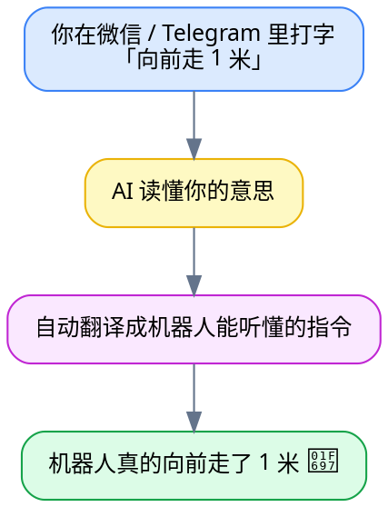
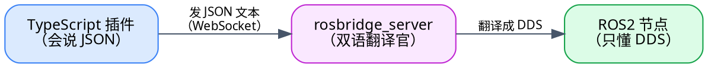

# 第一章：项目概览

> 本章目标：在不碰任何代码的前提下，让你彻底搞懂 **RosClaw 是什么、解决什么问题、整体怎么运作**。读完你会对整个项目有一张"心理地图"，后面每一章都是往这张地图上填细节。
>
> 面向**完全的新手**——不要求你懂 ROS2、不要求你会 TypeScript。遇到术语都会用大白话和类比解释。

---

## 一、一句话：RosClaw 是什么？

**RosClaw 是一座"桥"——它让你能用聊天软件里的大白话，去指挥一个机器人。**



不用学机器人编程、不用记复杂命令，**像聊天一样指挥机器人**——这就是 RosClaw 想做的事。

### 它到底解决了什么痛点？

传统上要控制一个 ROS2 机器人，你得：

- 在和机器人**同一个网络/同一台电脑**上；
- 安装一整套 ROS2 开发环境；
- 用命令行敲 `ros2 topic pub /cmd_vel geometry_msgs/msg/Twist "{linear: {x: 0.5}}"` 这种又长又容易写错的指令；
- 自己换算"向前 1 米"等于"速度 0.5 持续 2 秒"。

RosClaw 把这些**全部交给 AI 和插件代劳**。你只要会发微信消息，就能控制机器人——哪怕机器人在地球另一端。

---

## 二、三个必须先搞懂的概念

整个项目反复出现三个名词。先用大白话讲清楚，后面就不会懵。

### 概念 1：OpenClaw —— "AI 版的客服总机"

**OpenClaw 是一个 AI 网关平台**。你可以把它想成一个**智能总机**：

- 一头连着各种聊天软件（WhatsApp、Telegram、Discord、Slack，还有网页聊天框）；
- 中间坐着一个 **AI 代理**（大脑是 Claude 这样的大模型），负责"听懂人话、决定该干什么"；
- 另一头连着各种**插件**，每个插件提供一组"它会干的活儿"（叫做"工具"）。

> 类比：OpenClaw 像一家公司的**前台 + 调度中心**。顾客（你）打电话进来说需求，前台（AI）听懂后，派给对应的部门（插件）去办。

**RosClaw 就是 OpenClaw 的一个插件**——专门负责"和机器人打交道"这摊活儿。OpenClaw 本身不在这个仓库里，它是运行 RosClaw 的"宿主平台"。

### 概念 2：ROS2 —— "机器人世界的操作系统"

**ROS2（Robot Operating System 2）是机器人软件的通用框架**。几乎所有研究和工业机器人都用它。你不需要会写 ROS2 程序，但要听懂下面 4 个词，因为 RosClaw 干的事全是围绕它们：

| 词 | 大白话 | 例子 |
|---|---|---|
| **节点（Node）** | 一个独立运行的小程序 | "摄像头节点"、"导航节点"、"电机节点" |
| **话题（Topic）** | 一条持续广播的"频道"，发布者往里发、订阅者从里收 | `/cmd_vel`（速度指令频道）、`/odom`（位置反馈频道） |
| **服务（Service）** | 一问一答的调用，发一个请求等一个回复 | "告诉我当前电量是多少？" |
| **动作（Action）** | 一个耗时任务，过程中能持续汇报进度 | "导航到门口"（要走一会儿，途中不断报"还剩 3 米") |

再加一个底层名词：

- **DDS**：ROS2 内部传递消息用的"快递系统"（一种高效的二进制通信协议）。机器人内部节点之间靠它互相发消息。

> 类比：把机器人想成一家工厂。**节点**是各个车间；**话题**是厂区广播（"所有人注意，开始干活"）；**服务**是打电话问某车间"现在产量多少"；**动作**是派一个长期任务并要求定时汇报；**DDS** 是厂内的内部邮路。

### 概念 3：rosbridge —— "给机器人装的一扇翻译窗口"

这里有个现实难题：ROS2 内部用 **DDS**（二进制）通信，而我们的插件是用 **TypeScript/Node.js** 写的，**两者语言不通**——Node.js 没法直接说 DDS。

**rosbridge** 就是解决这个的官方组件。它给 ROS2 开了一扇"翻译窗口"：把 ROS2 的 DDS 通信**封装成 WebSocket + JSON**——而 JSON 和 WebSocket 是任何编程语言（包括 Node.js）都会的"普通话"。



> 类比：你（只会中文）要和一位只会法语的工程师沟通，中间请了个**翻译**（rosbridge）。你说中文，翻译转成法语；对方回法语，翻译转回中文。rosbridge 就是 ROS2 和外部世界之间的这位翻译。

一条典型的"rosbridge 普通话"长这样（让机器人前进）：

```json
{
  "op": "publish",
  "topic": "/cmd_vel",
  "msg": { "linear": { "x": 0.5, "y": 0, "z": 0 }, "angular": { "x": 0, "y": 0, "z": 0 } }
}
```

`op` 字段表明"这是一个发布操作"，后面是发到哪个话题、发什么内容。记住这个 `op` 格式，它会贯穿整个项目。

---

## 三、整体架构：一句话 + 一张图

把上面三个概念串起来，就是 RosClaw 的全貌：


**每一个箭头，都是一次"翻译"**（信息换了一种形态，但意思不变）：

| # | 这一步 | 把"什么"翻译成"什么" | 谁干的 |
|---|---|---|---|
| 1 | 消息应用 → OpenClaw | 微信/Telegram 协议 → OpenClaw 内部消息 | OpenClaw |
| 2 | OpenClaw → 插件 | 自然语言「向前走」→ 一次"工具调用" | AI 代理 |
| 3 | 插件 → rosbridge | 工具调用 → rosbridge 的 JSON | RosClaw 插件 |
| 4 | rosbridge → ROS2 | JSON → DDS 二进制消息 | rosbridge_server |

> 整个项目的"主角"是第 3 步——**RosClaw 插件**。它是这个仓库里你将要读的几乎所有代码。第 1、4 步是别人（OpenClaw、rosbridge）干的，第 2 步是 AI 干的。

如果你想**立刻看到这条链路在代码里逐行是怎么走的**（精确到哪个文件、哪个函数、第几行），有一篇专门的"流程主线"文档：[code/00 · 一条命令的旅程](code/00-一条命令的旅程.md)。建议读完本系列前几章后去看，它会把这张抽象的图变成真实的代码地图。

---

## 四、三种部署模式：机器人离你多远？

RosClaw 支持三种连接机器人的方式，对应"机器人离你有多远"的三种情况：

| 模式 | 场景 | 怎么连 | 什么时候用 |
|---|---|---|---|
| **模式 A：同机** | OpenClaw 和机器人在**同一台电脑** | 直接走 ROS2 DDS，不经过网络 | 延迟最低；机器人自带的板载电脑 |
| **模式 B：局域网** | OpenClaw 在你笔记本，机器人在**同一个 WiFi** | 通过 rosbridge 的 WebSocket | **新手首选**，开发调试最方便 |
| **模式 C：云端** | OpenClaw 在云服务器，机器人在**远端**（家里/野外） | 通过 WebRTC 穿透网络 | 远程遥控，跨地域 |

> 💡 **新手建议先用模式 B**：在自己电脑上用 Docker 跑一个 ROS2 仿真机器人，再让插件通过 rosbridge 连上它。不需要真机器人，零成本就能体验完整流程。具体步骤见 [第五章：完整实战教程](05-完整实战教程.md)。

这三种模式在代码里对应三套"传输层"实现，但它们**对上层提供完全一样的接口**——这是 RosClaw 一个很漂亮的设计，后面 [第三章](03-架构深度解析.md) 会细讲。

> 📌 **关于实现状态（诚实说明）**：项目文档曾把模式 A（local）和模式 C（webrtc）标为"存根/未实现"。但实际逐行读代码会发现，**模式 C 其实是相当完整的实现**（真的用了 WebRTC 库）。这种"文档和代码不一致"的情况，我们在逐行详解里会如实指出（见 [code/30](code/30-webrtc-transport.ts.md) 的勘误）。**读代码时以代码为准**——这本身就是一项重要的读码功夫。目前可以确定：**模式 B（rosbridge）是默认且最完整的**，新手就用它。

---

## 五、仓库长什么样？（目录巡览）

这是一个 **monorepo**（多个相关项目放在同一个仓库里）。主要目录：

```
rosclaw/
├── extensions/                    ← 【主角】OpenClaw 插件（TypeScript）
│   ├── openclaw-plugin/           ← 核心插件：控制机器人
│   │   ├── src/                   ← 你要读的源代码几乎都在这
│   │   │   ├── index.ts           ← 插件入口
│   │   │   ├── config.ts          ← 配置定义
│   │   │   ├── tools/             ← AI 能调用的 8 个工具
│   │   │   ├── transport/         ← 三种传输层（A/B/C 模式）
│   │   │   ├── safety/            ← 安全校验
│   │   │   ├── context/           ← 把机器人能力告诉 AI
│   │   │   └── commands/          ← 直接命令（如 /estop 急停）
│   │   └── skills/                ← 多步"技能"（导航、拍照……）
│   └── openclaw-canvas/           ← 第二个插件：实时仪表盘（占位中）
├── ros2_ws/src/                   ← ROS2 这一侧的 Python 包
│   ├── rosclaw_discovery/         ← "能力自动发现"节点
│   ├── rosclaw_msgs/              ← 自定义消息/服务类型
│   └── rosclaw_agent/             ← 模式 C 机器人侧节点
├── docker/                        ← 一键启动仿真环境
├── examples/                      ← 三个场景示例
├── docs/                          ← 架构文档
└── learn/                         ← 【你在这里】新手学习资料
```

**90% 的代码阅读都集中在 `extensions/openclaw-plugin/src/`**。其余目录（ROS2 包、Docker、示例）是配套。

---

## 六、三个现成示例

仓库自带三个示例场景，展示 RosClaw 能干什么：

| 示例 | 路径 | 说明 |
|---|---|---|
| 小车聊天控制 | `examples/turtlebot-chat/` | 用聊天消息控制 Gazebo 仿真里的 TurtleBot3 小车 |
| 机械臂控制 | `examples/arm-control/` | 用自然语言让机械臂做动作 |
| 多机巡逻 | `examples/fleet-patrol/` | 指挥多个机器人执行巡逻任务 |

---

## 七、新手术语小词典

读后面章节前，把这张表存着，遇到生词回来查：

| 术语 | 一句话解释 |
|---|---|
| OpenClaw | AI 网关平台，RosClaw 运行在它上面（宿主） |
| 插件（plugin） | 给 OpenClaw 增加能力的扩展，RosClaw 就是一个插件 |
| 工具（tool） | 插件提供给 AI 调用的一个具体动作（如"发布话题"） |
| ROS2 | 机器人软件框架 |
| 话题 / 服务 / 动作 | ROS2 的三种通信方式：广播频道 / 一问一答 / 耗时任务带进度 |
| DDS | ROS2 内部的二进制通信协议 |
| rosbridge | 把 ROS2 的 DDS 封装成 WebSocket+JSON 的翻译组件 |
| WebSocket | 一种保持长连接、可双向实时收发的网络协议 |
| 传输层（transport） | 插件里负责"实际和机器人通信"的那一层，有 A/B/C 三种实现 |
| 仿真（simulation） | 用软件（Gazebo）模拟一个机器人，不用真硬件 |

---

## 八、接下来读什么

你已经有了全局地图。根据你的目的选择下一步：

- **想继续打基础**（推荐按顺序）→ [第二章：技术前置知识](02-技术前置知识.md)：学这个项目会碰到哪些技术、每项最少要懂多少。
- **想理解它内部怎么搭起来的** → [第三章：架构深度解析](03-架构深度解析.md)。
- **想立刻动手跑起来** → [第五章：完整实战教程](05-完整实战教程.md)：手把手让仿真机器人动起来。
- **想钻进源码** → [第四章：核心代码导读](04-核心代码导读.md)，及配套的 [code/ 逐行详解系列](code/README.md)。

**下一步** → [第二章：技术前置知识](02-技术前置知识.md)
