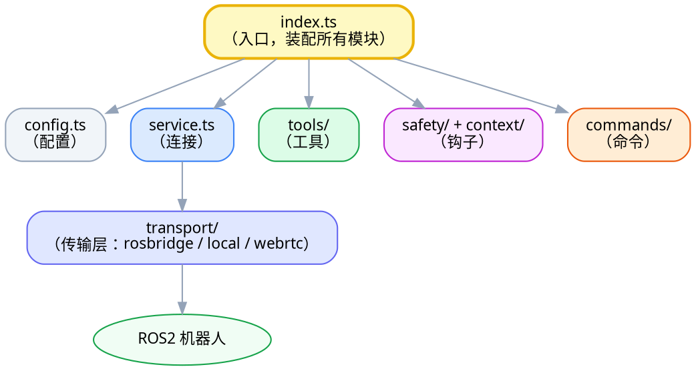
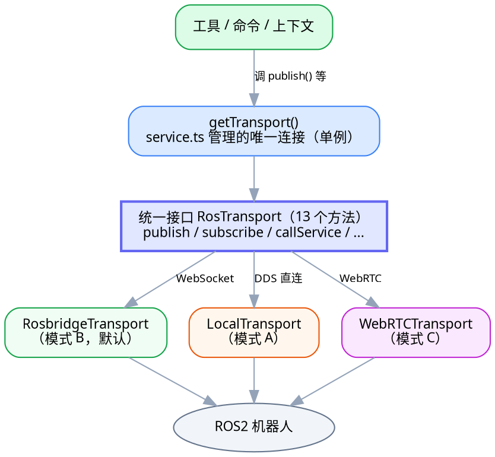
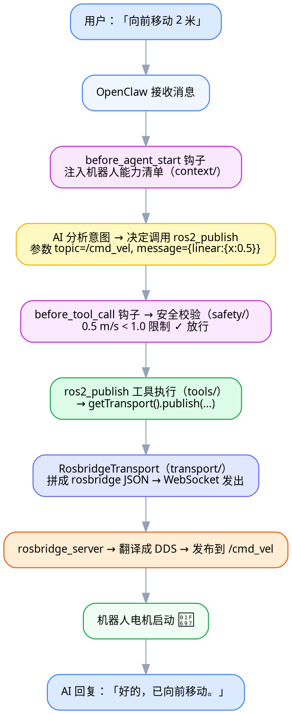

# 第三章：架构深度解析

> 本章目标：把 RosClaw 插件**内部是怎么搭起来的**讲透——分几层、每层干什么、谁先谁后、为什么这么设计。
>
> [第一章](01-项目概览.md) 给了全局地图，本章把镜头推近到"插件内部"。读完你会理解四种核心机制（工具/钩子/命令/传输层），这是看懂源码的骨架。
>
> 想看一条命令在代码里**逐行、逐函数**怎么流动？那是配套的 [code/00 · 一条命令的旅程](code/00-一条命令的旅程.md)——本章讲"结构"，那篇讲"流动"，互为表里。

---

## 一、三层架构：全局视角

整个系统从上到下分三层，职责清晰：

<div style="width: 760px; box-sizing: border-box; position: relative; background: #fafbfc; padding: 20px; border-radius: 6px; border: 1px solid #e5e7eb;">
  <style scoped>
    .arch-main { flex: 1; min-width: 0; }
    .arch-title { text-align: center; font-size: 20px; font-weight: bold; color: #1f2937; margin-bottom: 14px; }
    .arch-layer { margin: 8px 0; padding: 14px; border-radius: 6px; box-shadow: 0 1px 3px rgba(0,0,0,0.04); }
    .arch-layer-title { font-size: 14px; font-weight: bold; margin-bottom: 10px; text-align: center; }
    .arch-grid { display: grid; gap: 8px; }
    .arch-grid-3 { grid-template-columns: repeat(3, 1fr); }
    .arch-grid-4 { grid-template-columns: repeat(4, 1fr); }
    .arch-box { border-radius: 4px; padding: 8px; text-align: center; font-size: 12px; font-weight: 600; line-height: 1.4; color: #1f2937; background: #ffffff; border: 1px solid #e5e7eb; }
    .arch-box.highlight { background: #f3f4f6; border: 2px solid #6b7280; }
    .arch-box.tech { font-size: 11px; color: #6b7280; background: #f9fafb; }
    .arch-layer.user { background: linear-gradient(135deg, #eff6ff 0%, #dbeafe 100%); border: 2px solid #3b82f6; }
    .arch-layer.user .arch-layer-title { color: #1d4ed8; }
    .arch-layer.application { background: linear-gradient(135deg, #fffbeb 0%, #fef3c7 100%); border: 2px solid #d97706; }
    .arch-layer.application .arch-layer-title { color: #92400e; }
    .arch-layer.ai { background: linear-gradient(135deg, #f0fdf4 0%, #dcfce7 100%); border: 2px solid #16a34a; }
    .arch-layer.ai .arch-layer-title { color: #15803d; }
    .arch-flow-arrow { text-align: center; font-size: 11px; color: #64748b; margin: 2px 0; }
  </style>
  <div class="arch-title">RosClaw 三层架构</div>
  <div class="arch-main">
    <div class="arch-layer user">
      <div class="arch-layer-title">① 消息层（用户接口）</div>
      <div class="arch-grid arch-grid-4"><div class="arch-box">WhatsApp</div><div class="arch-box">Telegram</div><div class="arch-box">Discord</div><div class="arch-box">网页聊天</div></div>
    </div>
    <div class="arch-flow-arrow">▼ &nbsp; 自然语言消息</div>
    <div class="arch-layer application">
      <div class="arch-layer-title">② AI 网关层（OpenClaw）　← RosClaw 插件挂在这里</div>
      <div class="arch-grid arch-grid-3"><div class="arch-box">AI 代理<br><small>理解意图</small></div><div class="arch-box highlight">RosClaw 插件<br><small>工具 / 钩子 / 命令</small></div><div class="arch-box">决定调用哪个工具</div></div>
    </div>
    <div class="arch-flow-arrow">▼ &nbsp; rosbridge JSON / DDS / WebRTC</div>
    <div class="arch-layer ai">
      <div class="arch-layer-title">③ ROS2 层（机器人）</div>
      <div class="arch-grid arch-grid-3"><div class="arch-box tech">/cmd_vel<br><small>速度</small></div><div class="arch-box tech">/odom<br><small>里程计</small></div><div class="arch-box tech">/camera<br><small>图像</small></div></div>
      <div class="arch-flow-arrow" style="margin-top:8px;">▼</div>
      <div class="arch-grid arch-grid-3"><div class="arch-box tech">电机</div><div class="arch-box tech">摄像头</div><div class="arch-box tech">传感器</div></div>
    </div>
  </div>
</div>

- **消息层**：用户从哪进来。RosClaw 不管这层（OpenClaw 管）。
- **AI 网关层**：OpenClaw + 大模型。**RosClaw 插件就挂在这一层**，给 AI 提供"和机器人打交道的能力"。
- **ROS2 层**：真正的机器人（或仿真）。

**RosClaw 插件是连接 AI 层和 ROS2 层的桥。** 本章剩下的内容都在拆解这座桥。

---

## 二、插件内部：六个模块

RosClaw 插件的全部代码在 `extensions/openclaw-plugin/src/`，分成六块：

```
src/
├── index.ts          ← 入口：把下面所有模块"注册"起来
├── config.ts         ← 配置定义（Zod 校验）
├── plugin-api.ts     ← OpenClaw 平台的 API 类型声明（"合同"）
├── service.ts        ← 传输层连接的生命周期管理（单例）
├── tools/            ← AI 工具（8 个）
├── transport/        ← 传输层（3 种模式）
├── safety/           ← 安全校验钩子
├── context/          ← 机器人能力注入钩子
└── commands/         ← 直接命令（/estop、/transport）
```

把它们的关系画出来：



- `config.ts`、`plugin-api.ts` 是**地基**（配置和类型契约）。
- `service.ts` + `transport/` 是**连接管道**（怎么和机器人通信）。
- `tools/`、`safety/`、`context/`、`commands/` 是**四种对接 AI 的方式**（下一节细讲）。

---

## 三、真实启动顺序：`register()` 做了什么

插件被 OpenClaw 加载时，会调用入口 `index.ts` 里的 `register()` 函数。这是**真实代码**（不是伪代码），按顺序做 7 件事：

```typescript
register(api) {
  api.logger.info("RosClaw plugin loading...");
  const config = parseConfig(api.pluginConfig ?? {}); // 0. 解析+校验配置

  registerService(api, config);          // 1. 建立 ROS2 连接（传输层）
  registerTools(api);                    // 2. 注册 8 个 AI 工具
  registerSafetyHook(api, config);       // 3. 注册安全校验钩子
  registerRobotContext(api, config);     // 4. 注册机器人能力注入钩子
  registerEstopCommand(api, config);     // 5. 注册 /estop 命令
  registerTransportCommand(api, config); // 6. 注册 /transport 命令

  api.logger.info("RosClaw plugin loaded successfully");
}
```

**这 7 步就是插件的完整生命周期起点。** 注意两个要点：

1. **顺序有讲究**：`registerService` 必须第一个——先把"和机器人的连接"建好，后面的工具、钩子、命令才有连接可用。
2. **"注册" ≠ "执行"**：`register` 阶段只是**登记**（"这里有个工具叫 X""门口安排个安全员"），并不真的去控制机器人。真正干活是等用户消息进来、相应的零件被触发时。

> 🔍 逐行详解：[code/13 · index.ts](code/13-index.ts.md)。

---

## 四、四种对接 AI 的方式（核心机制）

这是理解 RosClaw 的**最关键一节**。插件和 OpenClaw/AI 打交道，一共四种方式，时机和用途各不相同：

| 方式 | 谁触发 | 何时 | 返回什么 | 例子 |
|---|---|---|---|---|
| **工具 Tool** | **AI** 主动调用 | AI 决定要做某动作时 | `content` + `details` | `ros2_publish` 发速度 |
| **钩子 Hook（工具前）** | 宿主自动 | 每次工具执行**前** | `{block, blockReason}` 或放行 | 安全校验拦超速 |
| **钩子 Hook（会话前）** | 宿主自动 | 每次 AI 会话**开始前** | `{prependContext}` | 注入机器人能力清单 |
| **命令 Command** | **用户**直接打 | 用户输入 `/xxx` 时 | `{text}` | `/estop` 急停 |

逐一说明：

### 4.1 工具（tools/）—— AI 的"动作按钮"

AI 不能直接碰机器人，它只能**调用插件注册的工具**。每个工具是一个"AI 能按的按钮"，带：
- 名字（`ros2_publish`）；
- 给 AI 看的说明（`description`，相当于提示词，决定 AI 何时用它）；
- 参数定义（TypeBox schema，告诉 AI 要传什么）；
- 执行逻辑（`execute`，真正干活）。

RosClaw 注册了 **8 个工具**：

| 文件 | 工具名 | 功能 | 对应 ROS2 操作 |
|---|---|---|---|
| `ros2-publish.ts` | `ros2_publish` | 向话题发布消息 | 话题（发布） |
| `ros2-subscribe.ts` | `ros2_subscribe_once` | 读取话题最新一条消息 | 话题（订阅） |
| `ros2-service.ts` | `ros2_service_call` | 调用服务 | 服务 |
| `ros2-action.ts` | `ros2_action_goal` | 发送动作目标 | 动作 |
| `ros2-param.ts` | `ros2_param_get` / `ros2_param_set` | 读/写节点参数 | 服务（参数） |
| `ros2-introspect.ts` | `ros2_list_topics` | 列出可用话题 | 服务（自省） |
| `ros2-camera.ts` | `ros2_camera_snapshot` | 截取摄像头图像 | 话题（订阅图像） |

> 🔍 逐行详解：[code/14 · 工具通用结构](code/14-tools-index.ts.md)，及 [code/15–21](code/15-ros2-publish.ts.md) 各工具。

### 4.2 钩子（safety/ 和 context/）—— 自动触发的"拦截 / 注入"

钩子是**宿主在特定时机自动触发**的函数（不是 AI 或用户主动调）。RosClaw 用了两个：

- **`before_tool_call`（工具执行前）—— 安全校验** `safety/validator.ts`
  每次工具即将执行前触发。检查 `ros2_publish` 的速度是否超限，超了就返回 `{ block: true, blockReason }` **拦下**，否则放行。这保证了"AI 再怎么乱来也突破不了物理安全上限"。

- **`before_agent_start`（AI 会话开始前）—— 能力注入** `context/robot-context.ts`
  每次对话开始前触发。它去查机器人当前有哪些话题/服务/动作，拼成一段文字，通过 `{ prependContext }` **塞进 AI 的系统提示**——这样 AI 才知道这台机器人"能干什么、该往哪个话题发"。还带 60 秒缓存和失败降级。

> 🔍 逐行详解：[code/22 · validator.ts](code/22-safety-validator.ts.md)、[code/23 · robot-context.ts](code/23-robot-context.ts.md)。

### 4.3 命令（commands/）—— 用户直接打的 `/xxx`

命令**绕过 AI**，由用户直接输入触发，返回的 `{ text }` 直接显示给用户。RosClaw 有两个：

- **`/estop`（紧急停止）** `commands/estop.ts`
  直接向 `/cmd_vel` 发零速度，**完全绕过 AI 推理**——紧急情况下不能等 AI 慢慢想，必须即时响应。
- **`/transport`（运行时切换传输模式）** `commands/transport.ts`
  在 rosbridge/local/webrtc 之间热切换，不重启插件。

> 🔍 逐行详解：[code/24 · estop.ts](code/24-commands-estop.ts.md)、[code/25 · transport.ts](code/25-commands-transport.ts.md)。

---

## 五、传输层：RosClaw 最漂亮的设计

工具调 `transport.publish(...)` 时，**根本不知道底层用的是 WebSocket 还是 WebRTC**——因为传输层用了**适配器模式**把三种通信方式的差异藏了起来。



**关键设计点**：

1. **统一接口 `RosTransport`**（`transport/transport.ts`）：定义了 13 个方法（publish/subscribe/callService/sendActionGoal/listTopics……）。这是一份"承诺清单"。
2. **三种实现都履行这份承诺**：每种模式写一个类去 `implements RosTransport`。上层只认接口、不认具体类。
3. **工厂按配置选实现**（`transport/factory.ts`）：

```typescript
// 伪代码示意（真实现是动态 import 懒加载）
async function createTransport(config) {
  switch (config.mode) {
    case "rosbridge": return new RosbridgeTransport(config.rosbridge);
    case "local":     return new LocalTransport(config.local);
    case "webrtc":    return new WebRTCTransport(config.webrtc);
  }
}
```

**这么设计的好处**：想换通信方式，只改工厂里 `new` 哪个类，**上层工具一行都不用动**。这就是"面向接口编程、实现可替换"。

> 📌 **实现状态（诚实说明）**：默认的 `rosbridge`（模式 B）是最完整的实现。`local`（A）和 `webrtc`（C）在项目文档里曾被标为"存根"，但逐行读代码发现 **模式 C 其实是完整实现**（真用了 WebRTC 库）。详见 [code/30 的勘误](code/30-webrtc-transport.ts.md)。**以代码为准。**

> 🔍 逐行详解：接口 [code/04](code/04-transport.ts.md)、工厂 [code/11](code/11-transport-factory.ts.md)、单例管理 [code/12](code/12-service.ts.md)、rosbridge 实现 [code/05–10](code/05-rosbridge-types.ts.md)。

---

## 六、能力自动发现：让 AI "认识"这台机器人

AI 怎么知道某台机器人有哪些话题可用？靠 **`rosclaw_discovery`** 这个 ROS2 节点（在 `ros2_ws/src/rosclaw_discovery/`，Python 写的）：

1. 它扫描当前 ROS2 环境里所有活跃的话题和服务；
2. 通过一个 `GetCapabilities` 服务接口把结果暴露出来；
3. 插件的 `context/robot-context.ts` 在每次 AI 会话开始前调用它（或调用标准的 `/rosapi/topics`），把能力清单**注入到 AI 的系统提示**。

这样同一个插件接到不同机器人时，AI 都能自动"认识"对方的能力，而不用为每台机器人改代码。

---

## 七、一次完整交互的数据流（高层版）

把前面所有机制串起来，一条命令的高层流动是：



> 这张图是"高层"的。**想看精确到"哪个文件、哪个函数、第几行"的版本**，请读配套的 [code/00 · 一条命令的旅程](code/00-一条命令的旅程.md)——它把上面每个箭头都落实到了真实代码位置。

---

## 八、用到的设计模式（点名）

读源码时你会反复遇到这几个经典设计模式，先认个脸：

| 模式 | 在哪体现 | 解决什么 |
|---|---|---|
| **适配器（Adapter）** | 传输层三种实现同一个 `RosTransport` 接口 | 隐藏底层差异，可替换 |
| **单例（Singleton）** | `service.ts` 全程序共享一个 `transport` | 所有工具共用同一条连接 |
| **工厂（Factory）** | `factory.ts` 按配置造对应传输层 | 把"造哪种对象"的判断集中一处 |
| **观察者 / 回调** | `onConnection`、话题订阅回调 | 状态变化时通知关心的人 |

这些模式不是 RosClaw 独创，而是软件工程的通用套路。认识它们后，你会发现"原来很多项目都长这样"。

---

## 九、本章小结

- 系统三层：消息层 / AI 网关层（插件挂这）/ ROS2 层。
- 插件六模块：地基（config、plugin-api）+ 连接（service、transport）+ 四种对接方式（tools、safety、context、commands）。
- **四种对接 AI 的方式**：工具（AI 调）、钩子-工具前（安全拦截）、钩子-会话前（能力注入）、命令（用户打）——这是全章最该记住的。
- **传输层适配器模式**：统一接口 + 三种可替换实现 + 工厂选择，是项目最漂亮的设计。

---

**下一步** → [第四章：核心代码导读](04-核心代码导读.md)：从架构走进源码，看每个文件的概貌；想逐行精读就去 [code/ 系列](code/README.md)。
