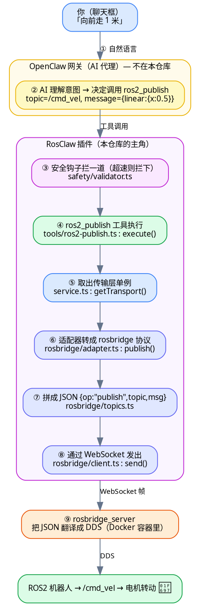
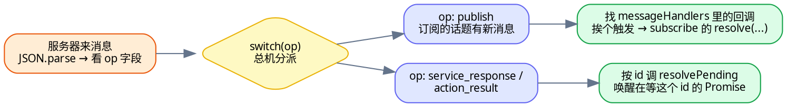

# 逐行详解 ⓪：一条命令的旅程（全系列主线 · 先读我）

> **这是整个逐行详解系列的"龙头"文档，建议第一个读。**
>
> 前面的 01–32 篇是"显微镜"——每篇把一个源文件**逐行**拆开。但新手最容易迷路的不是某一行看不懂，而是**"这些文件之间到底怎么串起来的？我发一句话，代码里到底依次发生了什么？"**
>
> 本篇就回答这个问题：我们跟踪**一条命令**——用户在聊天框打「向前走 1 米」——看它如何穿过整个 RosClaw，最终让机器人动起来。**每一跳都精确标注"哪个文件、哪个函数、第几行、信息变成了什么形状"，并链接到对应的逐行详解篇。**
>
> 读完它，你就有了一张"全局地图"。之后再按 01→32 钻进每个文件时，你随时知道"我现在在地图的哪个位置"。

---

## 怎么用这篇文档

- **第一次读**：从头顺读，不必点开每个链接，先在脑子里建立"一条命令流过 8 个站点"的整体印象。
- **读 01–32 时**：每当你读某一篇有点"只见树木"的感觉，回到本篇，找到那个文件在主线中的位置，就知道它"上游是谁、下游是谁"。
- **查地图**：文末有一张"全站点速查表"，可随时反查。

> 本篇出现的所有行号都对照当前源码核实过。若你本地代码版本不同，行号可能有小幅偏移，但函数名和顺序不变。

---

## 先看全景：一条命令要过几道关

想象你在微信里对机器人说「**向前走 1 米**」。这句中文，要变成机器人电机的转动，中间隔着**两个世界**：

- **"人话"的世界**：自然语言、聊天消息。
- **"机器"的世界**：ROS2 的话题、二进制 DDS 消息、电机指令。

RosClaw 就是把前者翻译成后者的**翻译流水线**。这条流水线大致是：



**注意信息的"形态"在一路上不断变化**（这是本篇最想让你记住的一点）：

| 阶段 | 信息长什么样 |
|---|---|
| 你发的 | 一句中文字符串 `"向前走 1 米"` |
| AI 产出的 | 一次"工具调用"：工具名 + 参数对象 |
| 工具内部 | 一个 JavaScript 对象 `{ topic, type, msg }` |
| 传输层发出的 | 一条 rosbridge **JSON 文本** `{"op":"publish",...}` |
| WebSocket 上 | 一个网络数据帧（就是上面那段 JSON 的字节） |
| rosbridge 之后 | ROS2 的 **DDS 二进制消息** |

**翻译，就是不断改变信息的形态、同时保持含义不变。** 下面逐站点细看。

---

## 站点 0（启动时就绪）：插件装配 —— `index.ts`

在你发任何消息**之前**，OpenClaw 启动时会加载 RosClaw 插件，调用它的 `register()` 函数。这一步把后面要用到的所有"零件"装好。

📍 **`src/index.ts` · `register()` · 第 17–39 行**

```typescript
register(api: OpenClawPluginApi): void {
  api.logger.info("RosClaw plugin loading...");
  const config = parseConfig(api.pluginConfig ?? {});   // 解析配置

  registerService(api, config);        // ① 建立 ROS2 连接（传输层）
  registerTools(api);                  // ② 注册 8 个 AI 工具
  registerSafetyHook(api, config);     // ③ 注册安全钩子
  registerRobotContext(api, config);   // ④ 注册"能力注入"钩子
  registerEstopCommand(api, config);   // ⑤ 注册 /estop 命令
  registerTransportCommand(api, config); // ⑥ 注册 /transport 命令
}
```

- **打个比方**：`register` 像开店前的"备货 + 摆货架"。它本身不卖东西，只是把"连接"建好、把"工具"摆上货架、把"安检员"安排到门口。等顾客（你的消息）上门，这些零件才各司其职。
- 这 6 个 `registerXxx` 就是插件的全部家当，**后面每一个站点都是其中之一被触发**。
- 注意一个**关键顺序**：`registerService` 排第一——必须先把"和机器人的连接"建好，后面的工具才有"管子"可用。

> 🔍 逐行详解：[第 13 篇 · index.ts](13-index.ts.md)（插件入口、`export default`、"只注册不执行"的节奏）

---

## 站点 1（会话开始前）：告诉 AI "这台机器人能干什么" —— `robot-context.ts`

你刚打开对话、还没说话时，就有一个钩子悄悄运行了：它**查出机器人当前有哪些话题/服务/动作，塞进 AI 的"脑子"里**。否则 AI 根本不知道该往哪个话题发消息。

📍 **`src/context/robot-context.ts` · `registerRobotContext()` · 第 26–49 行**

```typescript
api.on("before_agent_start", async (_event, _ctx) => {
  const capabilities = await discoverCapabilities(api, robotNamespace); // 查能力
  const context = buildRobotContext(robotName, robotNamespace, capabilities); // 拼成文本
  return { prependContext: context };   // 塞进 AI 系统提示
});
```

- **`before_agent_start`** 是个"钩子"——OpenClaw 在"AI 开始思考之前"自动触发它。返回 `{ prependContext: 文本 }`，这段文本就会被**插到 AI 的系统提示最前面**。
- 那段文本长这样（大意）：`这台机器人叫 TurtleBot3，可用话题有 /cmd_vel、/odom、/battery_state……`。AI 读了它，才知道"向前走"应该往 `/cmd_vel` 发。

**那"能力"是怎么查出来的？** 看 `discoverCapabilities`：

📍 **`src/context/robot-context.ts` · `discoverCapabilities()` · 第 55–98 行**

```typescript
const [topics, services, actions] = await Promise.all([
  transport.listTopics(),     // 并行发起三个查询
  transport.listServices(),
  transport.listActions(),
]);
```

- **`Promise.all`** 让三个查询**并行**跑、一起等结果（比一个个等快）。
- 这三个 `transport.listXxx()` 最终会**调用一个 ROS2 服务**去问机器人。以 `listTopics` 为例，它落到适配器里：

📍 **`src/transport/rosbridge/adapter.ts` · `listTopics()` · 第 102–112 行**

```typescript
const response = await callService(this.client, "/rosapi/topics", {}, "rosapi/srv/Topics");
```

- 看到了吗——**"查有哪些话题"本身也是一次"调用服务"**（服务名 `/rosapi/topics`）。这就和站点 6 之后的请求-响应走同一套机制了（后面会讲）。
- 还有个贴心设计：结果会**缓存 60 秒**（第 60 行 `Date.now() - cache.timestamp < CACHE_TTL_MS`），避免每次对话都重新查一遍；查询失败也不会崩，而是**降级**成一份硬编码的默认能力（第 89–97 行）。

> 🔍 逐行详解：[第 23 篇 · robot-context.ts](23-robot-context.ts.md)（`before_agent_start`、`Promise.all`、TTL 缓存、降级兜底）

---

## 站点 2（AI 的工作）：把"人话"变成"工具调用" —— OpenClaw 侧

这一步**不在本仓库**，是 OpenClaw 平台 + 大模型（Claude）干的，但它是整条链的转折点，必须理解：

- AI 收到你的「向前走 1 米」+ 站点 1 注入的能力清单，**推理**出："这要往 `/cmd_vel` 发一个 Twist 速度消息。"
- 于是 AI 产出一次**工具调用（tool call）**：
  - 工具名：`ros2_publish`
  - 参数：`{ topic: "/cmd_vel", type: "geometry_msgs/msg/Twist", message: { linear: { x: 0.5, ... }, angular: {...} } }`
- **AI 怎么知道有 `ros2_publish` 这个工具、该传什么参数？** 靠的是工具注册时写的 `description`（提示词）和 `parameters`（参数 schema）——这正是站点 0 里 `registerTools` 摆上货架时声明的。

> 📌 **这里是"人话世界"和"机器世界"的分界线**：往上是自然语言 + AI 推理，往下全是确定的代码逻辑。RosClaw 插件的工作从下一站正式开始。
>
> 🔍 想理解"工具"这种交互形式：[第 14 篇 · 工具通用结构](14-tools-index.ts.md)；想看整体架构：[顶层 · 03 架构深度解析](../03-架构深度解析.md)

---

## 站点 3（工具执行前）：安全员拦一道 —— `validator.ts`

AI 说要发速度消息，但**先别急**——在工具真正执行前，安全钩子会拦下来检查"这个速度会不会太快出危险"。

📍 **`src/safety/validator.ts` · `registerSafetyHook()` 内的 `before_tool_call` · 第 11–42 行**

```typescript
api.on("before_tool_call", async (event, _ctx) => {
  if (event.toolName === "ros2_publish") {
    const msg = event.params["message"] as Record<string, unknown> | undefined;
    if (msg) {
      const linear = msg["linear"] as Record<string, number> | undefined;
      if (linear) {
        const speed = Math.sqrt(                       // 第 20 行：算合速度
          (linear["x"] ?? 0) ** 2 + (linear["y"] ?? 0) ** 2 + (linear["z"] ?? 0) ** 2,
        );
        if (speed > safety.maxLinearVelocity) {
          return { block: true, blockReason: `...exceeds safety limit...` }; // 第 27 行：拦下
        }
      }
      // ……角速度同理（第 31–37 行）……
    }
  }
});
```

- **`before_tool_call`** 也是钩子，但时机不同：**每次工具即将执行前**触发。
- 它把参数里的 `message.linear` 取出来，用 `Math.sqrt(x² + y² + z²)` 算出**合速度**（第 20 行），和配置的上限 `maxLinearVelocity` 比。
- **两种结局**：
  - 超限 → `return { block: true, blockReason: "..." }`（第 27 行）→ **工具被拦截、不执行**，AI 收到拦截原因。
  - 没超 → 函数自然走完、`return` 一个 `undefined` → **放行**，进入下一站。
- **打个比方**：安全员站在工具门口，速度合规就放你进去，超速就把你拦下并说明理由。这一道关保证"AI 再怎么发疯，也发不出超过物理上限的危险速度"。

> 🔍 逐行详解：[第 22 篇 · validator.ts](22-safety-validator.ts.md)（钩子机制、`Math.sqrt`/`**`、默认放行/危险拦截）

---

## 站点 4：工具执行 —— `ros2-publish.ts`

安全员放行后，`ros2_publish` 工具的 `execute` 真正运行。它的工作出奇地简单——**取参数、拿传输层、发出去**。

📍 **`src/tools/ros2-publish.ts` · `execute()` · 第 24–37 行**

```typescript
async execute(_toolCallId, params) {
  const topic = params["topic"] as string;       // 第 25 行：取出三个参数
  const type = params["type"] as string;
  const message = params["message"] as Record<string, unknown>;

  const transport = getTransport();               // 第 29 行：拿到传输层单例
  transport.publish({ topic, type, msg: message }); // 第 30 行：发布！

  const result = { success: true, topic, type };
  return { content: [{ type: "text", text: JSON.stringify(result) }], details: result };
}
```

- 第 25–27 行：从 `params` 里取出 AI 传来的 `topic`、`type`、`message`。
- 第 29 行：`getTransport()` 拿到"和机器人的连接"（下一站讲它从哪来）。
- 第 30 行：`transport.publish({...})`——**真正的发布动作**。注意工具把参数 `message` 改名成 `msg` 装进对象（迁就传输层接口的字段名）。
- **工具层只是"薄薄一层"**：它不关心底层用 WebSocket 还是 WebRTC，只管"把请求交给 transport"。这正是分层设计的好处。

> 🔍 逐行详解：[第 15 篇 · ros2-publish.ts](15-ros2-publish.ts.md)（TypeBox 参数、`execute` 套路、`ToolResult` 的 content/details）

---

## 站点 5：取出"传输层"单例 —— `service.ts`

第 29 行那个 `getTransport()` 是从哪儿拿到连接的？答案在 `service.ts`——它管着一个**全程序共享的唯一连接对象（单例）**。

📍 **`src/service.ts` · `getTransport()` · 第 18–23 行**

```typescript
let transport: RosTransport | null = null;   // 第 9 行：模块级单例变量

export function getTransport(): RosTransport {
  if (!transport) {
    throw new Error("Transport not initialized. Is the service running?");
  }
  return transport;   // 返回那个唯一的连接
}
```

- `transport` 是个**模块级变量**（写在文件最外层，全文件共享），保存"唯一的那条连接"。
- **这条连接是什么时候建的？** 回到站点 0：`registerService` 在插件启动时，于 `start()` 里建好并连上：

📍 **`src/service.ts` · `registerService().start()` · 第 94–101 行**

```typescript
transport = await createTransport(transportCfg);  // 第 94 行：按配置造一个传输层
transport.onConnection((status) => { ... });
await transport.connect();                          // 第 100 行：连上机器人
currentMode = mode;
```

- `createTransport` 是个**工厂**：看配置里 `mode` 是 `rosbridge`/`local`/`webrtc`，就造对应的那一种。默认 `rosbridge`，所以这里造的是 `RosbridgeTransport`。
- **打个比方**：`service.ts` 像大楼的"总闸"——开店时合闸（`connect`），所有工具共用这一路电（同一个 `transport`），关店时拉闸（`disconnect`）。
- 还有个 `switchTransport`（第 35 行）支持运行时换传输模式，用了"并发门闩"防止换到一半被打断——那是 `/transport` 命令用的，本主线用不到。

> 🔍 逐行详解：[第 12 篇 · service.ts](12-service.ts.md)（模块级单例、并发门闩、生命周期）；工厂见 [第 11 篇](11-transport-factory.ts.md)

---

## 站点 6：适配器 —— `adapter.ts`

`transport.publish(...)` 调到的是 `RosbridgeTransport`（默认模式）的 `publish` 方法。它做的事也很薄——**转交给一个专门发布话题的小助手**。

📍 **`src/transport/rosbridge/adapter.ts` · `publish()` · 第 55–58 行**

```typescript
publish(options: PublishOptions): void {
  const publisher = new TopicPublisher(this.client, options.topic, options.type);
  publisher.publish(options.msg);
}
```

- `RosbridgeTransport` 实现了一个统一接口 `RosTransport`（13 个方法：publish/subscribe/callService……）。**三种传输模式都实现同一个接口**，所以上层（工具）调 `transport.publish` 时根本不用管底下是哪种模式。
- 这里它把活儿交给 `TopicPublisher`（话题发布小助手），自己只负责"组装零件、转交"。
- **打个比方**：适配器像前台。你说"我要发布到 /cmd_vel"，前台不亲自跑腿，而是叫来"话题发布专员"（`TopicPublisher`）去办。

> 🔍 逐行详解：[第 10 篇 · adapter.ts](10-rosbridge-adapter.ts.md)（`implements` 接口、13 个方法、把活儿分派给各助手）；统一接口本身见 [第 04 篇](04-transport.ts.md)

---

## 站点 7：拼成 rosbridge 协议 JSON —— `topics.ts`

`TopicPublisher.publish` 终于把请求变成了**rosbridge 协议规定的那条 JSON**。

📍 **`src/transport/rosbridge/topics.ts` · `TopicPublisher.publish()` · 第 15–22 行**

```typescript
publish(msg: Record<string, unknown>): void {
  this.client.send({
    op: "publish",          // ← rosbridge 协议：op 字段表明"这是发布操作"
    topic: this.topic,      //    /cmd_vel
    type: this.type,        //    geometry_msgs/msg/Twist
    msg,                    //    { linear: {...}, angular: {...} }
  });
}
```

- **这就是"信息形态"的关键一变**：原本是 JavaScript 对象，现在被拼成了 **rosbridge 协议**约定的形状——一个带 `op` 字段的对象。`op: "publish"` 告诉 rosbridge_server "我要往话题发消息"。
- rosbridge 协议就是一套"用带 `op` 字段的 JSON 表达 ROS2 操作"的约定：`publish`（发布）、`subscribe`（订阅）、`call_service`（调服务）等。
- 拼好后交给 `this.client.send(...)`——下一站真正发到网络上。

> 🔍 逐行详解：[第 07 篇 · topics.ts](07-rosbridge-topics.ts.md)；rosbridge 协议全貌见 [第 05 篇](05-rosbridge-types.ts.md)

---

## 站点 8：通过 WebSocket 发出去 —— `client.ts`

`client.send(...)` 是整条出站链的**最后一站**（插件这一侧）。它把那个 JSON 对象变成文本，写进 WebSocket。

📍 **`src/transport/rosbridge/client.ts` · `send()` · 第 138–144 行**

```typescript
send(message: RosbridgeMessage & Record<string, unknown>): void {
  if (!this.ws || this.status !== "connected") {
    throw new Error("Not connected to rosbridge server");
  }
  this.ws.send(JSON.stringify(message));   // 第 143 行：对象 → JSON 文本 → 发出
}
```

- 第 143 行 `JSON.stringify(message)`——**把对象序列化成 JSON 字符串**，再 `this.ws.send(...)` 写进 WebSocket 连接。
- 至此，那段文本 `{"op":"publish","topic":"/cmd_vel",...}` 以网络数据帧的形式，飞向 Docker 容器里的 **rosbridge_server**。
- `RosbridgeClient` 是最底层的"网络工"：管 WebSocket 的连接、断线重连、收发。**它是全系列最难、最核心的一篇**——因为"收消息"那一半（下面返回路径要用）也在这里。

> 🔍 逐行详解：[第 06 篇 · client.ts](06-rosbridge-client.ts.md) 🔥（全系列最难：connect、send、handleMessage）

---

## 站点 9（插件之外）：rosbridge → DDS → 机器人

JSON 飞出插件后：

1. **rosbridge_server**（跑在 Docker 容器里的 ROS2 官方组件）收到这条 JSON，**把它翻译成 ROS2 的 DDS 二进制消息**，发布到 `/cmd_vel` 话题。
2. ROS2 机器人（仿真里的 TurtleBot3）的电机控制节点**订阅**了 `/cmd_vel`，收到速度消息，驱动电机。
3. 🚗 **机器人向前动了。**

这一段不在本仓库（是 ROS2 生态的标准组件），但你要知道**信息在这里完成了最后一次形态转换**：rosbridge JSON → DDS 二进制。

> 想理解 rosbridge 是什么、为什么需要它：[顶层 · 01 项目概览](../01-项目概览.md) 和 [顶层 · 02 技术前置知识](../02-技术前置知识.md)。

---

## 返回路径：读类命令怎么把数据拿回来？

上面的「向前走」是**单向**的——发出去就完事（发布不需要回复）。但如果你问「**电池还有多少？**」，AI 会调 `ros2_subscribe_once` 工具，这就需要**等机器人回一条数据**。返回路径用了一个很妙的"竞速"技巧。

📍 **`src/tools/ros2-subscribe.ts` · `execute()` · 第 22–42 行**

```typescript
const result = await new Promise<Record<string, unknown>>((resolve, reject) => {
  const subscription = transport.subscribe(
    { topic, type: msgType },
    (msg) => {                       // 收到消息时：
      clearTimeout(timer);
      subscription.unsubscribe();
      resolve({ success: true, topic, message: msg });  // ← 兑现：把数据交出去
    },
  );
  const timer = setTimeout(() => {   // 同时起一个倒计时：
    subscription.unsubscribe();
    reject(new Error(`Timeout waiting for message on ${topic}`));  // ← 超时：报错
  }, timeout);
});
```

- **这是一场"竞速"**：两条路谁先到算谁——
  - **路 A**：机器人在 `timeout`（默认 5 秒）内回了消息 → 回调触发 → `resolve` 兑现，拿到数据。
  - **路 B**：超时了还没消息 → `setTimeout` 触发 → `reject` 报错。
  - 无论哪条先到，都会 `unsubscribe()` 退订并清掉对方（清 timer / 退订）——干净收尾。

**那机器人回的消息，是怎么走到这个回调里的？** 这就要回到站点 8 的 `client.ts`，但这次是**收消息**的那一半：

📍 **`src/transport/rosbridge/client.ts` · `handleMessage()` · 第 216–273 行**

```typescript
private handleMessage(data: string): void {
  const msg = JSON.parse(data);          // 收到的 JSON 文本 → 对象
  const op = msg.op as string | undefined;
  switch (op) {                          // 按 op 分派
    case "publish": {                    // 订阅的话题来消息了
      const handlers = this.messageHandlers.get(msg.topic);
      if (handlers) for (const h of handlers) h(msg.msg);  // → 触发上面那个回调
      break;
    }
    case "service_response":             // 服务调用的回复
    case "action_result": {
      this.resolvePending(msg.id, msg);  // 第 189 行：按 id 找到等待者并兑现
      break;
    }
    case "action_feedback": { ... }      // 动作进度
  }
}
```

- 收到的每条消息都先 `JSON.parse` 变回对象，再看 `op` 字段**分派**：
  - `op: "publish"`（订阅的话题有新消息）→ 找到登记在 `messageHandlers` 里的回调，挨个触发——**这就接回了上面 subscribe 的那个 `(msg) => { ... resolve(...) }`**。
  - `op: "service_response"` / `"action_result"` → 按消息里的 `id` 调 `resolvePending`（第 189 行），找到当初那个"在等这个 id 回复"的 Promise 并兑现。
- **"按 id 配对"是核心套路**：发请求时记下 `id` 和一个"等待者"，回复带着同样的 `id` 回来，就能精确找到该唤醒谁。站点 1 查能力用的 `callService` 也是靠这套机制拿到话题列表的。

把 `handleMessage` 这个"总机"的分派逻辑画出来：



> 🔍 逐行详解：[第 16 篇 · ros2-subscribe.ts](16-ros2-subscribe.ts.md)（竞速 Promise）；收发核心 [第 06 篇 · client.ts](06-rosbridge-client.ts.md)（`handleMessage` 的 `switch(op)`、`registerPending`/`resolvePending`）

---

## 全站点速查表（随时回查）

| 站点 | 文件 | 函数 | 行号 | 一句话 | 逐行详解 |
|---|---|---|---|---|---|
| 0 启动装配 | `index.ts` | `register()` | 17–39 | 注册 6 个零件 | [13](13-index.ts.md) |
| 1 能力注入 | `context/robot-context.ts` | `registerRobotContext` / `discoverCapabilities` | 26–49 / 55–98 | 把机器人能力塞进 AI 提示 | [23](23-robot-context.ts.md) |
| └ 发现走服务 | `transport/rosbridge/adapter.ts` | `listTopics()` | 102–112 | 调 `/rosapi/topics` 服务 | [10](10-rosbridge-adapter.ts.md) |
| 2 AI 选工具 | （OpenClaw 侧，非本仓库） | — | — | 人话 → 工具调用 | [14](14-tools-index.ts.md) |
| 3 安全拦截 | `safety/validator.ts` | `before_tool_call` 钩子 | 11–42 | 超速则 `block` | [22](22-safety-validator.ts.md) |
| 4 工具执行 | `tools/ros2-publish.ts` | `execute()` | 24–37 | 取参 → `transport.publish` | [15](15-ros2-publish.ts.md) |
| 5 取单例 | `service.ts` | `getTransport()` | 18–23 | 返回唯一连接（建于 94–101） | [12](12-service.ts.md) |
| 6 适配器 | `transport/rosbridge/adapter.ts` | `publish()` | 55–58 | 转交 `TopicPublisher` | [10](10-rosbridge-adapter.ts.md) |
| 7 拼协议 | `transport/rosbridge/topics.ts` | `TopicPublisher.publish()` | 15–22 | 组 `op:"publish"` JSON | [07](07-rosbridge-topics.ts.md) |
| 8 发送 | `transport/rosbridge/client.ts` | `send()` | 138–144 | `ws.send(JSON.stringify)` | [06](06-rosbridge-client.ts.md) |
| 9 机器人侧 | rosbridge_server → DDS | — | — | JSON → DDS → `/cmd_vel` | [01](../01-项目概览.md) |
| 返回 收消息 | `transport/rosbridge/client.ts` | `handleMessage()` | 216–273 | 按 `op`/`id` 分派回调 | [06](06-rosbridge-client.ts.md) |
| 返回 读工具 | `tools/ros2-subscribe.ts` | `execute()` | 22–42 | 竞速 Promise 等一条消息 | [16](16-ros2-subscribe.ts.md) |

---

## 三个最该记住的"全局道理"

读完这条主线，比记住具体行号更重要的是这三点——它们在 01–32 里会反复出现：

1. **分层 + 同一接口**：工具不知道底层用 WebSocket 还是 WebRTC，因为三种传输模式都实现同一个 `RosTransport` 接口（站点 4→6）。换模式只改工厂里 `new` 哪个类，上层一行都不用动。
2. **信息逐层改形、含义不变**：中文 → 工具调用 → JS 对象 → rosbridge JSON → WebSocket 帧 → DDS（看开头那张形态表）。每一层只负责"翻译成下一层听得懂的话"。
3. **请求-响应靠 id 配对、订阅靠话题回调**：出站是一条直线；入站则是 `handleMessage` 这个"总机"按 `op`/`id` 把消息接回正确的等待者（返回路径）。

---

## 接下来怎么读

- **想从最基础的"合同"开始**：→ [第 01 篇 · plugin-api.ts](01-plugin-api.ts.md)，然后按 01→32 顺序读，本系列每篇都假设你已掌握前面讲过的语法。
- **想先看大图、再钻代码**：→ 顶层 [03 架构深度解析](../03-架构深度解析.md) 和 [04 核心代码导读](../04-核心代码导读.md)。
- **想亲手跑起来、发一句话让机器人动**：→ 顶层 [05 完整实战教程](../05-完整实战教程.md)。

**这条主线会一直在这里。** 任何时候你在某一篇里"看不到全局"了，就回到本篇的速查表，找到那个文件的站点编号，你就知道它的上下游是谁。

下一份：[第 01 篇 · plugin-api.ts 逐行详解 →](01-plugin-api.ts.md)（一切的起点：OpenClaw 和插件之间的"合同"）

← 返回 [逐行详解系列 · 总览](README.md)
